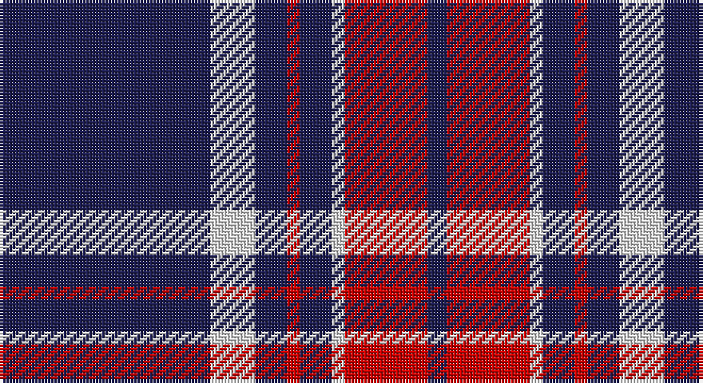

This page is one **sett** — a single exact thread-count. It belongs to the [tartan](/setts/db33w7db5r2db5w2r13db3/)
(the same proportion at any scale), whose colour order is pattern [BRWBRBWB](/stripes/brwbrbwb/).

Part of the [Americana](/tartans/americana/) tartan — the named design grouping this sett with its other cloths.

Sourced from tartans-authority.  It is a [8 stripe tartan](/stripes/stripes8/).

Original link http://www.tartansauthority.com/tartan-ferret/display/7892/

## Register references

External register numbers recorded for this tartan.

- Scottish Tartans Authority (ITI): 7892

## Thread count
DB/66 LN14 DB10 R4 DB10 LN4 R26 DB/6

One full sett is **208 threads**.

## Palette

Palette: <strong>Tartan Register</strong>
<table><thead><tr><th>Colour</th><th>Threads</th><th>Shade</th><th>Base</th><th>OKLCh</th></tr></thead><tbody><tr><td>DB/</td><td style="text-align:right;font-variant-numeric:tabular-nums">66</td><td><code style="background-color:#1C1C50;">#1C1C50</code> <small style="color:#888">#1C1C50</small></td><td>B <code style="background-color:#2A418A;">#2A418A</code></td><td><small style="color:#888">oklch(26.2% 0.093 277.9)</small></td></tr><tr><td>LN</td><td style="text-align:right;font-variant-numeric:tabular-nums">14</td><td><code style="background-color:#E0E0E0;">#E0E0E0</code> <small style="color:#888">#E0E0E0</small></td><td>W <code style="background-color:#F7F7F7;">#F7F7F7</code></td><td><small style="color:#888">oklch(90.7% 0.000 89.9)</small></td></tr><tr><td>DB</td><td style="text-align:right;font-variant-numeric:tabular-nums">10</td><td><code style="background-color:#1C1C50;">#1C1C50</code> <small style="color:#888">#1C1C50</small></td><td>B <code style="background-color:#2A418A;">#2A418A</code></td><td><small style="color:#888">oklch(26.2% 0.093 277.9)</small></td></tr><tr><td>R</td><td style="text-align:right;font-variant-numeric:tabular-nums">4</td><td><code style="background-color:#C80000;">#C80000</code> <small style="color:#888">#C80000</small></td><td>R <code style="background-color:#CC0000;">#CC0000</code></td><td><small style="color:#888">oklch(52.3% 0.215 29.2)</small></td></tr><tr><td>DB</td><td style="text-align:right;font-variant-numeric:tabular-nums">10</td><td><code style="background-color:#1C1C50;">#1C1C50</code> <small style="color:#888">#1C1C50</small></td><td>B <code style="background-color:#2A418A;">#2A418A</code></td><td><small style="color:#888">oklch(26.2% 0.093 277.9)</small></td></tr><tr><td>LN</td><td style="text-align:right;font-variant-numeric:tabular-nums">4</td><td><code style="background-color:#E0E0E0;">#E0E0E0</code> <small style="color:#888">#E0E0E0</small></td><td>W <code style="background-color:#F7F7F7;">#F7F7F7</code></td><td><small style="color:#888">oklch(90.7% 0.000 89.9)</small></td></tr><tr><td>R</td><td style="text-align:right;font-variant-numeric:tabular-nums">26</td><td><code style="background-color:#C80000;">#C80000</code> <small style="color:#888">#C80000</small></td><td>R <code style="background-color:#CC0000;">#CC0000</code></td><td><small style="color:#888">oklch(52.3% 0.215 29.2)</small></td></tr><tr><td>DB/</td><td style="text-align:right;font-variant-numeric:tabular-nums">6</td><td><code style="background-color:#1C1C50;">#1C1C50</code> <small style="color:#888">#1C1C50</small></td><td>B <code style="background-color:#2A418A;">#2A418A</code></td><td><small style="color:#888">oklch(26.2% 0.093 277.9)</small></td></tr></tbody></table>

# Sample pattern

## Compared to the master

This cloth is one sett of its design; the master sett (the exemplar the design is anchored on) is below for comparison.

<figure style="margin:0"><figcaption style="color:#888;font-size:smaller">this sett</figcaption></figure>
<figure style="margin:0"><figcaption style="color:#888;font-size:smaller"><a href="/setts/db2r2db28k11r27w2r2/">master sett →</a></figcaption></figure>

## Nearest tartans

The nearest existing variants by ΔTartan distance, with this tartan at the top so the swatches line up against it.

ΔTartan

Tartan

Sett

—

<a href="/ttd/edit/#slug=db33w7db5r2db5w2r13db3~x2">Americana - 1978 (Fashion)</a> <a class="nn-out" href="/variants/s8/db33w7db5r2db5w2r13db3~x2/" title="open its dictionary page">↗</a>

0.98

<a href="/ttd/edit/#slug=db12w1r3w1r3w1db6~x4&amp;base=db33w7db5r2db5w2r13db3~x2">BC Corps of Commissionaires</a> <a class="nn-out" href="/variants/s7/db12w1r3w1r3w1db6~x4/" title="open its dictionary page">↗</a>

1.12

<a href="/ttd/edit/#slug=db12lb1r3lb1r3lb1db6~x4&amp;base=db33w7db5r2db5w2r13db3~x2">BC Corps of Commissionaires, The</a> <a class="nn-out" href="/variants/s7/db12lb1r3lb1r3lb1db6~x4/" title="open its dictionary page">↗</a>

1.34

<a href="/variants/s6/db60ly6db11r25~x2/">South Australian Pipes &amp; Drums (Corp</a>

1.37

<a href="/variants/s10/db60ly6db11r25db11ly6~x2/">South Australian Pipes &amp; Drums</a>

1.39

<a href="/ttd/edit/#slug=db32r3db3r4w3r5db4r7~x2&amp;base=db33w7db5r2db5w2r13db3~x2">Edinburgh TIC (Corporate)</a> <a class="nn-out" href="/variants/s8/db32r3db3r4w3r5db4r7~x2/" title="open its dictionary page">↗</a>

1.39

<a href="/ttd/edit/#slug=db12ly1r16db1r1db14r3db14ly1~x4&amp;base=db33w7db5r2db5w2r13db3~x2">Orlando Fire Department (Corporate)</a> <a class="nn-out" href="/variants/s9/db12ly1r16db1r1db14r3db14ly1~x4/" title="open its dictionary page">↗</a>

1.41

<a href="/ttd/edit/#slug=k38t2m24w2k16m6t2k3t5~x2&amp;base=db33w7db5r2db5w2r13db3~x2">Universal Scientific Indust (Corp.)</a> <a class="nn-out" href="/variants/s9/k38t2m24w2k16m6t2k3t5~x2/" title="open its dictionary page">↗</a>

1.41

<a href="/variants/s12/db36lo5db8lb3db8lb10db3~x2/">Scottish Qualifications Authority</a>

1.45

<a href="/ttd/edit/#slug=db11w1r12db6r1db6w1~x4&amp;base=db33w7db5r2db5w2r13db3~x2">Coronation (1936) #2</a> <a class="nn-out" href="/variants/s7/db11w1r12db6r1db6w1~x4/" title="open its dictionary page">↗</a>

1.50

<a href="/ttd/edit/#slug=db2r7db2r7db22ly2~x2&amp;base=db33w7db5r2db5w2r13db3~x2">MacQueen variant</a> <a class="nn-out" href="/variants/s6/db2r7db2r7db22ly2~x2/" title="open its dictionary page">↗</a>

## Neighbour map

Every grey dot is one of 14360 variants placed by the first two principal components of the ΔTartan feature space (44% of its variance). Red is this tartan; blue dots are its nearest — click one to open its page.

<svg viewBox="0 0 640 380" role="img" style="max-width:100%;height:auto;border:1px solid #e0e0e0;border-radius:4px;display:block" xmlns="http://www.w3.org/2000/svg"><image href="/nn/cloud.v1.png" width="640" height="380"/><a href="/variants/s7/db12w1r3w1r3w1db6~x4/"><circle cx="395.0" cy="207.1" r="4" fill="#3465a4"><title>BC Corps of Commissionaires</title></circle></a><a href="/variants/s7/db12lb1r3lb1r3lb1db6~x4/"><circle cx="405.8" cy="209.2" r="4" fill="#3465a4"><title>BC Corps of Commissionaires, The</title></circle></a><a href="/variants/s6/db60ly6db11r25~x2/"><circle cx="409.5" cy="215.7" r="4" fill="#3465a4"><title>South Australian Pipes &amp; Drums (Corp</title></circle></a><a href="/variants/s10/db60ly6db11r25db11ly6~x2/"><circle cx="342.7" cy="191.0" r="4" fill="#3465a4"><title>South Australian Pipes &amp; Drums</title></circle></a><a href="/variants/s8/db32r3db3r4w3r5db4r7~x2/"><circle cx="411.3" cy="186.4" r="4" fill="#3465a4"><title>Edinburgh TIC (Corporate)</title></circle></a><a href="/variants/s9/db12ly1r16db1r1db14r3db14ly1~x4/"><circle cx="419.3" cy="191.6" r="4" fill="#3465a4"><title>Orlando Fire Department (Corporate)</title></circle></a><a href="/variants/s9/k38t2m24w2k16m6t2k3t5~x2/"><circle cx="338.9" cy="150.8" r="4" fill="#3465a4"><title>Universal Scientific Indust (Corp.)</title></circle></a><a href="/variants/s12/db36lo5db8lb3db8lb10db3~x2/"><circle cx="364.1" cy="175.2" r="4" fill="#3465a4"><title>Scottish Qualifications Authority</title></circle></a><a href="/variants/s7/db11w1r12db6r1db6w1~x4/"><circle cx="360.6" cy="209.9" r="4" fill="#3465a4"><title>Coronation (1936) #2</title></circle></a><a href="/variants/s6/db2r7db2r7db22ly2~x2/"><circle cx="393.5" cy="207.5" r="4" fill="#3465a4"><title>MacQueen variant</title></circle></a><circle cx="394.0" cy="168.0" r="5" fill="#c00000"/></svg>

ID: /variants/s8/db33w7db5r2db5w2r13db3~x2/
