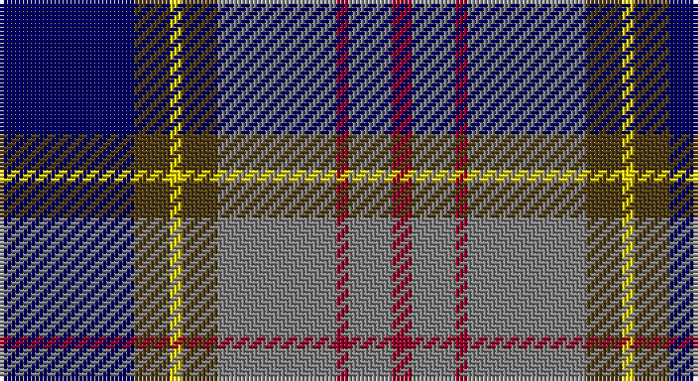

This page is one **sett** — a single exact thread-count. It belongs to the [tartan](/setts/db34dy9ly3dy9y30r3y11r5/)
(the same proportion at any scale), whose colour order is pattern [BGYGGRGR](/stripes/bgyggrgr/).

Sourced from register-of-tartans.  It is a [8 stripe tartan](/stripes/stripes8/).

Original link https://www.tartanregister.gov.uk/tartanDetails.aspx?ref=5980

## Register references

External register numbers recorded for this tartan.

- Scottish Register of Tartans: [5980](https://www.tartanregister.gov.uk/tartanDetails.aspx?ref=5980)
- Scottish Tartans World Register: 3263

## Thread count
DB/34 T9 Y3 T9 N30 DR3 N11 DR/5

One full sett is **169 threads**.

## Palette

Palette: <strong>Tartan Register</strong> <small style="color:#888">(4 of 5 colours)</small>
<table><thead><tr><th>Colour</th><th>Threads</th><th>Shade</th><th>Base</th><th>OKLCh</th></tr></thead><tbody><tr><td>DB/</td><td style="text-align:right;font-variant-numeric:tabular-nums">34</td><td><code style="background-color:#000064;">#000064</code> <small style="color:#888">#000064</small></td><td>B <code style="background-color:#2A418A;">#2A418A</code></td><td><small style="color:#888">oklch(22.7% 0.158 264.1)</small></td></tr><tr><td>T</td><td style="text-align:right;font-variant-numeric:tabular-nums">9</td><td><code style="background-color:#503C14;">#503C14</code> <small style="color:#888">#503C14</small></td><td>G <code style="background-color:#006100;">#006100</code></td><td><small style="color:#888">oklch(37.0% 0.062 81.8)</small></td></tr><tr><td>Y</td><td style="text-align:right;font-variant-numeric:tabular-nums">3</td><td><code style="background-color:#FADC00;">#FADC00</code> <small style="color:#888">#FADC00</small></td><td>Y <code style="background-color:#F2BF00;">#F2BF00</code></td><td><small style="color:#888">oklch(89.2% 0.185 99.2)</small></td></tr><tr><td>T</td><td style="text-align:right;font-variant-numeric:tabular-nums">9</td><td><code style="background-color:#503C14;">#503C14</code> <small style="color:#888">#503C14</small></td><td>G <code style="background-color:#006100;">#006100</code></td><td><small style="color:#888">oklch(37.0% 0.062 81.8)</small></td></tr><tr><td>N</td><td style="text-align:right;font-variant-numeric:tabular-nums">30</td><td><code style="background-color:#808080;">#808080</code> <small style="color:#888">#808080</small></td><td>G <code style="background-color:#006100;">#006100</code></td><td><small style="color:#888">oklch(60.0% 0.000 89.9)</small></td></tr><tr><td>DR</td><td style="text-align:right;font-variant-numeric:tabular-nums">3</td><td><code style="background-color:#960028;">#960028</code> <small style="color:#888">#960028</small></td><td>R <code style="background-color:#CC0000;">#CC0000</code></td><td><small style="color:#888">oklch(42.7% 0.171 18.3)</small></td></tr><tr><td>N</td><td style="text-align:right;font-variant-numeric:tabular-nums">11</td><td><code style="background-color:#808080;">#808080</code> <small style="color:#888">#808080</small></td><td>G <code style="background-color:#006100;">#006100</code></td><td><small style="color:#888">oklch(60.0% 0.000 89.9)</small></td></tr><tr><td>DR/</td><td style="text-align:right;font-variant-numeric:tabular-nums">5</td><td><code style="background-color:#960028;">#960028</code> <small style="color:#888">#960028</small></td><td>R <code style="background-color:#CC0000;">#CC0000</code></td><td><small style="color:#888">oklch(42.7% 0.171 18.3)</small></td></tr></tbody></table>

# Sample pattern

## Nearest tartans

The nearest existing variants by ΔTartan distance, with this tartan at the top so the swatches line up against it.

ΔTartan

Tartan

Sett

—

<a href="/ttd/edit/#slug=db34dy9ly3dy9y30r3y11r5">Ballantyne (Personal) STWR</a> <a class="nn-out" href="/variants/s8/db34dy9ly3dy9y30r3y11r5/" title="open its dictionary page">↗</a>

0.79

<a href="/ttd/edit/#slug=w15y98db72r25db8ly15&amp;base=db34dy9ly3dy9y30r3y11r5">Afternoon Tea / Darjeeling</a> <a class="nn-out" href="/variants/s6/w15y98db72r25db8ly15/" title="open its dictionary page">↗</a>

0.79

<a href="/ttd/edit/#slug=n12k2n2k2n2k12lp12t3w1~x2&amp;base=db34dy9ly3dy9y30r3y11r5">de Franck, Matt (Personal)</a> <a class="nn-out" href="/variants/s9/n12k2n2k2n2k12lp12t3w1~x2/" title="open its dictionary page">↗</a>

0.80

<a href="/ttd/edit/#slug=g3db12w1k12g13r2g2~x4&amp;base=db34dy9ly3dy9y30r3y11r5">MacFadzean/MacPhedran</a> <a class="nn-out" href="/variants/s7/g3db12w1k12g13r2g2~x4/" title="open its dictionary page">↗</a>

0.88

<a href="/ttd/edit/#slug=r3g2r6g20k15g3db18w2~x2&amp;base=db34dy9ly3dy9y30r3y11r5">Curry (Personal)</a> <a class="nn-out" href="/variants/s8/r3g2r6g20k15g3db18w2~x2/" title="open its dictionary page">↗</a>

0.88

<a href="/ttd/edit/#slug=o18k3o4lb3o4k18n20k2m4~x2&amp;base=db34dy9ly3dy9y30r3y11r5">Heart of the Highlands</a> <a class="nn-out" href="/variants/s9/o18k3o4lb3o4k18n20k2m4~x2/" title="open its dictionary page">↗</a>

0.89

<a href="/ttd/edit/#slug=o1r1o7k3o1k1o1k1db9ly1~x4&amp;base=db34dy9ly3dy9y30r3y11r5">Brady 60th (Personal)</a> <a class="nn-out" href="/variants/s10/o1r1o7k3o1k1o1k1db9ly1~x4/" title="open its dictionary page">↗</a>

0.89

<a href="/ttd/edit/#slug=g14k2g4r2g4k14dp15k1w3~x2&amp;base=db34dy9ly3dy9y30r3y11r5">MacRae Hunting #2</a> <a class="nn-out" href="/variants/s9/g14k2g4r2g4k14dp15k1w3~x2/" title="open its dictionary page">↗</a>

0.89

<a href="/ttd/edit/#slug=g18dp3dbi10db2dbi10dp20g20dp3lo2dbi2~x2&amp;base=db34dy9ly3dy9y30r3y11r5">Glasgow Cathedral</a> <a class="nn-out" href="/variants/s10/g18dp3dbi10db2dbi10dp20g20dp3lo2dbi2~x2/" title="open its dictionary page">↗</a>

0.89

<a href="/ttd/edit/#slug=ly3k12db1g5db12r1k2r1~x4&amp;base=db34dy9ly3dy9y30r3y11r5">Sandberg of Greenock (Personal)</a> <a class="nn-out" href="/variants/s8/ly3k12db1g5db12r1k2r1~x4/" title="open its dictionary page">↗</a>

0.90

<a href="/ttd/edit/#slug=t4n19lr2k19n2lr25lb2~x2&amp;base=db34dy9ly3dy9y30r3y11r5">Ritchie, Stephen James (Personal)</a> <a class="nn-out" href="/variants/s7/t4n19lr2k19n2lr25lb2~x2/" title="open its dictionary page">↗</a>

## Neighbour map

Every grey dot is one of 14360 variants placed by the first two principal components of the ΔTartan feature space (44% of its variance). Red is this tartan; blue dots are its nearest — click one to open its page.

<svg viewBox="0 0 640 380" role="img" style="max-width:100%;height:auto;border:1px solid #e0e0e0;border-radius:4px;display:block" xmlns="http://www.w3.org/2000/svg"><image href="/nn/cloud.v1.png" width="640" height="380"/><a href="/variants/s6/w15y98db72r25db8ly15/"><circle cx="202.7" cy="181.2" r="4" fill="#3465a4"><title>Afternoon Tea / Darjeeling</title></circle></a><a href="/variants/s9/n12k2n2k2n2k12lp12t3w1~x2/"><circle cx="149.9" cy="156.7" r="4" fill="#3465a4"><title>de Franck, Matt (Personal)</title></circle></a><a href="/variants/s7/g3db12w1k12g13r2g2~x4/"><circle cx="193.7" cy="188.3" r="4" fill="#3465a4"><title>MacFadzean/MacPhedran</title></circle></a><a href="/variants/s8/r3g2r6g20k15g3db18w2~x2/"><circle cx="163.4" cy="188.8" r="4" fill="#3465a4"><title>Curry (Personal)</title></circle></a><a href="/variants/s9/o18k3o4lb3o4k18n20k2m4~x2/"><circle cx="160.9" cy="175.2" r="4" fill="#3465a4"><title>Heart of the Highlands</title></circle></a><a href="/variants/s10/o1r1o7k3o1k1o1k1db9ly1~x4/"><circle cx="183.1" cy="155.4" r="4" fill="#3465a4"><title>Brady 60th (Personal)</title></circle></a><a href="/variants/s9/g14k2g4r2g4k14dp15k1w3~x2/"><circle cx="183.5" cy="166.4" r="4" fill="#3465a4"><title>MacRae Hunting #2</title></circle></a><a href="/variants/s10/g18dp3dbi10db2dbi10dp20g20dp3lo2dbi2~x2/"><circle cx="188.0" cy="178.5" r="4" fill="#3465a4"><title>Glasgow Cathedral</title></circle></a><a href="/variants/s8/ly3k12db1g5db12r1k2r1~x4/"><circle cx="188.0" cy="170.7" r="4" fill="#3465a4"><title>Sandberg of Greenock (Personal)</title></circle></a><a href="/variants/s7/t4n19lr2k19n2lr25lb2~x2/"><circle cx="175.1" cy="168.5" r="4" fill="#3465a4"><title>Ritchie, Stephen James (Personal)</title></circle></a><circle cx="186.8" cy="175.0" r="5" fill="#c00000"/></svg>

ID: /variants/s8/db34dy9ly3dy9y30r3y11r5/
