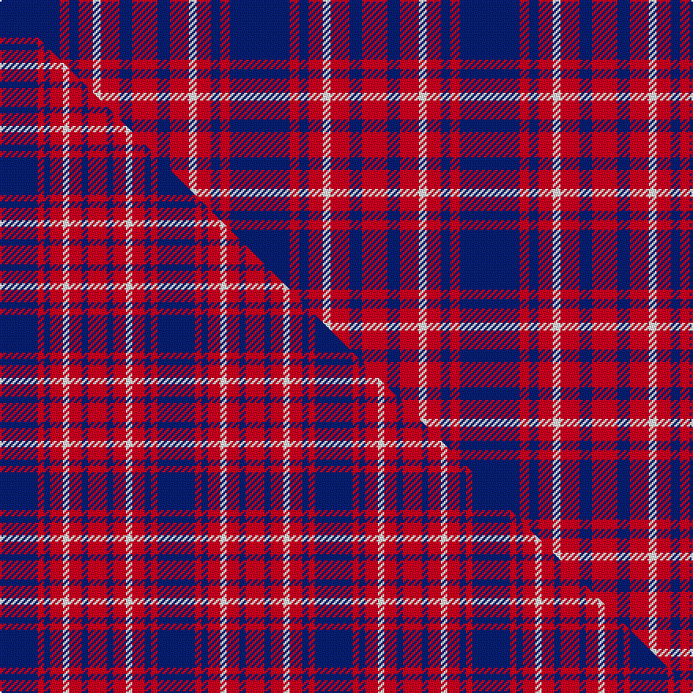

This page is one **sett** — a single exact thread-count. It belongs to the [tartan](/setts/db38r6db6r9w5r12db8r16/)
(the same proportion at any scale), whose colour order is pattern [BRBRWRBR](/stripes/brbrwrbr/).

Part of the [Edinburgh Marketing](/tartans/edinburgh-marketing/) tartan — the named design grouping this sett with its other cloths.

Sourced from weddslist.  It is a [8 stripe tartan](/stripes/stripes8/).

Original link http://www.weddslist.com/cgi-bin/tartans/pg.pl?source=sts

## Provenance

Earliest known date: 1991 The tartan was based on the Drummond tartan after the famous Lord Provost of Edinburgh, Lord Drummond, who is regarded as the father of the New Town and the "bridge" between the Old town of Edinburgh and the New Town. The colours are the corporate colours of Edinburgh Marketing, Navy, Red and White. The tartan was designed by Messrs. Kinloch Anderson of Leith, Edinburgh.

2 attestations — the source records this cloth was collapsed from (oldest owns this page)

<ul>
<li>undated — Edinburgh Marketing (weddslist, <a href="http://www.weddslist.com/cgi-bin/tartans/pg.pl?source=sts">record</a>) </li>
<li>undated — Edinburgh Marketing Corporate Tartan (house-of-tartan, <a href="http://www.house-of-tartan.scotland.net/house/TartanViewjs.asp?colr=Def&tnam=2106">record</a>) </li>
</ul>

## Thread count
DB/38 R6 DB6 R9 W5 R12 DB8 R/16

One full sett is **146 threads**.

## Palette
<table><thead><tr><th>Colour</th><th>Shade</th><th>OKLCh</th></tr></thead><tbody><tr><td>DB</td><td><code style="background-color:#082077;">#082077</code> <small style="color:#888">#082077</small></td><td><small style="color:#888">oklch(30.0% 0.149 265.1)</small></td></tr><tr><td>W</td><td><code style="background-color:#F7F7F7;">#F7F7F7</code> <small style="color:#888">#F7F7F7</small></td><td><small style="color:#888">oklch(97.6% 0.000 89.9)</small></td></tr><tr><td>R</td><td><code style="background-color:#D60020;">#D60020</code> <small style="color:#888">#D60020</small></td><td><small style="color:#888">oklch(55.2% 0.224 25.5)</small></td></tr></tbody></table>

# Sample pattern

## Compared to the master

This cloth is one sett of its design; the master sett (the exemplar the design is anchored on) is below for comparison.

Its **ΔTartan distance** from the master is **0.65** — the same measure the nearest-tartans table ranks by (0 is identical; a re-scale of the same cloth is near 0, a recolour or a different proportion further).

<figure class="master-compare" style="margin:0">

this sett
master sett ★

<figcaption style="color:#888;font-size:smaller">One weave of this sett against the <a href="/setts/db6r1db1r2w1r2db1r3/">master sett ★</a>, split on the diagonal: a shared proportion runs seamlessly across it with only the shades shifting; a different proportion breaks on it.</figcaption>
</figure>

## Nearest tartan variants

The nearest existing variants by ΔTartan distance, with this cloth at the top so the swatches line up against it.

ΔTartan

Threads

Variant

Sett

—

146

<a href="/variants/s8/db38r6db6r9w5r12db8r16/">Edinburgh Marketing</a>

<a href="/ttd/edit/#slug=db6r1db1r2w1r2db1r3~x4&amp;base=db38r6db6r9w5r12db8r16" title="compare in the TTD">0.32</a>

100

<a href="/variants/s8/db6r1db1r2w1r2db1r3~x4/">Edinburgh Marketing</a>

<a href="/ttd/edit/#slug=db32r3db3r4w3r5db4r7~x2&amp;base=db38r6db6r9w5r12db8r16" title="compare in the TTD">0.57</a>

166

<a href="/variants/s8/db32r3db3r4w3r5db4r7~x2/">Edinburgh TIC (Corporate)</a>

<a href="/ttd/edit/#slug=r5db6r1db6r1db6r5w5~x4&amp;base=db38r6db6r9w5r12db8r16" title="compare in the TTD">0.62</a>

240

<a href="/variants/s8/r5db6r1db6r1db6r5w5~x4/">U.S. Coast Guard</a>

<a href="/ttd/edit/#slug=r15db8r2db8r2db8r15w2~x4~db1406275-w3600000&amp;base=db38r6db6r9w5r12db8r16" title="compare in the TTD">0.80</a>

412

<a href="/variants/s8/r15db8r2db8r2db8r15w2~x4~db1406275-w3600000/">Hamilton</a>

<a href="/ttd/edit/#slug=r6w3r17db3r3db25r3~x2&amp;base=db38r6db6r9w5r12db8r16" title="compare in the TTD">1.50</a>

222

<a href="/variants/s7/r6w3r17db3r3db25r3~x2/">Bon Accord</a>

<a href="/ttd/edit/#slug=db4r1db18r18db1r1w1~x2&amp;base=db38r6db6r9w5r12db8r16" title="compare in the TTD">1.57</a>

166

<a href="/variants/s7/db4r1db18r18db1r1w1~x2/">St. Mildreds Check (School)</a>

<a href="/ttd/edit/#slug=db1r1db7r7db1r1~x4&amp;base=db38r6db6r9w5r12db8r16" title="compare in the TTD">1.98</a>

136

<a href="/variants/s6/db1r1db7r7db1r1~x4/">MacGregor of Glengyle</a>

<a href="/ttd/edit/#slug=b10r24b4r3b24w2r6b6~x2&amp;base=db38r6db6r9w5r12db8r16" title="compare in the TTD">2.22</a>

284

<a href="/variants/s8/b10r24b4r3b24w2r6b6~x2/">Embrace, The</a>

<a href="/ttd/edit/#slug=db3r24db3r3db25w3~x2&amp;base=db38r6db6r9w5r12db8r16" title="compare in the TTD">2.61</a>

232

<a href="/variants/s6/db3r24db3r3db25w3~x2/">Matthews (Personal)</a>

<a href="/ttd/edit/#slug=db7w1r7db4r2db4w2~x2&amp;base=db38r6db6r9w5r12db8r16" title="compare in the TTD">2.67</a>

90

<a href="/variants/s7/db7w1r7db4r2db4w2~x2/">Coronation</a>

## Neighbour map

Every grey dot is one of 13620 variants placed by the first two principal components of the ΔTartan feature space (42% of its variance). Red is this tartan; blue dots are its nearest — click one to open its page.

<svg viewBox="0 0 640 380" role="img" style="max-width:100%;height:auto;border:1px solid #e0e0e0;border-radius:4px;display:block" xmlns="http://www.w3.org/2000/svg"><image href="/nn/cloud.v1.png" width="640" height="380"/><a href="/variants/s8/db6r1db1r2w1r2db1r3~x4/"><circle cx="274.2" cy="230.8" r="4" fill="#3465a4"><title>Edinburgh Marketing</title></circle></a><a href="/variants/s8/db32r3db3r4w3r5db4r7~x2/"><circle cx="391.3" cy="175.5" r="4" fill="#3465a4"><title>Edinburgh TIC (Corporate)</title></circle></a><a href="/variants/s8/r5db6r1db6r1db6r5w5~x4/"><circle cx="228.0" cy="262.3" r="4" fill="#3465a4"><title>U.S. Coast Guard</title></circle></a><a href="/variants/s8/r15db8r2db8r2db8r15w2~x4~db1406275-w3600000/"><circle cx="345.9" cy="235.0" r="4" fill="#3465a4"><title>Hamilton</title></circle></a><a href="/variants/s7/r6w3r17db3r3db25r3~x2/"><circle cx="303.5" cy="203.5" r="4" fill="#3465a4"><title>Bon Accord</title></circle></a><a href="/variants/s7/db4r1db18r18db1r1w1~x2/"><circle cx="373.0" cy="165.2" r="4" fill="#3465a4"><title>St. Mildreds Check (School)</title></circle></a><a href="/variants/s6/db1r1db7r7db1r1~x4/"><circle cx="359.9" cy="238.2" r="4" fill="#3465a4"><title>MacGregor of Glengyle</title></circle></a><a href="/variants/s8/b10r24b4r3b24w2r6b6~x2/"><circle cx="386.1" cy="212.0" r="4" fill="#3465a4"><title>Embrace, The</title></circle></a><a href="/variants/s6/db3r24db3r3db25w3~x2/"><circle cx="322.7" cy="210.5" r="4" fill="#3465a4"><title>Matthews (Personal)</title></circle></a><a href="/variants/s7/db7w1r7db4r2db4w2~x2/"><circle cx="274.6" cy="246.8" r="4" fill="#3465a4"><title>Coronation</title></circle></a><circle cx="305.1" cy="216.9" r="5" fill="#c00000"/><text x="320" y="376" text-anchor="middle" font-size="11" fill="#999">ground</text><text x="11" y="190" text-anchor="middle" font-size="11" fill="#999" transform="rotate(-90 11 190)">complexity</text></svg>

ID: /variants/s8/db38r6db6r9w5r12db8r16/
