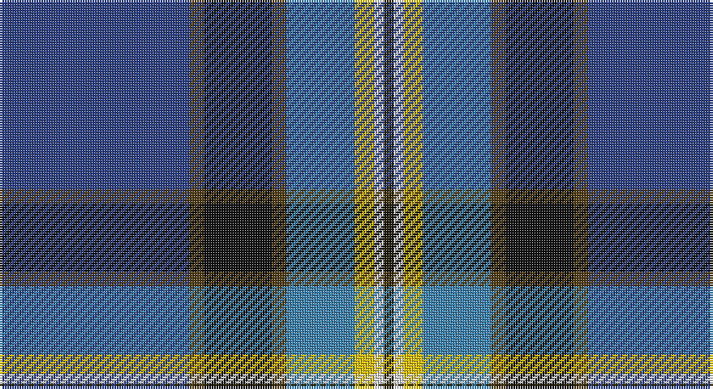

This page is one **sett** — a single exact thread-count. It belongs to the [tartan](/setts/db39dyi3k14dyi3t14ly4w2dy2/)
(the same proportion at any scale), whose colour order is pattern [BGKGBYWG](/stripes/bgkgbywg/).

Part of the [Unidentified Lady's](/tartans/unidentified-lady-s/) tartan — the named design grouping this sett with its other cloths.

Sourced from register-of-tartans.  It is a [8 stripe tartan](/stripes/stripes8/).

Original link https://www.tartanregister.gov.uk/tartanDetails.aspx?ref=4302

## Also known as

This cloth is also recorded under:

- Unidentified Lady's kilt
- Unidentified, Lady's kilt

## Register references

External register numbers recorded for this tartan.

- Scottish Register of Tartans: [4302](https://www.tartanregister.gov.uk/tartanDetails.aspx?ref=4302)
- Scottish Tartans World Register: 609

## Thread count
B/78 T6 K28 T6 Ba28 Y8 LN4 Ka/4

One full sett is **242 threads**.

## Palette

Palette: <strong>Tartan Register</strong> <small style="color:#888">(6 of 7 colours)</small>
<table><thead><tr><th>Colour</th><th>Threads</th><th>Shade</th><th>Base</th><th>OKLCh</th></tr></thead><tbody><tr><td>B/</td><td style="text-align:right;font-variant-numeric:tabular-nums">78</td><td><code style="background-color:#2C4084;">#2C4084</code> <small style="color:#888">#2C4084</small></td><td>B <code style="background-color:#2A418A;">#2A418A</code></td><td><small style="color:#888">oklch(39.4% 0.117 268.3)</small></td></tr><tr><td>T</td><td style="text-align:right;font-variant-numeric:tabular-nums">6</td><td><code style="background-color:#503C14;">#503C14</code> <small style="color:#888">#503C14</small></td><td>G <code style="background-color:#006100;">#006100</code></td><td><small style="color:#888">oklch(37.0% 0.062 81.8)</small></td></tr><tr><td>K</td><td style="text-align:right;font-variant-numeric:tabular-nums">28</td><td><code style="background-color:#101010;">#101010</code> <small style="color:#888">#101010</small></td><td>K <code style="background-color:#000000;">#000000</code></td><td><small style="color:#888">oklch(17.3% 0.000 89.9)</small></td></tr><tr><td>T</td><td style="text-align:right;font-variant-numeric:tabular-nums">6</td><td><code style="background-color:#503C14;">#503C14</code> <small style="color:#888">#503C14</small></td><td>G <code style="background-color:#006100;">#006100</code></td><td><small style="color:#888">oklch(37.0% 0.062 81.8)</small></td></tr><tr><td>Ba</td><td style="text-align:right;font-variant-numeric:tabular-nums">28</td><td><code style="background-color:#3C82AF;">#3C82AF</code> <small style="color:#888">#3C82AF</small></td><td>B <code style="background-color:#2A418A;">#2A418A</code></td><td><small style="color:#888">oklch(58.1% 0.099 239.8)</small></td></tr><tr><td>Y</td><td style="text-align:right;font-variant-numeric:tabular-nums">8</td><td><code style="background-color:#E8C000;">#E8C000</code> <small style="color:#888">#E8C000</small></td><td>Y <code style="background-color:#F2BF00;">#F2BF00</code></td><td><small style="color:#888">oklch(81.9% 0.168 93.7)</small></td></tr><tr><td>LN</td><td style="text-align:right;font-variant-numeric:tabular-nums">4</td><td><code style="background-color:#E0E0E0;">#E0E0E0</code> <small style="color:#888">#E0E0E0</small></td><td>W <code style="background-color:#F7F7F7;">#F7F7F7</code></td><td><small style="color:#888">oklch(90.7% 0.000 89.9)</small></td></tr><tr><td>Ka/</td><td style="text-align:right;font-variant-numeric:tabular-nums">4</td><td><code style="background-color:#2A2303;">#2A2303</code> <small style="color:#888">#2A2303</small></td><td>G <code style="background-color:#006100;">#006100</code></td><td><small style="color:#888">oklch(25.7% 0.049 96.8)</small></td></tr></tbody></table>

# Sample pattern

## Nearest tartans

The nearest existing variants by ΔTartan distance, with this tartan at the top so the swatches line up against it.

ΔTartan

Tartan

Sett

—

<a href="/ttd/edit/#slug=db39dyi3k14dyi3t14ly4w2dy2~x2">Unidentified Lady's kilt</a> <a class="nn-out" href="/variants/s8/db39dyi3k14dyi3t14ly4w2dy2~x2/" title="open its dictionary page">↗</a>

0.91

<a href="/ttd/edit/#slug=db20y1w1lo3g14n4y1dp4~x2&amp;base=db39dyi3k14dyi3t14ly4w2dy2~x2">St. Columba (one green)</a> <a class="nn-out" href="/variants/s8/db20y1w1lo3g14n4y1dp4~x2/" title="open its dictionary page">↗</a>

0.94

<a href="/ttd/edit/#slug=db39o3k14o3t14ly4w2dr2~x2&amp;base=db39dyi3k14dyi3t14ly4w2dy2~x2">Unidentified, Lady's kilt</a> <a class="nn-out" href="/variants/s8/db39o3k14o3t14ly4w2dr2~x2/" title="open its dictionary page">↗</a>

0.97

<a href="/ttd/edit/#slug=dp4g13db5ly3t6ly3db5n6db28w2~x2&amp;base=db39dyi3k14dyi3t14ly4w2dy2~x2">Highland, Blue (Corporate)</a> <a class="nn-out" href="/variants/s10/dp4g13db5ly3t6ly3db5n6db28w2~x2/" title="open its dictionary page">↗</a>

1.00

<a href="/ttd/edit/#slug=w3dbi1g18r3t4r3db4dbi3db2dbi24ri1~x2&amp;base=db39dyi3k14dyi3t14ly4w2dy2~x2">Queen of the South Football Club</a> <a class="nn-out" href="/variants/s11/w3dbi1g18r3t4r3db4dbi3db2dbi24ri1~x2/" title="open its dictionary page">↗</a>

1.01

<a href="/ttd/edit/#slug=db11dt5g4w3r3k16dt28lb2~x2&amp;base=db39dyi3k14dyi3t14ly4w2dy2~x2">Scottish Italian</a> <a class="nn-out" href="/variants/s8/db11dt5g4w3r3k16dt28lb2~x2/" title="open its dictionary page">↗</a>

1.03

<a href="/ttd/edit/#slug=w2db20dg2dgi2dg2dgi5dg8ly2r1~x2&amp;base=db39dyi3k14dyi3t14ly4w2dy2~x2">Unidentified (ex Tony Murray)</a> <a class="nn-out" href="/variants/s9/w2db20dg2dgi2dg2dgi5dg8ly2r1~x2/" title="open its dictionary page">↗</a>

1.08

<a href="/ttd/edit/#slug=o18k3g3r2w3db36k2ly6~x2&amp;base=db39dyi3k14dyi3t14ly4w2dy2~x2">M'Kleod</a> <a class="nn-out" href="/variants/s8/o18k3g3r2w3db36k2ly6~x2/" title="open its dictionary page">↗</a>

1.17

<a href="/ttd/edit/#slug=lo2k8db48lb9o12m3o9m3o12dg8lo2~x2&amp;base=db39dyi3k14dyi3t14ly4w2dy2~x2">Heston (Name)</a> <a class="nn-out" href="/variants/s11/lo2k8db48lb9o12m3o9m3o12dg8lo2~x2/" title="open its dictionary page">↗</a>

1.17

<a href="/ttd/edit/#slug=db60loi3db5lo5db9do20loi4g32lb4~x2&amp;base=db39dyi3k14dyi3t14ly4w2dy2~x2">State Seal of Ohio (Fashion)</a> <a class="nn-out" href="/variants/s9/db60loi3db5lo5db9do20loi4g32lb4~x2/" title="open its dictionary page">↗</a>

1.19

<a href="/ttd/edit/#slug=db24ri8gi8r2g8k1ly2~x2&amp;base=db39dyi3k14dyi3t14ly4w2dy2~x2">Scout Mapping Service #1 (Corporate)</a> <a class="nn-out" href="/variants/s7/db24ri8gi8r2g8k1ly2~x2/" title="open its dictionary page">↗</a>

## Neighbour map

Every grey dot is one of 14360 variants placed by the first two principal components of the ΔTartan feature space (44% of its variance). Red is this tartan; blue dots are its nearest — click one to open its page.

<svg viewBox="0 0 640 380" role="img" style="max-width:100%;height:auto;border:1px solid #e0e0e0;border-radius:4px;display:block" xmlns="http://www.w3.org/2000/svg"><image href="/nn/cloud.v1.png" width="640" height="380"/><a href="/variants/s8/db20y1w1lo3g14n4y1dp4~x2/"><circle cx="206.4" cy="121.5" r="4" fill="#3465a4"><title>St. Columba (one green)</title></circle></a><a href="/variants/s8/db39o3k14o3t14ly4w2dr2~x2/"><circle cx="207.4" cy="101.6" r="4" fill="#3465a4"><title>Unidentified, Lady's kilt</title></circle></a><a href="/variants/s10/dp4g13db5ly3t6ly3db5n6db28w2~x2/"><circle cx="205.2" cy="123.0" r="4" fill="#3465a4"><title>Highland, Blue (Corporate)</title></circle></a><a href="/variants/s11/w3dbi1g18r3t4r3db4dbi3db2dbi24ri1~x2/"><circle cx="199.7" cy="85.3" r="4" fill="#3465a4"><title>Queen of the South Football Club</title></circle></a><a href="/variants/s8/db11dt5g4w3r3k16dt28lb2~x2/"><circle cx="195.3" cy="147.6" r="4" fill="#3465a4"><title>Scottish Italian</title></circle></a><a href="/variants/s9/w2db20dg2dgi2dg2dgi5dg8ly2r1~x2/"><circle cx="237.2" cy="124.2" r="4" fill="#3465a4"><title>Unidentified (ex Tony Murray)</title></circle></a><a href="/variants/s8/o18k3g3r2w3db36k2ly6~x2/"><circle cx="221.0" cy="96.8" r="4" fill="#3465a4"><title>M'Kleod</title></circle></a><a href="/variants/s11/lo2k8db48lb9o12m3o9m3o12dg8lo2~x2/"><circle cx="191.2" cy="83.3" r="4" fill="#3465a4"><title>Heston (Name)</title></circle></a><a href="/variants/s9/db60loi3db5lo5db9do20loi4g32lb4~x2/"><circle cx="285.6" cy="132.1" r="4" fill="#3465a4"><title>State Seal of Ohio (Fashion)</title></circle></a><a href="/variants/s7/db24ri8gi8r2g8k1ly2~x2/"><circle cx="204.3" cy="119.0" r="4" fill="#3465a4"><title>Scout Mapping Service #1 (Corporate)</title></circle></a><circle cx="231.1" cy="115.2" r="5" fill="#c00000"/></svg>

ID: /variants/s8/db39dyi3k14dyi3t14ly4w2dy2~x2/
