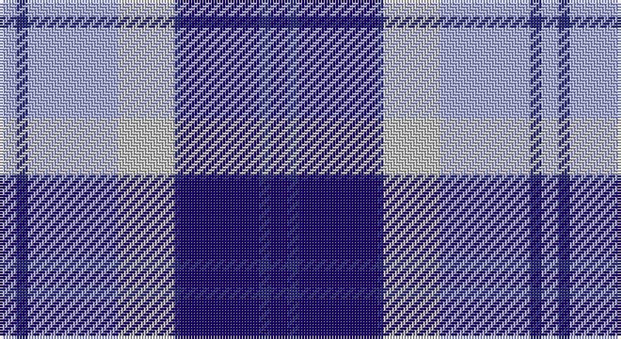

This page is one **sett** — a single exact thread-count. It belongs to the [tartan](/setts/db3dbi2db14dbi1lb10lbi16dbi2lbi3/)
(the same proportion at any scale), whose colour order is pattern [BBBBWWBW](/stripes/bbbbwwbw/).

Part of the [Bannockbane](/tartans/bannockbane/) tartan — the named design grouping this sett with its other cloths.

Sourced from register-of-tartans.  It is a [8 stripe tartan](/stripes/stripes8/).

Original link https://www.tartanregister.gov.uk/tartanDetails.aspx?ref=4910

## Also known as

This cloth is also recorded under:

- Bannockbane Blue
- Bannockbane Blue #1
- Bannockbane Blue #2
- Bannockbane Blue #3
- Bannockbane Brown #2
- Bannockbane Green
- Bannockbane Grey #1
- Bannockbane Grey #2
- Bannockbane Grey #3
- Bannockbane, Blue
- Bannockbane, Green
- Bannockbane, Grey
- Bannockbane, Light Tan

## Register references

External register numbers recorded for this tartan.

- Scottish Register of Tartans: [4910](https://www.tartanregister.gov.uk/tartanDetails.aspx?ref=4910)
- Scottish Tartans Authority (ITI): 3652

## Thread count
LP/6 DB4 LP32 N20 DB2 DBa28 DB4 DBa/6

One full sett is **192 threads**.

## Palette

Palette: <strong>Tartan Register</strong>
<table><thead><tr><th>Colour</th><th>Threads</th><th>Shade</th><th>Base</th><th>OKLCh</th></tr></thead><tbody><tr><td>LP/</td><td style="text-align:right;font-variant-numeric:tabular-nums">6</td><td><code style="background-color:#A8ACE8;">#A8ACE8</code> <small style="color:#888">#A8ACE8</small></td><td>W <code style="background-color:#F7F7F7;">#F7F7F7</code></td><td><small style="color:#888">oklch(76.3% 0.086 281.2)</small></td></tr><tr><td>DB</td><td style="text-align:right;font-variant-numeric:tabular-nums">4</td><td><code style="background-color:#2C2C80;">#2C2C80</code> <small style="color:#888">#2C2C80</small></td><td>B <code style="background-color:#2A418A;">#2A418A</code></td><td><small style="color:#888">oklch(35.0% 0.138 276.6)</small></td></tr><tr><td>LP</td><td style="text-align:right;font-variant-numeric:tabular-nums">32</td><td><code style="background-color:#A8ACE8;">#A8ACE8</code> <small style="color:#888">#A8ACE8</small></td><td>W <code style="background-color:#F7F7F7;">#F7F7F7</code></td><td><small style="color:#888">oklch(76.3% 0.086 281.2)</small></td></tr><tr><td>N</td><td style="text-align:right;font-variant-numeric:tabular-nums">20</td><td><code style="background-color:#C0C0C0;">#C0C0C0</code> <small style="color:#888">#C0C0C0</small></td><td>W <code style="background-color:#F7F7F7;">#F7F7F7</code></td><td><small style="color:#888">oklch(80.8% 0.000 89.9)</small></td></tr><tr><td>DB</td><td style="text-align:right;font-variant-numeric:tabular-nums">2</td><td><code style="background-color:#2C2C80;">#2C2C80</code> <small style="color:#888">#2C2C80</small></td><td>B <code style="background-color:#2A418A;">#2A418A</code></td><td><small style="color:#888">oklch(35.0% 0.138 276.6)</small></td></tr><tr><td>DBa</td><td style="text-align:right;font-variant-numeric:tabular-nums">28</td><td><code style="background-color:#1C0070;">#1C0070</code> <small style="color:#888">#1C0070</small></td><td>B <code style="background-color:#2A418A;">#2A418A</code></td><td><small style="color:#888">oklch(26.3% 0.162 277.1)</small></td></tr><tr><td>DB</td><td style="text-align:right;font-variant-numeric:tabular-nums">4</td><td><code style="background-color:#2C2C80;">#2C2C80</code> <small style="color:#888">#2C2C80</small></td><td>B <code style="background-color:#2A418A;">#2A418A</code></td><td><small style="color:#888">oklch(35.0% 0.138 276.6)</small></td></tr><tr><td>DBa/</td><td style="text-align:right;font-variant-numeric:tabular-nums">6</td><td><code style="background-color:#1C0070;">#1C0070</code> <small style="color:#888">#1C0070</small></td><td>B <code style="background-color:#2A418A;">#2A418A</code></td><td><small style="color:#888">oklch(26.3% 0.162 277.1)</small></td></tr></tbody></table>

# Sample pattern

## Compared to the master

This cloth is one sett of its design; the master sett (the exemplar the design is anchored on) is below for comparison.

<figure style="margin:0"><figcaption style="color:#888;font-size:smaller">this sett</figcaption></figure>
<figure style="margin:0"><figcaption style="color:#888;font-size:smaller"><a href="/setts/o2dy2o15dy2w10lo15dy2lo2/">master sett →</a></figcaption></figure>

## Nearest tartans

The nearest existing variants by ΔTartan distance, with this tartan at the top so the swatches line up against it.

ΔTartan

Tartan

Sett

—

<a href="/ttd/edit/#slug=db3dbi2db14dbi1lb10lbi16dbi2lbi3~x2">Bannockbane Blue #2</a> <a class="nn-out" href="/variants/s8/db3dbi2db14dbi1lb10lbi16dbi2lbi3~x2/" title="open its dictionary page">↗</a>

1.15

<a href="/ttd/edit/#slug=w9b3ly3b24db24ly2db2ly2~x2&amp;base=db3dbi2db14dbi1lb10lbi16dbi2lbi3~x2">Halesowen (District)</a> <a class="nn-out" href="/variants/s8/w9b3ly3b24db24ly2db2ly2~x2/" title="open its dictionary page">↗</a>

1.17

<a href="/ttd/edit/#slug=b27w2b14k14lg4k4lg4k4lg27&amp;base=db3dbi2db14dbi1lb10lbi16dbi2lbi3~x2">(1) Abercrombie</a> <a class="nn-out" href="/variants/s9/b27w2b14k14lg4k4lg4k4lg27/" title="open its dictionary page">↗</a>

1.21

<a href="/ttd/edit/#slug=db15lbi11lb2lbi1lb1g4lb1lbi1lb2lbi11db15g5~x4&amp;base=db3dbi2db14dbi1lb10lbi16dbi2lbi3~x2">Highlands Country Club</a> <a class="nn-out" href="/variants/s12/db15lbi11lb2lbi1lb1g4lb1lbi1lb2lbi11db15g5~x4/" title="open its dictionary page">↗</a>

1.25

<a href="/ttd/edit/#slug=t57k5t9m29k18w9m9w5&amp;base=db3dbi2db14dbi1lb10lbi16dbi2lbi3~x2">Yale College, Wrexham</a> <a class="nn-out" href="/variants/s8/t57k5t9m29k18w9m9w5/" title="open its dictionary page">↗</a>

1.27

<a href="/ttd/edit/#slug=db12lb2db2t6db4lb3db4lb18r1~x4&amp;base=db3dbi2db14dbi1lb10lbi16dbi2lbi3~x2">Thorburn #1 (Name)</a> <a class="nn-out" href="/variants/s9/db12lb2db2t6db4lb3db4lb18r1~x4/" title="open its dictionary page">↗</a>

1.30

<a href="/ttd/edit/#slug=db2t2db15t1w10t15db2t2~x2&amp;base=db3dbi2db14dbi1lb10lbi16dbi2lbi3~x2">Bannockbane Light Blue</a> <a class="nn-out" href="/variants/s8/db2t2db15t1w10t15db2t2~x2/" title="open its dictionary page">↗</a>

1.31

<a href="/ttd/edit/#slug=lp26w2lp3db15y26m2y3db4~x2&amp;base=db3dbi2db14dbi1lb10lbi16dbi2lbi3~x2">Scottish Highlander, dress</a> <a class="nn-out" href="/variants/s8/lp26w2lp3db15y26m2y3db4~x2/" title="open its dictionary page">↗</a>

1.38

<a href="/ttd/edit/#slug=db3dr2db18dr1w10o18dr2o3~x2&amp;base=db3dbi2db14dbi1lb10lbi16dbi2lbi3~x2">Bannockbane Silver</a> <a class="nn-out" href="/variants/s8/db3dr2db18dr1w10o18dr2o3~x2/" title="open its dictionary page">↗</a>

1.39

<a href="/ttd/edit/#slug=w28t19dbi19w4db2p2dbi7~x2&amp;base=db3dbi2db14dbi1lb10lbi16dbi2lbi3~x2">St. Andrews Dress, Earl of (Danc</a> <a class="nn-out" href="/variants/s7/w28t19dbi19w4db2p2dbi7~x2/" title="open its dictionary page">↗</a>

1.39

<a href="/ttd/edit/#slug=ly2b9r2db6ly1r1~x4&amp;base=db3dbi2db14dbi1lb10lbi16dbi2lbi3~x2">Lauder Primary School</a> <a class="nn-out" href="/variants/s6/ly2b9r2db6ly1r1~x4/" title="open its dictionary page">↗</a>

## Neighbour map

Every grey dot is one of 14360 variants placed by the first two principal components of the ΔTartan feature space (44% of its variance). Red is this tartan; blue dots are its nearest — click one to open its page.

<svg viewBox="0 0 640 380" role="img" style="max-width:100%;height:auto;border:1px solid #e0e0e0;border-radius:4px;display:block" xmlns="http://www.w3.org/2000/svg"><image href="/nn/cloud.v1.png" width="640" height="380"/><a href="/variants/s8/w9b3ly3b24db24ly2db2ly2~x2/"><circle cx="210.7" cy="169.5" r="4" fill="#3465a4"><title>Halesowen (District)</title></circle></a><a href="/variants/s9/b27w2b14k14lg4k4lg4k4lg27/"><circle cx="184.0" cy="160.4" r="4" fill="#3465a4"><title>(1) Abercrombie</title></circle></a><a href="/variants/s12/db15lbi11lb2lbi1lb1g4lb1lbi1lb2lbi11db15g5~x4/"><circle cx="208.4" cy="146.4" r="4" fill="#3465a4"><title>Highlands Country Club</title></circle></a><a href="/variants/s8/t57k5t9m29k18w9m9w5/"><circle cx="223.1" cy="167.6" r="4" fill="#3465a4"><title>Yale College, Wrexham</title></circle></a><a href="/variants/s9/db12lb2db2t6db4lb3db4lb18r1~x4/"><circle cx="249.3" cy="157.8" r="4" fill="#3465a4"><title>Thorburn #1 (Name)</title></circle></a><a href="/variants/s8/db2t2db15t1w10t15db2t2~x2/"><circle cx="233.9" cy="179.3" r="4" fill="#3465a4"><title>Bannockbane Light Blue</title></circle></a><a href="/variants/s8/lp26w2lp3db15y26m2y3db4~x2/"><circle cx="177.9" cy="147.4" r="4" fill="#3465a4"><title>Scottish Highlander, dress</title></circle></a><a href="/variants/s8/db3dr2db18dr1w10o18dr2o3~x2/"><circle cx="201.4" cy="153.2" r="4" fill="#3465a4"><title>Bannockbane Silver</title></circle></a><a href="/variants/s7/w28t19dbi19w4db2p2dbi7~x2/"><circle cx="169.1" cy="156.4" r="4" fill="#3465a4"><title>St. Andrews Dress, Earl of (Danc</title></circle></a><a href="/variants/s6/ly2b9r2db6ly1r1~x4/"><circle cx="177.9" cy="195.9" r="4" fill="#3465a4"><title>Lauder Primary School</title></circle></a><circle cx="183.4" cy="160.6" r="5" fill="#c00000"/></svg>

ID: /variants/s8/db3dbi2db14dbi1lb10lbi16dbi2lbi3~x2/
