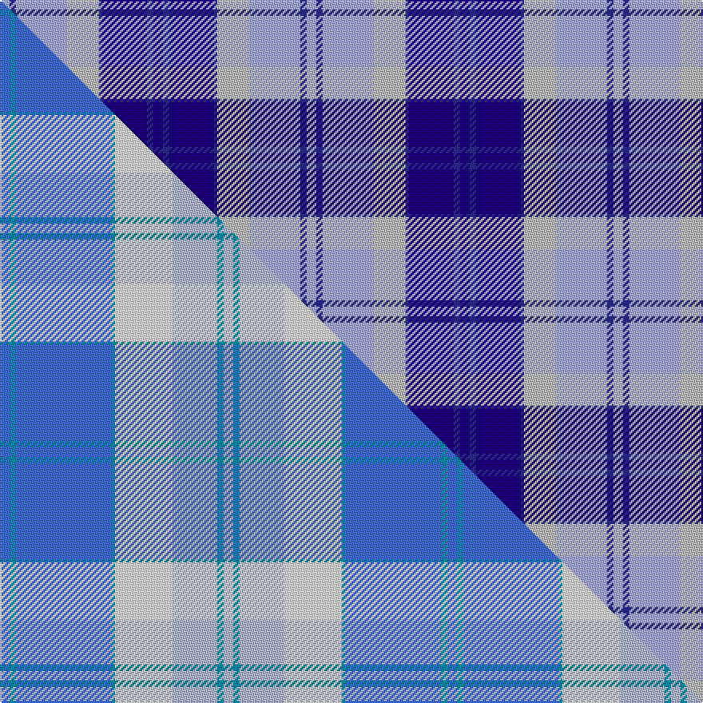

This page is one **sett** — a single exact thread-count. It belongs to the [tartan](/setts/db3dbi2db14dbi1lbi10lb16dbi2lb3/)
(the same proportion at any scale), whose colour order is pattern [BBBBWWBW](/stripes/bbbbwwbw/).

Part of the [Bannockbane](/tartans/bannockbane/) tartan — the named design grouping this sett with its other cloths.

Sourced from register-of-tartans.  It is a [8 stripe tartan](/stripes/stripes8/).

Original link [https://www.tartanregister.gov.uk/tartanDetails.aspx?ref=4910](https://www.tartanregister.gov.uk/tartanDetails.aspx?ref=4910)

Dataset <small>— provenance for this record, inherited from the source manifest</small>

<dl class="dataset-prov">
<dt>source</dt><dd><a href="/sources/register-of-tartans/">Scottish Register of Tartans</a></dd>
<dt>data captured from</dt><dd><a href="https://github.com/thetartan/tartan-database/blob/master/data/register-of-tartans/data.csv">https://github.com/thetartan/tartan-database/blob/master/data/register-of-tartans/data.csv</a></dd>
<dt>data date</dt><dd>2017-01-06 <small>(dataset default)</small></dd>
<dt>licence</dt><dd><a href="https://www.tartanregister.gov.uk/copyright">Crown copyright</a></dd>
</dl>

Capture chain <small>— the hands this data passed through, oldest first; each capture carries its own licence</small>

<ol class="capture-chain">
<li><a href="https://www.tartanregister.gov.uk/">Scottish Register of Tartans</a> · <a href="https://www.tartanregister.gov.uk/copyright">Crown copyright</a> <small>the living register — still published by National Records of Scotland</small></li>
<li><a href="https://github.com/thetartan/tartan-database">thetartan/tartan-database</a> <small>2016-2017</small> · <a href="https://creativecommons.org/licenses/by-nc-nd/4.0/">CC BY-NC-ND 4.0</a> <small>Levko Kravets's frozen compilation — the capture we vendored, and where its CC licence text came from</small></li>
<li>this dictionary <small>captured 2026-06-10 · commit 5bf86c7566</small> <small>each re-capture is a git commit to data/sources</small></li>
</ol>

## Register references

External register numbers recorded for this tartan.

- Scottish Register of Tartans: [4910](https://www.tartanregister.gov.uk/tartanDetails.aspx?ref=4910)
- Scottish Tartans Authority (ITI): 3652

## Thread count
LB/6 DBi4 LB32 LBi20 DBi2 DB28 DBi4 DB/6

One full sett is **192 threads**.

## Palette

Palette (<a href="/colour/tartan-register/">Tartan Register</a>)
<table><thead><tr><th>Colour</th><th>Shade</th><th>Ref</th><th>OKLCh</th></tr></thead><tbody><tr><td>DB</td><td><code style="background-color:#2C2C80;">#2C2C80</code> <small style="color:#888">#2C2C80</small></td><td><a href="/colour/tartan-register/#s-2c2c80" title="Dark Blue">DB4</a></td><td><small style="color:#888">oklch(35.0% 0.138 276.6)</small></td></tr><tr><td>DB</td><td><code style="background-color:#1C0070;">#1C0070</code> <small style="color:#888">#1C0070</small></td><td><a href="/colour/tartan-register/#s-1c0070" title="Dark Blue">DB5</a></td><td><small style="color:#888">oklch(26.3% 0.162 277.1)</small></td></tr><tr><td>LB</td><td><code style="background-color:#A8ACE8;">#A8ACE8</code> <small style="color:#888">#A8ACE8</small></td><td><a href="/colour/tartan-register/#s-a8ace8" title="Light Purple">LP1</a></td><td><small style="color:#888">oklch(76.3% 0.086 281.2)</small></td></tr><tr><td>LB</td><td><code style="background-color:#C0C0C0;">#C0C0C0</code> <small style="color:#888">#C0C0C0</small></td><td><a href="/colour/tartan-register/#s-c0c0c0" title="Grey">N2</a></td><td><small style="color:#888">oklch(80.8% 0.000 89.9)</small></td></tr></tbody></table>

# Sample pattern

## Compared to the master

This cloth is one sett of its design; the master sett (the exemplar the design is anchored on) is below for comparison.

Its **ΔTartan distance** from the master is **0.69** — the same measure the nearest-tartans table ranks by (0 is identical; a re-scale of the same cloth is near 0, a recolour or a different proportion further).

<figure class="master-compare" style="margin:0">

this sett
master sett ★

<figcaption style="color:#888;font-size:smaller">One weave of this sett against the <a href="/setts/b3t2b30t1w18lb14t2lb3/">master sett ★</a>, split on the diagonal: a shared proportion runs seamlessly across it with only the shades shifting; a different proportion breaks on it.</figcaption>
</figure>

## Nearest tartan variants

The nearest existing variants by ΔTartan distance, with this cloth at the top so the swatches line up against it.

ΔTartan

Threads

Variant

Sett

—

192

<a href="/variants/s8/db3dbi2db14dbi1lbi10lb16dbi2lb3~x2~db1106275-dbi1406275-lbi3200000-lb3103284/">Bannockbane Blue #2</a>

<a href="/ttd/edit/#slug=b3t2b30t1w18lb14t2lb3~x2&amp;base=db3dbi2db14dbi1lbi10lb16dbi2lb3~x2~db1106275-dbi1406275-lbi3200000-lb3103284" title="compare in the TTD">0.69</a>

280

<a href="/variants/s8/b3t2b30t1w18lb14t2lb3~x2/">Bannockbane Blue #3</a>

<a href="/ttd/edit/#slug=db7w3db2w6db16lb26dr4~x2&amp;base=db3dbi2db14dbi1lbi10lb16dbi2lb3~x2~db1106275-dbi1406275-lbi3200000-lb3103284" title="compare in the TTD">2.23</a>

234

<a href="/variants/s7/db7w3db2w6db16lb26dr4~x2/">Keela (Corporate)</a>

<a href="/ttd/edit/#slug=dt26w2dt3db15lb26db2lb3y4~x2~dt1204274-db1406275&amp;base=db3dbi2db14dbi1lbi10lb16dbi2lb3~x2~db1106275-dbi1406275-lbi3200000-lb3103284" title="compare in the TTD">2.26</a>

264

<a href="/variants/s8/db26w2db3dbi15lb26dbi2lb3y4~x2~db1204274-dbi1406275/">Banff and Buchan District Tartan</a>

<a href="/ttd/edit/#slug=db26w2db3n15lb26n2lb3y4~x2~db0805267-n1604274&amp;base=db3dbi2db14dbi1lbi10lb16dbi2lb3~x2~db1106275-dbi1406275-lbi3200000-lb3103284" title="compare in the TTD">2.26</a>

264

<a href="/variants/s8/db26w2db3dbi15lb26dbi2lb3y4~x2~db0805267-dbi1604274/">Banff, and Buchan</a>

<a href="/ttd/edit/#slug=db3dr2db18dr1w10n18dr2n3~x2&amp;base=db3dbi2db14dbi1lbi10lb16dbi2lb3~x2~db1106275-dbi1406275-lbi3200000-lb3103284" title="compare in the TTD">2.50</a>

216

<a href="/variants/s8/db3dr2db18dr1w10n18dr2n3~x2/">Bannockbane Silver</a>

<a href="/ttd/edit/#slug=ly15dbi2lb8db21w2dbi21db6w7~x2~dbi1406275-db1004274&amp;base=db3dbi2db14dbi1lbi10lb16dbi2lb3~x2~db1106275-dbi1406275-lbi3200000-lb3103284" title="compare in the TTD">2.83</a>

284

<a href="/variants/s8/ly15dbi2lb8db21w2dbi21db6w7~x2~dbi1406275-db1004274/">Monaghan County Crest (Fashion)</a>

<a href="/ttd/edit/#slug=db2b2db15b1w10b15db2b2~x2&amp;base=db3dbi2db14dbi1lbi10lb16dbi2lb3~x2~db1106275-dbi1406275-lbi3200000-lb3103284" title="compare in the TTD">2.84</a>

188

<a href="/variants/s8/db2b2db15b1w10b15db2b2~x2/">Bannockbane</a>

<a href="/ttd/edit/#slug=dy15dbi2lb8db21w2dbi21db6w7~x2~dbi1406275-db1004274&amp;base=db3dbi2db14dbi1lbi10lb16dbi2lb3~x2~db1106275-dbi1406275-lbi3200000-lb3103284" title="compare in the TTD">2.98</a>

284

<a href="/variants/s8/dy15dbi2lb8db21w2dbi21db6w7~x2~dbi1406275-db1004274/">Monaghan County, Crest Range</a>

<a href="/ttd/edit/#slug=db2lb2db15lb1w10lb15db2lb2~x2&amp;base=db3dbi2db14dbi1lbi10lb16dbi2lb3~x2~db1106275-dbi1406275-lbi3200000-lb3103284" title="compare in the TTD">3.11</a>

188

<a href="/variants/s8/db2lb2db15lb1w10lb15db2lb2~x2/">Bannockbane Light Blue</a>

<a href="/ttd/edit/#slug=db2w2db8b8w10db2w1db1~x2&amp;base=db3dbi2db14dbi1lbi10lb16dbi2lb3~x2~db1106275-dbi1406275-lbi3200000-lb3103284" title="compare in the TTD">3.17</a>

130

<a href="/variants/s8/db2w2db8b8w10db2w1db1~x2/">Laval (Tartan de..), dress</a>

## Neighbour map

Every grey dot is one of 13621 variants placed by the first two principal components of the ΔTartan feature space (42% of its variance). Red is this tartan; blue dots are its nearest — click one to open its page.

<svg viewBox="0 0 640 380" role="img" style="max-width:100%;height:auto;border:1px solid #e0e0e0;border-radius:4px;display:block" xmlns="http://www.w3.org/2000/svg"><image href="/nn/cloud.v1.png" width="640" height="380"/><a href="/variants/s8/b3t2b30t1w18lb14t2lb3~x2/"><circle cx="351.9" cy="187.2" r="4" fill="#3465a4"><title>Bannockbane Blue #3</title></circle></a><a href="/variants/s7/db7w3db2w6db16lb26dr4~x2/"><circle cx="257.5" cy="218.2" r="4" fill="#3465a4"><title>Keela (Corporate)</title></circle></a><a href="/variants/s8/db26w2db3dbi15lb26dbi2lb3y4~x2~db1204274-dbi1406275/"><circle cx="214.4" cy="184.0" r="4" fill="#3465a4"><title>Banff and Buchan District Tartan</title></circle></a><a href="/variants/s8/db26w2db3dbi15lb26dbi2lb3y4~x2~db0805267-dbi1604274/"><circle cx="199.5" cy="180.2" r="4" fill="#3465a4"><title>Banff, and Buchan</title></circle></a><a href="/variants/s8/db3dr2db18dr1w10n18dr2n3~x2/"><circle cx="259.4" cy="199.7" r="4" fill="#3465a4"><title>Bannockbane Silver</title></circle></a><a href="/variants/s8/ly15dbi2lb8db21w2dbi21db6w7~x2~dbi1406275-db1004274/"><circle cx="162.9" cy="224.4" r="4" fill="#3465a4"><title>Monaghan County Crest (Fashion)</title></circle></a><a href="/variants/s8/db2b2db15b1w10b15db2b2~x2/"><circle cx="295.4" cy="221.1" r="4" fill="#3465a4"><title>Bannockbane</title></circle></a><a href="/variants/s8/dy15dbi2lb8db21w2dbi21db6w7~x2~dbi1406275-db1004274/"><circle cx="162.7" cy="217.0" r="4" fill="#3465a4"><title>Monaghan County, Crest Range</title></circle></a><a href="/variants/s8/db2lb2db15lb1w10lb15db2lb2~x2/"><circle cx="290.3" cy="221.6" r="4" fill="#3465a4"><title>Bannockbane Light Blue</title></circle></a><a href="/variants/s8/db2w2db8b8w10db2w1db1~x2/"><circle cx="246.7" cy="241.8" r="4" fill="#3465a4"><title>Laval (Tartan de..), dress</title></circle></a><circle cx="250.1" cy="209.6" r="5" fill="#c00000"/><text x="320" y="376" text-anchor="middle" font-size="11" fill="#999">ground</text><text x="11" y="190" text-anchor="middle" font-size="11" fill="#999" transform="rotate(-90 11 190)">complexity</text></svg>

ID: /variants/s8/db3dbi2db14dbi1lbi10lb16dbi2lb3~x2~db1106275-dbi1406275-lbi3200000-lb3103284/
