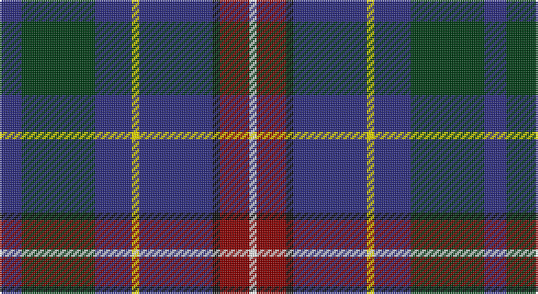

This page is one **sett** — a single exact thread-count. It belongs to the [tartan](/setts/db3dg10db5ly1db10k1r4w1/)
(the same proportion at any scale), whose colour order is pattern [BGBYBKRW](/stripes/bgbybkrw/).

Sourced from register-of-tartans.  It is a [8 stripe tartan](/stripes/stripes8/).

Original link https://www.tartanregister.gov.uk/tartanDetails.aspx?ref=10993

## Also known as

This cloth is also recorded under:

- Côté-Haché

2 attestations — the source records this cloth was collapsed from (oldest owns this page)

<ul>
<li>18/01/2014 — Côté-Haché (Personal) (register-of-tartans, <a href="https://www.tartanregister.gov.uk/tartanDetails.aspx?ref=10993">record</a>)</li>
<li>2014 — Cot-Hach (Personal)l) (tartans-authority, <a href="http://www.tartansauthority.com/tartan-ferret/display/10993/">record</a>)</li>
</ul>

## Register references

External register numbers recorded for this tartan.

- Scottish Register of Tartans: [10993](https://www.tartanregister.gov.uk/tartanDetails?ref=10993)
- Scottish Tartans Authority (ITI): 10993

## Thread count
DB/12 DG40 DB20 Y4 DB40 K4 DR16 W/4

One full sett is **264 threads**.

## Palette

Palette: <strong>Tartan Register</strong>
<table><thead><tr><th>Colour</th><th>Threads</th><th>Shade</th><th>Base</th><th>OKLCh</th></tr></thead><tbody><tr><td>DB/</td><td style="text-align:right;font-variant-numeric:tabular-nums">12</td><td><code style="background-color:#2C2C80;">#2C2C80</code> <small style="color:#888">#2C2C80</small></td><td>B <code style="background-color:#2A418A;">#2A418A</code></td><td><small style="color:#888">oklch(35.0% 0.138 276.6)</small></td></tr><tr><td>DG</td><td style="text-align:right;font-variant-numeric:tabular-nums">40</td><td><code style="background-color:#003C14;">#003C14</code> <small style="color:#888">#003C14</small></td><td>G <code style="background-color:#006100;">#006100</code></td><td><small style="color:#888">oklch(31.1% 0.089 148.5)</small></td></tr><tr><td>DB</td><td style="text-align:right;font-variant-numeric:tabular-nums">20</td><td><code style="background-color:#2C2C80;">#2C2C80</code> <small style="color:#888">#2C2C80</small></td><td>B <code style="background-color:#2A418A;">#2A418A</code></td><td><small style="color:#888">oklch(35.0% 0.138 276.6)</small></td></tr><tr><td>Y</td><td style="text-align:right;font-variant-numeric:tabular-nums">4</td><td><code style="background-color:#FFE600;">#FFE600</code> <small style="color:#888">#FFE600</small></td><td>Y <code style="background-color:#F2BF00;">#F2BF00</code></td><td><small style="color:#888">oklch(91.7% 0.192 101.4)</small></td></tr><tr><td>DB</td><td style="text-align:right;font-variant-numeric:tabular-nums">40</td><td><code style="background-color:#2C2C80;">#2C2C80</code> <small style="color:#888">#2C2C80</small></td><td>B <code style="background-color:#2A418A;">#2A418A</code></td><td><small style="color:#888">oklch(35.0% 0.138 276.6)</small></td></tr><tr><td>K</td><td style="text-align:right;font-variant-numeric:tabular-nums">4</td><td><code style="background-color:#101010;">#101010</code> <small style="color:#888">#101010</small></td><td>K <code style="background-color:#000000;">#000000</code></td><td><small style="color:#888">oklch(17.3% 0.000 89.9)</small></td></tr><tr><td>DR</td><td style="text-align:right;font-variant-numeric:tabular-nums">16</td><td><code style="background-color:#880000;">#880000</code> <small style="color:#888">#880000</small></td><td>R <code style="background-color:#CC0000;">#CC0000</code></td><td><small style="color:#888">oklch(39.4% 0.162 29.2)</small></td></tr><tr><td>W/</td><td style="text-align:right;font-variant-numeric:tabular-nums">4</td><td><code style="background-color:#FFFFFF;">#FFFFFF</code> <small style="color:#888">#FFFFFF</small></td><td>W <code style="background-color:#F7F7F7;">#F7F7F7</code></td><td><small style="color:#888">oklch(100.0% 0.000 89.9)</small></td></tr></tbody></table>

# Sample pattern

## Nearest tartans

The nearest existing variants by ΔTartan distance, with this tartan at the top so the swatches line up against it.

ΔTartan

Tartan

Sett

—

<a href="/ttd/edit/#slug=db3dg10db5ly1db10k1r4w1~x4">Côté-Haché (Personal)</a> <a class="nn-out" href="/variants/s8/db3dg10db5ly1db10k1r4w1~x4/" title="open its dictionary page">↗</a>

0.96

<a href="/ttd/edit/#slug=r2w2dg8g2dg2db20t8g2db15w2~x2&amp;base=db3dg10db5ly1db10k1r4w1~x4">Tupper, John Charles (Personal)</a> <a class="nn-out" href="/variants/s10/r2w2dg8g2dg2db20t8g2db15w2~x2/" title="open its dictionary page">↗</a>

1.04

<a href="/variants/s6/t12dp35lr4w3ki11k5~x2/">Ferster, James Carney</a>

1.05

<a href="/ttd/edit/#slug=dbi4dg2w2dg4db10r2db12ly3~x2&amp;base=db3dg10db5ly1db10k1r4w1~x4">United Services Planning Assoc Corporate Tartan</a> <a class="nn-out" href="/variants/s8/dbi4dg2w2dg4db10r2db12ly3~x2/" title="open its dictionary page">↗</a>

1.06

<a href="/ttd/edit/#slug=k3dg2k12db4b19r3b19db4k12dg2lo3~x2&amp;base=db3dg10db5ly1db10k1r4w1~x4">Loch Lomond Millenium</a> <a class="nn-out" href="/variants/s11/k3dg2k12db4b19r3b19db4k12dg2lo3~x2/" title="open its dictionary page">↗</a>

1.06

<a href="/ttd/edit/#slug=r3g9y15db10k2db18w3~x2&amp;base=db3dg10db5ly1db10k1r4w1~x4">Coulthard (Personal)</a> <a class="nn-out" href="/variants/s7/r3g9y15db10k2db18w3~x2/" title="open its dictionary page">↗</a>

1.07

<a href="/ttd/edit/#slug=db30n10y10db5r3ly3g3~x2&amp;base=db3dg10db5ly1db10k1r4w1~x4">Wrigglesworth Family Canada (Personal)</a> <a class="nn-out" href="/variants/s7/db30n10y10db5r3ly3g3~x2/" title="open its dictionary page">↗</a>

1.08

<a href="/ttd/edit/#slug=r1b8k4g1dg4g1k4b8ly1~x6&amp;base=db3dg10db5ly1db10k1r4w1~x4">Quinn (Personal)</a> <a class="nn-out" href="/variants/s9/r1b8k4g1dg4g1k4b8ly1~x6/" title="open its dictionary page">↗</a>

1.12

<a href="/ttd/edit/#slug=b11db5g4w3r3k16db28b2~x2&amp;base=db3dg10db5ly1db10k1r4w1~x4">Scottish Italian</a> <a class="nn-out" href="/variants/s8/b11db5g4w3r3k16db28b2~x2/" title="open its dictionary page">↗</a>

1.13

<a href="/ttd/edit/#slug=db36r4db6g18db15k18w4~x2&amp;base=db3dg10db5ly1db10k1r4w1~x4">Grainger (Name)</a> <a class="nn-out" href="/variants/s7/db36r4db6g18db15k18w4~x2/" title="open its dictionary page">↗</a>

1.14

<a href="/ttd/edit/#slug=b12dt35lb4w3k11r5~x2&amp;base=db3dg10db5ly1db10k1r4w1~x4">Ferster, James Carney (Personal)</a> <a class="nn-out" href="/variants/s6/b12dt35lb4w3k11r5~x2/" title="open its dictionary page">↗</a>

## Neighbour map

Every grey dot is one of 14360 variants placed by the first two principal components of the ΔTartan feature space (44% of its variance). Red is this tartan; blue dots are its nearest — click one to open its page.

<svg viewBox="0 0 640 380" role="img" style="max-width:100%;height:auto;border:1px solid #e0e0e0;border-radius:4px;display:block" xmlns="http://www.w3.org/2000/svg"><image href="/nn/cloud.v1.png" width="640" height="380"/><a href="/variants/s10/r2w2dg8g2dg2db20t8g2db15w2~x2/"><circle cx="239.4" cy="153.3" r="4" fill="#3465a4"><title>Tupper, John Charles (Personal)</title></circle></a><a href="/variants/s6/t12dp35lr4w3ki11k5~x2/"><circle cx="222.4" cy="168.0" r="4" fill="#3465a4"><title>Ferster, James Carney</title></circle></a><a href="/variants/s8/dbi4dg2w2dg4db10r2db12ly3~x2/"><circle cx="213.6" cy="198.7" r="4" fill="#3465a4"><title>United Services Planning Assoc Corporate Tartan</title></circle></a><a href="/variants/s11/k3dg2k12db4b19r3b19db4k12dg2lo3~x2/"><circle cx="192.2" cy="166.7" r="4" fill="#3465a4"><title>Loch Lomond Millenium</title></circle></a><a href="/variants/s7/r3g9y15db10k2db18w3~x2/"><circle cx="186.1" cy="202.0" r="4" fill="#3465a4"><title>Coulthard (Personal)</title></circle></a><a href="/variants/s7/db30n10y10db5r3ly3g3~x2/"><circle cx="275.2" cy="181.9" r="4" fill="#3465a4"><title>Wrigglesworth Family Canada (Personal)</title></circle></a><a href="/variants/s9/r1b8k4g1dg4g1k4b8ly1~x6/"><circle cx="199.9" cy="191.6" r="4" fill="#3465a4"><title>Quinn (Personal)</title></circle></a><a href="/variants/s8/b11db5g4w3r3k16db28b2~x2/"><circle cx="208.2" cy="156.9" r="4" fill="#3465a4"><title>Scottish Italian</title></circle></a><a href="/variants/s7/db36r4db6g18db15k18w4~x2/"><circle cx="263.7" cy="214.6" r="4" fill="#3465a4"><title>Grainger (Name)</title></circle></a><a href="/variants/s6/b12dt35lb4w3k11r5~x2/"><circle cx="220.1" cy="173.4" r="4" fill="#3465a4"><title>Ferster, James Carney (Personal)</title></circle></a><circle cx="235.0" cy="183.6" r="5" fill="#c00000"/></svg>

ID: /variants/s8/db3dg10db5ly1db10k1r4w1~x4/
