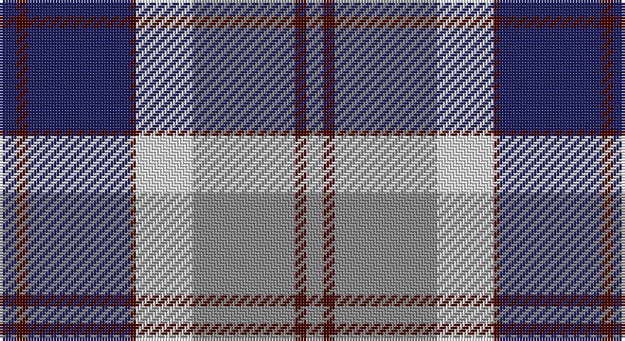

This page is one **sett** — a single exact thread-count. It belongs to the [tartan](/setts/db3dr2db18dr1w10o18dr2o3/)
(the same proportion at any scale), whose colour order is pattern [BBBBWRBR](/stripes/bbbbwrbr/).

Sourced from register-of-tartans.  It is a [8 stripe tartan](/stripes/stripes8/).

Original link https://www.tartanregister.gov.uk/tartanDetails.aspx?ref=205

## Also known as

This cloth is also recorded under:

- Bannockbane, Modern Silver

## Register references

External register numbers recorded for this tartan.

- Scottish Register of Tartans: [205](https://www.tartanregister.gov.uk/tartanDetails.aspx?ref=205)
- Scottish Tartans Authority (ITI): 595
- Scottish Tartans World Register: 595

## Thread count
DB/6 DR4 DB36 DR2 LN20 N36 DR4 N/6

One full sett is **216 threads**.

## Palette

Palette: <strong>Tartan Register</strong> <small style="color:#888">(3 of 4 colours)</small>
<table><thead><tr><th>Colour</th><th>Threads</th><th>Shade</th><th>Base</th><th>OKLCh</th></tr></thead><tbody><tr><td>DB/</td><td style="text-align:right;font-variant-numeric:tabular-nums">6</td><td><code style="background-color:#202060;">#202060</code> <small style="color:#888">#202060</small></td><td>B <code style="background-color:#2A418A;">#2A418A</code></td><td><small style="color:#888">oklch(28.9% 0.111 276.9)</small></td></tr><tr><td>DR</td><td style="text-align:right;font-variant-numeric:tabular-nums">4</td><td><code style="background-color:#480800;">#480800</code> <small style="color:#888">#480800</small></td><td>B <code style="background-color:#2A418A;">#2A418A</code></td><td><small style="color:#888">oklch(26.1% 0.096 33.1)</small></td></tr><tr><td>DB</td><td style="text-align:right;font-variant-numeric:tabular-nums">36</td><td><code style="background-color:#202060;">#202060</code> <small style="color:#888">#202060</small></td><td>B <code style="background-color:#2A418A;">#2A418A</code></td><td><small style="color:#888">oklch(28.9% 0.111 276.9)</small></td></tr><tr><td>DR</td><td style="text-align:right;font-variant-numeric:tabular-nums">2</td><td><code style="background-color:#480800;">#480800</code> <small style="color:#888">#480800</small></td><td>B <code style="background-color:#2A418A;">#2A418A</code></td><td><small style="color:#888">oklch(26.1% 0.096 33.1)</small></td></tr><tr><td>LN</td><td style="text-align:right;font-variant-numeric:tabular-nums">20</td><td><code style="background-color:#E0E0E0;">#E0E0E0</code> <small style="color:#888">#E0E0E0</small></td><td>W <code style="background-color:#F7F7F7;">#F7F7F7</code></td><td><small style="color:#888">oklch(90.7% 0.000 89.9)</small></td></tr><tr><td>N</td><td style="text-align:right;font-variant-numeric:tabular-nums">36</td><td><code style="background-color:#888888;">#888888</code> <small style="color:#888">#888888</small></td><td>R <code style="background-color:#CC0000;">#CC0000</code></td><td><small style="color:#888">oklch(62.7% 0.000 89.9)</small></td></tr><tr><td>DR</td><td style="text-align:right;font-variant-numeric:tabular-nums">4</td><td><code style="background-color:#480800;">#480800</code> <small style="color:#888">#480800</small></td><td>B <code style="background-color:#2A418A;">#2A418A</code></td><td><small style="color:#888">oklch(26.1% 0.096 33.1)</small></td></tr><tr><td>N/</td><td style="text-align:right;font-variant-numeric:tabular-nums">6</td><td><code style="background-color:#888888;">#888888</code> <small style="color:#888">#888888</small></td><td>R <code style="background-color:#CC0000;">#CC0000</code></td><td><small style="color:#888">oklch(62.7% 0.000 89.9)</small></td></tr></tbody></table>

# Sample pattern

## Nearest tartans

The nearest existing variants by ΔTartan distance, with this tartan at the top so the swatches line up against it.

ΔTartan

Tartan

Sett

—

<a href="/ttd/edit/#slug=db3dr2db18dr1w10o18dr2o3~x2">Bannockbane Silver</a> <a class="nn-out" href="/variants/s8/db3dr2db18dr1w10o18dr2o3~x2/" title="open its dictionary page">↗</a>

0.93

<a href="/ttd/edit/#slug=db3o2db18o1w10y18o2y3~x2&amp;base=db3dr2db18dr1w10o18dr2o3~x2">Bannockbane, Modern Silver</a> <a class="nn-out" href="/variants/s8/db3o2db18o1w10y18o2y3~x2/" title="open its dictionary page">↗</a>

0.95

<a href="/ttd/edit/#slug=db3m2db30m1w18o30m2o3~x2&amp;base=db3dr2db18dr1w10o18dr2o3~x2">Bannockbane Navy</a> <a class="nn-out" href="/variants/s8/db3m2db30m1w18o30m2o3~x2/" title="open its dictionary page">↗</a>

1.03

<a href="/ttd/edit/#slug=r3dy1w12dy2db2dy2db14w2db2~x2&amp;base=db3dr2db18dr1w10o18dr2o3~x2">Lord Arran (Corporate)</a> <a class="nn-out" href="/variants/s9/r3dy1w12dy2db2dy2db14w2db2~x2/" title="open its dictionary page">↗</a>

1.11

<a href="/ttd/edit/#slug=w4r1db18k6w5k4w4k4w3k2r1db2~x2&amp;base=db3dr2db18dr1w10o18dr2o3~x2">Knights Templar St Andrews Corporate Tartan</a> <a class="nn-out" href="/variants/s12/w4r1db18k6w5k4w4k4w3k2r1db2~x2/" title="open its dictionary page">↗</a>

1.11

<a href="/ttd/edit/#slug=r12b18k1r4k1g6k2~x2&amp;base=db3dr2db18dr1w10o18dr2o3~x2">Confederate (Military)</a> <a class="nn-out" href="/variants/s7/r12b18k1r4k1g6k2~x2/" title="open its dictionary page">↗</a>

1.12

<a href="/ttd/edit/#slug=dt7w3dt2w6dt16t26r4~x2&amp;base=db3dr2db18dr1w10o18dr2o3~x2">Keela (Corporate)</a> <a class="nn-out" href="/variants/s7/dt7w3dt2w6dt16t26r4~x2/" title="open its dictionary page">↗</a>

1.12

<a href="/ttd/edit/#slug=r9w5t57k5t9r29k18w9&amp;base=db3dr2db18dr1w10o18dr2o3~x2">Yale College of Wrexham (Corporate)</a> <a class="nn-out" href="/variants/s8/r9w5t57k5t9r29k18w9/" title="open its dictionary page">↗</a>

1.14

<a href="/ttd/edit/#slug=r12b18k1r4k1dg6k2~x2&amp;base=db3dr2db18dr1w10o18dr2o3~x2">Confederate</a> <a class="nn-out" href="/variants/s7/r12b18k1r4k1dg6k2~x2/" title="open its dictionary page">↗</a>

1.15

<a href="/ttd/edit/#slug=lp10dp9o59dp9k59dp9lp5&amp;base=db3dr2db18dr1w10o18dr2o3~x2">Central Newcastle School</a> <a class="nn-out" href="/variants/s7/lp10dp9o59dp9k59dp9lp5/" title="open its dictionary page">↗</a>

1.16

<a href="/ttd/edit/#slug=k4lo2k13lo1w8b13lo2b4~x2&amp;base=db3dr2db18dr1w10o18dr2o3~x2">Bannockbane Blue #1</a> <a class="nn-out" href="/variants/s8/k4lo2k13lo1w8b13lo2b4~x2/" title="open its dictionary page">↗</a>

## Neighbour map

Every grey dot is one of 14360 variants placed by the first two principal components of the ΔTartan feature space (44% of its variance). Red is this tartan; blue dots are its nearest — click one to open its page.

<svg viewBox="0 0 640 380" role="img" style="max-width:100%;height:auto;border:1px solid #e0e0e0;border-radius:4px;display:block" xmlns="http://www.w3.org/2000/svg"><image href="/nn/cloud.v1.png" width="640" height="380"/><a href="/variants/s8/db3o2db18o1w10y18o2y3~x2/"><circle cx="223.5" cy="163.9" r="4" fill="#3465a4"><title>Bannockbane, Modern Silver</title></circle></a><a href="/variants/s8/db3m2db30m1w18o30m2o3~x2/"><circle cx="228.1" cy="120.4" r="4" fill="#3465a4"><title>Bannockbane Navy</title></circle></a><a href="/variants/s9/r3dy1w12dy2db2dy2db14w2db2~x2/"><circle cx="224.4" cy="144.0" r="4" fill="#3465a4"><title>Lord Arran (Corporate)</title></circle></a><a href="/variants/s12/w4r1db18k6w5k4w4k4w3k2r1db2~x2/"><circle cx="181.7" cy="131.2" r="4" fill="#3465a4"><title>Knights Templar St Andrews Corporate Tartan</title></circle></a><a href="/variants/s7/r12b18k1r4k1g6k2~x2/"><circle cx="237.4" cy="163.4" r="4" fill="#3465a4"><title>Confederate (Military)</title></circle></a><a href="/variants/s7/dt7w3dt2w6dt16t26r4~x2/"><circle cx="213.0" cy="182.8" r="4" fill="#3465a4"><title>Keela (Corporate)</title></circle></a><a href="/variants/s8/r9w5t57k5t9r29k18w9/"><circle cx="225.3" cy="167.9" r="4" fill="#3465a4"><title>Yale College of Wrexham (Corporate)</title></circle></a><a href="/variants/s7/r12b18k1r4k1dg6k2~x2/"><circle cx="238.0" cy="163.7" r="4" fill="#3465a4"><title>Confederate</title></circle></a><a href="/variants/s7/lp10dp9o59dp9k59dp9lp5/"><circle cx="204.0" cy="175.1" r="4" fill="#3465a4"><title>Central Newcastle School</title></circle></a><a href="/variants/s8/k4lo2k13lo1w8b13lo2b4~x2/"><circle cx="148.8" cy="173.3" r="4" fill="#3465a4"><title>Bannockbane Blue #1</title></circle></a><circle cx="201.4" cy="153.2" r="5" fill="#c00000"/></svg>

ID: /variants/s8/db3dr2db18dr1w10o18dr2o3~x2/
