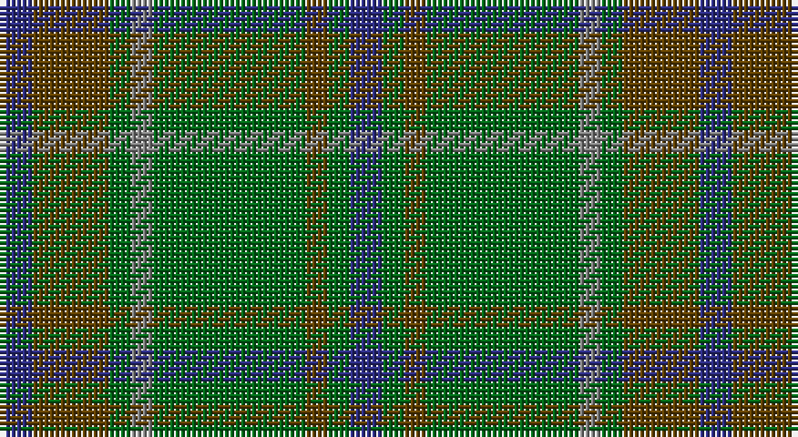

This page is one **sett** — a single exact thread-count. It belongs to the [tartan](/setts/db3dy7g2y2g14dy2g2db3/)
(the same proportion at any scale), whose colour order is pattern [BGGGGGGB](/stripes/bggggggb/).

Part of the [Daks](/tartans/daks/) tartan — the named design grouping this sett with its other cloths.

Sourced from register-of-tartans.  It is a [8 stripe tartan](/stripes/stripes8/).

Original link https://www.tartanregister.gov.uk/tartanDetails.aspx?ref=871

## Also known as

This cloth is also recorded under:

- Daks Muted blue
- Daks, Black
- Daks, Muted blue

## Register references

External register numbers recorded for this tartan.

- Scottish Register of Tartans: [871](https://www.tartanregister.gov.uk/tartanDetails.aspx?ref=871)
- Scottish Tartans Authority (ITI): 191
- Scottish Tartans World Register: 191

## Thread count
DB/6 T14 G4 N4 G28 T4 G4 DB/6

One full sett is **128 threads**.

## Palette

Palette: <strong>Tartan Register</strong>
<table><thead><tr><th>Colour</th><th>Threads</th><th>Shade</th><th>Base</th><th>OKLCh</th></tr></thead><tbody><tr><td>DB/</td><td style="text-align:right;font-variant-numeric:tabular-nums">6</td><td><code style="background-color:#2C2C80;">#2C2C80</code> <small style="color:#888">#2C2C80</small></td><td>B <code style="background-color:#2A418A;">#2A418A</code></td><td><small style="color:#888">oklch(35.0% 0.138 276.6)</small></td></tr><tr><td>T</td><td style="text-align:right;font-variant-numeric:tabular-nums">14</td><td><code style="background-color:#604000;">#604000</code> <small style="color:#888">#604000</small></td><td>G <code style="background-color:#006100;">#006100</code></td><td><small style="color:#888">oklch(39.8% 0.083 76.8)</small></td></tr><tr><td>G</td><td style="text-align:right;font-variant-numeric:tabular-nums">4</td><td><code style="background-color:#006818;">#006818</code> <small style="color:#888">#006818</small></td><td>G <code style="background-color:#006100;">#006100</code></td><td><small style="color:#888">oklch(45.0% 0.142 145.0)</small></td></tr><tr><td>N</td><td style="text-align:right;font-variant-numeric:tabular-nums">4</td><td><code style="background-color:#808080;">#808080</code> <small style="color:#888">#808080</small></td><td>G <code style="background-color:#006100;">#006100</code></td><td><small style="color:#888">oklch(60.0% 0.000 89.9)</small></td></tr><tr><td>G</td><td style="text-align:right;font-variant-numeric:tabular-nums">28</td><td><code style="background-color:#006818;">#006818</code> <small style="color:#888">#006818</small></td><td>G <code style="background-color:#006100;">#006100</code></td><td><small style="color:#888">oklch(45.0% 0.142 145.0)</small></td></tr><tr><td>T</td><td style="text-align:right;font-variant-numeric:tabular-nums">4</td><td><code style="background-color:#604000;">#604000</code> <small style="color:#888">#604000</small></td><td>G <code style="background-color:#006100;">#006100</code></td><td><small style="color:#888">oklch(39.8% 0.083 76.8)</small></td></tr><tr><td>G</td><td style="text-align:right;font-variant-numeric:tabular-nums">4</td><td><code style="background-color:#006818;">#006818</code> <small style="color:#888">#006818</small></td><td>G <code style="background-color:#006100;">#006100</code></td><td><small style="color:#888">oklch(45.0% 0.142 145.0)</small></td></tr><tr><td>DB/</td><td style="text-align:right;font-variant-numeric:tabular-nums">6</td><td><code style="background-color:#2C2C80;">#2C2C80</code> <small style="color:#888">#2C2C80</small></td><td>B <code style="background-color:#2A418A;">#2A418A</code></td><td><small style="color:#888">oklch(35.0% 0.138 276.6)</small></td></tr></tbody></table>

# Sample pattern

## Nearest tartans

The nearest existing variants by ΔTartan distance, with this tartan at the top so the swatches line up against it.

ΔTartan

Tartan

Sett

—

<a href="/ttd/edit/#slug=db3dy7g2y2g14dy2g2db3~x2">Daks (Loden)</a> <a class="nn-out" href="/variants/s8/db3dy7g2y2g14dy2g2db3~x2/" title="open its dictionary page">↗</a>

1.05

<a href="/ttd/edit/#slug=db3o7g2r2g14o2g2db3~x2&amp;base=db3dy7g2y2g14dy2g2db3~x2">Daks, Tartan-Loden</a> <a class="nn-out" href="/variants/s8/db3o7g2r2g14o2g2db3~x2/" title="open its dictionary page">↗</a>

1.19

<a href="/ttd/edit/#slug=dgi4ly2dgi17dg2r4dg2dgi3dg11dgi2~x2&amp;base=db3dy7g2y2g14dy2g2db3~x2">Armagh, County</a> <a class="nn-out" href="/variants/s9/dgi4ly2dgi17dg2r4dg2dgi3dg11dgi2~x2/" title="open its dictionary page">↗</a>

1.29

<a href="/ttd/edit/#slug=g5k2g28k10dy26db4g4~x2&amp;base=db3dy7g2y2g14dy2g2db3~x2">John Telfar Dunbar/Hunting Tartan</a> <a class="nn-out" href="/variants/s7/g5k2g28k10dy26db4g4~x2/" title="open its dictionary page">↗</a>

1.38

<a href="/ttd/edit/#slug=g10n2w2n16g6ly2g4r2g3n6~x4&amp;base=db3dy7g2y2g14dy2g2db3~x2">Harkness Htg (Name)</a> <a class="nn-out" href="/variants/s10/g10n2w2n16g6ly2g4r2g3n6~x4/" title="open its dictionary page">↗</a>

1.42

<a href="/ttd/edit/#slug=dp4dt18r2dt2r2dt9g20dt3g4~x2&amp;base=db3dy7g2y2g14dy2g2db3~x2">St. Andrews New Golf Club</a> <a class="nn-out" href="/variants/s9/dp4dt18r2dt2r2dt9g20dt3g4~x2/" title="open its dictionary page">↗</a>

1.42

<a href="/ttd/edit/#slug=dt17g5dt5g17dt4g17k2dy2k2g5~x2&amp;base=db3dy7g2y2g14dy2g2db3~x2">Hueg (Hunting) (Personal)</a> <a class="nn-out" href="/variants/s10/dt17g5dt5g17dt4g17k2dy2k2g5~x2/" title="open its dictionary page">↗</a>

1.47

<a href="/ttd/edit/#slug=g8k2g13lr4g12n22g5lo3~x2&amp;base=db3dy7g2y2g14dy2g2db3~x2">Taylor</a> <a class="nn-out" href="/variants/s8/g8k2g13lr4g12n22g5lo3~x2/" title="open its dictionary page">↗</a>

1.51

<a href="/ttd/edit/#slug=g1dy8g8r1g8dy8w1~x2&amp;base=db3dy7g2y2g14dy2g2db3~x2">MacKinnon Hunting Clan Tartan</a> <a class="nn-out" href="/variants/s7/g1dy8g8r1g8dy8w1~x2/" title="open its dictionary page">↗</a>

1.54

<a href="/ttd/edit/#slug=gi14t2gi2t2gi3t6g12r2~x2&amp;base=db3dy7g2y2g14dy2g2db3~x2">Cranston</a> <a class="nn-out" href="/variants/s8/gi14t2gi2t2gi3t6g12r2~x2/" title="open its dictionary page">↗</a>

1.55

<a href="/ttd/edit/#slug=yi12dg2yi2dg2yi2dy8y8dy1~x2&amp;base=db3dy7g2y2g14dy2g2db3~x2">Ancient Universal (Fashion?)</a> <a class="nn-out" href="/variants/s8/yi12dg2yi2dg2yi2dy8y8dy1~x2/" title="open its dictionary page">↗</a>

## Neighbour map

Every grey dot is one of 14360 variants placed by the first two principal components of the ΔTartan feature space (44% of its variance). Red is this tartan; blue dots are its nearest — click one to open its page.

<svg viewBox="0 0 640 380" role="img" style="max-width:100%;height:auto;border:1px solid #e0e0e0;border-radius:4px;display:block" xmlns="http://www.w3.org/2000/svg"><image href="/nn/cloud.v1.png" width="640" height="380"/><a href="/variants/s8/db3o7g2r2g14o2g2db3~x2/"><circle cx="304.6" cy="239.6" r="4" fill="#3465a4"><title>Daks, Tartan-Loden</title></circle></a><a href="/variants/s9/dgi4ly2dgi17dg2r4dg2dgi3dg11dgi2~x2/"><circle cx="386.1" cy="256.5" r="4" fill="#3465a4"><title>Armagh, County</title></circle></a><a href="/variants/s7/g5k2g28k10dy26db4g4~x2/"><circle cx="333.4" cy="234.6" r="4" fill="#3465a4"><title>John Telfar Dunbar/Hunting Tartan</title></circle></a><a href="/variants/s10/g10n2w2n16g6ly2g4r2g3n6~x4/"><circle cx="283.7" cy="231.7" r="4" fill="#3465a4"><title>Harkness Htg (Name)</title></circle></a><a href="/variants/s9/dp4dt18r2dt2r2dt9g20dt3g4~x2/"><circle cx="341.2" cy="233.8" r="4" fill="#3465a4"><title>St. Andrews New Golf Club</title></circle></a><a href="/variants/s10/dt17g5dt5g17dt4g17k2dy2k2g5~x2/"><circle cx="380.8" cy="256.4" r="4" fill="#3465a4"><title>Hueg (Hunting) (Personal)</title></circle></a><a href="/variants/s8/g8k2g13lr4g12n22g5lo3~x2/"><circle cx="336.0" cy="237.5" r="4" fill="#3465a4"><title>Taylor</title></circle></a><a href="/variants/s7/g1dy8g8r1g8dy8w1~x2/"><circle cx="353.0" cy="282.1" r="4" fill="#3465a4"><title>MacKinnon Hunting Clan Tartan</title></circle></a><a href="/variants/s8/gi14t2gi2t2gi3t6g12r2~x2/"><circle cx="270.7" cy="251.5" r="4" fill="#3465a4"><title>Cranston</title></circle></a><a href="/variants/s8/yi12dg2yi2dg2yi2dy8y8dy1~x2/"><circle cx="283.4" cy="227.7" r="4" fill="#3465a4"><title>Ancient Universal (Fashion?)</title></circle></a><circle cx="329.5" cy="256.6" r="5" fill="#c00000"/></svg>

ID: /variants/s8/db3dy7g2y2g14dy2g2db3~x2/
