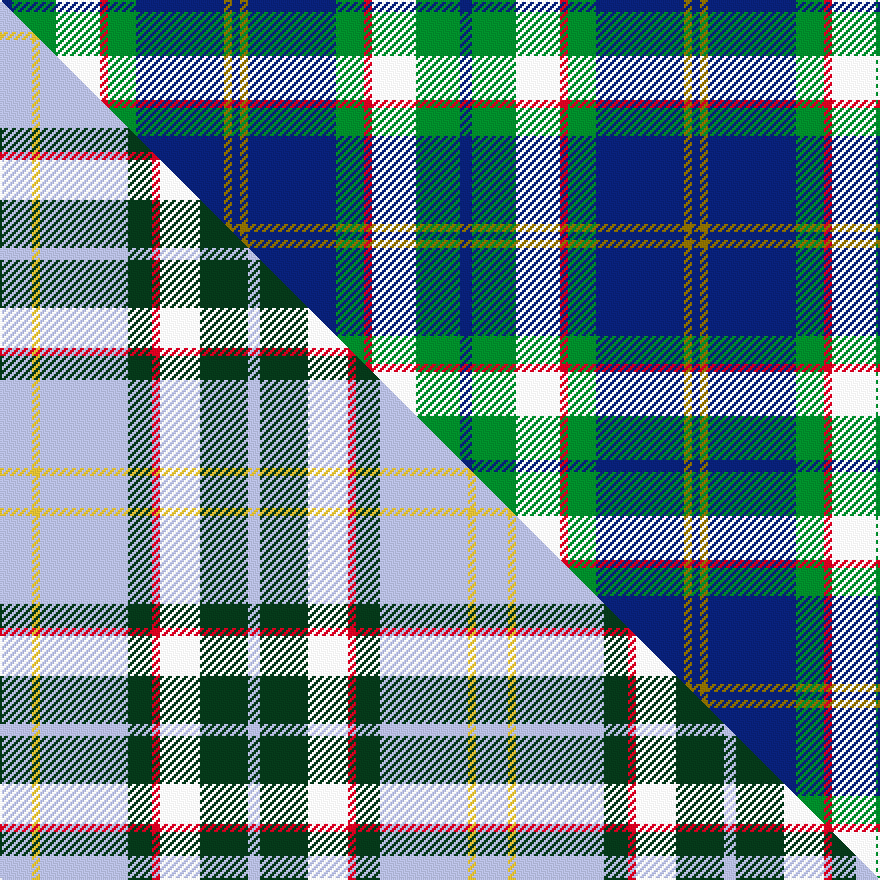

This is one **variant** — a specific cloth: this exact thread count and colourway, with its own
provenance below. It is one weaving of the [sett](/tartans/b/ba/bahamas/) (the scale-free proportion — the
same cloth at any scale or shade), whose colour order is pattern [BGBGRWGB](/stripes/bgbgrwgb/).

Part of the [Bahamas](/tartans/b/ba/bahamas/) tartan — the named design grouping this sett with its other cloths.

Sourced from weddslist.  It is a [8 stripe tartan](/stripes/stripes8/).

Original link [http://www.weddslist.com/cgi-bin/tartans/pg.pl?source=sts](http://www.weddslist.com/cgi-bin/tartans/pg.pl?source=sts)

Dataset <small>— provenance for this record, inherited from the source manifest</small>

<dl class="dataset-prov">
<dt>source</dt><dd><a href="/sources/weddslist/">Weddslist</a></dd>
<dt>data captured from</dt><dd><a href="https://github.com/thetartan/tartan-database/blob/master/data/weddslist/data.csv">https://github.com/thetartan/tartan-database/blob/master/data/weddslist/data.csv</a></dd>
<dt>data date</dt><dd>2016-11-17 <small>(dataset default)</small></dd>
<dt>licence</dt><dd><a href="https://creativecommons.org/licenses/by-nc-nd/4.0/">CC BY-NC-ND 4.0</a></dd>
</dl>

Capture chain <small>— the hands this data passed through, oldest first; each capture carries its own licence</small>

<ol class="capture-chain">
<li><a href="https://www.weddslist.com/tartans/">Weddslist</a> <small>the living privately compiled reference</small></li>
<li><a href="https://github.com/thetartan/tartan-database">thetartan/tartan-database</a> <small>2016-2017</small> · <a href="https://creativecommons.org/licenses/by-nc-nd/4.0/">CC BY-NC-ND 4.0</a> <small>Levko Kravets's frozen compilation — the capture we vendored, and where its CC licence text came from</small></li>
<li>this dictionary <small>captured 2026-06-10 · commit 5bf86c7566</small> <small>each re-capture is a git commit to data/sources</small></li>
</ol>

## Thread count
DB/6 G22 W22 R4 G14 DB44 Y4 DB/4

One full sett is **230 threads**.

## Palette
<table><thead><tr><th>Colour</th><th>Shade</th><th>OKLCh</th></tr></thead><tbody><tr><td>DB</td><td><code style="background-color:#082077;">#082077</code> <small style="color:#888">#082077</small></td><td><small style="color:#888">oklch(30.0% 0.149 265.1)</small></td></tr><tr><td>G</td><td><code style="background-color:#008B2A;">#008B2A</code> <small style="color:#888">#008B2A</small></td><td><small style="color:#888">oklch(55.4% 0.170 145.9)</small></td></tr><tr><td>W</td><td><code style="background-color:#F7F7F7;">#F7F7F7</code> <small style="color:#888">#F7F7F7</small></td><td><small style="color:#888">oklch(97.6% 0.000 89.9)</small></td></tr><tr><td>R</td><td><code style="background-color:#D60020;">#D60020</code> <small style="color:#888">#D60020</small></td><td><small style="color:#888">oklch(55.2% 0.224 25.5)</small></td></tr><tr><td>Y</td><td><code style="background-color:#8B6E00;">#8B6E00</code> <small style="color:#888">#8B6E00</small></td><td><small style="color:#888">oklch(55.1% 0.113 90.4)</small></td></tr></tbody></table>

# Sample pattern

## Compared to the master

This cloth is one sett of its design; the master sett (the exemplar the design is anchored on) is below for comparison.

Its **ΔTartan distance** from the master is **0.46** — the same measure the nearest-tartans table ranks by (0 is identical; a re-scale of the same cloth is near 0, a recolour or a different proportion further).

<figure class="master-compare" style="margin:0">

this sett
master sett ★

<figcaption style="color:#888;font-size:smaller">One weave of this sett against the <a href="/setts/lb8ly2lb22dg6r2w10dg12lb3/">master sett ★</a>, split on the diagonal: a shared proportion runs seamlessly across it with only the shades shifting; a different proportion breaks on it.</figcaption>
</figure>

## Nearest tartan variants

The nearest existing variants by ΔTartan distance, with this cloth at the top so the swatches line up against it.

ΔTartan

Threads

Variant

Sett

—

230

<a href="/variants/s8/db3g11w11r2g7db22y2db2~x2/">Bahamas</a>

<a href="/ttd/edit/#slug=db6y2db22g7r2w11g11db3~x2&amp;base=db3g11w11r2g7db22y2db2~x2" title="compare in the TTD">0.16</a>

238

<a href="/variants/s8/db6y2db22g7r2w11g11db3~x2/">Bahamas District Tartan</a>

<a href="/ttd/edit/#slug=lb8ly2lb22dg6r2w10dg12lb3~x2&amp;base=db3g11w11r2g7db22y2db2~x2" title="compare in the TTD">0.46</a>

238

<a href="/variants/s8/lb8ly2lb22dg6r2w10dg12lb3~x2/">Bahamas</a>

<a href="/ttd/edit/#slug=db15w2g2ly15r3db21r3g15~x2&amp;base=db3g11w11r2g7db22y2db2~x2" title="compare in the TTD">1.57</a>

244

<a href="/variants/s8/db15w2g2ly15r3db21r3g15~x2/">Loyalhanna</a>

<a href="/ttd/edit/#slug=db4ri1db12w1ri4w1g4w1r4g12db1w2~x2~ri2406019-r1706009&amp;base=db3g11w11r2g7db22y2db2~x2" title="compare in the TTD">2.29</a>

176

<a href="/variants/s12/db4ri1db12w1ri4w1g4w1r4g12db1w2~x2~ri2406019-r1706009/">Glenfalloch Corporate Tartan</a>

<a href="/ttd/edit/#slug=r2db12dg2g11dg4db5g2w24g2~x2~w3600000&amp;base=db3g11w11r2g7db22y2db2~x2" title="compare in the TTD">2.41</a>

248

<a href="/variants/s9/r2db12dg2g11dg4db5g2w24g2~x2~w3600000/">Fraser Gathering Dress Clan Tartan</a>

<a href="/ttd/edit/#slug=w3db28g26r3g26db26lb12db3lb3&amp;base=db3g11w11r2g7db22y2db2~x2" title="compare in the TTD">2.44</a>

254

<a href="/variants/s9/w3db28g26r3g26db26lb12db3lb3/">Seaford House</a>

<a href="/ttd/edit/#slug=db3g4db24g6w3g4r3g8ly3~x2&amp;base=db3g11w11r2g7db22y2db2~x2" title="compare in the TTD">2.45</a>

220

<a href="/variants/s9/db3g4db24g6w3g4r3g8ly3~x2/">Scottish Borders Tourist Board (Corp</a>

<a href="/ttd/edit/#slug=r6db27lb2g2lb2g30w4~x2&amp;base=db3g11w11r2g7db22y2db2~x2" title="compare in the TTD">2.47</a>

272

<a href="/variants/s7/r6db27lb2g2lb2g30w4~x2/">MX-5 Owners' Club</a>

<a href="/ttd/edit/#slug=db12r2db2r2db2g10w12o3~x2&amp;base=db3g11w11r2g7db22y2db2~x2" title="compare in the TTD">2.48</a>

150

<a href="/variants/s8/db12r2db2r2db2g10w12o3~x2/">Idaho, Centennial</a>

<a href="/ttd/edit/#slug=t5dy28w5k20ly5t47ly4~x2&amp;base=db3g11w11r2g7db22y2db2~x2" title="compare in the TTD">2.52</a>

438

<a href="/variants/s7/t5dy28w5k20ly5t47ly4~x2/">State Seal of Washington (Fashion)</a>

## Neighbour map

Every grey dot is one of 13657 variants placed by the first two principal components of the ΔTartan feature space (42% of its variance). Red is this tartan; blue dots are its nearest — click one to open its page. The map is a flat projection of a many-dimensional space — [how to read it](/posts/neighbourhood-maps/).

<svg viewBox="0 0 640 380" role="img" style="max-width:100%;height:auto;border:1px solid #e0e0e0;border-radius:4px;display:block" xmlns="http://www.w3.org/2000/svg"><image href="/nn/cloud.v1.png" width="640" height="380"/><a href="/variants/s8/db6y2db22g7r2w11g11db3~x2/"><circle cx="202.7" cy="185.2" r="4" fill="#3465a4"><title>Bahamas District Tartan</title></circle></a><a href="/variants/s8/lb8ly2lb22dg6r2w10dg12lb3~x2/"><circle cx="225.7" cy="187.9" r="4" fill="#3465a4"><title>Bahamas</title></circle></a><a href="/variants/s8/db15w2g2ly15r3db21r3g15~x2/"><circle cx="195.5" cy="189.7" r="4" fill="#3465a4"><title>Loyalhanna</title></circle></a><a href="/variants/s12/db4ri1db12w1ri4w1g4w1r4g12db1w2~x2~ri2406019-r1706009/"><circle cx="161.9" cy="156.0" r="4" fill="#3465a4"><title>Glenfalloch Corporate Tartan</title></circle></a><a href="/variants/s9/r2db12dg2g11dg4db5g2w24g2~x2~w3600000/"><circle cx="158.6" cy="164.3" r="4" fill="#3465a4"><title>Fraser Gathering Dress Clan Tartan</title></circle></a><a href="/variants/s9/w3db28g26r3g26db26lb12db3lb3/"><circle cx="207.0" cy="197.4" r="4" fill="#3465a4"><title>Seaford House</title></circle></a><a href="/variants/s9/db3g4db24g6w3g4r3g8ly3~x2/"><circle cx="221.0" cy="181.5" r="4" fill="#3465a4"><title>Scottish Borders Tourist Board (Corp</title></circle></a><a href="/variants/s7/r6db27lb2g2lb2g30w4~x2/"><circle cx="240.5" cy="164.5" r="4" fill="#3465a4"><title>MX-5 Owners' Club</title></circle></a><a href="/variants/s8/db12r2db2r2db2g10w12o3~x2/"><circle cx="115.7" cy="207.5" r="4" fill="#3465a4"><title>Idaho, Centennial</title></circle></a><a href="/variants/s7/t5dy28w5k20ly5t47ly4~x2/"><circle cx="185.2" cy="166.7" r="4" fill="#3465a4"><title>State Seal of Washington (Fashion)</title></circle></a><circle cx="192.2" cy="178.2" r="5" fill="#c00000"/><text x="320" y="376" text-anchor="middle" font-size="11" fill="#999">ground</text><text x="11" y="190" text-anchor="middle" font-size="11" fill="#999" transform="rotate(-90 11 190)">complexity</text></svg>

ID: /variants/s8/db3g11w11r2g7db22y2db2~x2/
