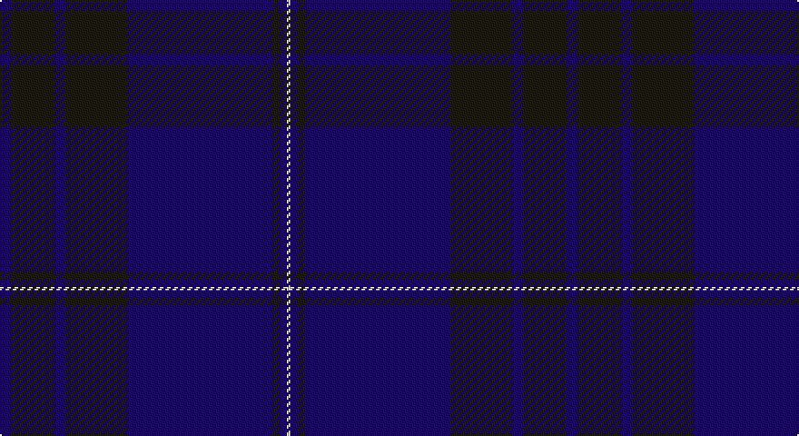

This page is one **sett** — a single exact thread-count. It belongs to the [tartan](/setts/db3k12db3k17db40k2db2w1/)
(the same proportion at any scale), whose colour order is pattern [BKBKBKBW](/stripes/bkbkbkbw/).

Part of the [Blue Spirit](/tartans/blue-spirit/) tartan — the named design grouping this sett with its other cloths.

Sourced from house-of-tartan.  It is a [8 stripe tartan](/stripes/stripes8/).

Original link http://www.house-of-tartan.scotland.net/house/TartanViewjs.asp?colr=Def&tnam=7001

## Provenance

Earliest known date: 01/08/2006 Designed by Kirsty Anderson of The House of Edgar for ACS Clothing of Glasgow.

## Thread count
DB/6 K24 DB6 K34 DB80 K4 DB4 LN/2

One full sett is **312 threads**.

## Palette

Palette: <strong>Tartan Dictionary</strong> <small style="color:#888">(1 of 3 colours)</small>
<table><thead><tr><th>Colour</th><th>Threads</th><th>Shade</th><th>Base</th><th>OKLCh</th></tr></thead><tbody><tr><td>DB/</td><td style="text-align:right;font-variant-numeric:tabular-nums">6</td><td><code style="background-color:#1B056A;">#1B056A</code> <small style="color:#888">#1B056A</small></td><td>B <code style="background-color:#2A418A;">#2A418A</code></td><td><small style="color:#888">oklch(25.8% 0.152 277.3)</small></td></tr><tr><td>K</td><td style="text-align:right;font-variant-numeric:tabular-nums">24</td><td><code style="background-color:#1E1A10;">#1E1A10</code> <small style="color:#888">#1E1A10</small></td><td>K <code style="background-color:#000000;">#000000</code></td><td><small style="color:#888">oklch(21.9% 0.019 88.7)</small></td></tr><tr><td>DB</td><td style="text-align:right;font-variant-numeric:tabular-nums">6</td><td><code style="background-color:#1B056A;">#1B056A</code> <small style="color:#888">#1B056A</small></td><td>B <code style="background-color:#2A418A;">#2A418A</code></td><td><small style="color:#888">oklch(25.8% 0.152 277.3)</small></td></tr><tr><td>K</td><td style="text-align:right;font-variant-numeric:tabular-nums">34</td><td><code style="background-color:#1E1A10;">#1E1A10</code> <small style="color:#888">#1E1A10</small></td><td>K <code style="background-color:#000000;">#000000</code></td><td><small style="color:#888">oklch(21.9% 0.019 88.7)</small></td></tr><tr><td>DB</td><td style="text-align:right;font-variant-numeric:tabular-nums">80</td><td><code style="background-color:#1B056A;">#1B056A</code> <small style="color:#888">#1B056A</small></td><td>B <code style="background-color:#2A418A;">#2A418A</code></td><td><small style="color:#888">oklch(25.8% 0.152 277.3)</small></td></tr><tr><td>K</td><td style="text-align:right;font-variant-numeric:tabular-nums">4</td><td><code style="background-color:#1E1A10;">#1E1A10</code> <small style="color:#888">#1E1A10</small></td><td>K <code style="background-color:#000000;">#000000</code></td><td><small style="color:#888">oklch(21.9% 0.019 88.7)</small></td></tr><tr><td>DB</td><td style="text-align:right;font-variant-numeric:tabular-nums">4</td><td><code style="background-color:#1B056A;">#1B056A</code> <small style="color:#888">#1B056A</small></td><td>B <code style="background-color:#2A418A;">#2A418A</code></td><td><small style="color:#888">oklch(25.8% 0.152 277.3)</small></td></tr><tr><td>LN/</td><td style="text-align:right;font-variant-numeric:tabular-nums">2</td><td><code style="background-color:#E0E0E0;">#E0E0E0</code> <small style="color:#888">#E0E0E0</small></td><td>W <code style="background-color:#F7F7F7;">#F7F7F7</code></td><td><small style="color:#888">oklch(90.7% 0.000 89.9)</small></td></tr></tbody></table>

# Sample pattern

## Compared to the master

This cloth is one sett of its design; the master sett (the exemplar the design is anchored on) is below for comparison.

<figure style="margin:0"><figcaption style="color:#888;font-size:smaller">this sett</figcaption></figure>
<figure style="margin:0"><figcaption style="color:#888;font-size:smaller"><a href="/setts/db3k13db3k22db49k2db2lb1/">master sett →</a></figcaption></figure>

## Nearest tartans

The nearest existing variants by ΔTartan distance, with this tartan at the top so the swatches line up against it.

ΔTartan

Tartan

Sett

—

<a href="/ttd/edit/#slug=db3k12db3k17db40k2db2w1~x2">Blue Spirit Fashion Tartan</a> <a class="nn-out" href="/variants/s8/db3k12db3k17db40k2db2w1~x2/" title="open its dictionary page">↗</a>

0.57

<a href="/ttd/edit/#slug=db3k13db3k22db49k2db2lb1~x2&amp;base=db3k12db3k17db40k2db2w1~x2">Blue Spirit</a> <a class="nn-out" href="/variants/s8/db3k13db3k22db49k2db2lb1~x2/" title="open its dictionary page">↗</a>

1.11

<a href="/ttd/edit/#slug=db56k4w1db6k20w2k20~x2&amp;base=db3k12db3k17db40k2db2w1~x2">Dalziel Rugby Club (Corporate)</a> <a class="nn-out" href="/variants/s7/db56k4w1db6k20w2k20~x2/" title="open its dictionary page">↗</a>

1.60

<a href="/ttd/edit/#slug=k10db3k3db32dg1db1dg1db2n2~x2&amp;base=db3k12db3k17db40k2db2w1~x2">Orman (Midlothian) (Personal)</a> <a class="nn-out" href="/variants/s9/k10db3k3db32dg1db1dg1db2n2~x2/" title="open its dictionary page">↗</a>

1.66

<a href="/ttd/edit/#slug=db4y1db30k15dp4db2k2db2k10db4dp2db2~x2&amp;base=db3k12db3k17db40k2db2w1~x2">Scotland's Own (Fashion)</a> <a class="nn-out" href="/variants/s12/db4y1db30k15dp4db2k2db2k10db4dp2db2~x2/" title="open its dictionary page">↗</a>

1.69

<a href="/ttd/edit/#slug=k1y3db3do28db36y1~x2&amp;base=db3k12db3k17db40k2db2w1~x2">Potts (Personal)</a> <a class="nn-out" href="/variants/s6/k1y3db3do28db36y1~x2/" title="open its dictionary page">↗</a>

1.72

<a href="/ttd/edit/#slug=db80k28dp9k3m5k12~x2&amp;base=db3k12db3k17db40k2db2w1~x2">Earl Blue Marl</a> <a class="nn-out" href="/variants/s6/db80k28dp9k3m5k12~x2/" title="open its dictionary page">↗</a>

1.76

<a href="/ttd/edit/#slug=dt45db7w3db27r1db7~x2&amp;base=db3k12db3k17db40k2db2w1~x2">U.S. Navy/Edzell (Military)</a> <a class="nn-out" href="/variants/s6/dt45db7w3db27r1db7~x2/" title="open its dictionary page">↗</a>

1.78

<a href="/ttd/edit/#slug=k3t1k32db6k4db16k3r2~x2&amp;base=db3k12db3k17db40k2db2w1~x2">Little of Morton Rigg Red (Personal)</a> <a class="nn-out" href="/variants/s8/k3t1k32db6k4db16k3r2~x2/" title="open its dictionary page">↗</a>

1.83

<a href="/ttd/edit/#slug=n4db48n21db14dy3db6n1ly3~x2&amp;base=db3k12db3k17db40k2db2w1~x2">Munster Ancestry (Fashion)</a> <a class="nn-out" href="/variants/s8/n4db48n21db14dy3db6n1ly3~x2/" title="open its dictionary page">↗</a>

1.86

<a href="/ttd/edit/#slug=k7r2k33db33k2db7~x2&amp;base=db3k12db3k17db40k2db2w1~x2">Casterton (Corporate)</a> <a class="nn-out" href="/variants/s6/k7r2k33db33k2db7~x2/" title="open its dictionary page">↗</a>

## Neighbour map

Every grey dot is one of 14360 variants placed by the first two principal components of the ΔTartan feature space (44% of its variance). Red is this tartan; blue dots are its nearest — click one to open its page.

<svg viewBox="0 0 640 380" role="img" style="max-width:100%;height:auto;border:1px solid #e0e0e0;border-radius:4px;display:block" xmlns="http://www.w3.org/2000/svg"><image href="/nn/cloud.v1.png" width="640" height="380"/><a href="/variants/s8/db3k13db3k22db49k2db2lb1~x2/"><circle cx="557.5" cy="200.7" r="4" fill="#3465a4"><title>Blue Spirit</title></circle></a><a href="/variants/s7/db56k4w1db6k20w2k20~x2/"><circle cx="499.6" cy="195.5" r="4" fill="#3465a4"><title>Dalziel Rugby Club (Corporate)</title></circle></a><a href="/variants/s9/k10db3k3db32dg1db1dg1db2n2~x2/"><circle cx="582.6" cy="191.1" r="4" fill="#3465a4"><title>Orman (Midlothian) (Personal)</title></circle></a><a href="/variants/s12/db4y1db30k15dp4db2k2db2k10db4dp2db2~x2/"><circle cx="446.8" cy="167.6" r="4" fill="#3465a4"><title>Scotland's Own (Fashion)</title></circle></a><a href="/variants/s6/k1y3db3do28db36y1~x2/"><circle cx="472.5" cy="197.6" r="4" fill="#3465a4"><title>Potts (Personal)</title></circle></a><a href="/variants/s6/db80k28dp9k3m5k12~x2/"><circle cx="453.0" cy="201.0" r="4" fill="#3465a4"><title>Earl Blue Marl</title></circle></a><a href="/variants/s6/dt45db7w3db27r1db7~x2/"><circle cx="450.4" cy="200.6" r="4" fill="#3465a4"><title>U.S. Navy/Edzell (Military)</title></circle></a><a href="/variants/s8/k3t1k32db6k4db16k3r2~x2/"><circle cx="539.4" cy="215.6" r="4" fill="#3465a4"><title>Little of Morton Rigg Red (Personal)</title></circle></a><a href="/variants/s8/n4db48n21db14dy3db6n1ly3~x2/"><circle cx="532.0" cy="168.8" r="4" fill="#3465a4"><title>Munster Ancestry (Fashion)</title></circle></a><a href="/variants/s6/k7r2k33db33k2db7~x2/"><circle cx="452.2" cy="267.2" r="4" fill="#3465a4"><title>Casterton (Corporate)</title></circle></a><circle cx="537.3" cy="205.8" r="5" fill="#c00000"/></svg>

ID: /variants/s8/db3k12db3k17db40k2db2w1~x2/
