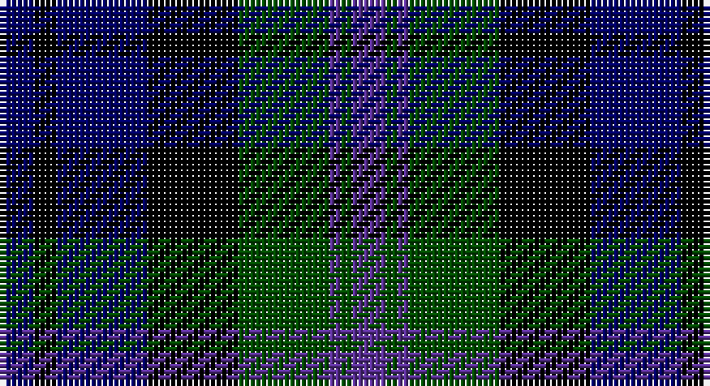

This page is one **sett** — a single exact thread-count. It belongs to the [tartan](/setts/db3k2db8k8dg8dp1dg1dp3/)
(the same proportion at any scale), whose colour order is pattern [BGBGKBKB](/stripes/bgbgkbkb/).

Part of the [Baird](/tartans/baird/) tartan — the named design grouping this sett with its other cloths.

Sourced from weddslist.  It is a [8 stripe tartan](/stripes/stripes8/).

Original link http://www.weddslist.com/cgi-bin/tartans/pg.pl?source=rb

## Thread count
DB/6 K4 DB16 K16 G16 P2 G2 P/6

One full sett is **124 threads**.

## Palette

Palette: <strong>Tartan Register</strong> <small style="color:#888">(3 of 4 colours)</small>
<table><thead><tr><th>Colour</th><th>Threads</th><th>Shade</th><th>Base</th><th>OKLCh</th></tr></thead><tbody><tr><td>DB/</td><td style="text-align:right;font-variant-numeric:tabular-nums">6</td><td><code style="background-color:#000064;">#000064</code> <small style="color:#888">#000064</small></td><td>B <code style="background-color:#2A418A;">#2A418A</code></td><td><small style="color:#888">oklch(22.7% 0.158 264.1)</small></td></tr><tr><td>K</td><td style="text-align:right;font-variant-numeric:tabular-nums">4</td><td><code style="background-color:#000000;">#000000</code> <small style="color:#888">#000000</small></td><td>K <code style="background-color:#000000;">#000000</code></td><td><small style="color:#888">oklch(0.0% 0.000 0.0)</small></td></tr><tr><td>DB</td><td style="text-align:right;font-variant-numeric:tabular-nums">16</td><td><code style="background-color:#000064;">#000064</code> <small style="color:#888">#000064</small></td><td>B <code style="background-color:#2A418A;">#2A418A</code></td><td><small style="color:#888">oklch(22.7% 0.158 264.1)</small></td></tr><tr><td>K</td><td style="text-align:right;font-variant-numeric:tabular-nums">16</td><td><code style="background-color:#000000;">#000000</code> <small style="color:#888">#000000</small></td><td>K <code style="background-color:#000000;">#000000</code></td><td><small style="color:#888">oklch(0.0% 0.000 0.0)</small></td></tr><tr><td>G</td><td style="text-align:right;font-variant-numeric:tabular-nums">16</td><td><code style="background-color:#004C00;">#004C00</code> <small style="color:#888">#004C00</small></td><td>G <code style="background-color:#006100;">#006100</code></td><td><small style="color:#888">oklch(36.1% 0.123 142.5)</small></td></tr><tr><td>P</td><td style="text-align:right;font-variant-numeric:tabular-nums">2</td><td><code style="background-color:#5A3094;">#5A3094</code> <small style="color:#888">#5A3094</small></td><td>B <code style="background-color:#2A418A;">#2A418A</code></td><td><small style="color:#888">oklch(41.8% 0.156 298.7)</small></td></tr><tr><td>G</td><td style="text-align:right;font-variant-numeric:tabular-nums">2</td><td><code style="background-color:#004C00;">#004C00</code> <small style="color:#888">#004C00</small></td><td>G <code style="background-color:#006100;">#006100</code></td><td><small style="color:#888">oklch(36.1% 0.123 142.5)</small></td></tr><tr><td>P/</td><td style="text-align:right;font-variant-numeric:tabular-nums">6</td><td><code style="background-color:#5A3094;">#5A3094</code> <small style="color:#888">#5A3094</small></td><td>B <code style="background-color:#2A418A;">#2A418A</code></td><td><small style="color:#888">oklch(41.8% 0.156 298.7)</small></td></tr></tbody></table>

# Sample pattern

## Compared to the master

This cloth is one sett of its design; the master sett (the exemplar the design is anchored on) is below for comparison.

<figure style="margin:0"><figcaption style="color:#888;font-size:smaller">this sett</figcaption></figure>
<figure style="margin:0"><figcaption style="color:#888;font-size:smaller"><a href="/setts/db3k2db8k8g8dp1g1dp3/">master sett →</a></figcaption></figure>

## Nearest tartans

The nearest existing variants by ΔTartan distance, with this tartan at the top so the swatches line up against it.

ΔTartan

Tartan

Sett

—

<a href="/ttd/edit/#slug=db3k2db8k8dg8dp1dg1dp3~x2">Baird</a> <a class="nn-out" href="/variants/s8/db3k2db8k8dg8dp1dg1dp3~x2/" title="open its dictionary page">↗</a>

0.47

<a href="/ttd/edit/#slug=db3k2db8k8dg8n1dg1n3~x2&amp;base=db3k2db8k8dg8dp1dg1dp3~x2">Baird</a> <a class="nn-out" href="/variants/s8/db3k2db8k8dg8n1dg1n3~x2/" title="open its dictionary page">↗</a>

0.77

<a href="/ttd/edit/#slug=db6k1db6k8r1dg8r2~x2&amp;base=db3k2db8k8dg8dp1dg1dp3~x2">Fletcher C</a> <a class="nn-out" href="/variants/s7/db6k1db6k8r1dg8r2~x2/" title="open its dictionary page">↗</a>

0.81

<a href="/ttd/edit/#slug=db6k1db6k8r1dg8r2&amp;base=db3k2db8k8dg8dp1dg1dp3~x2">Fletcher C</a> <a class="nn-out" href="/variants/s7/db6k1db6k8r1dg8r2/" title="open its dictionary page">↗</a>

0.91

<a href="/ttd/edit/#slug=db6k1db6k8r1dg8k2&amp;base=db3k2db8k8dg8dp1dg1dp3~x2">Fletcher</a> <a class="nn-out" href="/variants/s7/db6k1db6k8r1dg8k2/" title="open its dictionary page">↗</a>

0.95

<a href="/ttd/edit/#slug=db6k1db6k8r1dg8k2~x2&amp;base=db3k2db8k8dg8dp1dg1dp3~x2">Fletcher</a> <a class="nn-out" href="/variants/s7/db6k1db6k8r1dg8k2~x2/" title="open its dictionary page">↗</a>

1.01

<a href="/ttd/edit/#slug=k3dg14k14dg2db14r3~x2&amp;base=db3k2db8k8dg8dp1dg1dp3~x2">Morrison</a> <a class="nn-out" href="/variants/s6/k3dg14k14dg2db14r3~x2/" title="open its dictionary page">↗</a>

1.03

<a href="/ttd/edit/#slug=k3dg14k14dg2db14r3&amp;base=db3k2db8k8dg8dp1dg1dp3~x2">Morrison</a> <a class="nn-out" href="/variants/s6/k3dg14k14dg2db14r3/" title="open its dictionary page">↗</a>

1.09

<a href="/ttd/edit/#slug=r2k1db8k8dg8k1b2~x2&amp;base=db3k2db8k8dg8dp1dg1dp3~x2">Campbell of Cawdor</a> <a class="nn-out" href="/variants/s7/r2k1db8k8dg8k1b2~x2/" title="open its dictionary page">↗</a>

1.16

<a href="/ttd/edit/#slug=k8r1db8lr1db8r1k8dg8k1dg8~x2&amp;base=db3k2db8k8dg8dp1dg1dp3~x2">Hunter</a> <a class="nn-out" href="/variants/s10/k8r1db8lr1db8r1k8dg8k1dg8~x2/" title="open its dictionary page">↗</a>

1.19

<a href="/ttd/edit/#slug=r2dg8lr1k8db8k1db1~x2&amp;base=db3k2db8k8dg8dp1dg1dp3~x2">Colquhoun</a> <a class="nn-out" href="/variants/s7/r2dg8lr1k8db8k1db1~x2/" title="open its dictionary page">↗</a>

## Neighbour map

Every grey dot is one of 14360 variants placed by the first two principal components of the ΔTartan feature space (44% of its variance). Red is this tartan; blue dots are its nearest — click one to open its page.

<svg viewBox="0 0 640 380" role="img" style="max-width:100%;height:auto;border:1px solid #e0e0e0;border-radius:4px;display:block" xmlns="http://www.w3.org/2000/svg"><image href="/nn/cloud.v1.png" width="640" height="380"/><a href="/variants/s8/db3k2db8k8dg8n1dg1n3~x2/"><circle cx="167.4" cy="243.2" r="4" fill="#3465a4"><title>Baird</title></circle></a><a href="/variants/s7/db6k1db6k8r1dg8r2~x2/"><circle cx="183.4" cy="252.5" r="4" fill="#3465a4"><title>Fletcher C</title></circle></a><a href="/variants/s7/db6k1db6k8r1dg8r2/"><circle cx="168.3" cy="244.5" r="4" fill="#3465a4"><title>Fletcher C</title></circle></a><a href="/variants/s7/db6k1db6k8r1dg8k2/"><circle cx="197.5" cy="258.4" r="4" fill="#3465a4"><title>Fletcher</title></circle></a><a href="/variants/s7/db6k1db6k8r1dg8k2~x2/"><circle cx="205.6" cy="262.3" r="4" fill="#3465a4"><title>Fletcher</title></circle></a><a href="/variants/s6/k3dg14k14dg2db14r3~x2/"><circle cx="178.6" cy="261.3" r="4" fill="#3465a4"><title>Morrison</title></circle></a><a href="/variants/s6/k3dg14k14dg2db14r3/"><circle cx="164.4" cy="254.2" r="4" fill="#3465a4"><title>Morrison</title></circle></a><a href="/variants/s7/r2k1db8k8dg8k1b2~x2/"><circle cx="144.1" cy="220.4" r="4" fill="#3465a4"><title>Campbell of Cawdor</title></circle></a><a href="/variants/s10/k8r1db8lr1db8r1k8dg8k1dg8~x2/"><circle cx="144.3" cy="220.5" r="4" fill="#3465a4"><title>Hunter</title></circle></a><a href="/variants/s7/r2dg8lr1k8db8k1db1~x2/"><circle cx="142.8" cy="214.0" r="4" fill="#3465a4"><title>Colquhoun</title></circle></a><circle cx="159.7" cy="240.0" r="5" fill="#c00000"/></svg>

ID: /variants/s8/db3k2db8k8dg8dp1dg1dp3~x2/
