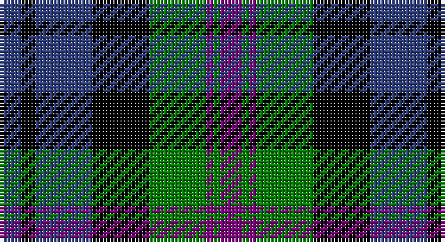

This page is one **sett** — a single exact thread-count. It belongs to the [tartan](/setts/db3k2db8k8g8p1g1p3/)
(the same proportion at any scale), whose colour order is pattern [BGBGKBKB](/stripes/bgbgkbkb/).

Sourced from weddslist.  It is a [8 stripe tartan](/stripes/stripes8/).

Original link http://www.weddslist.com/cgi-bin/tartans/pg.pl?source=sts

## Thread count
B/6 K4 B16 K16 G16 P2 G2 P/6

One full sett is **124 threads**.

## Palette

Palette: <strong>Ingles Buchan</strong> <small style="color:#888">(1 of 4 colours)</small>
<table><thead><tr><th>Colour</th><th>Threads</th><th>Shade</th><th>Base</th><th>OKLCh</th></tr></thead><tbody><tr><td>B/</td><td style="text-align:right;font-variant-numeric:tabular-nums">6</td><td><code style="background-color:#304080;">#304080</code> <small style="color:#888">#304080</small></td><td>B <code style="background-color:#2A418A;">#2A418A</code></td><td><small style="color:#888">oklch(39.4% 0.109 270.2)</small></td></tr><tr><td>K</td><td style="text-align:right;font-variant-numeric:tabular-nums">4</td><td><code style="background-color:#000000;">#000000</code> <small style="color:#888">#000000</small></td><td>K <code style="background-color:#000000;">#000000</code></td><td><small style="color:#888">oklch(0.0% 0.000 0.0)</small></td></tr><tr><td>B</td><td style="text-align:right;font-variant-numeric:tabular-nums">16</td><td><code style="background-color:#304080;">#304080</code> <small style="color:#888">#304080</small></td><td>B <code style="background-color:#2A418A;">#2A418A</code></td><td><small style="color:#888">oklch(39.4% 0.109 270.2)</small></td></tr><tr><td>K</td><td style="text-align:right;font-variant-numeric:tabular-nums">16</td><td><code style="background-color:#000000;">#000000</code> <small style="color:#888">#000000</small></td><td>K <code style="background-color:#000000;">#000000</code></td><td><small style="color:#888">oklch(0.0% 0.000 0.0)</small></td></tr><tr><td>G</td><td style="text-align:right;font-variant-numeric:tabular-nums">16</td><td><code style="background-color:#008000;">#008000</code> <small style="color:#888">#008000</small></td><td>G <code style="background-color:#006100;">#006100</code></td><td><small style="color:#888">oklch(52.0% 0.177 142.5)</small></td></tr><tr><td>P</td><td style="text-align:right;font-variant-numeric:tabular-nums">2</td><td><code style="background-color:#800080;">#800080</code> <small style="color:#888">#800080</small></td><td>B <code style="background-color:#2A418A;">#2A418A</code></td><td><small style="color:#888">oklch(42.1% 0.193 328.4)</small></td></tr><tr><td>G</td><td style="text-align:right;font-variant-numeric:tabular-nums">2</td><td><code style="background-color:#008000;">#008000</code> <small style="color:#888">#008000</small></td><td>G <code style="background-color:#006100;">#006100</code></td><td><small style="color:#888">oklch(52.0% 0.177 142.5)</small></td></tr><tr><td>P/</td><td style="text-align:right;font-variant-numeric:tabular-nums">6</td><td><code style="background-color:#800080;">#800080</code> <small style="color:#888">#800080</small></td><td>B <code style="background-color:#2A418A;">#2A418A</code></td><td><small style="color:#888">oklch(42.1% 0.193 328.4)</small></td></tr></tbody></table>

# Sample pattern

## Nearest tartans

The nearest existing variants by ΔTartan distance, with this tartan at the top so the swatches line up against it.

ΔTartan

Tartan

Sett

—

<a href="/ttd/edit/#slug=db3k2db8k8g8p1g1p3~x2">Baird</a> <a class="nn-out" href="/variants/s8/db3k2db8k8g8p1g1p3~x2/" title="open its dictionary page">↗</a>

0.65

<a href="/ttd/edit/#slug=db6k1db6k8r1g8r2~x2&amp;base=db3k2db8k8g8p1g1p3~x2">Fletcher of Dunans</a> <a class="nn-out" href="/variants/s7/db6k1db6k8r1g8r2~x2/" title="open its dictionary page">↗</a>

0.79

<a href="/ttd/edit/#slug=db6k1db6k8r1g8k2~x2&amp;base=db3k2db8k8g8p1g1p3~x2">Fletcher</a> <a class="nn-out" href="/variants/s7/db6k1db6k8r1g8k2~x2/" title="open its dictionary page">↗</a>

0.80

<a href="/ttd/edit/#slug=ly6dg3ly3dg22k23dp23k4~x2&amp;base=db3k2db8k8g8p1g1p3~x2">Gordon of Esslemont</a> <a class="nn-out" href="/variants/s7/ly6dg3ly3dg22k23dp23k4~x2/" title="open its dictionary page">↗</a>

0.93

<a href="/variants/s8/db10k6t1g6k1~x2/">Unnamed, No 115</a>

0.96

<a href="/ttd/edit/#slug=r7k4db28k24t24k4db4~x2&amp;base=db3k2db8k8g8p1g1p3~x2">MacCorquodale</a> <a class="nn-out" href="/variants/s7/r7k4db28k24t24k4db4~x2/" title="open its dictionary page">↗</a>

0.98

<a href="/ttd/edit/#slug=db8k2db2k2db2k8g7k1w1~x2&amp;base=db3k2db8k8g8p1g1p3~x2">Forbes</a> <a class="nn-out" href="/variants/s9/db8k2db2k2db2k8g7k1w1~x2/" title="open its dictionary page">↗</a>

0.98

<a href="/ttd/edit/#slug=db9k9db9r2k18g12r2g4r2g4~x2&amp;base=db3k2db8k8g8p1g1p3~x2">Newlands</a> <a class="nn-out" href="/variants/s10/db9k9db9r2k18g12r2g4r2g4~x2/" title="open its dictionary page">↗</a>

0.98

<a href="/ttd/edit/#slug=k3g14k14g2db14r3~x2&amp;base=db3k2db8k8g8p1g1p3~x2">Morrison</a> <a class="nn-out" href="/variants/s6/k3g14k14g2db14r3~x2/" title="open its dictionary page">↗</a>

0.98

<a href="/ttd/edit/#slug=db1k1db6k6g6k1w1~x2&amp;base=db3k2db8k8g8p1g1p3~x2">Forbes</a> <a class="nn-out" href="/variants/s7/db1k1db6k6g6k1w1~x2/" title="open its dictionary page">↗</a>

0.99

<a href="/ttd/edit/#slug=k3g3lb2g11k12db18k2lb3~x2&amp;base=db3k2db8k8g8p1g1p3~x2">Louisiana</a> <a class="nn-out" href="/variants/s8/k3g3lb2g11k12db18k2lb3~x2/" title="open its dictionary page">↗</a>

## Neighbour map

Every grey dot is one of 14360 variants placed by the first two principal components of the ΔTartan feature space (44% of its variance). Red is this tartan; blue dots are its nearest — click one to open its page.

<svg viewBox="0 0 640 380" role="img" style="max-width:100%;height:auto;border:1px solid #e0e0e0;border-radius:4px;display:block" xmlns="http://www.w3.org/2000/svg"><image href="/nn/cloud.v1.png" width="640" height="380"/><a href="/variants/s7/db6k1db6k8r1g8r2~x2/"><circle cx="147.1" cy="229.0" r="4" fill="#3465a4"><title>Fletcher of Dunans</title></circle></a><a href="/variants/s7/db6k1db6k8r1g8k2~x2/"><circle cx="158.2" cy="233.5" r="4" fill="#3465a4"><title>Fletcher</title></circle></a><a href="/variants/s7/ly6dg3ly3dg22k23dp23k4~x2/"><circle cx="148.6" cy="218.3" r="4" fill="#3465a4"><title>Gordon of Esslemont</title></circle></a><a href="/variants/s8/db10k6t1g6k1~x2/"><circle cx="146.4" cy="216.1" r="4" fill="#3465a4"><title>Unnamed, No 115</title></circle></a><a href="/variants/s7/r7k4db28k24t24k4db4~x2/"><circle cx="144.1" cy="220.5" r="4" fill="#3465a4"><title>MacCorquodale</title></circle></a><a href="/variants/s9/db8k2db2k2db2k8g7k1w1~x2/"><circle cx="171.4" cy="207.8" r="4" fill="#3465a4"><title>Forbes</title></circle></a><a href="/variants/s10/db9k9db9r2k18g12r2g4r2g4~x2/"><circle cx="149.8" cy="203.1" r="4" fill="#3465a4"><title>Newlands</title></circle></a><a href="/variants/s6/k3g14k14g2db14r3~x2/"><circle cx="137.1" cy="236.8" r="4" fill="#3465a4"><title>Morrison</title></circle></a><a href="/variants/s7/db1k1db6k6g6k1w1~x2/"><circle cx="142.7" cy="224.4" r="4" fill="#3465a4"><title>Forbes</title></circle></a><a href="/variants/s8/k3g3lb2g11k12db18k2lb3~x2/"><circle cx="137.5" cy="199.9" r="4" fill="#3465a4"><title>Louisiana</title></circle></a><circle cx="129.6" cy="218.2" r="5" fill="#c00000"/></svg>

ID: /variants/s8/db3k2db8k8g8p1g1p3~x2/
