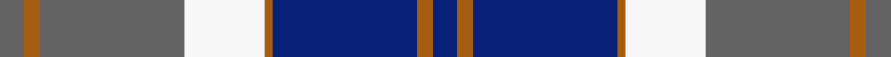
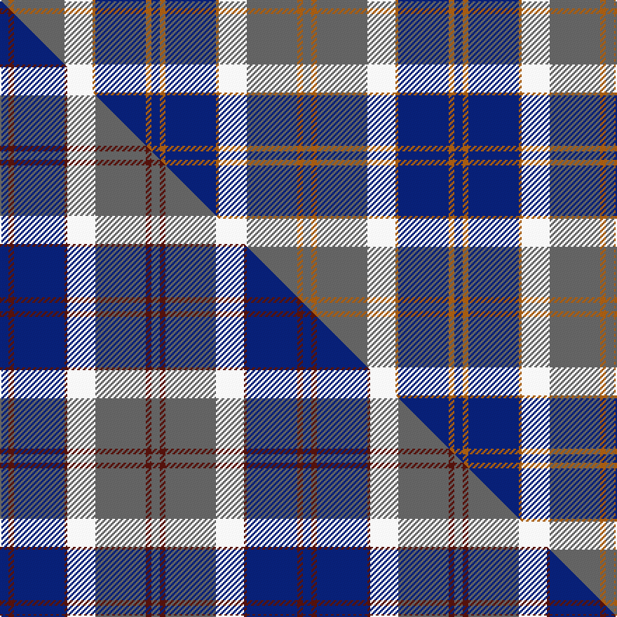

This page is one **sett** — a single exact thread-count. It belongs to the [tartan](/setts/db3o2db18o1w10n18o2n3/)
(the same proportion at any scale), whose colour order is pattern [BRBRWBRB](/stripes/brbrwbrb/).

Part of the [Bannockbane Silver](/tartans/bannockbane-silver/) tartan — the named design grouping this sett with its other cloths.

Sourced from weddslist.  It is a [8 stripe tartan](/stripes/stripes8/).

Original link http://www.weddslist.com/cgi-bin/tartans/pg.pl?source=sts

Dataset <small>— provenance for this record, inherited from the source manifest</small>

<dl class="dataset-prov">
<dt>source</dt><dd><a href="/sources/weddslist/">Weddslist</a></dd>
<dt>data captured from</dt><dd><a href="https://github.com/thetartan/tartan-database/blob/master/data/weddslist/data.csv">https://github.com/thetartan/tartan-database/blob/master/data/weddslist/data.csv</a></dd>
<dt>data date</dt><dd>2016-11-17 <small>(dataset default)</small></dd>
<dt>licence</dt><dd><a href="https://creativecommons.org/licenses/by-nc-nd/4.0/">CC BY-NC-ND 4.0</a></dd>
</dl>

Capture chain <small>— the hands this data passed through, oldest first; each capture carries its own licence</small>

<ol class="capture-chain">
<li><a href="https://www.weddslist.com/tartans/">Weddslist</a> <small>the living privately compiled reference</small></li>
<li><a href="https://github.com/thetartan/tartan-database">thetartan/tartan-database</a> <small>2016-2017</small> · <a href="https://creativecommons.org/licenses/by-nc-nd/4.0/">CC BY-NC-ND 4.0</a> <small>Levko Kravets's frozen compilation — the capture we vendored, and where its CC licence text came from</small></li>
<li>this dictionary <small>captured 2026-06-10 · commit 5bf86c7566</small> <small>each re-capture is a git commit to data/sources</small></li>
</ol>

## Thread count
N/6 O4 N36 W20 O2 DB36 O4 DB/6

One full sett is **216 threads**.

## Palette
<table><thead><tr><th>Colour</th><th>Shade</th><th>OKLCh</th></tr></thead><tbody><tr><td>DB</td><td><code style="background-color:#082077;">#082077</code> <small style="color:#888">#082077</small></td><td><small style="color:#888">oklch(30.0% 0.149 265.1)</small></td></tr><tr><td>W</td><td><code style="background-color:#F7F7F7;">#F7F7F7</code> <small style="color:#888">#F7F7F7</small></td><td><small style="color:#888">oklch(97.6% 0.000 89.9)</small></td></tr><tr><td>N</td><td><code style="background-color:#636363;">#636363</code> <small style="color:#888">#636363</small></td><td><small style="color:#888">oklch(50.0% 0.000 89.9)</small></td></tr><tr><td>O</td><td><code style="background-color:#A65C11;">#A65C11</code> <small style="color:#888">#A65C11</small></td><td><small style="color:#888">oklch(55.0% 0.125 58.3)</small></td></tr></tbody></table>

# Sample pattern

## Compared to the master

This cloth is one sett of its design; the master sett (the exemplar the design is anchored on) is below for comparison.

Its **ΔTartan distance** from the master is **0.90** — the same measure the nearest-tartans table ranks by (0 is identical; a re-scale of the same cloth is near 0, a recolour or a different proportion further).

<figure class="master-compare" style="margin:0">

this sett
master sett ★

<figcaption style="color:#888;font-size:smaller">One weave of this sett against the <a href="/setts/db3dr2db18dr1w10n18dr2n3/">master sett ★</a>, split on the diagonal: a shared proportion runs seamlessly across it with only the shades shifting; a different proportion breaks on it.</figcaption>
</figure>

## Nearest tartan variants

The nearest existing variants by ΔTartan distance, with this cloth at the top so the swatches line up against it.

ΔTartan

Threads

Variant

Sett

—

216

<a href="/variants/s8/db3o2db18o1w10n18o2n3~x2/">Bannockbane, Modern Silver</a>

<a href="/ttd/edit/#slug=g8lr4db21g6r7g1r1g8~x2&amp;base=db3o2db18o1w10n18o2n3~x2" title="compare in the TTD">2.81</a>

192

<a href="/variants/s8/g8lr4db21g6r7g1r1g8~x2/">Cathcart</a>

<a href="/ttd/edit/#slug=g5db15lr11lb2lr1lb1g4~x4~lr3200000-lb3103284&amp;base=db3o2db18o1w10n18o2n3~x2" title="compare in the TTD">2.99</a>

276

<a href="/variants/s7/g5db15lbi11lb2lbi1lb1g4~x4~lbi3200000-lb3103284/">Highlands Country Club (Corporate)</a>

<a href="/ttd/edit/#slug=b36w4b4w4b16dg64r9b6~x2&amp;base=db3o2db18o1w10n18o2n3~x2" title="compare in the TTD">3.01</a>

488

<a href="/variants/s8/b36w4b4w4b16dg64r9b6~x2/">Colvin</a>

<a href="/ttd/edit/#slug=w5db32g12db2w30k4~x2&amp;base=db3o2db18o1w10n18o2n3~x2" title="compare in the TTD">3.04</a>

322

<a href="/variants/s6/w5db32g12db2w30k4~x2/">Bonnie Royal</a>

<a href="/ttd/edit/#slug=db3r2db30r1w18o30r2o3~x2&amp;base=db3o2db18o1w10n18o2n3~x2" title="compare in the TTD">3.05</a>

344

<a href="/variants/s8/db3r2db30r1w18o30r2o3~x2/">Bannockbane Navy</a>

<a href="/ttd/edit/#slug=g3r12dg12g5r2db30g2r2~x2&amp;base=db3o2db18o1w10n18o2n3~x2" title="compare in the TTD">3.09</a>

262

<a href="/variants/s8/g3r12dg12g5r2db30g2r2~x2/">Rannoch Moor (Fashion)</a>

<a href="/ttd/edit/#slug=w3g15db18r15g1r2~x2&amp;base=db3o2db18o1w10n18o2n3~x2" title="compare in the TTD">3.11</a>

206

<a href="/variants/s6/w3g15db18r15g1r2~x2/">Nibley</a>

<a href="/ttd/edit/#slug=db49y12r12y12dg32w8db3&amp;base=db3o2db18o1w10n18o2n3~x2" title="compare in the TTD">3.14</a>

204

<a href="/variants/s7/db49y12r12y12dg32w8db3/">Kuznetsov (2014)</a>

<a href="/ttd/edit/#slug=w4lb44dbi19db44r2~x2~dbi1404259-db1003265&amp;base=db3o2db18o1w10n18o2n3~x2" title="compare in the TTD">3.16</a>

440

<a href="/variants/s5/w4lb44dbi19db44r2~x2~dbi1404259-db1003265/">World Federation of Building Contractors</a>

<a href="/ttd/edit/#slug=db12lb2db2t6db4lb3db4lb18r1~x4~db1406275-t2405244&amp;base=db3o2db18o1w10n18o2n3~x2" title="compare in the TTD">3.17</a>

364

<a href="/variants/s9/db12lb2db2t6db4lb3db4lb18r1~x4~db1406275-t2405244/">Thorburn #1 (Name)</a>

## Neighbour map

Every grey dot is one of 13620 variants placed by the first two principal components of the ΔTartan feature space (42% of its variance). Red is this tartan; blue dots are its nearest — click one to open its page.

<svg viewBox="0 0 640 380" role="img" style="max-width:100%;height:auto;border:1px solid #e0e0e0;border-radius:4px;display:block" xmlns="http://www.w3.org/2000/svg"><image href="/nn/cloud.v1.png" width="640" height="380"/><a href="/variants/s8/g8lr4db21g6r7g1r1g8~x2/"><circle cx="242.4" cy="177.1" r="4" fill="#3465a4"><title>Cathcart</title></circle></a><a href="/variants/s7/g5db15lbi11lb2lbi1lb1g4~x4~lbi3200000-lb3103284/"><circle cx="229.6" cy="203.6" r="4" fill="#3465a4"><title>Highlands Country Club (Corporate)</title></circle></a><a href="/variants/s8/b36w4b4w4b16dg64r9b6~x2/"><circle cx="294.1" cy="169.3" r="4" fill="#3465a4"><title>Colvin</title></circle></a><a href="/variants/s6/w5db32g12db2w30k4~x2/"><circle cx="198.9" cy="178.7" r="4" fill="#3465a4"><title>Bonnie Royal</title></circle></a><a href="/variants/s8/db3r2db30r1w18o30r2o3~x2/"><circle cx="229.1" cy="133.1" r="4" fill="#3465a4"><title>Bannockbane Navy</title></circle></a><a href="/variants/s8/g3r12dg12g5r2db30g2r2~x2/"><circle cx="263.1" cy="173.7" r="4" fill="#3465a4"><title>Rannoch Moor (Fashion)</title></circle></a><a href="/variants/s6/w3g15db18r15g1r2~x2/"><circle cx="200.1" cy="193.8" r="4" fill="#3465a4"><title>Nibley</title></circle></a><a href="/variants/s7/db49y12r12y12dg32w8db3/"><circle cx="205.6" cy="179.9" r="4" fill="#3465a4"><title>Kuznetsov (2014)</title></circle></a><a href="/variants/s5/w4lb44dbi19db44r2~x2~dbi1404259-db1003265/"><circle cx="217.6" cy="178.6" r="4" fill="#3465a4"><title>World Federation of Building Contractors</title></circle></a><a href="/variants/s9/db12lb2db2t6db4lb3db4lb18r1~x4~db1406275-t2405244/"><circle cx="280.0" cy="175.2" r="4" fill="#3465a4"><title>Thorburn #1 (Name)</title></circle></a><circle cx="219.5" cy="172.8" r="5" fill="#c00000"/><text x="320" y="376" text-anchor="middle" font-size="11" fill="#999">ground</text><text x="11" y="190" text-anchor="middle" font-size="11" fill="#999" transform="rotate(-90 11 190)">complexity</text></svg>

ID: /variants/s8/db3o2db18o1w10n18o2n3~x2/
