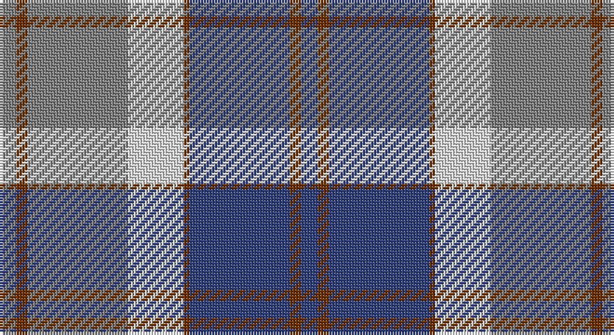

This page is one **sett** — a single exact thread-count. It belongs to the [tartan](/setts/db3o2db18o1w10y18o2y3/)
(the same proportion at any scale), whose colour order is pattern [BRBRWGRG](/stripes/brbrwgrg/).

Sourced from weddslist.  It is a [8 stripe tartan](/stripes/stripes8/).

Original link http://www.weddslist.com/cgi-bin/tartans/pg.pl?source=sts

## Thread count
N/6 T4 N36 LN20 T2 B36 T4 B/6

One full sett is **216 threads**.

## Palette

Palette: <strong>Tartan Register</strong> <small style="color:#888">(2 of 4 colours)</small>
<table><thead><tr><th>Colour</th><th>Threads</th><th>Shade</th><th>Base</th><th>OKLCh</th></tr></thead><tbody><tr><td>N/</td><td style="text-align:right;font-variant-numeric:tabular-nums">6</td><td><code style="background-color:#808080;">#808080</code> <small style="color:#888">#808080</small></td><td>G <code style="background-color:#006100;">#006100</code></td><td><small style="color:#888">oklch(60.0% 0.000 89.9)</small></td></tr><tr><td>T</td><td style="text-align:right;font-variant-numeric:tabular-nums">4</td><td><code style="background-color:#703000;">#703000</code> <small style="color:#888">#703000</small></td><td>R <code style="background-color:#CC0000;">#CC0000</code></td><td><small style="color:#888">oklch(39.1% 0.105 49.1)</small></td></tr><tr><td>N</td><td style="text-align:right;font-variant-numeric:tabular-nums">36</td><td><code style="background-color:#808080;">#808080</code> <small style="color:#888">#808080</small></td><td>G <code style="background-color:#006100;">#006100</code></td><td><small style="color:#888">oklch(60.0% 0.000 89.9)</small></td></tr><tr><td>LN</td><td style="text-align:right;font-variant-numeric:tabular-nums">20</td><td><code style="background-color:#E0E0E0;">#E0E0E0</code> <small style="color:#888">#E0E0E0</small></td><td>W <code style="background-color:#F7F7F7;">#F7F7F7</code></td><td><small style="color:#888">oklch(90.7% 0.000 89.9)</small></td></tr><tr><td>T</td><td style="text-align:right;font-variant-numeric:tabular-nums">2</td><td><code style="background-color:#703000;">#703000</code> <small style="color:#888">#703000</small></td><td>R <code style="background-color:#CC0000;">#CC0000</code></td><td><small style="color:#888">oklch(39.1% 0.105 49.1)</small></td></tr><tr><td>B</td><td style="text-align:right;font-variant-numeric:tabular-nums">36</td><td><code style="background-color:#304080;">#304080</code> <small style="color:#888">#304080</small></td><td>B <code style="background-color:#2A418A;">#2A418A</code></td><td><small style="color:#888">oklch(39.4% 0.109 270.2)</small></td></tr><tr><td>T</td><td style="text-align:right;font-variant-numeric:tabular-nums">4</td><td><code style="background-color:#703000;">#703000</code> <small style="color:#888">#703000</small></td><td>R <code style="background-color:#CC0000;">#CC0000</code></td><td><small style="color:#888">oklch(39.1% 0.105 49.1)</small></td></tr><tr><td>B/</td><td style="text-align:right;font-variant-numeric:tabular-nums">6</td><td><code style="background-color:#304080;">#304080</code> <small style="color:#888">#304080</small></td><td>B <code style="background-color:#2A418A;">#2A418A</code></td><td><small style="color:#888">oklch(39.4% 0.109 270.2)</small></td></tr></tbody></table>

# Sample pattern

## Nearest tartans

The nearest existing variants by ΔTartan distance, with this tartan at the top so the swatches line up against it.

ΔTartan

Tartan

Sett

—

<a href="/ttd/edit/#slug=db3o2db18o1w10y18o2y3~x2">Bannockbane, Modern Silver</a> <a class="nn-out" href="/variants/s8/db3o2db18o1w10y18o2y3~x2/" title="open its dictionary page">↗</a>

0.93

<a href="/ttd/edit/#slug=db3dr2db18dr1w10o18dr2o3~x2&amp;base=db3o2db18o1w10y18o2y3~x2">Bannockbane Silver</a> <a class="nn-out" href="/variants/s8/db3dr2db18dr1w10o18dr2o3~x2/" title="open its dictionary page">↗</a>

1.16

<a href="/ttd/edit/#slug=dt7w3dt2w6dt16t26r4~x2&amp;base=db3o2db18o1w10y18o2y3~x2">Keela (Corporate)</a> <a class="nn-out" href="/variants/s7/dt7w3dt2w6dt16t26r4~x2/" title="open its dictionary page">↗</a>

1.21

<a href="/ttd/edit/#slug=w4t30g6r2g6r28ly2r3~x2&amp;base=db3o2db18o1w10y18o2y3~x2">Scotland 2000 Commemorative Tartan</a> <a class="nn-out" href="/variants/s8/w4t30g6r2g6r28ly2r3~x2/" title="open its dictionary page">↗</a>

1.25

<a href="/ttd/edit/#slug=w4n1ly2n22dt20w2dt4w2~x2&amp;base=db3o2db18o1w10y18o2y3~x2">Gorman Blue (Personal)</a> <a class="nn-out" href="/variants/s8/w4n1ly2n22dt20w2dt4w2~x2/" title="open its dictionary page">↗</a>

1.29

<a href="/ttd/edit/#slug=b11r1k8r1b1r1o8r1b1~x4&amp;base=db3o2db18o1w10y18o2y3~x2">MacPherson Hunting</a> <a class="nn-out" href="/variants/s9/b11r1k8r1b1r1o8r1b1~x4/" title="open its dictionary page">↗</a>

1.30

<a href="/ttd/edit/#slug=w3lr4w1lr15p24do15ly1do4ly3~x4&amp;base=db3o2db18o1w10y18o2y3~x2">Sean F Forrester (Personal)</a> <a class="nn-out" href="/variants/s9/w3lr4w1lr15p24do15ly1do4ly3~x4/" title="open its dictionary page">↗</a>

1.32

<a href="/ttd/edit/#slug=lp26w2lp3db15y26m2y3db4~x2&amp;base=db3o2db18o1w10y18o2y3~x2">Scottish Highlander, dress</a> <a class="nn-out" href="/variants/s8/lp26w2lp3db15y26m2y3db4~x2/" title="open its dictionary page">↗</a>

1.37

<a href="/ttd/edit/#slug=r12b18k1r4k1g6k2~x2&amp;base=db3o2db18o1w10y18o2y3~x2">Confederate (Military)</a> <a class="nn-out" href="/variants/s7/r12b18k1r4k1g6k2~x2/" title="open its dictionary page">↗</a>

1.37

<a href="/ttd/edit/#slug=n30k5n19k5n2lr20ly2lr20k5ly4~x2&amp;base=db3o2db18o1w10y18o2y3~x2">Sonsub</a> <a class="nn-out" href="/variants/s10/n30k5n19k5n2lr20ly2lr20k5ly4~x2/" title="open its dictionary page">↗</a>

1.39

<a href="/ttd/edit/#slug=w9b3ly3b24db24ly2db2ly2~x2&amp;base=db3o2db18o1w10y18o2y3~x2">Halesowen (District)</a> <a class="nn-out" href="/variants/s8/w9b3ly3b24db24ly2db2ly2~x2/" title="open its dictionary page">↗</a>

## Neighbour map

Every grey dot is one of 14360 variants placed by the first two principal components of the ΔTartan feature space (44% of its variance). Red is this tartan; blue dots are its nearest — click one to open its page.

<svg viewBox="0 0 640 380" role="img" style="max-width:100%;height:auto;border:1px solid #e0e0e0;border-radius:4px;display:block" xmlns="http://www.w3.org/2000/svg"><image href="/nn/cloud.v1.png" width="640" height="380"/><a href="/variants/s8/db3dr2db18dr1w10o18dr2o3~x2/"><circle cx="201.4" cy="153.2" r="4" fill="#3465a4"><title>Bannockbane Silver</title></circle></a><a href="/variants/s7/dt7w3dt2w6dt16t26r4~x2/"><circle cx="213.0" cy="182.8" r="4" fill="#3465a4"><title>Keela (Corporate)</title></circle></a><a href="/variants/s8/w4t30g6r2g6r28ly2r3~x2/"><circle cx="237.9" cy="148.3" r="4" fill="#3465a4"><title>Scotland 2000 Commemorative Tartan</title></circle></a><a href="/variants/s8/w4n1ly2n22dt20w2dt4w2~x2/"><circle cx="277.8" cy="155.6" r="4" fill="#3465a4"><title>Gorman Blue (Personal)</title></circle></a><a href="/variants/s9/b11r1k8r1b1r1o8r1b1~x4/"><circle cx="213.8" cy="175.2" r="4" fill="#3465a4"><title>MacPherson Hunting</title></circle></a><a href="/variants/s9/w3lr4w1lr15p24do15ly1do4ly3~x4/"><circle cx="182.4" cy="120.5" r="4" fill="#3465a4"><title>Sean F Forrester (Personal)</title></circle></a><a href="/variants/s8/lp26w2lp3db15y26m2y3db4~x2/"><circle cx="177.9" cy="147.4" r="4" fill="#3465a4"><title>Scottish Highlander, dress</title></circle></a><a href="/variants/s7/r12b18k1r4k1g6k2~x2/"><circle cx="237.4" cy="163.4" r="4" fill="#3465a4"><title>Confederate (Military)</title></circle></a><a href="/variants/s10/n30k5n19k5n2lr20ly2lr20k5ly4~x2/"><circle cx="255.6" cy="174.0" r="4" fill="#3465a4"><title>Sonsub</title></circle></a><a href="/variants/s8/w9b3ly3b24db24ly2db2ly2~x2/"><circle cx="210.7" cy="169.5" r="4" fill="#3465a4"><title>Halesowen (District)</title></circle></a><circle cx="223.5" cy="163.9" r="5" fill="#c00000"/></svg>

ID: /variants/s8/db3o2db18o1w10y18o2y3~x2/
