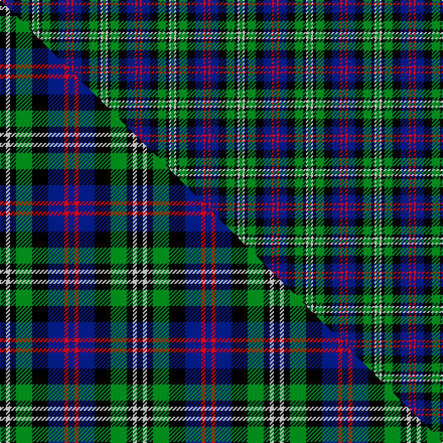

This is one **variant** — a specific cloth: this exact thread count and colourway, with its own
provenance below. It is one weaving of the [sett](/setts/db3r2db8k8g8k3w2g3/) (the scale-free proportion — the
same cloth at any scale or shade), whose colour order is pattern [BRBKGKWG](/stripes/brbkgkwg/).

Part of the [Davidson Double](/tartans/davidson-double/) tartan — the named design grouping this sett with its other cloths.

Sourced from weddslist.  It is a [8 stripe tartan](/stripes/stripes8/).

Original link [http://www.weddslist.com/cgi-bin/tartans/pg.pl?source=rb](http://www.weddslist.com/cgi-bin/tartans/pg.pl?source=rb)

Dataset <small>— provenance for this record, inherited from the source manifest</small>

<dl class="dataset-prov">
<dt>source</dt><dd><a href="/sources/weddslist/">Weddslist</a></dd>
<dt>data captured from</dt><dd><a href="https://github.com/thetartan/tartan-database/blob/master/data/weddslist/data.csv">https://github.com/thetartan/tartan-database/blob/master/data/weddslist/data.csv</a></dd>
<dt>data date</dt><dd>2016-11-17 <small>(dataset default)</small></dd>
<dt>licence</dt><dd><a href="https://creativecommons.org/licenses/by-nc-nd/4.0/">CC BY-NC-ND 4.0</a></dd>
</dl>

Capture chain <small>— the hands this data passed through, oldest first; each capture carries its own licence</small>

<ol class="capture-chain">
<li><a href="https://www.weddslist.com/tartans/">Weddslist</a> <small>the living privately compiled reference</small></li>
<li><a href="https://github.com/thetartan/tartan-database">thetartan/tartan-database</a> <small>2016-2017</small> · <a href="https://creativecommons.org/licenses/by-nc-nd/4.0/">CC BY-NC-ND 4.0</a> <small>Levko Kravets's frozen compilation — the capture we vendored, and where its CC licence text came from</small></li>
<li>this dictionary <small>captured 2026-06-10 · commit 5bf86c7566</small> <small>each re-capture is a git commit to data/sources</small></li>
</ol>

## Thread count
DB/3 R2 DB8 K8 G8 K3 W2 G/3

One full sett is **68 threads**.

## Palette
<table><thead><tr><th>Colour</th><th>Shade</th><th>OKLCh</th></tr></thead><tbody><tr><td>DB</td><td><code style="background-color:#082077;">#082077</code> <small style="color:#888">#082077</small></td><td><small style="color:#888">oklch(30.0% 0.149 265.1)</small></td></tr><tr><td>G</td><td><code style="background-color:#008B2A;">#008B2A</code> <small style="color:#888">#008B2A</small></td><td><small style="color:#888">oklch(55.4% 0.170 145.9)</small></td></tr><tr><td>K</td><td><code style="background-color:#000000;">#000000</code> <small style="color:#888">#000000</small></td><td><small style="color:#888">oklch(0.0% 0.000 0.0)</small></td></tr><tr><td>W</td><td><code style="background-color:#F7F7F7;">#F7F7F7</code> <small style="color:#888">#F7F7F7</small></td><td><small style="color:#888">oklch(97.6% 0.000 89.9)</small></td></tr><tr><td>R</td><td><code style="background-color:#D60020;">#D60020</code> <small style="color:#888">#D60020</small></td><td><small style="color:#888">oklch(55.2% 0.224 25.5)</small></td></tr></tbody></table>

# Sample pattern

## Compared to the master

This cloth is one sett of its design; the master sett (the exemplar the design is anchored on) is below for comparison.

Its **ΔTartan distance** from the master is **1.12** — the same measure the nearest-tartans table ranks by (0 is identical; a re-scale of the same cloth is near 0, a recolour or a different proportion further).

<figure class="master-compare" style="margin:0">

this sett
master sett ★

<figcaption style="color:#888;font-size:smaller">One weave of this sett against the <a href="/setts/k3w2k3g8k8db8r2db3/">master sett ★</a>, split on the diagonal: a shared proportion runs seamlessly across it with only the shades shifting; a different proportion breaks on it.</figcaption>
</figure>

## Nearest tartan variants

The nearest existing variants by ΔTartan distance, with this cloth at the top so the swatches line up against it.

ΔTartan

Threads

Variant

Sett

—

68

<a href="/variants/s8/db3r2db8k8g8k3w2g3/">Davidson Double</a>

<a href="/ttd/edit/#slug=k3w2k3g8k8db8r2db3&amp;base=db3r2db8k8g8k3w2g3" title="compare in the TTD">1.12</a>

68

<a href="/variants/s8/k3w2k3g8k8db8r2db3/">Davidson Double</a>

<a href="/ttd/edit/#slug=k3w2k3g8k8db8r2db3~x2&amp;base=db3r2db8k8g8k3w2g3" title="compare in the TTD">1.12</a>

136

<a href="/variants/s8/k3w2k3g8k8db8r2db3~x2/">Davidson, Double</a>

<a href="/ttd/edit/#slug=g8k7db8r2db8k7g8k2~x2&amp;base=db3r2db8k8g8k3w2g3" title="compare in the TTD">1.62</a>

180

<a href="/variants/s8/g8k7db8r2db8k7g8k2~x2/">Denholm</a>

<a href="/ttd/edit/#slug=y8g4db16g4k14y14db4t3~x2&amp;base=db3r2db8k8g8k3w2g3" title="compare in the TTD">1.90</a>

246

<a href="/variants/s8/y8g4db16g4k14y14db4t3~x2/">Hinnigan (Personal)</a>

<a href="/ttd/edit/#slug=r4g11k11g2db11dg3~x4&amp;base=db3r2db8k8g8k3w2g3" title="compare in the TTD">1.98</a>

308

<a href="/variants/s6/r4g11k11g2db11dg3~x4/">Casely</a>

<a href="/ttd/edit/#slug=dp11lb2k10g10y3~x2&amp;base=db3r2db8k8g8k3w2g3" title="compare in the TTD">1.99</a>

116

<a href="/variants/s5/dp11lb2k10g10y3~x2/">Wilson's No.217</a>

<a href="/ttd/edit/#slug=db8k4lo2k3dr2k3lo2k4g8~x4&amp;base=db3r2db8k8g8k3w2g3" title="compare in the TTD">2.00</a>

224

<a href="/variants/s9/db8k4lo2k3dr2k3lo2k4g8~x4/">Vosko</a>

<a href="/ttd/edit/#slug=db5lb4db22k15g22r4g4~x2&amp;base=db3r2db8k8g8k3w2g3" title="compare in the TTD">2.04</a>

286

<a href="/variants/s7/db5lb4db22k15g22r4g4~x2/">Cairngorm #2</a>

<a href="/ttd/edit/#slug=r1k2g4k1g1k2db3k1w1~x6&amp;base=db3r2db8k8g8k3w2g3" title="compare in the TTD">2.11</a>

180

<a href="/variants/s9/r1k2g4k1g1k2db3k1w1~x6/">MacKean Dress (Personal)</a>

<a href="/ttd/edit/#slug=k4g16k13db16lb3db3~x2&amp;base=db3r2db8k8g8k3w2g3" title="compare in the TTD">2.22</a>

206

<a href="/variants/s6/k4g16k13db16lb3db3~x2/">I Y</a>

## Neighbour map

Every grey dot is one of 13621 variants placed by the first two principal components of the ΔTartan feature space (42% of its variance). Red is this tartan; blue dots are its nearest — click one to open its page.

<svg viewBox="0 0 640 380" role="img" style="max-width:100%;height:auto;border:1px solid #e0e0e0;border-radius:4px;display:block" xmlns="http://www.w3.org/2000/svg"><image href="/nn/cloud.v1.png" width="640" height="380"/><a href="/variants/s8/k3w2k3g8k8db8r2db3/"><circle cx="75.9" cy="227.5" r="4" fill="#3465a4"><title>Davidson Double</title></circle></a><a href="/variants/s8/k3w2k3g8k8db8r2db3~x2/"><circle cx="75.9" cy="227.5" r="4" fill="#3465a4"><title>Davidson, Double</title></circle></a><a href="/variants/s8/g8k7db8r2db8k7g8k2~x2/"><circle cx="76.2" cy="271.0" r="4" fill="#3465a4"><title>Denholm</title></circle></a><a href="/variants/s8/y8g4db16g4k14y14db4t3~x2/"><circle cx="86.3" cy="222.7" r="4" fill="#3465a4"><title>Hinnigan (Personal)</title></circle></a><a href="/variants/s6/r4g11k11g2db11dg3~x4/"><circle cx="73.4" cy="233.8" r="4" fill="#3465a4"><title>Casely</title></circle></a><a href="/variants/s5/dp11lb2k10g10y3~x2/"><circle cx="73.4" cy="223.9" r="4" fill="#3465a4"><title>Wilson's No.217</title></circle></a><a href="/variants/s9/db8k4lo2k3dr2k3lo2k4g8~x4/"><circle cx="71.4" cy="224.1" r="4" fill="#3465a4"><title>Vosko</title></circle></a><a href="/variants/s7/db5lb4db22k15g22r4g4~x2/"><circle cx="106.6" cy="210.9" r="4" fill="#3465a4"><title>Cairngorm #2</title></circle></a><a href="/variants/s9/r1k2g4k1g1k2db3k1w1~x6/"><circle cx="65.6" cy="221.2" r="4" fill="#3465a4"><title>MacKean Dress (Personal)</title></circle></a><a href="/variants/s6/k4g16k13db16lb3db3~x2/"><circle cx="118.4" cy="239.1" r="4" fill="#3465a4"><title>I Y</title></circle></a><circle cx="46.9" cy="231.2" r="5" fill="#c00000"/><text x="320" y="376" text-anchor="middle" font-size="11" fill="#999">ground</text><text x="11" y="190" text-anchor="middle" font-size="11" fill="#999" transform="rotate(-90 11 190)">complexity</text></svg>

ID: /variants/s8/db3r2db8k8g8k3w2g3/
