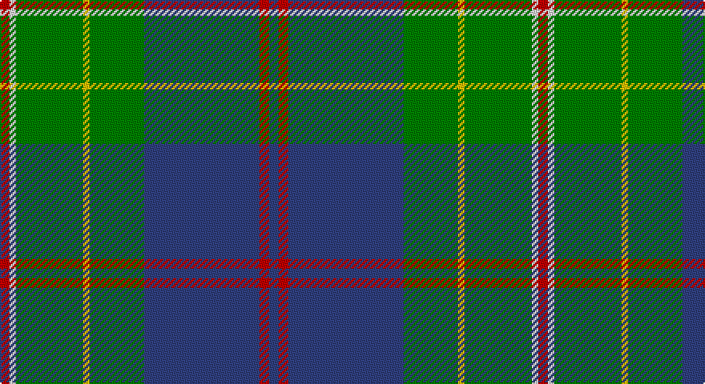

This page is one **sett** — a single exact thread-count. It belongs to the [tartan](/setts/db3r3db36g17ly2g21w2r3/)
(the same proportion at any scale), whose colour order is pattern [BRBGYGWR](/stripes/brbgygwr/).

Part of the [Singh](/tartans/singh/) tartan — the named design grouping this sett with its other cloths.

Sourced from weddslist.  It is a [8 stripe tartan](/stripes/stripes8/).

Original link http://www.weddslist.com/cgi-bin/tartans/pg.pl?source=sts

## Provenance

Earliest known date: 1999 Created for the use of those with the name Singh. The proposer was Sirdar Iqubal Singh, Lord of Butley

2 attestations — the source records this cloth was collapsed from (oldest owns this page)

<ul>
<li>undated — Singh (weddslist, <a href="http://www.weddslist.com/cgi-bin/tartans/pg.pl?source=sts">record</a>)</li>
<li>undated — Singh Name Tartan (house-of-tartan, <a href="http://www.house-of-tartan.scotland.net/house/TartanViewjs.asp?colr=Def&tnam=2600">record</a>)</li>
</ul>

## Thread count
R/6 LN4 G42 Y4 G34 B72 R6 B/6

One full sett is **336 threads**.

## Palette

Palette: <strong>Tartan Dictionary</strong> <small style="color:#888">(1 of 5 colours)</small>
<table><thead><tr><th>Colour</th><th>Threads</th><th>Shade</th><th>Base</th><th>OKLCh</th></tr></thead><tbody><tr><td>R/</td><td style="text-align:right;font-variant-numeric:tabular-nums">6</td><td><code style="background-color:#C00000;">#C00000</code> <small style="color:#888">#C00000</small></td><td>R <code style="background-color:#CC0000;">#CC0000</code></td><td><small style="color:#888">oklch(50.7% 0.208 29.2)</small></td></tr><tr><td>LN</td><td style="text-align:right;font-variant-numeric:tabular-nums">4</td><td><code style="background-color:#E0E0E0;">#E0E0E0</code> <small style="color:#888">#E0E0E0</small></td><td>W <code style="background-color:#F7F7F7;">#F7F7F7</code></td><td><small style="color:#888">oklch(90.7% 0.000 89.9)</small></td></tr><tr><td>G</td><td style="text-align:right;font-variant-numeric:tabular-nums">42</td><td><code style="background-color:#008000;">#008000</code> <small style="color:#888">#008000</small></td><td>G <code style="background-color:#006100;">#006100</code></td><td><small style="color:#888">oklch(52.0% 0.177 142.5)</small></td></tr><tr><td>Y</td><td style="text-align:right;font-variant-numeric:tabular-nums">4</td><td><code style="background-color:#F0C000;">#F0C000</code> <small style="color:#888">#F0C000</small></td><td>Y <code style="background-color:#F2BF00;">#F2BF00</code></td><td><small style="color:#888">oklch(82.7% 0.169 90.5)</small></td></tr><tr><td>G</td><td style="text-align:right;font-variant-numeric:tabular-nums">34</td><td><code style="background-color:#008000;">#008000</code> <small style="color:#888">#008000</small></td><td>G <code style="background-color:#006100;">#006100</code></td><td><small style="color:#888">oklch(52.0% 0.177 142.5)</small></td></tr><tr><td>B</td><td style="text-align:right;font-variant-numeric:tabular-nums">72</td><td><code style="background-color:#304080;">#304080</code> <small style="color:#888">#304080</small></td><td>B <code style="background-color:#2A418A;">#2A418A</code></td><td><small style="color:#888">oklch(39.4% 0.109 270.2)</small></td></tr><tr><td>R</td><td style="text-align:right;font-variant-numeric:tabular-nums">6</td><td><code style="background-color:#C00000;">#C00000</code> <small style="color:#888">#C00000</small></td><td>R <code style="background-color:#CC0000;">#CC0000</code></td><td><small style="color:#888">oklch(50.7% 0.208 29.2)</small></td></tr><tr><td>B/</td><td style="text-align:right;font-variant-numeric:tabular-nums">6</td><td><code style="background-color:#304080;">#304080</code> <small style="color:#888">#304080</small></td><td>B <code style="background-color:#2A418A;">#2A418A</code></td><td><small style="color:#888">oklch(39.4% 0.109 270.2)</small></td></tr></tbody></table>

# Sample pattern

## Compared to the master

This cloth is one sett of its design; the master sett (the exemplar the design is anchored on) is below for comparison.

<figure style="margin:0"><figcaption style="color:#888;font-size:smaller">this sett</figcaption></figure>
<figure style="margin:0"><figcaption style="color:#888;font-size:smaller"><a href="/setts/dp3r3dp34g18lo2g18lb2r3/">master sett →</a></figcaption></figure>

## Nearest tartans

The nearest existing variants by ΔTartan distance, with this tartan at the top so the swatches line up against it.

ΔTartan

Tartan

Sett

—

<a href="/ttd/edit/#slug=db3r3db36g17ly2g21w2r3~x2">Singh</a> <a class="nn-out" href="/variants/s8/db3r3db36g17ly2g21w2r3~x2/" title="open its dictionary page">↗</a>

0.70

<a href="/ttd/edit/#slug=r4k2g36k2b18ly3b18k2~x2&amp;base=db3r3db36g17ly2g21w2r3~x2">Fox Hunting</a> <a class="nn-out" href="/variants/s8/r4k2g36k2b18ly3b18k2~x2/" title="open its dictionary page">↗</a>

0.83

<a href="/ttd/edit/#slug=k3g36db28r2db2ly3~x2&amp;base=db3r3db36g17ly2g21w2r3~x2">Carmichael</a> <a class="nn-out" href="/variants/s6/k3g36db28r2db2ly3~x2/" title="open its dictionary page">↗</a>

0.97

<a href="/ttd/edit/#slug=ly4g3r2g36b30k3b3k3~x2&amp;base=db3r3db36g17ly2g21w2r3~x2">Chartered Accountants of Scotland</a> <a class="nn-out" href="/variants/s8/ly4g3r2g36b30k3b3k3~x2/" title="open its dictionary page">↗</a>

1.00

<a href="/ttd/edit/#slug=r1g16db2g10db22ly4r2ly1~x2&amp;base=db3r3db36g17ly2g21w2r3~x2">New Mexico</a> <a class="nn-out" href="/variants/s8/r1g16db2g10db22ly4r2ly1~x2/" title="open its dictionary page">↗</a>

1.00

<a href="/ttd/edit/#slug=r6db27t2g2t2g30w4~x2&amp;base=db3r3db36g17ly2g21w2r3~x2">MX-5 Owners' Club</a> <a class="nn-out" href="/variants/s7/r6db27t2g2t2g30w4~x2/" title="open its dictionary page">↗</a>

1.03

<a href="/ttd/edit/#slug=dg30db6r2db2ly2db15w2~x2&amp;base=db3r3db36g17ly2g21w2r3~x2">Hydesville Tower (Corporate)</a> <a class="nn-out" href="/variants/s7/dg30db6r2db2ly2db15w2~x2/" title="open its dictionary page">↗</a>

1.04

<a href="/ttd/edit/#slug=db5ly2db17g14w1g1w1g4ly2~x2&amp;base=db3r3db36g17ly2g21w2r3~x2">MacOrrell</a> <a class="nn-out" href="/variants/s9/db5ly2db17g14w1g1w1g4ly2~x2/" title="open its dictionary page">↗</a>

1.09

<a href="/ttd/edit/#slug=t24k2r2t2db12g28r4g5t3g3~x2&amp;base=db3r3db36g17ly2g21w2r3~x2">Downie (Name)</a> <a class="nn-out" href="/variants/s10/t24k2r2t2db12g28r4g5t3g3~x2/" title="open its dictionary page">↗</a>

1.11

<a href="/ttd/edit/#slug=g5db24g7k10g24ly2db2ly2r2~x2&amp;base=db3r3db36g17ly2g21w2r3~x2">Maitland Chief</a> <a class="nn-out" href="/variants/s9/g5db24g7k10g24ly2db2ly2r2~x2/" title="open its dictionary page">↗</a>

1.13

<a href="/ttd/edit/#slug=db3g13t1r3t1db10ly1~x2&amp;base=db3r3db36g17ly2g21w2r3~x2">Heckenberg Htg (Personal)</a> <a class="nn-out" href="/variants/s7/db3g13t1r3t1db10ly1~x2/" title="open its dictionary page">↗</a>

## Neighbour map

Every grey dot is one of 14360 variants placed by the first two principal components of the ΔTartan feature space (44% of its variance). Red is this tartan; blue dots are its nearest — click one to open its page.

<svg viewBox="0 0 640 380" role="img" style="max-width:100%;height:auto;border:1px solid #e0e0e0;border-radius:4px;display:block" xmlns="http://www.w3.org/2000/svg"><image href="/nn/cloud.v1.png" width="640" height="380"/><a href="/variants/s8/r4k2g36k2b18ly3b18k2~x2/"><circle cx="270.9" cy="163.7" r="4" fill="#3465a4"><title>Fox Hunting</title></circle></a><a href="/variants/s6/k3g36db28r2db2ly3~x2/"><circle cx="296.0" cy="164.0" r="4" fill="#3465a4"><title>Carmichael</title></circle></a><a href="/variants/s8/ly4g3r2g36b30k3b3k3~x2/"><circle cx="303.9" cy="159.7" r="4" fill="#3465a4"><title>Chartered Accountants of Scotland</title></circle></a><a href="/variants/s8/r1g16db2g10db22ly4r2ly1~x2/"><circle cx="289.2" cy="164.6" r="4" fill="#3465a4"><title>New Mexico</title></circle></a><a href="/variants/s7/r6db27t2g2t2g30w4~x2/"><circle cx="242.4" cy="159.2" r="4" fill="#3465a4"><title>MX-5 Owners' Club</title></circle></a><a href="/variants/s7/dg30db6r2db2ly2db15w2~x2/"><circle cx="306.8" cy="164.6" r="4" fill="#3465a4"><title>Hydesville Tower (Corporate)</title></circle></a><a href="/variants/s9/db5ly2db17g14w1g1w1g4ly2~x2/"><circle cx="281.9" cy="161.4" r="4" fill="#3465a4"><title>MacOrrell</title></circle></a><a href="/variants/s10/t24k2r2t2db12g28r4g5t3g3~x2/"><circle cx="243.5" cy="160.6" r="4" fill="#3465a4"><title>Downie (Name)</title></circle></a><a href="/variants/s9/g5db24g7k10g24ly2db2ly2r2~x2/"><circle cx="241.5" cy="173.8" r="4" fill="#3465a4"><title>Maitland Chief</title></circle></a><a href="/variants/s7/db3g13t1r3t1db10ly1~x2/"><circle cx="236.2" cy="179.4" r="4" fill="#3465a4"><title>Heckenberg Htg (Personal)</title></circle></a><circle cx="281.0" cy="157.0" r="5" fill="#c00000"/></svg>

ID: /variants/s8/db3r3db36g17ly2g21w2r3~x2/
