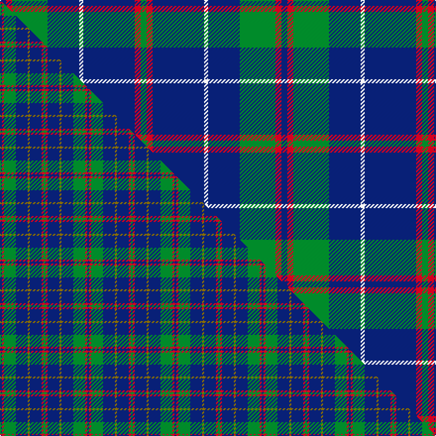

This is one **variant** — a specific cloth: this exact thread count and colourway, with its own
provenance below. It is one weaving of the [sett](/tartans/m/ma/machardy/) (the scale-free proportion — the
same cloth at any scale or shade), whose colour order is pattern [BRGBWBRG](/stripes/brgbwbrg/).

Part of the [MacHardy](/tartans/m/ma/machardy/) tartan — the named design grouping this sett with its other cloths.

Sourced from house-of-tartan.  It is a [8 stripe tartan](/stripes/stripes8/).

Original link [http://www.house-of-tartan.scotland.net/house/TartanViewjs.asp?colr=Def&tnam=514](http://www.house-of-tartan.scotland.net/house/TartanViewjs.asp?colr=Def&tnam=514)

## Provenance

Earliest known date: 1906 The following is from an 1860 manuscript written by a Charles Andrew McHardy who was the Chief Constable of Dumbarton and an historian. The McHardy Tartan, for Kilting and Plaiding, according to coloured thread scale is as follows:-Warp, 6 red; 58 green; 58 blue; 4 white; 58 blue; 6 red; 6 green; 6 red; 58 blue; 4 white; 58 blue; 58 green; 6 red; 6 blue; 6 red; 58 green; 58 blue; 4 white; 58 blue; 6 red; 6 green; 6 red; 58 blue; 4 white; 58 blue; 58 green; 6 red; 6 blue; 6 red &c. The ordinary width of a web of tartan is about two feet two inches, and if made of double width the sets, as above, are to be repeated until the full width be obtained. The threads in the Woof must correspond with those in the Warp, and if this be attended to the sets and checks will be correct. The slightly smaller sett illustrated comes from Johnston book of 1906.

2 attestations — the source records this cloth was collapsed from (oldest owns this page)

<ul>
<li>1906 — MacHardy Clan Tartan (house-of-tartan, <a href="http://www.house-of-tartan.scotland.net/house/TartanViewjs.asp?colr=Def&tnam=514">record</a>) </li>
<li>undated — MacHardy (weddslist, <a href="http://www.weddslist.com/cgi-bin/tartans/pg.pl?source=sts">record</a>) </li>
</ul>

Dataset <small>— provenance for this record, inherited from the source manifest</small>

<dl class="dataset-prov">
<dt>source</dt><dd><a href="/sources/house-of-tartan/">House of Tartan</a></dd>
<dt>data captured from</dt><dd><a href="https://github.com/thetartan/tartan-database/blob/master/data/house-of-tartan/data.csv">https://github.com/thetartan/tartan-database/blob/master/data/house-of-tartan/data.csv</a></dd>
<dt>data date</dt><dd>1906 <small>(this record)</small></dd>
<dt>licence</dt><dd><a href="https://creativecommons.org/licenses/by-nc-nd/4.0/">CC BY-NC-ND 4.0</a></dd>
</dl>

Capture chain <small>— the hands this data passed through, oldest first; each capture carries its own licence</small>

<ol class="capture-chain">
<li><a href="http://www.house-of-tartan.scotland.net/">House of Tartan</a> <small>the weaver/retailer's database — the site is now offline; the URL is kept as the ultimate source's identity</small></li>
<li><a href="https://github.com/thetartan/tartan-database">thetartan/tartan-database</a> <small>2016-2017</small> · <a href="https://creativecommons.org/licenses/by-nc-nd/4.0/">CC BY-NC-ND 4.0</a> <small>Levko Kravets's frozen compilation — the capture we vendored, and where its CC licence text came from</small></li>
<li>this dictionary <small>captured 2026-06-10 · commit 5bf86c7566</small> <small>each re-capture is a git commit to data/sources</small></li>
</ol>

## Thread count
DB/6 R6 G36 DB32 W4 DB52 R6 G/6

One full sett is **284 threads**.

## Palette
<table><thead><tr><th>Colour</th><th>Shade</th><th>OKLCh</th></tr></thead><tbody><tr><td>DB</td><td><code style="background-color:#082077;">#082077</code> <small style="color:#888">#082077</small></td><td><small style="color:#888">oklch(30.0% 0.149 265.1)</small></td></tr><tr><td>G</td><td><code style="background-color:#008B2A;">#008B2A</code> <small style="color:#888">#008B2A</small></td><td><small style="color:#888">oklch(55.4% 0.170 145.9)</small></td></tr><tr><td>W</td><td><code style="background-color:#F7F7F7;">#F7F7F7</code> <small style="color:#888">#F7F7F7</small></td><td><small style="color:#888">oklch(97.6% 0.000 89.9)</small></td></tr><tr><td>R</td><td><code style="background-color:#D60020;">#D60020</code> <small style="color:#888">#D60020</small></td><td><small style="color:#888">oklch(55.2% 0.224 25.5)</small></td></tr></tbody></table>

# Sample pattern

## Compared to the master

This cloth is one sett of its design; the master sett (the exemplar the design is anchored on) is below for comparison.

Its **ΔTartan distance** from the master is **0.80** — the same measure the nearest-tartans table ranks by (0 is identical; a re-scale of the same cloth is near 0, a recolour or a different proportion further).

<figure class="master-compare" style="margin:0">

this sett
master sett ★

<figcaption style="color:#888;font-size:smaller">One weave of this sett against the <a href="/setts/db1r1g6db6y1db6r1g1/">master sett ★</a>, split on the diagonal: a shared proportion runs seamlessly across it with only the shades shifting; a different proportion breaks on it.</figcaption>
</figure>

## Nearest tartan variants

The nearest existing variants by ΔTartan distance, with this cloth at the top so the swatches line up against it.

ΔTartan

Threads

Variant

Sett

—

284

<a href="/variants/s8/db3r3g18db16w2db26r3g3~x2/">MacHardy Clan Tartan</a>

<a href="/ttd/edit/#slug=db6r3g26db26w4db26r5g5~x2&amp;base=db3r3g18db16w2db26r3g3~x2" title="compare in the TTD">0.30</a>

382

<a href="/variants/s8/db6r3g26db26w4db26r5g5~x2/">MacHardy, Blue</a>

<a href="/ttd/edit/#slug=db1r1g6db6y1db6r1g1~x2&amp;base=db3r3g18db16w2db26r3g3~x2" title="compare in the TTD">0.80</a>

88

<a href="/variants/s8/db1r1g6db6y1db6r1g1~x2/">MacHardy</a>

<a href="/ttd/edit/#slug=g23db3k8db4g4db56ly8&amp;base=db3r3g18db16w2db26r3g3~x2" title="compare in the TTD">1.23</a>

181

<a href="/variants/s7/g23db3k8db4g4db56ly8/">Tern House</a>

<a href="/ttd/edit/#slug=g23db3k8db4g4db56dy8&amp;base=db3r3g18db16w2db26r3g3~x2" title="compare in the TTD">1.23</a>

181

<a href="/variants/s7/g23db3k8db4g4db56dy8/">Tern House</a>

<a href="/ttd/edit/#slug=db2y1db18g7r7db1g1~x2&amp;base=db3r3g18db16w2db26r3g3~x2" title="compare in the TTD">1.25</a>

142

<a href="/variants/s7/db2y1db18g7r7db1g1~x2/">Unnamed C20th - USA</a>

<a href="/ttd/edit/#slug=k10db30g3db3g3db3r6~x2&amp;base=db3r3g18db16w2db26r3g3~x2" title="compare in the TTD">1.83</a>

200

<a href="/variants/s7/k10db30g3db3g3db3r6~x2/">Kinding</a>

<a href="/ttd/edit/#slug=db13g8r5db3g2r1y1~x4&amp;base=db3r3g18db16w2db26r3g3~x2" title="compare in the TTD">1.85</a>

208

<a href="/variants/s7/db13g8r5db3g2r1y1~x4/">Fibonacci7</a>

<a href="/ttd/edit/#slug=db16w1db1w1db8g16r1db2~x2&amp;base=db3r3g18db16w2db26r3g3~x2" title="compare in the TTD">1.90</a>

148

<a href="/variants/s8/db16w1db1w1db8g16r1db2~x2/">Roxburgh</a>

<a href="/ttd/edit/#slug=db30r3db3y3db3g30db36w5~x2&amp;base=db3r3g18db16w2db26r3g3~x2" title="compare in the TTD">1.96</a>

382

<a href="/variants/s8/db30r3db3y3db3g30db36w5~x2/">De Nardi Hunting (Personal)</a>

<a href="/ttd/edit/#slug=db23w1db1w1db8g22r1db3~x4&amp;base=db3r3g18db16w2db26r3g3~x2" title="compare in the TTD">1.98</a>

376

<a href="/variants/s8/db23w1db1w1db8g22r1db3~x4/">Roxburgh, Green (District)</a>

## Neighbour map

Every grey dot is one of 13656 variants placed by the first two principal components of the ΔTartan feature space (42% of its variance). Red is this tartan; blue dots are its nearest — click one to open its page. The map is a flat projection of a many-dimensional space — [how to read it](/posts/neighbourhood-maps/).

<svg viewBox="0 0 640 380" role="img" style="max-width:100%;height:auto;border:1px solid #e0e0e0;border-radius:4px;display:block" xmlns="http://www.w3.org/2000/svg"><image href="/nn/cloud.v1.png" width="640" height="380"/><a href="/variants/s8/db6r3g26db26w4db26r5g5~x2/"><circle cx="294.7" cy="207.9" r="4" fill="#3465a4"><title>MacHardy, Blue</title></circle></a><a href="/variants/s8/db1r1g6db6y1db6r1g1~x2/"><circle cx="295.4" cy="225.0" r="4" fill="#3465a4"><title>MacHardy</title></circle></a><a href="/variants/s7/g23db3k8db4g4db56ly8/"><circle cx="324.5" cy="146.2" r="4" fill="#3465a4"><title>Tern House</title></circle></a><a href="/variants/s7/g23db3k8db4g4db56dy8/"><circle cx="351.9" cy="154.8" r="4" fill="#3465a4"><title>Tern House</title></circle></a><a href="/variants/s7/db2y1db18g7r7db1g1~x2/"><circle cx="339.4" cy="166.1" r="4" fill="#3465a4"><title>Unnamed C20th - USA</title></circle></a><a href="/variants/s7/k10db30g3db3g3db3r6~x2/"><circle cx="319.8" cy="167.0" r="4" fill="#3465a4"><title>Kinding</title></circle></a><a href="/variants/s7/db13g8r5db3g2r1y1~x4/"><circle cx="273.3" cy="197.4" r="4" fill="#3465a4"><title>Fibonacci7</title></circle></a><a href="/variants/s8/db16w1db1w1db8g16r1db2~x2/"><circle cx="347.4" cy="166.9" r="4" fill="#3465a4"><title>Roxburgh</title></circle></a><a href="/variants/s8/db30r3db3y3db3g30db36w5~x2/"><circle cx="340.3" cy="171.5" r="4" fill="#3465a4"><title>De Nardi Hunting (Personal)</title></circle></a><a href="/variants/s8/db23w1db1w1db8g22r1db3~x4/"><circle cx="368.7" cy="149.5" r="4" fill="#3465a4"><title>Roxburgh, Green (District)</title></circle></a><circle cx="339.6" cy="183.5" r="5" fill="#c00000"/><text x="320" y="376" text-anchor="middle" font-size="11" fill="#999">ground</text><text x="11" y="190" text-anchor="middle" font-size="11" fill="#999" transform="rotate(-90 11 190)">complexity</text></svg>

ID: /variants/s8/db3r3g18db16w2db26r3g3~x2/
