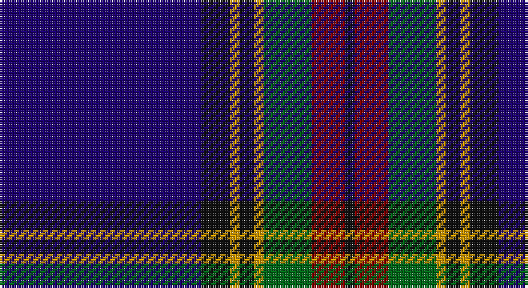

This page is one **sett** — a single exact thread-count. It belongs to the [tartan](/setts/db42k6lo2k3lo2g10r7k2/)
(the same proportion at any scale), whose colour order is pattern [BKYKYGRK](/stripes/bkykygrk/).

Part of the [MacBeth](/tartans/macbeth/) tartan — the named design grouping this sett with its other cloths.

Sourced from tartans-authority.  It is a [8 stripe tartan](/stripes/stripes8/).

Original link http://www.tartansauthority.com/tartan-ferret/display/3320/

## Also known as

This cloth is also recorded under:

- MacBeth #2
- MacBeth #3
- MacBeth/Stewart Brydone 1862
- MacLulich
- Stewart Blue
- Stewart/Stuart Blue

2 attestations — the source records this cloth was collapsed from (oldest owns this page)

<ul>
<li>1991 — MacBeth (Fashion) (tartans-authority, <a href="http://www.tartansauthority.com/tartan-ferret/display/3320/">record</a>)</li>
<li>undated — MacBeth #3 (register-of-tartans, <a href="https://www.tartanregister.gov.uk/tartanDetails.aspx?ref=5191">record</a>)</li>
</ul>

## Register references

External register numbers recorded for this tartan.

- Scottish Register of Tartans: [5191](https://www.tartanregister.gov.uk/tartanDetails.aspx?ref=5191)
- Scottish Tartans Authority (ITI): 3320

## Thread count
DB/84 K12 DY4 K6 DY4 G20 DR14 K/4

One full sett is **208 threads**.

## Palette

Palette: <strong>Tartan Register</strong> <small style="color:#888">(4 of 5 colours)</small>
<table><thead><tr><th>Colour</th><th>Threads</th><th>Shade</th><th>Base</th><th>OKLCh</th></tr></thead><tbody><tr><td>DB/</td><td style="text-align:right;font-variant-numeric:tabular-nums">84</td><td><code style="background-color:#1C0070;">#1C0070</code> <small style="color:#888">#1C0070</small></td><td>B <code style="background-color:#2A418A;">#2A418A</code></td><td><small style="color:#888">oklch(26.3% 0.162 277.1)</small></td></tr><tr><td>K</td><td style="text-align:right;font-variant-numeric:tabular-nums">12</td><td><code style="background-color:#101010;">#101010</code> <small style="color:#888">#101010</small></td><td>K <code style="background-color:#000000;">#000000</code></td><td><small style="color:#888">oklch(17.3% 0.000 89.9)</small></td></tr><tr><td>DY</td><td style="text-align:right;font-variant-numeric:tabular-nums">4</td><td><code style="background-color:#D09800;">#D09800</code> <small style="color:#888">#D09800</small></td><td>Y <code style="background-color:#F2BF00;">#F2BF00</code></td><td><small style="color:#888">oklch(71.4% 0.147 82.1)</small></td></tr><tr><td>K</td><td style="text-align:right;font-variant-numeric:tabular-nums">6</td><td><code style="background-color:#101010;">#101010</code> <small style="color:#888">#101010</small></td><td>K <code style="background-color:#000000;">#000000</code></td><td><small style="color:#888">oklch(17.3% 0.000 89.9)</small></td></tr><tr><td>DY</td><td style="text-align:right;font-variant-numeric:tabular-nums">4</td><td><code style="background-color:#D09800;">#D09800</code> <small style="color:#888">#D09800</small></td><td>Y <code style="background-color:#F2BF00;">#F2BF00</code></td><td><small style="color:#888">oklch(71.4% 0.147 82.1)</small></td></tr><tr><td>G</td><td style="text-align:right;font-variant-numeric:tabular-nums">20</td><td><code style="background-color:#006818;">#006818</code> <small style="color:#888">#006818</small></td><td>G <code style="background-color:#006100;">#006100</code></td><td><small style="color:#888">oklch(45.0% 0.142 145.0)</small></td></tr><tr><td>DR</td><td style="text-align:right;font-variant-numeric:tabular-nums">14</td><td><code style="background-color:#880000;">#880000</code> <small style="color:#888">#880000</small></td><td>R <code style="background-color:#CC0000;">#CC0000</code></td><td><small style="color:#888">oklch(39.4% 0.162 29.2)</small></td></tr><tr><td>K/</td><td style="text-align:right;font-variant-numeric:tabular-nums">4</td><td><code style="background-color:#101010;">#101010</code> <small style="color:#888">#101010</small></td><td>K <code style="background-color:#000000;">#000000</code></td><td><small style="color:#888">oklch(17.3% 0.000 89.9)</small></td></tr></tbody></table>

# Sample pattern

## Compared to the master

This cloth is one sett of its design; the master sett (the exemplar the design is anchored on) is below for comparison.

<figure style="margin:0"><figcaption style="color:#888;font-size:smaller">this sett</figcaption></figure>
<figure style="margin:0"><figcaption style="color:#888;font-size:smaller"><a href="/setts/db33r8k12ly2k4w4k4g12db8k4db4w2/">master sett →</a></figcaption></figure>

## Nearest tartans

The nearest existing variants by ΔTartan distance, with this tartan at the top so the swatches line up against it.

ΔTartan

Tartan

Sett

—

<a href="/ttd/edit/#slug=db42k6lo2k3lo2g10r7k2~x2">MacBeth (Fashion)</a> <a class="nn-out" href="/variants/s8/db42k6lo2k3lo2g10r7k2~x2/" title="open its dictionary page">↗</a>

0.88

<a href="/ttd/edit/#slug=db6dp3db56k24g6r6g6&amp;base=db42k6lo2k3lo2g10r7k2~x2">Wcwm 9275-1395</a> <a class="nn-out" href="/variants/s7/db6dp3db56k24g6r6g6/" title="open its dictionary page">↗</a>

0.95

<a href="/ttd/edit/#slug=db20dy1db1dy1dg8k1w3~x2&amp;base=db42k6lo2k3lo2g10r7k2~x2">Chestico</a> <a class="nn-out" href="/variants/s7/db20dy1db1dy1dg8k1w3~x2/" title="open its dictionary page">↗</a>

0.97

<a href="/ttd/edit/#slug=r1db2dt1dbi3dt19db3ly1db2ly1~x4&amp;base=db42k6lo2k3lo2g10r7k2~x2">Pagus Wasia</a> <a class="nn-out" href="/variants/s9/r1db2dt1dbi3dt19db3ly1db2ly1~x4/" title="open its dictionary page">↗</a>

1.01

<a href="/ttd/edit/#slug=k62b4k7db29k3lo4k3lb4k11b16~x2&amp;base=db42k6lo2k3lo2g10r7k2~x2">State Seal of Massachusetts Fash)</a> <a class="nn-out" href="/variants/s10/k62b4k7db29k3lo4k3lb4k11b16~x2/" title="open its dictionary page">↗</a>

1.03

<a href="/ttd/edit/#slug=k1w1k18db20w1r1lo1~x4&amp;base=db42k6lo2k3lo2g10r7k2~x2">Fuller of Hopewell (Personal)</a> <a class="nn-out" href="/variants/s7/k1w1k18db20w1r1lo1~x4/" title="open its dictionary page">↗</a>

1.05

<a href="/ttd/edit/#slug=w3db2ly1db2ly1db31k28r2k2~x2&amp;base=db42k6lo2k3lo2g10r7k2~x2">Hill (Name)</a> <a class="nn-out" href="/variants/s9/w3db2ly1db2ly1db31k28r2k2~x2/" title="open its dictionary page">↗</a>

1.07

<a href="/ttd/edit/#slug=r2k3db42k3ly2k3g22k3r2~x2&amp;base=db42k6lo2k3lo2g10r7k2~x2">Strachan (Name)</a> <a class="nn-out" href="/variants/s9/r2k3db42k3ly2k3g22k3r2~x2/" title="open its dictionary page">↗</a>

1.09

<a href="/ttd/edit/#slug=g1db1k1db30k30w2db5ly1~x2&amp;base=db42k6lo2k3lo2g10r7k2~x2">Binder Wedding (Personal)</a> <a class="nn-out" href="/variants/s8/g1db1k1db30k30w2db5ly1~x2/" title="open its dictionary page">↗</a>

1.09

<a href="/ttd/edit/#slug=db6ly3k2ly5dbi30g2k4g2dbi6db4~x2&amp;base=db42k6lo2k3lo2g10r7k2~x2">St. Andrews University (Corporate)</a> <a class="nn-out" href="/variants/s10/db6ly3k2ly5dbi30g2k4g2dbi6db4~x2/" title="open its dictionary page">↗</a>

1.10

<a href="/ttd/edit/#slug=lb3k6lbi2k6db2k2db32k2n1~x2&amp;base=db42k6lo2k3lo2g10r7k2~x2">Nocken (Personal)</a> <a class="nn-out" href="/variants/s9/lb3k6lbi2k6db2k2db32k2n1~x2/" title="open its dictionary page">↗</a>

## Neighbour map

Every grey dot is one of 14360 variants placed by the first two principal components of the ΔTartan feature space (44% of its variance). Red is this tartan; blue dots are its nearest — click one to open its page.

<svg viewBox="0 0 640 380" role="img" style="max-width:100%;height:auto;border:1px solid #e0e0e0;border-radius:4px;display:block" xmlns="http://www.w3.org/2000/svg"><image href="/nn/cloud.v1.png" width="640" height="380"/><a href="/variants/s7/db6dp3db56k24g6r6g6/"><circle cx="358.2" cy="171.5" r="4" fill="#3465a4"><title>Wcwm 9275-1395</title></circle></a><a href="/variants/s7/db20dy1db1dy1dg8k1w3~x2/"><circle cx="352.6" cy="145.2" r="4" fill="#3465a4"><title>Chestico</title></circle></a><a href="/variants/s9/r1db2dt1dbi3dt19db3ly1db2ly1~x4/"><circle cx="375.2" cy="141.7" r="4" fill="#3465a4"><title>Pagus Wasia</title></circle></a><a href="/variants/s10/k62b4k7db29k3lo4k3lb4k11b16~x2/"><circle cx="353.7" cy="138.8" r="4" fill="#3465a4"><title>State Seal of Massachusetts Fash)</title></circle></a><a href="/variants/s7/k1w1k18db20w1r1lo1~x4/"><circle cx="313.1" cy="144.7" r="4" fill="#3465a4"><title>Fuller of Hopewell (Personal)</title></circle></a><a href="/variants/s9/w3db2ly1db2ly1db31k28r2k2~x2/"><circle cx="337.4" cy="114.0" r="4" fill="#3465a4"><title>Hill (Name)</title></circle></a><a href="/variants/s9/r2k3db42k3ly2k3g22k3r2~x2/"><circle cx="321.9" cy="132.9" r="4" fill="#3465a4"><title>Strachan (Name)</title></circle></a><a href="/variants/s8/g1db1k1db30k30w2db5ly1~x2/"><circle cx="358.0" cy="127.7" r="4" fill="#3465a4"><title>Binder Wedding (Personal)</title></circle></a><a href="/variants/s10/db6ly3k2ly5dbi30g2k4g2dbi6db4~x2/"><circle cx="300.6" cy="140.4" r="4" fill="#3465a4"><title>St. Andrews University (Corporate)</title></circle></a><a href="/variants/s9/lb3k6lbi2k6db2k2db32k2n1~x2/"><circle cx="406.6" cy="120.6" r="4" fill="#3465a4"><title>Nocken (Personal)</title></circle></a><circle cx="342.9" cy="140.2" r="5" fill="#c00000"/></svg>

ID: /variants/s8/db42k6lo2k3lo2g10r7k2~x2/
