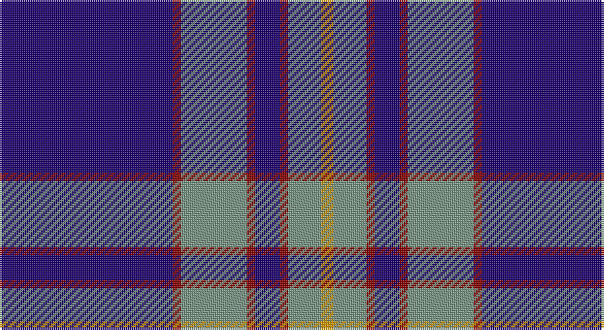

This page is one **sett** — a single exact thread-count. It belongs to the [tartan](/setts/db42r2y16r2db6r2y8lo3/)
(the same proportion at any scale), whose colour order is pattern [BRGRBRGY](/stripes/brgrbrgy/).

Sourced from register-of-tartans.  It is a [8 stripe tartan](/stripes/stripes8/).

Original link https://www.tartanregister.gov.uk/tartanDetails.aspx?ref=3392

## Also known as

This cloth is also recorded under:

- Prince George's Police Pipe Band

2 attestations — the source records this cloth was collapsed from (oldest owns this page)

<ul>
<li>01/01/1984 — Prince George's Police Pipe Band (register-of-tartans, <a href="https://www.tartanregister.gov.uk/tartanDetails.aspx?ref=3392">record</a>)</li>
<li>1988 — Prince George's Police (Corporate) (tartans-authority, <a href="http://www.tartansauthority.com/tartan-ferret/display/5474/">record</a>)</li>
</ul>

## Register references

External register numbers recorded for this tartan.

- Scottish Register of Tartans: [3392](https://www.tartanregister.gov.uk/tartanDetails.aspx?ref=3392)
- Scottish Tartans Authority (ITI): 5474
- Scottish Tartans World Register: 2874

## Thread count
DB/84 DR4 LG32 DR4 DB12 DR4 LG16 DY/6

One full sett is **234 threads**.

## Palette

Palette: <strong>Tartan Register</strong> <small style="color:#888">(3 of 4 colours)</small>
<table><thead><tr><th>Colour</th><th>Threads</th><th>Shade</th><th>Base</th><th>OKLCh</th></tr></thead><tbody><tr><td>DB/</td><td style="text-align:right;font-variant-numeric:tabular-nums">84</td><td><code style="background-color:#1C0070;">#1C0070</code> <small style="color:#888">#1C0070</small></td><td>B <code style="background-color:#2A418A;">#2A418A</code></td><td><small style="color:#888">oklch(26.3% 0.162 277.1)</small></td></tr><tr><td>DR</td><td style="text-align:right;font-variant-numeric:tabular-nums">4</td><td><code style="background-color:#880000;">#880000</code> <small style="color:#888">#880000</small></td><td>R <code style="background-color:#CC0000;">#CC0000</code></td><td><small style="color:#888">oklch(39.4% 0.162 29.2)</small></td></tr><tr><td>LG</td><td style="text-align:right;font-variant-numeric:tabular-nums">32</td><td><code style="background-color:#789484;">#789484</code> <small style="color:#888">#789484</small></td><td>G <code style="background-color:#006100;">#006100</code></td><td><small style="color:#888">oklch(64.0% 0.040 160.0)</small></td></tr><tr><td>DR</td><td style="text-align:right;font-variant-numeric:tabular-nums">4</td><td><code style="background-color:#880000;">#880000</code> <small style="color:#888">#880000</small></td><td>R <code style="background-color:#CC0000;">#CC0000</code></td><td><small style="color:#888">oklch(39.4% 0.162 29.2)</small></td></tr><tr><td>DB</td><td style="text-align:right;font-variant-numeric:tabular-nums">12</td><td><code style="background-color:#1C0070;">#1C0070</code> <small style="color:#888">#1C0070</small></td><td>B <code style="background-color:#2A418A;">#2A418A</code></td><td><small style="color:#888">oklch(26.3% 0.162 277.1)</small></td></tr><tr><td>DR</td><td style="text-align:right;font-variant-numeric:tabular-nums">4</td><td><code style="background-color:#880000;">#880000</code> <small style="color:#888">#880000</small></td><td>R <code style="background-color:#CC0000;">#CC0000</code></td><td><small style="color:#888">oklch(39.4% 0.162 29.2)</small></td></tr><tr><td>LG</td><td style="text-align:right;font-variant-numeric:tabular-nums">16</td><td><code style="background-color:#789484;">#789484</code> <small style="color:#888">#789484</small></td><td>G <code style="background-color:#006100;">#006100</code></td><td><small style="color:#888">oklch(64.0% 0.040 160.0)</small></td></tr><tr><td>DY/</td><td style="text-align:right;font-variant-numeric:tabular-nums">6</td><td><code style="background-color:#D09800;">#D09800</code> <small style="color:#888">#D09800</small></td><td>Y <code style="background-color:#F2BF00;">#F2BF00</code></td><td><small style="color:#888">oklch(71.4% 0.147 82.1)</small></td></tr></tbody></table>

# Sample pattern

## Nearest tartans

The nearest existing variants by ΔTartan distance, with this tartan at the top so the swatches line up against it.

ΔTartan

Tartan

Sett

—

<a href="/ttd/edit/#slug=db42r2y16r2db6r2y8lo3~x2">Prince George's Police Pipe Band</a> <a class="nn-out" href="/variants/s8/db42r2y16r2db6r2y8lo3~x2/" title="open its dictionary page">↗</a>

0.77

<a href="/ttd/edit/#slug=w2db35k9w3k9ly2~x2&amp;base=db42r2y16r2db6r2y8lo3~x2">Hannah (Personal)</a> <a class="nn-out" href="/variants/s6/w2db35k9w3k9ly2~x2/" title="open its dictionary page">↗</a>

1.08

<a href="/ttd/edit/#slug=db23w1db1w1db8g22r1db3~x4&amp;base=db42r2y16r2db6r2y8lo3~x2">Roxburgh, Green (District)</a> <a class="nn-out" href="/variants/s8/db23w1db1w1db8g22r1db3~x4/" title="open its dictionary page">↗</a>

1.09

<a href="/ttd/edit/#slug=o1lb6db4lb1db16n1db4n6lb1~x4&amp;base=db42r2y16r2db6r2y8lo3~x2">Fujisankei Serene (Corporate)</a> <a class="nn-out" href="/variants/s9/o1lb6db4lb1db16n1db4n6lb1~x4/" title="open its dictionary page">↗</a>

1.13

<a href="/ttd/edit/#slug=k1ly2k3n12k18w1~x2&amp;base=db42r2y16r2db6r2y8lo3~x2">Jon's Theme</a> <a class="nn-out" href="/variants/s6/k1ly2k3n12k18w1~x2/" title="open its dictionary page">↗</a>

1.15

<a href="/ttd/edit/#slug=db42k6db3k3db3w5db17w7lo10k3~x2&amp;base=db42r2y16r2db6r2y8lo3~x2">California Riverside, University of (Corporate)</a> <a class="nn-out" href="/variants/s10/db42k6db3k3db3w5db17w7lo10k3~x2/" title="open its dictionary page">↗</a>

1.18

<a href="/ttd/edit/#slug=db4w1db1w3db24y9k1y9k3~x2&amp;base=db42r2y16r2db6r2y8lo3~x2">Historic Scotland</a> <a class="nn-out" href="/variants/s9/db4w1db1w3db24y9k1y9k3~x2/" title="open its dictionary page">↗</a>

1.19

<a href="/ttd/edit/#slug=db28dr3w1dr3db4w2dp1w5~x4&amp;base=db42r2y16r2db6r2y8lo3~x2">Baker Family Tartan</a> <a class="nn-out" href="/variants/s8/db28dr3w1dr3db4w2dp1w5~x4/" title="open its dictionary page">↗</a>

1.21

<a href="/ttd/edit/#slug=r10db15g2db2w1db1w1~x4&amp;base=db42r2y16r2db6r2y8lo3~x2">Ikelman #4 (Personal)</a> <a class="nn-out" href="/variants/s7/r10db15g2db2w1db1w1~x4/" title="open its dictionary page">↗</a>

1.23

<a href="/ttd/edit/#slug=db21n2w1n2db1r2db1o6~x4&amp;base=db42r2y16r2db6r2y8lo3~x2">Blue Rust</a> <a class="nn-out" href="/variants/s8/db21n2w1n2db1r2db1o6~x4/" title="open its dictionary page">↗</a>

1.26

<a href="/ttd/edit/#slug=w2r5db4g8db4r5w2r5db40g8db4w2~x2&amp;base=db42r2y16r2db6r2y8lo3~x2">Yamaue (Corporate)</a> <a class="nn-out" href="/variants/s12/w2r5db4g8db4r5w2r5db40g8db4w2~x2/" title="open its dictionary page">↗</a>

## Neighbour map

Every grey dot is one of 14360 variants placed by the first two principal components of the ΔTartan feature space (44% of its variance). Red is this tartan; blue dots are its nearest — click one to open its page.

<svg viewBox="0 0 640 380" role="img" style="max-width:100%;height:auto;border:1px solid #e0e0e0;border-radius:4px;display:block" xmlns="http://www.w3.org/2000/svg"><image href="/nn/cloud.v1.png" width="640" height="380"/><a href="/variants/s6/w2db35k9w3k9ly2~x2/"><circle cx="349.3" cy="172.4" r="4" fill="#3465a4"><title>Hannah (Personal)</title></circle></a><a href="/variants/s8/db23w1db1w1db8g22r1db3~x4/"><circle cx="374.5" cy="158.4" r="4" fill="#3465a4"><title>Roxburgh, Green (District)</title></circle></a><a href="/variants/s9/o1lb6db4lb1db16n1db4n6lb1~x4/"><circle cx="344.2" cy="168.9" r="4" fill="#3465a4"><title>Fujisankei Serene (Corporate)</title></circle></a><a href="/variants/s6/k1ly2k3n12k18w1~x2/"><circle cx="366.0" cy="187.5" r="4" fill="#3465a4"><title>Jon's Theme</title></circle></a><a href="/variants/s10/db42k6db3k3db3w5db17w7lo10k3~x2/"><circle cx="352.0" cy="149.0" r="4" fill="#3465a4"><title>California Riverside, University of (Corporate)</title></circle></a><a href="/variants/s9/db4w1db1w3db24y9k1y9k3~x2/"><circle cx="301.2" cy="138.3" r="4" fill="#3465a4"><title>Historic Scotland</title></circle></a><a href="/variants/s8/db28dr3w1dr3db4w2dp1w5~x4/"><circle cx="427.3" cy="122.7" r="4" fill="#3465a4"><title>Baker Family Tartan</title></circle></a><a href="/variants/s7/r10db15g2db2w1db1w1~x4/"><circle cx="339.6" cy="170.6" r="4" fill="#3465a4"><title>Ikelman #4 (Personal)</title></circle></a><a href="/variants/s8/db21n2w1n2db1r2db1o6~x4/"><circle cx="382.8" cy="133.9" r="4" fill="#3465a4"><title>Blue Rust</title></circle></a><a href="/variants/s12/w2r5db4g8db4r5w2r5db40g8db4w2~x2/"><circle cx="350.0" cy="126.9" r="4" fill="#3465a4"><title>Yamaue (Corporate)</title></circle></a><circle cx="365.1" cy="146.9" r="5" fill="#c00000"/></svg>

ID: /variants/s8/db42r2y16r2db6r2y8lo3~x2/
