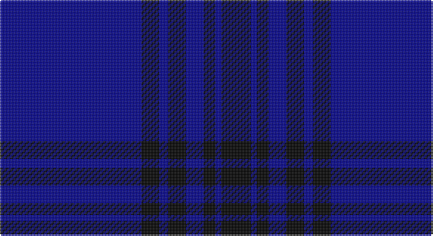

This page is one **sett** — a single exact thread-count. It belongs to the [tartan](/setts/db48k6db3k6db6k4db2k10/)
(the same proportion at any scale), whose colour order is pattern [BKBKBKBK](/stripes/bkbkbkbk/).

Part of the [Lochleven](/tartans/lochleven/) tartan — the named design grouping this sett with its other cloths.

Sourced from tartans-authority.  It is a [8 stripe tartan](/stripes/stripes8/).

Original link http://www.tartansauthority.com/tartan-ferret/display/4990/

## Register references

External register numbers recorded for this tartan.

- Scottish Tartans Authority (ITI): 4990

## Thread count
DB/96 K12 DB6 K12 DB12 K8 DB4 K/20

One full sett is **224 threads**.

## Palette

Palette: <strong>Tartan Register</strong>
<table><thead><tr><th>Colour</th><th>Threads</th><th>Shade</th><th>Base</th><th>OKLCh</th></tr></thead><tbody><tr><td>DB/</td><td style="text-align:right;font-variant-numeric:tabular-nums">96</td><td><code style="background-color:#00008C;">#00008C</code> <small style="color:#888">#00008C</small></td><td>B <code style="background-color:#2A418A;">#2A418A</code></td><td><small style="color:#888">oklch(28.9% 0.200 264.1)</small></td></tr><tr><td>K</td><td style="text-align:right;font-variant-numeric:tabular-nums">12</td><td><code style="background-color:#000000;">#000000</code> <small style="color:#888">#000000</small></td><td>K <code style="background-color:#000000;">#000000</code></td><td><small style="color:#888">oklch(0.0% 0.000 0.0)</small></td></tr><tr><td>DB</td><td style="text-align:right;font-variant-numeric:tabular-nums">6</td><td><code style="background-color:#00008C;">#00008C</code> <small style="color:#888">#00008C</small></td><td>B <code style="background-color:#2A418A;">#2A418A</code></td><td><small style="color:#888">oklch(28.9% 0.200 264.1)</small></td></tr><tr><td>K</td><td style="text-align:right;font-variant-numeric:tabular-nums">12</td><td><code style="background-color:#000000;">#000000</code> <small style="color:#888">#000000</small></td><td>K <code style="background-color:#000000;">#000000</code></td><td><small style="color:#888">oklch(0.0% 0.000 0.0)</small></td></tr><tr><td>DB</td><td style="text-align:right;font-variant-numeric:tabular-nums">12</td><td><code style="background-color:#00008C;">#00008C</code> <small style="color:#888">#00008C</small></td><td>B <code style="background-color:#2A418A;">#2A418A</code></td><td><small style="color:#888">oklch(28.9% 0.200 264.1)</small></td></tr><tr><td>K</td><td style="text-align:right;font-variant-numeric:tabular-nums">8</td><td><code style="background-color:#000000;">#000000</code> <small style="color:#888">#000000</small></td><td>K <code style="background-color:#000000;">#000000</code></td><td><small style="color:#888">oklch(0.0% 0.000 0.0)</small></td></tr><tr><td>DB</td><td style="text-align:right;font-variant-numeric:tabular-nums">4</td><td><code style="background-color:#00008C;">#00008C</code> <small style="color:#888">#00008C</small></td><td>B <code style="background-color:#2A418A;">#2A418A</code></td><td><small style="color:#888">oklch(28.9% 0.200 264.1)</small></td></tr><tr><td>K/</td><td style="text-align:right;font-variant-numeric:tabular-nums">20</td><td><code style="background-color:#000000;">#000000</code> <small style="color:#888">#000000</small></td><td>K <code style="background-color:#000000;">#000000</code></td><td><small style="color:#888">oklch(0.0% 0.000 0.0)</small></td></tr></tbody></table>

# Sample pattern

## Compared to the master

This cloth is one sett of its design; the master sett (the exemplar the design is anchored on) is below for comparison.

<figure style="margin:0"><figcaption style="color:#888;font-size:smaller">this sett</figcaption></figure>
<figure style="margin:0"><figcaption style="color:#888;font-size:smaller"><a href="/setts/db48dg6db3dg6db6dg4db2dg10/">master sett →</a></figcaption></figure>

## Nearest tartans

The nearest existing variants by ΔTartan distance, with this tartan at the top so the swatches line up against it.

ΔTartan

Tartan

Sett

—

<a href="/ttd/edit/#slug=db48k6db3k6db6k4db2k10~x2">Lochleven (Dance)</a> <a class="nn-out" href="/variants/s8/db48k6db3k6db6k4db2k10~x2/" title="open its dictionary page">↗</a>

1.53

<a href="/ttd/edit/#slug=db48dg6db3dg6db6dg4db2dg10~x2&amp;base=db48k6db3k6db6k4db2k10~x2">Lochleven (Dance)</a> <a class="nn-out" href="/variants/s8/db48dg6db3dg6db6dg4db2dg10~x2/" title="open its dictionary page">↗</a>

2.13

<a href="/ttd/edit/#slug=db144r9t44db4t4db4&amp;base=db48k6db3k6db6k4db2k10~x2">United French Freemasons (Corporate</a> <a class="nn-out" href="/variants/s6/db144r9t44db4t4db4/" title="open its dictionary page">↗</a>

2.14

<a href="/ttd/edit/#slug=b10db6b3db62w4db5~x2&amp;base=db48k6db3k6db6k4db2k10~x2">Auchairne</a> <a class="nn-out" href="/variants/s6/b10db6b3db62w4db5~x2/" title="open its dictionary page">↗</a>

2.21

<a href="/ttd/edit/#slug=db2k6db2k6db16r1~x2&amp;base=db48k6db3k6db6k4db2k10~x2">MacKay V</a> <a class="nn-out" href="/variants/s6/db2k6db2k6db16r1~x2/" title="open its dictionary page">↗</a>

2.21

<a href="/ttd/edit/#slug=k14db14k14db40k3db2~x2&amp;base=db48k6db3k6db6k4db2k10~x2">Atlin (Fashion)</a> <a class="nn-out" href="/variants/s6/k14db14k14db40k3db2~x2/" title="open its dictionary page">↗</a>

2.31

<a href="/ttd/edit/#slug=db32o4dt12db2dt4db2dt2y16db67o6&amp;base=db48k6db3k6db6k4db2k10~x2">Calum's Cabin</a> <a class="nn-out" href="/variants/s10/db32o4dt12db2dt4db2dt2y16db67o6/" title="open its dictionary page">↗</a>

2.31

<a href="/ttd/edit/#slug=db100y10k5y10r8&amp;base=db48k6db3k6db6k4db2k10~x2">Waugh</a> <a class="nn-out" href="/variants/s5/db100y10k5y10r8/" title="open its dictionary page">↗</a>

2.32

<a href="/ttd/edit/#slug=db29dbi2db1dbi1db1dbi1t8lo1~x4&amp;base=db48k6db3k6db6k4db2k10~x2">Marist School, The</a> <a class="nn-out" href="/variants/s8/db29dbi2db1dbi1db1dbi1t8lo1~x4/" title="open its dictionary page">↗</a>

2.39

<a href="/ttd/edit/#slug=b11db7b3db70lb4db6~x2&amp;base=db48k6db3k6db6k4db2k10~x2">Auchairne (Corporate)</a> <a class="nn-out" href="/variants/s6/b11db7b3db70lb4db6~x2/" title="open its dictionary page">↗</a>

2.40

<a href="/ttd/edit/#slug=db128r8t41n4t4n4&amp;base=db48k6db3k6db6k4db2k10~x2">French Freemasons' Pride (Fashion)</a> <a class="nn-out" href="/variants/s6/db128r8t41n4t4n4/" title="open its dictionary page">↗</a>

## Neighbour map

Every grey dot is one of 14360 variants placed by the first two principal components of the ΔTartan feature space (44% of its variance). Red is this tartan; blue dots are its nearest — click one to open its page.

<svg viewBox="0 0 640 380" role="img" style="max-width:100%;height:auto;border:1px solid #e0e0e0;border-radius:4px;display:block" xmlns="http://www.w3.org/2000/svg"><image href="/nn/cloud.v1.png" width="640" height="380"/><a href="/variants/s8/db48dg6db3dg6db6dg4db2dg10~x2/"><circle cx="538.8" cy="213.6" r="4" fill="#3465a4"><title>Lochleven (Dance)</title></circle></a><a href="/variants/s6/db144r9t44db4t4db4/"><circle cx="557.3" cy="176.8" r="4" fill="#3465a4"><title>United French Freemasons (Corporate</title></circle></a><a href="/variants/s6/b10db6b3db62w4db5~x2/"><circle cx="552.3" cy="185.8" r="4" fill="#3465a4"><title>Auchairne</title></circle></a><a href="/variants/s6/db2k6db2k6db16r1~x2/"><circle cx="427.6" cy="245.5" r="4" fill="#3465a4"><title>MacKay V</title></circle></a><a href="/variants/s6/k14db14k14db40k3db2~x2/"><circle cx="501.0" cy="274.0" r="4" fill="#3465a4"><title>Atlin (Fashion)</title></circle></a><a href="/variants/s10/db32o4dt12db2dt4db2dt2y16db67o6/"><circle cx="461.7" cy="138.1" r="4" fill="#3465a4"><title>Calum's Cabin</title></circle></a><a href="/variants/s5/db100y10k5y10r8/"><circle cx="500.7" cy="185.1" r="4" fill="#3465a4"><title>Waugh</title></circle></a><a href="/variants/s8/db29dbi2db1dbi1db1dbi1t8lo1~x4/"><circle cx="501.9" cy="144.4" r="4" fill="#3465a4"><title>Marist School, The</title></circle></a><a href="/variants/s6/b11db7b3db70lb4db6~x2/"><circle cx="612.6" cy="198.8" r="4" fill="#3465a4"><title>Auchairne (Corporate)</title></circle></a><a href="/variants/s6/db128r8t41n4t4n4/"><circle cx="480.5" cy="159.3" r="4" fill="#3465a4"><title>French Freemasons' Pride (Fashion)</title></circle></a><circle cx="520.5" cy="204.5" r="5" fill="#c00000"/></svg>

ID: /variants/s8/db48k6db3k6db6k4db2k10~x2/
