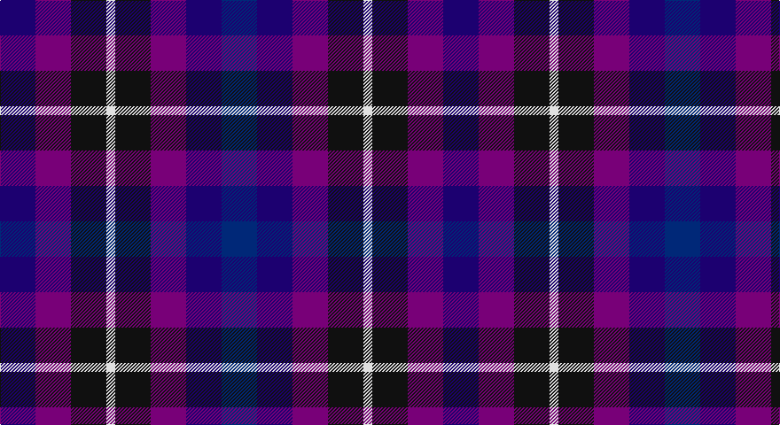

This page is one **sett** — a single exact thread-count. It belongs to the [tartan](/setts/db4dbi4dp4k4w1k4dp4dbi4/)
(the same proportion at any scale), whose colour order is pattern [BBBKWKBB](/stripes/bbbkwkbb/).

Part of the [Weston](/tartans/weston/) tartan — the named design grouping this sett with its other cloths.

Sourced from house-of-tartan.  It is a [8 stripe tartan](/stripes/stripes8/).

Original link http://www.house-of-tartan.scotland.net/house/TartanViewjs.asp?colr=Def&tnam=5777

## Provenance

Earliest known date: Feb 2002 For their wedding.

## Thread count
DB/40 P40 K40 LN10 K40 P40 DB40 DBa/40

One full sett is **500 threads**.

## Palette

Palette: <strong>Tartan Register</strong> <small style="color:#888">(6 of 7 colours)</small>
<table><thead><tr><th>Colour</th><th>Threads</th><th>Shade</th><th>Base</th><th>OKLCh</th></tr></thead><tbody><tr><td>DB/</td><td style="text-align:right;font-variant-numeric:tabular-nums">40</td><td><code style="background-color:#1C0070;">#1C0070</code> <small style="color:#888">#1C0070</small></td><td>B <code style="background-color:#2A418A;">#2A418A</code></td><td><small style="color:#888">oklch(26.3% 0.162 277.1)</small></td></tr><tr><td>P</td><td style="text-align:right;font-variant-numeric:tabular-nums">40</td><td><code style="background-color:#780078;">#780078</code> <small style="color:#888">#780078</small></td><td>B <code style="background-color:#2A418A;">#2A418A</code></td><td><small style="color:#888">oklch(40.2% 0.185 328.4)</small></td></tr><tr><td>K</td><td style="text-align:right;font-variant-numeric:tabular-nums">40</td><td><code style="background-color:#101010;">#101010</code> <small style="color:#888">#101010</small></td><td>K <code style="background-color:#000000;">#000000</code></td><td><small style="color:#888">oklch(17.3% 0.000 89.9)</small></td></tr><tr><td>LN</td><td style="text-align:right;font-variant-numeric:tabular-nums">10</td><td><code style="background-color:#E0E0E0;">#E0E0E0</code> <small style="color:#888">#E0E0E0</small></td><td>W <code style="background-color:#F7F7F7;">#F7F7F7</code></td><td><small style="color:#888">oklch(90.7% 0.000 89.9)</small></td></tr><tr><td>K</td><td style="text-align:right;font-variant-numeric:tabular-nums">40</td><td><code style="background-color:#101010;">#101010</code> <small style="color:#888">#101010</small></td><td>K <code style="background-color:#000000;">#000000</code></td><td><small style="color:#888">oklch(17.3% 0.000 89.9)</small></td></tr><tr><td>P</td><td style="text-align:right;font-variant-numeric:tabular-nums">40</td><td><code style="background-color:#780078;">#780078</code> <small style="color:#888">#780078</small></td><td>B <code style="background-color:#2A418A;">#2A418A</code></td><td><small style="color:#888">oklch(40.2% 0.185 328.4)</small></td></tr><tr><td>DB</td><td style="text-align:right;font-variant-numeric:tabular-nums">40</td><td><code style="background-color:#1C0070;">#1C0070</code> <small style="color:#888">#1C0070</small></td><td>B <code style="background-color:#2A418A;">#2A418A</code></td><td><small style="color:#888">oklch(26.3% 0.162 277.1)</small></td></tr><tr><td>DBa/</td><td style="text-align:right;font-variant-numeric:tabular-nums">40</td><td><code style="background-color:#002878;">#002878</code> <small style="color:#888">#002878</small></td><td>B <code style="background-color:#2A418A;">#2A418A</code></td><td><small style="color:#888">oklch(31.5% 0.143 261.7)</small></td></tr></tbody></table>

# Sample pattern

## Compared to the master

This cloth is one sett of its design; the master sett (the exemplar the design is anchored on) is below for comparison.

<figure style="margin:0"><figcaption style="color:#888;font-size:smaller">this sett</figcaption></figure>
<figure style="margin:0"><figcaption style="color:#888;font-size:smaller"><a href="/setts/dt4db4dp4k4w1/">master sett →</a></figcaption></figure>

## Nearest tartans

The nearest existing variants by ΔTartan distance, with this tartan at the top so the swatches line up against it.

ΔTartan

Tartan

Sett

—

<a href="/ttd/edit/#slug=db4dbi4dp4k4w1k4dp4dbi4~x10">Weston Family Tartan</a> <a class="nn-out" href="/variants/s8/db4dbi4dp4k4w1k4dp4dbi4~x10/" title="open its dictionary page">↗</a>

1.35

<a href="/ttd/edit/#slug=dt4db4dp4k4w1~x10&amp;base=db4dbi4dp4k4w1k4dp4dbi4~x10">Weston (Personal)</a> <a class="nn-out" href="/variants/s5/dt4db4dp4k4w1~x10/" title="open its dictionary page">↗</a>

1.84

<a href="/ttd/edit/#slug=db3k1n3dp4g3~x4&amp;base=db4dbi4dp4k4w1k4dp4dbi4~x10">Crinnion (Personal)</a> <a class="nn-out" href="/variants/s5/db3k1n3dp4g3~x4/" title="open its dictionary page">↗</a>

1.88

<a href="/variants/s10/dp2r1dp5k4db5lb1~x4/">Kintore</a>

2.09

<a href="/ttd/edit/#slug=dg27n20r9db16b20~x2&amp;base=db4dbi4dp4k4w1k4dp4dbi4~x10">Currens (2016)</a> <a class="nn-out" href="/variants/s5/dg27n20r9db16b20~x2/" title="open its dictionary page">↗</a>

2.21

<a href="/ttd/edit/#slug=k4dt4dy1dt4r4db4w1~x8&amp;base=db4dbi4dp4k4w1k4dp4dbi4~x10">Blackdown Hills</a> <a class="nn-out" href="/variants/s7/k4dt4dy1dt4r4db4w1~x8/" title="open its dictionary page">↗</a>

2.23

<a href="/ttd/edit/#slug=dp2r1dp5k4db5lb1~x4&amp;base=db4dbi4dp4k4w1k4dp4dbi4~x10">Kintore (Fashion)</a> <a class="nn-out" href="/variants/s6/dp2r1dp5k4db5lb1~x4/" title="open its dictionary page">↗</a>

2.38

<a href="/ttd/edit/#slug=k4dt4dy1dt4r4db4lr1~x8&amp;base=db4dbi4dp4k4w1k4dp4dbi4~x10">Blackdown Hills (Corporate)</a> <a class="nn-out" href="/variants/s7/k4dt4dy1dt4r4db4lr1~x8/" title="open its dictionary page">↗</a>

2.38

<a href="/ttd/edit/#slug=r1b4do4b1do4db4do1db4r4db1r4b4r1~x6&amp;base=db4dbi4dp4k4w1k4dp4dbi4~x10">Vincent</a> <a class="nn-out" href="/variants/s13/r1b4do4b1do4db4do1db4r4db1r4b4r1~x6/" title="open its dictionary page">↗</a>

2.40

<a href="/ttd/edit/#slug=db15dp15g15dg15k8w5~x2&amp;base=db4dbi4dp4k4w1k4dp4dbi4~x10">Williams, Edmund (Personal)</a> <a class="nn-out" href="/variants/s6/db15dp15g15dg15k8w5~x2/" title="open its dictionary page">↗</a>

2.46

<a href="/ttd/edit/#slug=dp3k3dp3dg6r2~x2&amp;base=db4dbi4dp4k4w1k4dp4dbi4~x10">Austin (Wilson's No 137)</a> <a class="nn-out" href="/variants/s5/dp3k3dp3dg6r2~x2/" title="open its dictionary page">↗</a>

## Neighbour map

Every grey dot is one of 14360 variants placed by the first two principal components of the ΔTartan feature space (44% of its variance). Red is this tartan; blue dots are its nearest — click one to open its page.

<svg viewBox="0 0 640 380" role="img" style="max-width:100%;height:auto;border:1px solid #e0e0e0;border-radius:4px;display:block" xmlns="http://www.w3.org/2000/svg"><image href="/nn/cloud.v1.png" width="640" height="380"/><a href="/variants/s5/dt4db4dp4k4w1~x10/"><circle cx="53.1" cy="304.9" r="4" fill="#3465a4"><title>Weston (Personal)</title></circle></a><a href="/variants/s5/db3k1n3dp4g3~x4/"><circle cx="87.0" cy="317.2" r="4" fill="#3465a4"><title>Crinnion (Personal)</title></circle></a><a href="/variants/s10/dp2r1dp5k4db5lb1~x4/"><circle cx="152.6" cy="249.7" r="4" fill="#3465a4"><title>Kintore</title></circle></a><a href="/variants/s5/dg27n20r9db16b20~x2/"><circle cx="66.5" cy="328.4" r="4" fill="#3465a4"><title>Currens (2016)</title></circle></a><a href="/variants/s7/k4dt4dy1dt4r4db4w1~x8/"><circle cx="90.3" cy="269.0" r="4" fill="#3465a4"><title>Blackdown Hills</title></circle></a><a href="/variants/s6/dp2r1dp5k4db5lb1~x4/"><circle cx="165.1" cy="258.1" r="4" fill="#3465a4"><title>Kintore (Fashion)</title></circle></a><a href="/variants/s7/k4dt4dy1dt4r4db4lr1~x8/"><circle cx="119.0" cy="284.2" r="4" fill="#3465a4"><title>Blackdown Hills (Corporate)</title></circle></a><a href="/variants/s13/r1b4do4b1do4db4do1db4r4db1r4b4r1~x6/"><circle cx="74.0" cy="245.1" r="4" fill="#3465a4"><title>Vincent</title></circle></a><a href="/variants/s6/db15dp15g15dg15k8w5~x2/"><circle cx="14.0" cy="279.6" r="4" fill="#3465a4"><title>Williams, Edmund (Personal)</title></circle></a><a href="/variants/s5/dp3k3dp3dg6r2~x2/"><circle cx="122.6" cy="317.4" r="4" fill="#3465a4"><title>Austin (Wilson's No 137)</title></circle></a><circle cx="64.4" cy="305.7" r="5" fill="#c00000"/></svg>

ID: /variants/s8/db4dbi4dp4k4w1k4dp4dbi4~x10/
