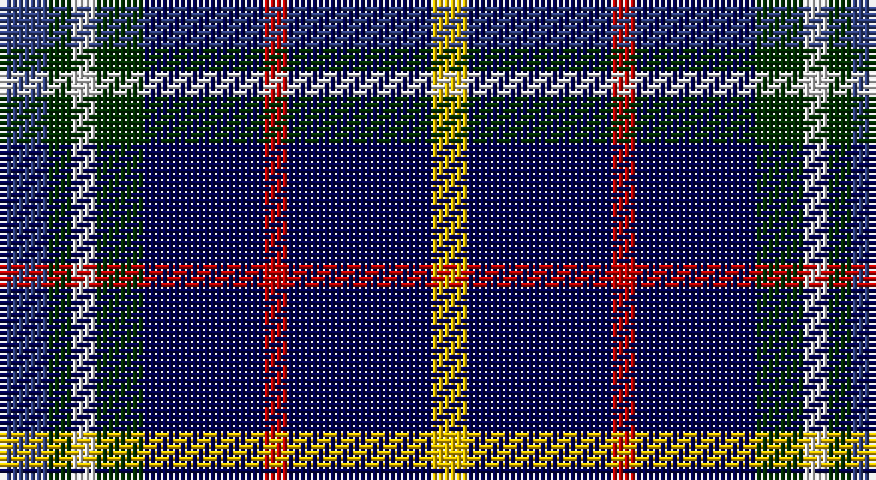

This page is one **sett** — a single exact thread-count. It belongs to the [tartan](/setts/db4dg2w2dg4dbi10r2dbi12ly3/)
(the same proportion at any scale), whose colour order is pattern [BGWGBRBY](/stripes/bgwgbrby/).

Sourced from weddslist.  It is a [8 stripe tartan](/stripes/stripes8/).

Original link http://www.weddslist.com/cgi-bin/tartans/pg.pl?source=sts

## Also known as

This cloth is also recorded under:

- United Services, Planning Association

## Thread count
B/8 DG4 LN4 DG8 DB20 R4 DB24 Y/6

One full sett is **142 threads**.

## Palette

Palette: <strong>Tartan Dictionary</strong> <small style="color:#888">(1 of 6 colours)</small>
<table><thead><tr><th>Colour</th><th>Threads</th><th>Shade</th><th>Base</th><th>OKLCh</th></tr></thead><tbody><tr><td>B/</td><td style="text-align:right;font-variant-numeric:tabular-nums">8</td><td><code style="background-color:#304080;">#304080</code> <small style="color:#888">#304080</small></td><td>B <code style="background-color:#2A418A;">#2A418A</code></td><td><small style="color:#888">oklch(39.4% 0.109 270.2)</small></td></tr><tr><td>DG</td><td style="text-align:right;font-variant-numeric:tabular-nums">4</td><td><code style="background-color:#003000;">#003000</code> <small style="color:#888">#003000</small></td><td>G <code style="background-color:#006100;">#006100</code></td><td><small style="color:#888">oklch(26.8% 0.091 142.5)</small></td></tr><tr><td>LN</td><td style="text-align:right;font-variant-numeric:tabular-nums">4</td><td><code style="background-color:#E0E0E0;">#E0E0E0</code> <small style="color:#888">#E0E0E0</small></td><td>W <code style="background-color:#F7F7F7;">#F7F7F7</code></td><td><small style="color:#888">oklch(90.7% 0.000 89.9)</small></td></tr><tr><td>DG</td><td style="text-align:right;font-variant-numeric:tabular-nums">8</td><td><code style="background-color:#003000;">#003000</code> <small style="color:#888">#003000</small></td><td>G <code style="background-color:#006100;">#006100</code></td><td><small style="color:#888">oklch(26.8% 0.091 142.5)</small></td></tr><tr><td>DB</td><td style="text-align:right;font-variant-numeric:tabular-nums">20</td><td><code style="background-color:#000050;">#000050</code> <small style="color:#888">#000050</small></td><td>B <code style="background-color:#2A418A;">#2A418A</code></td><td><small style="color:#888">oklch(19.5% 0.135 264.1)</small></td></tr><tr><td>R</td><td style="text-align:right;font-variant-numeric:tabular-nums">4</td><td><code style="background-color:#C00000;">#C00000</code> <small style="color:#888">#C00000</small></td><td>R <code style="background-color:#CC0000;">#CC0000</code></td><td><small style="color:#888">oklch(50.7% 0.208 29.2)</small></td></tr><tr><td>DB</td><td style="text-align:right;font-variant-numeric:tabular-nums">24</td><td><code style="background-color:#000050;">#000050</code> <small style="color:#888">#000050</small></td><td>B <code style="background-color:#2A418A;">#2A418A</code></td><td><small style="color:#888">oklch(19.5% 0.135 264.1)</small></td></tr><tr><td>Y/</td><td style="text-align:right;font-variant-numeric:tabular-nums">6</td><td><code style="background-color:#F0C000;">#F0C000</code> <small style="color:#888">#F0C000</small></td><td>Y <code style="background-color:#F2BF00;">#F2BF00</code></td><td><small style="color:#888">oklch(82.7% 0.169 90.5)</small></td></tr></tbody></table>

# Sample pattern

## Nearest tartans

The nearest existing variants by ΔTartan distance, with this tartan at the top so the swatches line up against it.

ΔTartan

Tartan

Sett

—

<a href="/ttd/edit/#slug=db4dg2w2dg4dbi10r2dbi12ly3~x2">United Services, Planning Association</a> <a class="nn-out" href="/variants/s8/db4dg2w2dg4dbi10r2dbi12ly3~x2/" title="open its dictionary page">↗</a>

0.81

<a href="/ttd/edit/#slug=k10p3db4p3k7b3g8k17ly2~x2&amp;base=db4dg2w2dg4dbi10r2dbi12ly3~x2">Ayrshire Tourist Board</a> <a class="nn-out" href="/variants/s9/k10p3db4p3k7b3g8k17ly2~x2/" title="open its dictionary page">↗</a>

0.86

<a href="/ttd/edit/#slug=dbi4dg2w2dg4db10r2db12ly3~x2&amp;base=db4dg2w2dg4dbi10r2dbi12ly3~x2">United Services Planning Assoc Corporate Tartan</a> <a class="nn-out" href="/variants/s8/dbi4dg2w2dg4db10r2db12ly3~x2/" title="open its dictionary page">↗</a>

1.27

<a href="/ttd/edit/#slug=dg2y13db12w3db10w3db12g13dp2~x2&amp;base=db4dg2w2dg4dbi10r2dbi12ly3~x2">Mounth, The</a> <a class="nn-out" href="/variants/s9/dg2y13db12w3db10w3db12g13dp2~x2/" title="open its dictionary page">↗</a>

1.29

<a href="/ttd/edit/#slug=dbi16g8db8g8dbi16r3o3gi3~x2&amp;base=db4dg2w2dg4dbi10r2dbi12ly3~x2">Glen Erin</a> <a class="nn-out" href="/variants/s8/dbi16g8db8g8dbi16r3o3gi3~x2/" title="open its dictionary page">↗</a>

1.33

<a href="/ttd/edit/#slug=o3k15r2k15n15p3~x2&amp;base=db4dg2w2dg4dbi10r2dbi12ly3~x2">H.M.S. DUNCAN</a> <a class="nn-out" href="/variants/s6/o3k15r2k15n15p3~x2/" title="open its dictionary page">↗</a>

1.37

<a href="/ttd/edit/#slug=r1n8k4g1g4g1k4n8ly1~x6&amp;base=db4dg2w2dg4dbi10r2dbi12ly3~x2">Quinn</a> <a class="nn-out" href="/variants/s9/r1n8k4g1g4g1k4n8ly1~x6/" title="open its dictionary page">↗</a>

1.39

<a href="/ttd/edit/#slug=r2w2dg8g2dg2db20t8g2db15w2~x2&amp;base=db4dg2w2dg4dbi10r2dbi12ly3~x2">Tupper, John Charles (Personal)</a> <a class="nn-out" href="/variants/s10/r2w2dg8g2dg2db20t8g2db15w2~x2/" title="open its dictionary page">↗</a>

1.46

<a href="/ttd/edit/#slug=lb6db20lg5db5lg5db20r14db4k18db30ly4db4&amp;base=db4dg2w2dg4dbi10r2dbi12ly3~x2">Edinburgh Bus Tours</a> <a class="nn-out" href="/variants/s12/lb6db20lg5db5lg5db20r14db4k18db30ly4db4/" title="open its dictionary page">↗</a>

1.47

<a href="/ttd/edit/#slug=db36r4db6g18db15k18w4~x2&amp;base=db4dg2w2dg4dbi10r2dbi12ly3~x2">Grainger (Name)</a> <a class="nn-out" href="/variants/s7/db36r4db6g18db15k18w4~x2/" title="open its dictionary page">↗</a>

1.49

<a href="/ttd/edit/#slug=k3g2k12dt4db19r3db19dt4k12g2ly3~x2&amp;base=db4dg2w2dg4dbi10r2dbi12ly3~x2">Loch Lomond Millennium</a> <a class="nn-out" href="/variants/s11/k3g2k12dt4db19r3db19dt4k12g2ly3~x2/" title="open its dictionary page">↗</a>

## Neighbour map

Every grey dot is one of 14360 variants placed by the first two principal components of the ΔTartan feature space (44% of its variance). Red is this tartan; blue dots are its nearest — click one to open its page.

<svg viewBox="0 0 640 380" role="img" style="max-width:100%;height:auto;border:1px solid #e0e0e0;border-radius:4px;display:block" xmlns="http://www.w3.org/2000/svg"><image href="/nn/cloud.v1.png" width="640" height="380"/><a href="/variants/s9/k10p3db4p3k7b3g8k17ly2~x2/"><circle cx="234.9" cy="186.6" r="4" fill="#3465a4"><title>Ayrshire Tourist Board</title></circle></a><a href="/variants/s8/dbi4dg2w2dg4db10r2db12ly3~x2/"><circle cx="213.6" cy="198.7" r="4" fill="#3465a4"><title>United Services Planning Assoc Corporate Tartan</title></circle></a><a href="/variants/s9/dg2y13db12w3db10w3db12g13dp2~x2/"><circle cx="132.3" cy="195.4" r="4" fill="#3465a4"><title>Mounth, The</title></circle></a><a href="/variants/s8/dbi16g8db8g8dbi16r3o3gi3~x2/"><circle cx="155.0" cy="221.0" r="4" fill="#3465a4"><title>Glen Erin</title></circle></a><a href="/variants/s6/o3k15r2k15n15p3~x2/"><circle cx="251.7" cy="222.3" r="4" fill="#3465a4"><title>H.M.S. DUNCAN</title></circle></a><a href="/variants/s9/r1n8k4g1g4g1k4n8ly1~x6/"><circle cx="180.0" cy="174.7" r="4" fill="#3465a4"><title>Quinn</title></circle></a><a href="/variants/s10/r2w2dg8g2dg2db20t8g2db15w2~x2/"><circle cx="239.4" cy="153.3" r="4" fill="#3465a4"><title>Tupper, John Charles (Personal)</title></circle></a><a href="/variants/s12/lb6db20lg5db5lg5db20r14db4k18db30ly4db4/"><circle cx="257.7" cy="178.5" r="4" fill="#3465a4"><title>Edinburgh Bus Tours</title></circle></a><a href="/variants/s7/db36r4db6g18db15k18w4~x2/"><circle cx="263.7" cy="214.6" r="4" fill="#3465a4"><title>Grainger (Name)</title></circle></a><a href="/variants/s11/k3g2k12dt4db19r3db19dt4k12g2ly3~x2/"><circle cx="180.5" cy="160.9" r="4" fill="#3465a4"><title>Loch Lomond Millennium</title></circle></a><circle cx="196.9" cy="195.5" r="5" fill="#c00000"/></svg>

ID: /variants/s8/db4dg2w2dg4dbi10r2dbi12ly3~x2/
