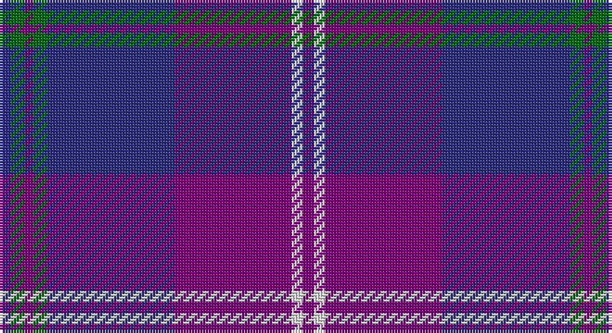

This page is one **sett** — a single exact thread-count. It belongs to the [tartan](/setts/db4g5dp3g5db46dp42w4dp4/)
(the same proportion at any scale), whose colour order is pattern [BGBGBBWB](/stripes/bgbgbbwb/).

Sourced from register-of-tartans.  It is a [8 stripe tartan](/stripes/stripes8/).

Original link https://www.tartanregister.gov.uk/tartanDetails.aspx?ref=662

2 attestations — the source records this cloth was collapsed from (oldest owns this page)

<ul>
<li>01/09/2003 — Clans of Caledonia (register-of-tartans, <a href="https://www.tartanregister.gov.uk/tartanDetails.aspx?ref=662">record</a>)</li>
<li>September 2003 — Clans of Caledonia (Corporate) (tartans-authority, <a href="http://www.tartansauthority.com/tartan-ferret/display/5923/">record</a>)</li>
</ul>

## Register references

External register numbers recorded for this tartan.

- Scottish Register of Tartans: [662](https://www.tartanregister.gov.uk/tartanDetails.aspx?ref=662)
- Scottish Tartans Authority (ITI): 5923

## Thread count
DB/4 G5 P3 G5 DB46 P42 LN4 P/4

One full sett is **218 threads**.

## Palette

Palette: <strong>Tartan Register</strong>
<table><thead><tr><th>Colour</th><th>Threads</th><th>Shade</th><th>Base</th><th>OKLCh</th></tr></thead><tbody><tr><td>DB/</td><td style="text-align:right;font-variant-numeric:tabular-nums">4</td><td><code style="background-color:#2C2C80;">#2C2C80</code> <small style="color:#888">#2C2C80</small></td><td>B <code style="background-color:#2A418A;">#2A418A</code></td><td><small style="color:#888">oklch(35.0% 0.138 276.6)</small></td></tr><tr><td>G</td><td style="text-align:right;font-variant-numeric:tabular-nums">5</td><td><code style="background-color:#006818;">#006818</code> <small style="color:#888">#006818</small></td><td>G <code style="background-color:#006100;">#006100</code></td><td><small style="color:#888">oklch(45.0% 0.142 145.0)</small></td></tr><tr><td>P</td><td style="text-align:right;font-variant-numeric:tabular-nums">3</td><td><code style="background-color:#780078;">#780078</code> <small style="color:#888">#780078</small></td><td>B <code style="background-color:#2A418A;">#2A418A</code></td><td><small style="color:#888">oklch(40.2% 0.185 328.4)</small></td></tr><tr><td>G</td><td style="text-align:right;font-variant-numeric:tabular-nums">5</td><td><code style="background-color:#006818;">#006818</code> <small style="color:#888">#006818</small></td><td>G <code style="background-color:#006100;">#006100</code></td><td><small style="color:#888">oklch(45.0% 0.142 145.0)</small></td></tr><tr><td>DB</td><td style="text-align:right;font-variant-numeric:tabular-nums">46</td><td><code style="background-color:#2C2C80;">#2C2C80</code> <small style="color:#888">#2C2C80</small></td><td>B <code style="background-color:#2A418A;">#2A418A</code></td><td><small style="color:#888">oklch(35.0% 0.138 276.6)</small></td></tr><tr><td>P</td><td style="text-align:right;font-variant-numeric:tabular-nums">42</td><td><code style="background-color:#780078;">#780078</code> <small style="color:#888">#780078</small></td><td>B <code style="background-color:#2A418A;">#2A418A</code></td><td><small style="color:#888">oklch(40.2% 0.185 328.4)</small></td></tr><tr><td>LN</td><td style="text-align:right;font-variant-numeric:tabular-nums">4</td><td><code style="background-color:#E0E0E0;">#E0E0E0</code> <small style="color:#888">#E0E0E0</small></td><td>W <code style="background-color:#F7F7F7;">#F7F7F7</code></td><td><small style="color:#888">oklch(90.7% 0.000 89.9)</small></td></tr><tr><td>P/</td><td style="text-align:right;font-variant-numeric:tabular-nums">4</td><td><code style="background-color:#780078;">#780078</code> <small style="color:#888">#780078</small></td><td>B <code style="background-color:#2A418A;">#2A418A</code></td><td><small style="color:#888">oklch(40.2% 0.185 328.4)</small></td></tr></tbody></table>

# Sample pattern

## Nearest tartans

The nearest existing variants by ΔTartan distance, with this tartan at the top so the swatches line up against it.

ΔTartan

Tartan

Sett

—

<a href="/ttd/edit/#slug=db4g5dp3g5db46dp42w4dp4">Clans of Caledonia</a> <a class="nn-out" href="/variants/s8/db4g5dp3g5db46dp42w4dp4/" title="open its dictionary page">↗</a>

1.54

<a href="/ttd/edit/#slug=r3dt4w2dt33db32dt2r4w3&amp;base=db4g5dp3g5db46dp42w4dp4">BABC</a> <a class="nn-out" href="/variants/s8/r3dt4w2dt33db32dt2r4w3/" title="open its dictionary page">↗</a>

1.54

<a href="/ttd/edit/#slug=r3dt4w2dt33db32dt2r4w3~x2&amp;base=db4g5dp3g5db46dp42w4dp4">B.A.B.C. (Corporate)</a> <a class="nn-out" href="/variants/s8/r3dt4w2dt33db32dt2r4w3~x2/" title="open its dictionary page">↗</a>

1.59

<a href="/ttd/edit/#slug=db2w2dp16lg2dp2r5db37dp6lg2db2~x2&amp;base=db4g5dp3g5db46dp42w4dp4">Pride of Fife</a> <a class="nn-out" href="/variants/s10/db2w2dp16lg2dp2r5db37dp6lg2db2~x2/" title="open its dictionary page">↗</a>

1.64

<a href="/ttd/edit/#slug=db2b2r1b16w1db20r2~x2&amp;base=db4g5dp3g5db46dp42w4dp4">British American School (Corporate)</a> <a class="nn-out" href="/variants/s7/db2b2r1b16w1db20r2~x2/" title="open its dictionary page">↗</a>

1.65

<a href="/ttd/edit/#slug=dp10ly3dp8db42g5o5~x2&amp;base=db4g5dp3g5db46dp42w4dp4">Cheadle (Personal)</a> <a class="nn-out" href="/variants/s6/dp10ly3dp8db42g5o5~x2/" title="open its dictionary page">↗</a>

1.66

<a href="/ttd/edit/#slug=dp1m4dp1m1dp12k6dt16w1~x2&amp;base=db4g5dp3g5db46dp42w4dp4">First</a> <a class="nn-out" href="/variants/s8/dp1m4dp1m1dp12k6dt16w1~x2/" title="open its dictionary page">↗</a>

1.69

<a href="/ttd/edit/#slug=r2db34k2lb2k2n30db3n6r2~x2&amp;base=db4g5dp3g5db46dp42w4dp4">Wcwm 1475-2</a> <a class="nn-out" href="/variants/s9/r2db34k2lb2k2n30db3n6r2~x2/" title="open its dictionary page">↗</a>

1.70

<a href="/ttd/edit/#slug=b27db8b14db8b14db26r84db6r12&amp;base=db4g5dp3g5db46dp42w4dp4">POF (Fashion)</a> <a class="nn-out" href="/variants/s9/b27db8b14db8b14db26r84db6r12/" title="open its dictionary page">↗</a>

1.71

<a href="/ttd/edit/#slug=n8db24k2db2n8db2k2db4ly2db4k2n12w3~x2&amp;base=db4g5dp3g5db46dp42w4dp4">Heddle</a> <a class="nn-out" href="/variants/s13/n8db24k2db2n8db2k2db4ly2db4k2n12w3~x2/" title="open its dictionary page">↗</a>

1.75

<a href="/ttd/edit/#slug=r2p3r1p16n2p9n9p3n15g1n3g2~x2&amp;base=db4g5dp3g5db46dp42w4dp4">Clydebank (Fashion)</a> <a class="nn-out" href="/variants/s12/r2p3r1p16n2p9n9p3n15g1n3g2~x2/" title="open its dictionary page">↗</a>

## Neighbour map

Every grey dot is one of 14360 variants placed by the first two principal components of the ΔTartan feature space (44% of its variance). Red is this tartan; blue dots are its nearest — click one to open its page.

<svg viewBox="0 0 640 380" role="img" style="max-width:100%;height:auto;border:1px solid #e0e0e0;border-radius:4px;display:block" xmlns="http://www.w3.org/2000/svg"><image href="/nn/cloud.v1.png" width="640" height="380"/><a href="/variants/s8/r3dt4w2dt33db32dt2r4w3/"><circle cx="325.6" cy="178.3" r="4" fill="#3465a4"><title>BABC</title></circle></a><a href="/variants/s8/r3dt4w2dt33db32dt2r4w3~x2/"><circle cx="325.6" cy="178.3" r="4" fill="#3465a4"><title>B.A.B.C. (Corporate)</title></circle></a><a href="/variants/s10/db2w2dp16lg2dp2r5db37dp6lg2db2~x2/"><circle cx="373.0" cy="150.6" r="4" fill="#3465a4"><title>Pride of Fife</title></circle></a><a href="/variants/s7/db2b2r1b16w1db20r2~x2/"><circle cx="394.9" cy="197.0" r="4" fill="#3465a4"><title>British American School (Corporate)</title></circle></a><a href="/variants/s6/dp10ly3dp8db42g5o5~x2/"><circle cx="356.2" cy="186.5" r="4" fill="#3465a4"><title>Cheadle (Personal)</title></circle></a><a href="/variants/s8/dp1m4dp1m1dp12k6dt16w1~x2/"><circle cx="254.6" cy="172.4" r="4" fill="#3465a4"><title>First</title></circle></a><a href="/variants/s9/r2db34k2lb2k2n30db3n6r2~x2/"><circle cx="317.6" cy="151.7" r="4" fill="#3465a4"><title>Wcwm 1475-2</title></circle></a><a href="/variants/s9/b27db8b14db8b14db26r84db6r12/"><circle cx="339.0" cy="198.2" r="4" fill="#3465a4"><title>POF (Fashion)</title></circle></a><a href="/variants/s13/n8db24k2db2n8db2k2db4ly2db4k2n12w3~x2/"><circle cx="285.7" cy="161.9" r="4" fill="#3465a4"><title>Heddle</title></circle></a><a href="/variants/s12/r2p3r1p16n2p9n9p3n15g1n3g2~x2/"><circle cx="354.8" cy="197.1" r="4" fill="#3465a4"><title>Clydebank (Fashion)</title></circle></a><circle cx="345.8" cy="183.5" r="5" fill="#c00000"/></svg>

ID: /variants/s8/db4g5dp3g5db46dp42w4dp4/
