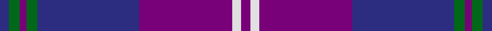

This is one **variant** — a specific cloth: this exact thread count and colourway, with its own
provenance below. It is one weaving of the [sett](/tartans/c/cl/clans-of-caledonia/) (the scale-free proportion — the
same cloth at any scale or shade), whose colour order is pattern [BGBGBBWB](/stripes/bgbgbbwb/).

Part of the [Clans of Caledonia](/tartans/c/cl/clans-of-caledonia/) tartan — the named design grouping this sett with its other cloths.

Sourced from register-of-tartans.  It is a [8 stripe tartan](/stripes/stripes8/).

Original link [https://www.tartanregister.gov.uk/tartanDetails.aspx?ref=662](https://www.tartanregister.gov.uk/tartanDetails.aspx?ref=662)

2 attestations — the source records this cloth was collapsed from (oldest owns this page)

<ul>
<li>01/09/2003 — Clans of Caledonia (register-of-tartans, <a href="https://www.tartanregister.gov.uk/tartanDetails.aspx?ref=662">record</a>)  <em>Introduced primarily for MacTag's American market but also to commemorate the 10th anniversary of MacTag ltd. Sample in Scottish Tartans Authority's Collection.</em></li>
<li>September 2003 — Clans of Caledonia (Corporate) (tartans-authority, <a href="https://web.archive.org/web/*/http://www.tartansauthority.com/tartan-ferret/display/5923/*">record</a>)  <em>Introduced primarily for MacTag's American market but also to commemorate the 10th anniversary of MacTag Ltd. Sample in STA Collection.</em></li>
</ul>

Dataset <small>— provenance for this record, inherited from the source manifest</small>

<dl class="dataset-prov">
<dt>source</dt><dd><a href="/sources/register-of-tartans/">Scottish Register of Tartans</a></dd>
<dt>data captured from</dt><dd><a href="https://github.com/thetartan/tartan-database/blob/master/data/register-of-tartans/data.csv">https://github.com/thetartan/tartan-database/blob/master/data/register-of-tartans/data.csv</a></dd>
<dt>data date</dt><dd>01/09/2003 <small>(this record)</small></dd>
<dt>licence</dt><dd><a href="https://www.tartanregister.gov.uk/copyright">Crown copyright</a></dd>
</dl>

Capture chain <small>— the hands this data passed through, oldest first; each capture carries its own licence</small>

<ol class="capture-chain">
<li><a href="https://www.tartanregister.gov.uk/">Scottish Register of Tartans</a> · <a href="https://www.tartanregister.gov.uk/copyright">Crown copyright</a> <small>the living register — still published by National Records of Scotland</small></li>
<li><a href="https://github.com/thetartan/tartan-database">thetartan/tartan-database</a> <small>2016-2017</small> · <a href="https://creativecommons.org/licenses/by-nc-nd/4.0/">CC BY-NC-ND 4.0</a> <small>Levko Kravets's frozen compilation — the capture we vendored, and where its CC licence text came from</small></li>
<li>this dictionary <small>captured 2026-06-10 · commit 5bf86c7566</small> <small>each re-capture is a git commit to data/sources</small></li>
</ol>

## Register references

External register numbers recorded for this tartan.

- Scottish Register of Tartans: [662](https://www.tartanregister.gov.uk/tartanDetails.aspx?ref=662)
- Scottish Tartans Authority (ITI): 5923

## Thread count
DB/4 G5 DP3 G5 DB46 DP42 W4 DP/4

One full sett is **218 threads**.

## Palette
<table><thead><tr><th>Colour</th><th>Shade</th><th>OKLCh</th></tr></thead><tbody><tr><td>DB</td><td><code style="background-color:#082077;">#082077</code> <small style="color:#888">#082077</small></td><td><small style="color:#888">oklch(30.0% 0.149 265.1)</small></td></tr><tr><td>G</td><td><code style="background-color:#008B2A;">#008B2A</code> <small style="color:#888">#008B2A</small></td><td><small style="color:#888">oklch(55.4% 0.170 145.9)</small></td></tr><tr><td>K</td><td><code style="background-color:#000000;">#000000</code> <small style="color:#888">#000000</small></td><td><small style="color:#888">oklch(0.0% 0.000 0.0)</small></td></tr><tr><td>W</td><td><code style="background-color:#F7F7F7;">#F7F7F7</code> <small style="color:#888">#F7F7F7</small></td><td><small style="color:#888">oklch(97.6% 0.000 89.9)</small></td></tr><tr><td>DP</td><td><code style="background-color:#4B0B4F;">#4B0B4F</code> <small style="color:#888">#4B0B4F</small></td><td><small style="color:#888">oklch(30.1% 0.125 325.4)</small></td></tr></tbody></table>

# Sample pattern

## Nearest tartan variants

The nearest existing variants by ΔTartan distance, with this cloth at the top so the swatches line up against it.

ΔTartan

Threads

Variant

Sett

—

218

<a href="/variants/s8/db4g5dp3g5db46dp42w4dp4/">Clans of Caledonia</a>

<a href="/ttd/edit/#slug=dy12db2dy2db30dt3db2dt13w4~x2~db1406275-dt1204274&amp;base=db4g5dp3g5db46dp42w4dp4" title="compare in the TTD">2.61</a>

240

<a href="/variants/s8/dy12dbi2dy2dbi30db3dbi2db13w4~x2~dbi1406275-db1204274/">Highlands School (N. Carolina) Corporate Tartan</a>

<a href="/ttd/edit/#slug=r3db4w2db33dbi32db2r4w3~db1404245-dbi1406275&amp;base=db4g5dp3g5db46dp42w4dp4" title="compare in the TTD">2.94</a>

160

<a href="/variants/s8/r3db4w2db33dbi32db2r4w3~db1404245-dbi1406275/">BABC</a>

<a href="/ttd/edit/#slug=r3db4w2db33dbi32db2r4w3~x2~db1404245-dbi1406275&amp;base=db4g5dp3g5db46dp42w4dp4" title="compare in the TTD">2.94</a>

320

<a href="/variants/s8/r3db4w2db33dbi32db2r4w3~x2~db1404245-dbi1406275/">B.A.B.C. (Corporate)</a>

<a href="/ttd/edit/#slug=b24dp3b3dp3b3dp7dg20r3~x2&amp;base=db4g5dp3g5db46dp42w4dp4" title="compare in the TTD">2.94</a>

210

<a href="/variants/s8/b24dp3b3dp3b3dp7dg20r3~x2/">Crantock</a>

<a href="/ttd/edit/#slug=dp6y1dp20db6g19dp2~x4&amp;base=db4g5dp3g5db46dp42w4dp4" title="compare in the TTD">3.08</a>

400

<a href="/variants/s6/dp6y1dp20db6g19dp2~x4/">Discover Islay (District)</a>

<a href="/ttd/edit/#slug=dr1dg4g1dg3dr4db15w1~x4&amp;base=db4g5dp3g5db46dp42w4dp4" title="compare in the TTD">3.31</a>

224

<a href="/variants/s7/dr1dg4g1dg3dr4db15w1~x4/">Bressuire</a>

<a href="/ttd/edit/#slug=db2w2dp16lg2dp2r5db37dp6lg2db2~x2&amp;base=db4g5dp3g5db46dp42w4dp4" title="compare in the TTD">3.51</a>

296

<a href="/variants/s10/db2w2dp16lg2dp2r5db37dp6lg2db2~x2/">Pride of Fife</a>

<a href="/ttd/edit/#slug=n37ly2r6ly2n8db49n3~x2&amp;base=db4g5dp3g5db46dp42w4dp4" title="compare in the TTD">3.53</a>

348

<a href="/variants/s7/n37ly2r6ly2n8db49n3~x2/">U.S. Merchant Marine Academy (Corpo</a>

<a href="/ttd/edit/#slug=y7db32dp4db4dp8db4dp8g32y3~x2&amp;base=db4g5dp3g5db46dp42w4dp4" title="compare in the TTD">3.57</a>

388

<a href="/variants/s9/y7db32dp4db4dp8db4dp8g32y3~x2/">Children 1st (Corporate)</a>

<a href="/ttd/edit/#slug=y12n2y2n30db3n2db13w4~x2~n1604274-db0805267&amp;base=db4g5dp3g5db46dp42w4dp4" title="compare in the TTD">3.57</a>

240

<a href="/variants/s8/y12dbi2y2dbi30db3dbi2db13w4~x2~dbi1604274-db0805267/">Highlands School, (North Carolina)</a>

## Neighbour map

Every grey dot is one of 13657 variants placed by the first two principal components of the ΔTartan feature space (42% of its variance). Red is this tartan; blue dots are its nearest — click one to open its page. The map is a flat projection of a many-dimensional space — [how to read it](/posts/neighbourhood-maps/).

<svg viewBox="0 0 640 380" role="img" style="max-width:100%;height:auto;border:1px solid #e0e0e0;border-radius:4px;display:block" xmlns="http://www.w3.org/2000/svg"><image href="/nn/cloud.v1.png" width="640" height="380"/><a href="/variants/s8/dy12dbi2dy2dbi30db3dbi2db13w4~x2~dbi1406275-db1204274/"><circle cx="379.1" cy="210.1" r="4" fill="#3465a4"><title>Highlands School (N. Carolina) Corporate Tartan</title></circle></a><a href="/variants/s8/r3db4w2db33dbi32db2r4w3~db1404245-dbi1406275/"><circle cx="355.4" cy="179.7" r="4" fill="#3465a4"><title>BABC</title></circle></a><a href="/variants/s8/r3db4w2db33dbi32db2r4w3~x2~db1404245-dbi1406275/"><circle cx="355.4" cy="179.7" r="4" fill="#3465a4"><title>B.A.B.C. (Corporate)</title></circle></a><a href="/variants/s8/b24dp3b3dp3b3dp7dg20r3~x2/"><circle cx="288.7" cy="215.1" r="4" fill="#3465a4"><title>Crantock</title></circle></a><a href="/variants/s6/dp6y1dp20db6g19dp2~x4/"><circle cx="358.1" cy="208.7" r="4" fill="#3465a4"><title>Discover Islay (District)</title></circle></a><a href="/variants/s7/dr1dg4g1dg3dr4db15w1~x4/"><circle cx="353.3" cy="191.0" r="4" fill="#3465a4"><title>Bressuire</title></circle></a><a href="/variants/s10/db2w2dp16lg2dp2r5db37dp6lg2db2~x2/"><circle cx="347.4" cy="129.2" r="4" fill="#3465a4"><title>Pride of Fife</title></circle></a><a href="/variants/s7/n37ly2r6ly2n8db49n3~x2/"><circle cx="377.4" cy="173.1" r="4" fill="#3465a4"><title>U.S. Merchant Marine Academy (Corpo</title></circle></a><a href="/variants/s9/y7db32dp4db4dp8db4dp8g32y3~x2/"><circle cx="262.7" cy="211.5" r="4" fill="#3465a4"><title>Children 1st (Corporate)</title></circle></a><a href="/variants/s8/y12dbi2y2dbi30db3dbi2db13w4~x2~dbi1604274-db0805267/"><circle cx="320.7" cy="189.3" r="4" fill="#3465a4"><title>Highlands School, (North Carolina)</title></circle></a><circle cx="368.0" cy="192.1" r="5" fill="#c00000"/><text x="320" y="376" text-anchor="middle" font-size="11" fill="#999">ground</text><text x="11" y="190" text-anchor="middle" font-size="11" fill="#999" transform="rotate(-90 11 190)">complexity</text></svg>

ID: /variants/s8/db4g5dp3g5db46dp42w4dp4/
