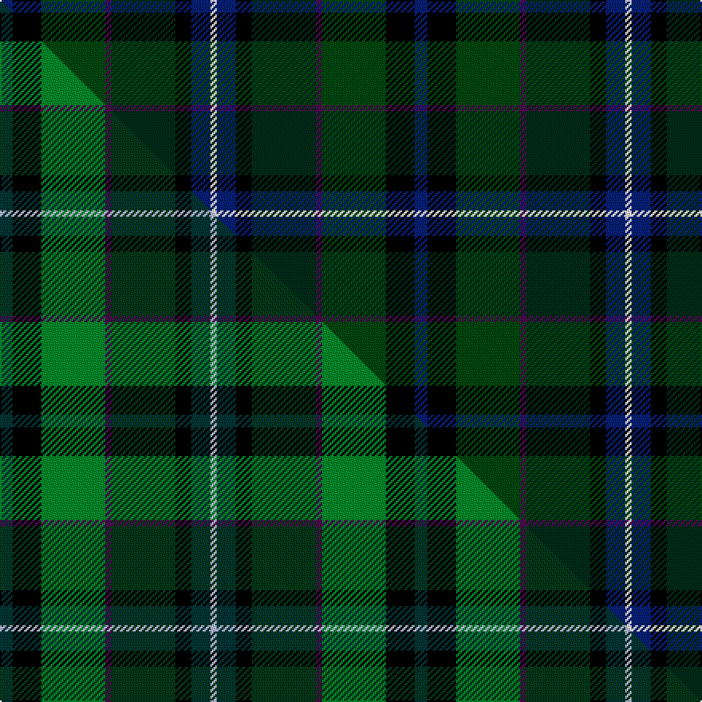

This is one **variant** — a specific cloth: this exact thread count and colourway, with its own
provenance below. It is one weaving of the [sett](/setts/db4k9dgi20dp2dg20k5db6w2/) (the scale-free proportion — the
same cloth at any scale or shade), whose colour order is pattern [BKGBGKBW](/stripes/bkgbgkbw/).

Part of the [Linden](/tartans/l/li/linden/) tartan — the named design grouping this sett with its other cloths.

Sourced from house-of-tartan.  It is a [8 stripe tartan](/stripes/stripes8/).

Original link [http://www.house-of-tartan.scotland.net/house/TartanViewjs.asp?colr=Def&tnam=5772](http://www.house-of-tartan.scotland.net/house/TartanViewjs.asp?colr=Def&tnam=5772)

## Provenance

Earliest known date: Jan 2003 Blue and white from the saltire. Purple and green from the thistle. The name Linden is associated with the colour green. The Linden tree is a lime tree.

Dataset <small>— provenance for this record, inherited from the source manifest</small>

<dl class="dataset-prov">
<dt>source</dt><dd><a href="/sources/house-of-tartan/">House of Tartan</a></dd>
<dt>data captured from</dt><dd><a href="https://github.com/thetartan/tartan-database/blob/master/data/house-of-tartan/data.csv">https://github.com/thetartan/tartan-database/blob/master/data/house-of-tartan/data.csv</a></dd>
<dt>data date</dt><dd>Jan 2003 <small>(this record)</small></dd>
<dt>licence</dt><dd><a href="https://creativecommons.org/licenses/by-nc-nd/4.0/">CC BY-NC-ND 4.0</a></dd>
</dl>

Capture chain <small>— the hands this data passed through, oldest first; each capture carries its own licence</small>

<ol class="capture-chain">
<li><a href="http://www.house-of-tartan.scotland.net/">House of Tartan</a> <small>the weaver/retailer's database — the site is now offline; the URL is kept as the ultimate source's identity</small></li>
<li><a href="https://github.com/thetartan/tartan-database">thetartan/tartan-database</a> <small>2016-2017</small> · <a href="https://creativecommons.org/licenses/by-nc-nd/4.0/">CC BY-NC-ND 4.0</a> <small>Levko Kravets's frozen compilation — the capture we vendored, and where its CC licence text came from</small></li>
<li>this dictionary <small>captured 2026-06-10 · commit 5bf86c7566</small> <small>each re-capture is a git commit to data/sources</small></li>
</ol>

## Thread count
DB/8 K18 DGi40 DP4 DG40 K10 DB12 W/4

One full sett is **260 threads**.

## Palette
<table><thead><tr><th>Colour</th><th>Shade</th><th>OKLCh</th></tr></thead><tbody><tr><td>DG</td><td><code style="background-color:#002C18;">#002C18</code> <small style="color:#888">#002C18</small></td><td><small style="color:#888">oklch(25.8% 0.060 158.1)</small></td></tr><tr><td>DG</td><td><code style="background-color:#004810;">#004810</code> <small style="color:#888">#004810</small></td><td><small style="color:#888">oklch(34.9% 0.108 145.5)</small></td></tr><tr><td>DB</td><td><code style="background-color:#082077;">#082077</code> <small style="color:#888">#082077</small></td><td><small style="color:#888">oklch(30.0% 0.149 265.1)</small></td></tr><tr><td>G</td><td><code style="background-color:#408060;">#408060</code> <small style="color:#888">#408060</small></td><td><small style="color:#888">oklch(54.8% 0.084 160.1)</small></td></tr><tr><td>DG</td><td><code style="background-color:#00643C;">#00643C</code> <small style="color:#888">#00643C</small></td><td><small style="color:#888">oklch(44.3% 0.104 157.7)</small></td></tr><tr><td>G</td><td><code style="background-color:#289C18;">#289C18</code> <small style="color:#888">#289C18</small></td><td><small style="color:#888">oklch(60.6% 0.191 141.6)</small></td></tr><tr><td>K</td><td><code style="background-color:#000000;">#000000</code> <small style="color:#888">#000000</small></td><td><small style="color:#888">oklch(0.0% 0.000 0.0)</small></td></tr><tr><td>W</td><td><code style="background-color:#F7F7F7;">#F7F7F7</code> <small style="color:#888">#F7F7F7</small></td><td><small style="color:#888">oklch(97.6% 0.000 89.9)</small></td></tr><tr><td>DP</td><td><code style="background-color:#4B0B4F;">#4B0B4F</code> <small style="color:#888">#4B0B4F</small></td><td><small style="color:#888">oklch(30.1% 0.125 325.4)</small></td></tr></tbody></table>

# Sample pattern

## Compared to the master

This cloth is one sett of its design; the master sett (the exemplar the design is anchored on) is below for comparison.

Its **ΔTartan distance** from the master is **2.61** — the same measure the nearest-tartans table ranks by (0 is identical; a re-scale of the same cloth is near 0, a recolour or a different proportion further).

<figure class="master-compare" style="margin:0">

this sett
master sett ★

<figcaption style="color:#888;font-size:smaller">One weave of this sett against the <a href="/setts/dt4k9g20dp2dg20k5dt6lb2/">master sett ★</a>, split on the diagonal: a shared proportion runs seamlessly across it with only the shades shifting; a different proportion breaks on it.</figcaption>
</figure>

## Nearest tartan variants

The nearest existing variants by ΔTartan distance, with this cloth at the top so the swatches line up against it.

ΔTartan

Threads

Variant

Sett

—

260

<a href="/variants/s8/db4k9dgi20dp2dg20k5db6w2~x2~dgi1404144-dg1002166/">Linden Family Tartan</a>

<a href="/ttd/edit/#slug=dr2db11k8dg8y2g8k1y2~x2~dg1806142-g2408144&amp;base=db4k9dgi20dp2dg20k5db6w2~x2~dgi1404144-dg1002166" title="compare in the TTD">1.53</a>

160

<a href="/variants/s8/dr2db11k8dg8y2g8k1y2~x2~dg1806142-g2408144/">Scout Mapping Service #2 (Corporate)</a>

<a href="/ttd/edit/#slug=dg20dr2g3db12k20dr2dt3db4dt3~x2&amp;base=db4k9dgi20dp2dg20k5db6w2~x2~dgi1404144-dg1002166" title="compare in the TTD">1.84</a>

230

<a href="/variants/s9/dg20dr2g3db12k20dr2dt3db4dt3~x2/">Ithilien Heather (Personal)</a>

<a href="/ttd/edit/#slug=dg20dr2g3db12k20dr2n3db4n3~x2~dg1302138&amp;base=db4k9dgi20dp2dg20k5db6w2~x2~dgi1404144-dg1002166" title="compare in the TTD">2.29</a>

230

<a href="/variants/s9/dg20dr2g3db12k20dr2n3db4n3~x2~dg1302138/">Ithilien Commemorative Tartan</a>

<a href="/ttd/edit/#slug=db3r2db18k6dg18y2g3~x2&amp;base=db4k9dgi20dp2dg20k5db6w2~x2~dgi1404144-dg1002166" title="compare in the TTD">2.60</a>

196

<a href="/variants/s7/db3r2db18k6dg18y2g3~x2/">McComb</a>

<a href="/ttd/edit/#slug=dt4k9g20dp2dg20k5dt6lb2~x2&amp;base=db4k9dgi20dp2dg20k5db6w2~x2~dgi1404144-dg1002166" title="compare in the TTD">2.61</a>

260

<a href="/variants/s8/dt4k9g20dp2dg20k5dt6lb2~x2/">Linden</a>

<a href="/ttd/edit/#slug=db3r2db18k6dg18y2g3~x2~dg1806142-g2203152&amp;base=db4k9dgi20dp2dg20k5db6w2~x2~dgi1404144-dg1002166" title="compare in the TTD">2.65</a>

196

<a href="/variants/s7/db3r2db18k6dg18y2g3~x2~dg1806142-g2203152/">McComb (Personal)</a>

<a href="/ttd/edit/#slug=dr3dg2dr6dg20k15dg3db18w2~x2&amp;base=db4k9dgi20dp2dg20k5db6w2~x2~dgi1404144-dg1002166" title="compare in the TTD">2.70</a>

266

<a href="/variants/s8/dr3dg2dr6dg20k15dg3db18w2~x2/">Curry (Irish) (Name)</a>

<a href="/ttd/edit/#slug=db9w2dg25do10k15dp4~x2&amp;base=db4k9dgi20dp2dg20k5db6w2~x2~dgi1404144-dg1002166" title="compare in the TTD">2.73</a>

234

<a href="/variants/s6/db9w2dg25do10k15dp4~x2/">Staley (2014)</a>

<a href="/ttd/edit/#slug=w2dg20b3k10dy20ly2~x2&amp;base=db4k9dgi20dp2dg20k5db6w2~x2~dgi1404144-dg1002166" title="compare in the TTD">2.74</a>

220

<a href="/variants/s6/w2dg20b3k10dy20ly2~x2/">Morris of Balgonie Htg (Personal)</a>

<a href="/ttd/edit/#slug=r3dg20k2n11k2db20lr2~x2&amp;base=db4k9dgi20dp2dg20k5db6w2~x2~dgi1404144-dg1002166" title="compare in the TTD">2.85</a>

230

<a href="/variants/s7/r3dg20k2n11k2db20lr2~x2/">Grandfather Mountain Games (District</a>

## Neighbour map

Every grey dot is one of 13621 variants placed by the first two principal components of the ΔTartan feature space (42% of its variance). Red is this tartan; blue dots are its nearest — click one to open its page. The map is a flat projection of a many-dimensional space — [how to read it](/posts/neighbourhood-maps/).

<svg viewBox="0 0 640 380" role="img" style="max-width:100%;height:auto;border:1px solid #e0e0e0;border-radius:4px;display:block" xmlns="http://www.w3.org/2000/svg"><image href="/nn/cloud.v1.png" width="640" height="380"/><a href="/variants/s8/dr2db11k8dg8y2g8k1y2~x2~dg1806142-g2408144/"><circle cx="58.0" cy="177.8" r="4" fill="#3465a4"><title>Scout Mapping Service #2 (Corporate)</title></circle></a><a href="/variants/s9/dg20dr2g3db12k20dr2dt3db4dt3~x2/"><circle cx="155.0" cy="173.8" r="4" fill="#3465a4"><title>Ithilien Heather (Personal)</title></circle></a><a href="/variants/s9/dg20dr2g3db12k20dr2n3db4n3~x2~dg1302138/"><circle cx="138.1" cy="166.5" r="4" fill="#3465a4"><title>Ithilien Commemorative Tartan</title></circle></a><a href="/variants/s7/db3r2db18k6dg18y2g3~x2/"><circle cx="200.8" cy="181.5" r="4" fill="#3465a4"><title>McComb</title></circle></a><a href="/variants/s8/dt4k9g20dp2dg20k5dt6lb2~x2/"><circle cx="102.9" cy="175.4" r="4" fill="#3465a4"><title>Linden</title></circle></a><a href="/variants/s7/db3r2db18k6dg18y2g3~x2~dg1806142-g2203152/"><circle cx="176.5" cy="175.1" r="4" fill="#3465a4"><title>McComb (Personal)</title></circle></a><a href="/variants/s8/dr3dg2dr6dg20k15dg3db18w2~x2/"><circle cx="175.5" cy="188.4" r="4" fill="#3465a4"><title>Curry (Irish) (Name)</title></circle></a><a href="/variants/s6/db9w2dg25do10k15dp4~x2/"><circle cx="171.9" cy="193.8" r="4" fill="#3465a4"><title>Staley (2014)</title></circle></a><a href="/variants/s6/w2dg20b3k10dy20ly2~x2/"><circle cx="156.9" cy="184.4" r="4" fill="#3465a4"><title>Morris of Balgonie Htg (Personal)</title></circle></a><a href="/variants/s7/r3dg20k2n11k2db20lr2~x2/"><circle cx="169.2" cy="178.2" r="4" fill="#3465a4"><title>Grandfather Mountain Games (District</title></circle></a><circle cx="134.1" cy="183.4" r="5" fill="#c00000"/><text x="320" y="376" text-anchor="middle" font-size="11" fill="#999">ground</text><text x="11" y="190" text-anchor="middle" font-size="11" fill="#999" transform="rotate(-90 11 190)">complexity</text></svg>

ID: /variants/s8/db4k9dgi20dp2dg20k5db6w2~x2~dgi1404144-dg1002166/
