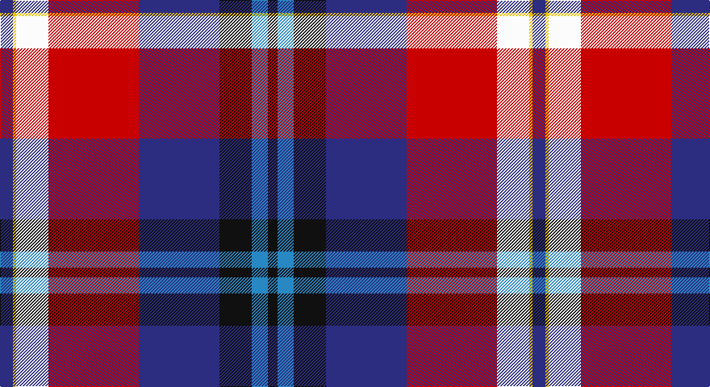

This page is one **sett** — a single exact thread-count. It belongs to the [tartan](/setts/db4ly1w10r28db25k10t5k3/)
(the same proportion at any scale), whose colour order is pattern [BYWRBKBK](/stripes/bywrbkbk/).

Sourced from register-of-tartans.  It is a [8 stripe tartan](/stripes/stripes8/).

Original link https://www.tartanregister.gov.uk/tartanDetails.aspx?ref=2895

## Also known as

This cloth is also recorded under:

- McKnight Dress #2

2 attestations — the source records this cloth was collapsed from (oldest owns this page)

<ul>
<li>01/01/2004 — McKnight Dress #2 (Personal) (register-of-tartans, <a href="https://www.tartanregister.gov.uk/tartanDetails.aspx?ref=2895">record</a>)</li>
<li>pre 2004 — McKnight Dress (Personal) (tartans-authority, <a href="http://www.tartansauthority.com/tartan-ferret/display/6214/">record</a>)</li>
</ul>

## Register references

External register numbers recorded for this tartan.

- Scottish Register of Tartans: [2895](https://www.tartanregister.gov.uk/tartanDetails.aspx?ref=2895)
- Scottish Tartans Authority (ITI): 6214

## Thread count
DB/16 Y4 W40 R112 DB100 K40 B20 K/12

One full sett is **660 threads**.

## Palette

Palette: <strong>Tartan Register</strong>
<table><thead><tr><th>Colour</th><th>Threads</th><th>Shade</th><th>Base</th><th>OKLCh</th></tr></thead><tbody><tr><td>DB/</td><td style="text-align:right;font-variant-numeric:tabular-nums">16</td><td><code style="background-color:#2C2C80;">#2C2C80</code> <small style="color:#888">#2C2C80</small></td><td>B <code style="background-color:#2A418A;">#2A418A</code></td><td><small style="color:#888">oklch(35.0% 0.138 276.6)</small></td></tr><tr><td>Y</td><td style="text-align:right;font-variant-numeric:tabular-nums">4</td><td><code style="background-color:#E8C000;">#E8C000</code> <small style="color:#888">#E8C000</small></td><td>Y <code style="background-color:#F2BF00;">#F2BF00</code></td><td><small style="color:#888">oklch(81.9% 0.168 93.7)</small></td></tr><tr><td>W</td><td style="text-align:right;font-variant-numeric:tabular-nums">40</td><td><code style="background-color:#FCFCFC;">#FCFCFC</code> <small style="color:#888">#FCFCFC</small></td><td>W <code style="background-color:#F7F7F7;">#F7F7F7</code></td><td><small style="color:#888">oklch(99.1% 0.000 89.9)</small></td></tr><tr><td>R</td><td style="text-align:right;font-variant-numeric:tabular-nums">112</td><td><code style="background-color:#C80000;">#C80000</code> <small style="color:#888">#C80000</small></td><td>R <code style="background-color:#CC0000;">#CC0000</code></td><td><small style="color:#888">oklch(52.3% 0.215 29.2)</small></td></tr><tr><td>DB</td><td style="text-align:right;font-variant-numeric:tabular-nums">100</td><td><code style="background-color:#2C2C80;">#2C2C80</code> <small style="color:#888">#2C2C80</small></td><td>B <code style="background-color:#2A418A;">#2A418A</code></td><td><small style="color:#888">oklch(35.0% 0.138 276.6)</small></td></tr><tr><td>K</td><td style="text-align:right;font-variant-numeric:tabular-nums">40</td><td><code style="background-color:#101010;">#101010</code> <small style="color:#888">#101010</small></td><td>K <code style="background-color:#000000;">#000000</code></td><td><small style="color:#888">oklch(17.3% 0.000 89.9)</small></td></tr><tr><td>B</td><td style="text-align:right;font-variant-numeric:tabular-nums">20</td><td><code style="background-color:#2888C4;">#2888C4</code> <small style="color:#888">#2888C4</small></td><td>B <code style="background-color:#2A418A;">#2A418A</code></td><td><small style="color:#888">oklch(60.1% 0.125 241.5)</small></td></tr><tr><td>K/</td><td style="text-align:right;font-variant-numeric:tabular-nums">12</td><td><code style="background-color:#101010;">#101010</code> <small style="color:#888">#101010</small></td><td>K <code style="background-color:#000000;">#000000</code></td><td><small style="color:#888">oklch(17.3% 0.000 89.9)</small></td></tr></tbody></table>

# Sample pattern

## Nearest tartans

The nearest existing variants by ΔTartan distance, with this tartan at the top so the swatches line up against it.

ΔTartan

Tartan

Sett

—

<a href="/ttd/edit/#slug=db4ly1w10r28db25k10t5k3~x4">McKnight Dress #2 (Personal)</a> <a class="nn-out" href="/variants/s8/db4ly1w10r28db25k10t5k3~x4/" title="open its dictionary page">↗</a>

1.02

<a href="/ttd/edit/#slug=lb3m14w1k2g2k16t20lb1~x2&amp;base=db4ly1w10r28db25k10t5k3~x4">Vinther, Niels Christian (Personal)</a> <a class="nn-out" href="/variants/s8/lb3m14w1k2g2k16t20lb1~x2/" title="open its dictionary page">↗</a>

1.17

<a href="/ttd/edit/#slug=k2ly1k2ly8r29o9db24w2db2~x2&amp;base=db4ly1w10r28db25k10t5k3~x4">Lermontov</a> <a class="nn-out" href="/variants/s9/k2ly1k2ly8r29o9db24w2db2~x2/" title="open its dictionary page">↗</a>

1.29

<a href="/ttd/edit/#slug=k6r2db18lo2g2lo2g10r20db2lb1db6~x2&amp;base=db4ly1w10r28db25k10t5k3~x4">Aberdeen Asset Management (Corp)</a> <a class="nn-out" href="/variants/s11/k6r2db18lo2g2lo2g10r20db2lb1db6~x2/" title="open its dictionary page">↗</a>

1.31

<a href="/ttd/edit/#slug=db4w8db8w10k16lg4r38ly1&amp;base=db4ly1w10r28db25k10t5k3~x4">Edinburgh Napier University</a> <a class="nn-out" href="/variants/s8/db4w8db8w10k16lg4r38ly1/" title="open its dictionary page">↗</a>

1.35

<a href="/ttd/edit/#slug=ly2dp16k1r5k1ri8k1r5k16lg2~x4&amp;base=db4ly1w10r28db25k10t5k3~x4">Tribal</a> <a class="nn-out" href="/variants/s10/ly2dp16k1r5k1ri8k1r5k16lg2~x4/" title="open its dictionary page">↗</a>

1.36

<a href="/ttd/edit/#slug=w2b27k1g3k1n10k1r24w2~x2&amp;base=db4ly1w10r28db25k10t5k3~x4">Scotland's Charity Air Ambulance</a> <a class="nn-out" href="/variants/s9/w2b27k1g3k1n10k1r24w2~x2/" title="open its dictionary page">↗</a>

1.37

<a href="/ttd/edit/#slug=w5db6r20k6n5k3db26r2ly1r2db3w3~x2&amp;base=db4ly1w10r28db25k10t5k3~x4">Clinton Wedding</a> <a class="nn-out" href="/variants/s12/w5db6r20k6n5k3db26r2ly1r2db3w3~x2/" title="open its dictionary page">↗</a>

1.42

<a href="/ttd/edit/#slug=w5db6r20k6t5k3db26r2ly1r2db3w3~x2&amp;base=db4ly1w10r28db25k10t5k3~x4">Clinton Wedding (Personal)</a> <a class="nn-out" href="/variants/s12/w5db6r20k6t5k3db26r2ly1r2db3w3~x2/" title="open its dictionary page">↗</a>

1.43

<a href="/ttd/edit/#slug=g20db2w2db12dp29r1dp1k3~x2&amp;base=db4ly1w10r28db25k10t5k3~x4">Longhaugh Primary School</a> <a class="nn-out" href="/variants/s8/g20db2w2db12dp29r1dp1k3~x2/" title="open its dictionary page">↗</a>

1.44

<a href="/ttd/edit/#slug=r6t3p24ly2k23w23k2w6~x2&amp;base=db4ly1w10r28db25k10t5k3~x4">Culloden, Dress</a> <a class="nn-out" href="/variants/s8/r6t3p24ly2k23w23k2w6~x2/" title="open its dictionary page">↗</a>

## Neighbour map

Every grey dot is one of 14360 variants placed by the first two principal components of the ΔTartan feature space (44% of its variance). Red is this tartan; blue dots are its nearest — click one to open its page.

<svg viewBox="0 0 640 380" role="img" style="max-width:100%;height:auto;border:1px solid #e0e0e0;border-radius:4px;display:block" xmlns="http://www.w3.org/2000/svg"><image href="/nn/cloud.v1.png" width="640" height="380"/><a href="/variants/s8/lb3m14w1k2g2k16t20lb1~x2/"><circle cx="157.6" cy="115.5" r="4" fill="#3465a4"><title>Vinther, Niels Christian (Personal)</title></circle></a><a href="/variants/s9/k2ly1k2ly8r29o9db24w2db2~x2/"><circle cx="193.9" cy="82.0" r="4" fill="#3465a4"><title>Lermontov</title></circle></a><a href="/variants/s11/k6r2db18lo2g2lo2g10r20db2lb1db6~x2/"><circle cx="171.0" cy="107.1" r="4" fill="#3465a4"><title>Aberdeen Asset Management (Corp)</title></circle></a><a href="/variants/s8/db4w8db8w10k16lg4r38ly1/"><circle cx="189.5" cy="70.3" r="4" fill="#3465a4"><title>Edinburgh Napier University</title></circle></a><a href="/variants/s10/ly2dp16k1r5k1ri8k1r5k16lg2~x4/"><circle cx="138.1" cy="109.2" r="4" fill="#3465a4"><title>Tribal</title></circle></a><a href="/variants/s9/w2b27k1g3k1n10k1r24w2~x2/"><circle cx="204.2" cy="76.5" r="4" fill="#3465a4"><title>Scotland's Charity Air Ambulance</title></circle></a><a href="/variants/s12/w5db6r20k6n5k3db26r2ly1r2db3w3~x2/"><circle cx="200.8" cy="80.3" r="4" fill="#3465a4"><title>Clinton Wedding</title></circle></a><a href="/variants/s12/w5db6r20k6t5k3db26r2ly1r2db3w3~x2/"><circle cx="210.1" cy="83.3" r="4" fill="#3465a4"><title>Clinton Wedding (Personal)</title></circle></a><a href="/variants/s8/g20db2w2db12dp29r1dp1k3~x2/"><circle cx="228.9" cy="99.4" r="4" fill="#3465a4"><title>Longhaugh Primary School</title></circle></a><a href="/variants/s8/r6t3p24ly2k23w23k2w6~x2/"><circle cx="97.6" cy="126.7" r="4" fill="#3465a4"><title>Culloden, Dress</title></circle></a><circle cx="152.7" cy="102.7" r="5" fill="#c00000"/></svg>

ID: /variants/s8/db4ly1w10r28db25k10t5k3~x4/
