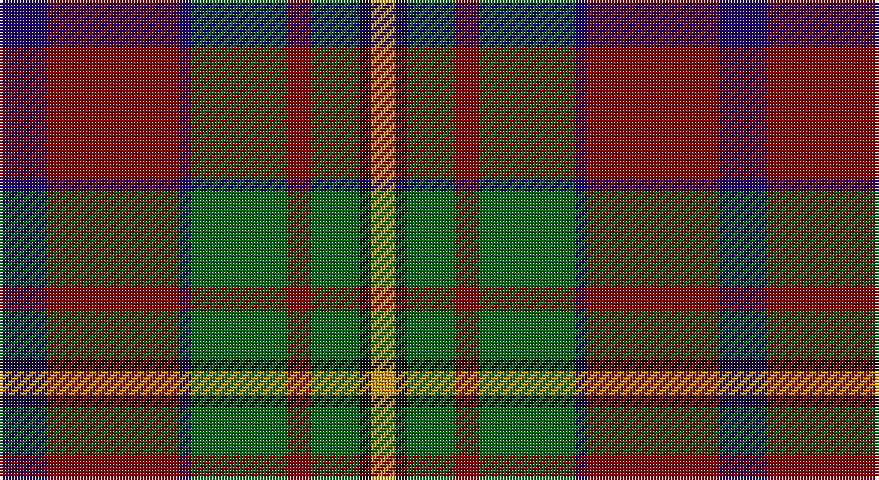

This page is one **sett** — a single exact thread-count. It belongs to the [tartan](/setts/db4r11db1g8r2g4k1lo2/)
(the same proportion at any scale), whose colour order is pattern [BRBGRGKY](/stripes/brbgrgky/).

Sourced from register-of-tartans.  It is a [8 stripe tartan](/stripes/stripes8/).

Original link https://www.tartanregister.gov.uk/tartanDetails.aspx?ref=789

## Also known as

This cloth is also recorded under:

- Craik of Assington

2 attestations — the source records this cloth was collapsed from (oldest owns this page)

<ul>
<li>01/01/1980 — Craik of Assington (Personal) (register-of-tartans, <a href="https://www.tartanregister.gov.uk/tartanDetails.aspx?ref=789">record</a>)</li>
<li>1980 — Craik (Personal) (tartans-authority, <a href="http://www.tartansauthority.com/tartan-ferret/display/494/">record</a>)</li>
</ul>

## Register references

External register numbers recorded for this tartan.

- Scottish Register of Tartans: [789](https://www.tartanregister.gov.uk/tartanDetails.aspx?ref=789)
- Scottish Tartans Authority (ITI): 494
- Scottish Tartans World Register: 494

## Thread count
DB/16 DR44 DB4 G32 DR8 G16 K4 DY/8

One full sett is **240 threads**.

## Palette

Palette: <strong>Tartan Register</strong> <small style="color:#888">(4 of 5 colours)</small>
<table><thead><tr><th>Colour</th><th>Threads</th><th>Shade</th><th>Base</th><th>OKLCh</th></tr></thead><tbody><tr><td>DB/</td><td style="text-align:right;font-variant-numeric:tabular-nums">16</td><td><code style="background-color:#1C0070;">#1C0070</code> <small style="color:#888">#1C0070</small></td><td>B <code style="background-color:#2A418A;">#2A418A</code></td><td><small style="color:#888">oklch(26.3% 0.162 277.1)</small></td></tr><tr><td>DR</td><td style="text-align:right;font-variant-numeric:tabular-nums">44</td><td><code style="background-color:#880000;">#880000</code> <small style="color:#888">#880000</small></td><td>R <code style="background-color:#CC0000;">#CC0000</code></td><td><small style="color:#888">oklch(39.4% 0.162 29.2)</small></td></tr><tr><td>DB</td><td style="text-align:right;font-variant-numeric:tabular-nums">4</td><td><code style="background-color:#1C0070;">#1C0070</code> <small style="color:#888">#1C0070</small></td><td>B <code style="background-color:#2A418A;">#2A418A</code></td><td><small style="color:#888">oklch(26.3% 0.162 277.1)</small></td></tr><tr><td>G</td><td style="text-align:right;font-variant-numeric:tabular-nums">32</td><td><code style="background-color:#006818;">#006818</code> <small style="color:#888">#006818</small></td><td>G <code style="background-color:#006100;">#006100</code></td><td><small style="color:#888">oklch(45.0% 0.142 145.0)</small></td></tr><tr><td>DR</td><td style="text-align:right;font-variant-numeric:tabular-nums">8</td><td><code style="background-color:#880000;">#880000</code> <small style="color:#888">#880000</small></td><td>R <code style="background-color:#CC0000;">#CC0000</code></td><td><small style="color:#888">oklch(39.4% 0.162 29.2)</small></td></tr><tr><td>G</td><td style="text-align:right;font-variant-numeric:tabular-nums">16</td><td><code style="background-color:#006818;">#006818</code> <small style="color:#888">#006818</small></td><td>G <code style="background-color:#006100;">#006100</code></td><td><small style="color:#888">oklch(45.0% 0.142 145.0)</small></td></tr><tr><td>K</td><td style="text-align:right;font-variant-numeric:tabular-nums">4</td><td><code style="background-color:#101010;">#101010</code> <small style="color:#888">#101010</small></td><td>K <code style="background-color:#000000;">#000000</code></td><td><small style="color:#888">oklch(17.3% 0.000 89.9)</small></td></tr><tr><td>DY/</td><td style="text-align:right;font-variant-numeric:tabular-nums">8</td><td><code style="background-color:#D09800;">#D09800</code> <small style="color:#888">#D09800</small></td><td>Y <code style="background-color:#F2BF00;">#F2BF00</code></td><td><small style="color:#888">oklch(71.4% 0.147 82.1)</small></td></tr></tbody></table>

# Sample pattern

## Nearest tartans

The nearest existing variants by ΔTartan distance, with this tartan at the top so the swatches line up against it.

ΔTartan

Tartan

Sett

—

<a href="/ttd/edit/#slug=db4r11db1g8r2g4k1lo2~x4">Craik of Assington (Personal)</a> <a class="nn-out" href="/variants/s8/db4r11db1g8r2g4k1lo2~x4/" title="open its dictionary page">↗</a>

0.69

<a href="/ttd/edit/#slug=lb4dg13g6r16lbi2r2g2~x2&amp;base=db4r11db1g8r2g4k1lo2~x4">Caledonian Brewery (Corporate)</a> <a class="nn-out" href="/variants/s7/lb4dg13g6r16lbi2r2g2~x2/" title="open its dictionary page">↗</a>

0.71

<a href="/ttd/edit/#slug=o30k4o3k4o3g20dt20ly4~x2&amp;base=db4r11db1g8r2g4k1lo2~x4">Sikh (Corporate)</a> <a class="nn-out" href="/variants/s8/o30k4o3k4o3g20dt20ly4~x2/" title="open its dictionary page">↗</a>

0.81

<a href="/ttd/edit/#slug=r2y18k2y3k20dy30w2~x2&amp;base=db4r11db1g8r2g4k1lo2~x4">Bennett, J P. (Personal)</a> <a class="nn-out" href="/variants/s7/r2y18k2y3k20dy30w2~x2/" title="open its dictionary page">↗</a>

0.98

<a href="/ttd/edit/#slug=dt12w2dt13dg3g2r24g3~x2&amp;base=db4r11db1g8r2g4k1lo2~x4">Wellmont Foundation (Corporate)</a> <a class="nn-out" href="/variants/s7/dt12w2dt13dg3g2r24g3~x2/" title="open its dictionary page">↗</a>

1.00

<a href="/ttd/edit/#slug=lb3r30k18db6g30k2~x2&amp;base=db4r11db1g8r2g4k1lo2~x4">Bryant (Dalgleish) (Personal)</a> <a class="nn-out" href="/variants/s6/lb3r30k18db6g30k2~x2/" title="open its dictionary page">↗</a>

1.00

<a href="/ttd/edit/#slug=lb1k1r10g10k5lb5r10k1lb1~x4&amp;base=db4r11db1g8r2g4k1lo2~x4">Graham of Montrose Red</a> <a class="nn-out" href="/variants/s9/lb1k1r10g10k5lb5r10k1lb1~x4/" title="open its dictionary page">↗</a>

1.02

<a href="/ttd/edit/#slug=r2lb1r8k4db1g10lr1g2~x4&amp;base=db4r11db1g8r2g4k1lo2~x4">Sawyer</a> <a class="nn-out" href="/variants/s8/r2lb1r8k4db1g10lr1g2~x4/" title="open its dictionary page">↗</a>

1.03

<a href="/ttd/edit/#slug=o56k12o7k12o7g50db50ly10&amp;base=db4r11db1g8r2g4k1lo2~x4">Sikh</a> <a class="nn-out" href="/variants/s8/o56k12o7k12o7g50db50ly10/" title="open its dictionary page">↗</a>

1.06

<a href="/ttd/edit/#slug=db3k5r2g2r3g12r6k1r3~x4&amp;base=db4r11db1g8r2g4k1lo2~x4">Fulton (1999) (Name)</a> <a class="nn-out" href="/variants/s9/db3k5r2g2r3g12r6k1r3~x4/" title="open its dictionary page">↗</a>

1.08

<a href="/ttd/edit/#slug=g14r1g14r7lb1r7lb1r7k5dp3lb1~x4&amp;base=db4r11db1g8r2g4k1lo2~x4">Hynde (Sir John) (Artefact)</a> <a class="nn-out" href="/variants/s11/g14r1g14r7lb1r7lb1r7k5dp3lb1~x4/" title="open its dictionary page">↗</a>

## Neighbour map

Every grey dot is one of 14360 variants placed by the first two principal components of the ΔTartan feature space (44% of its variance). Red is this tartan; blue dots are its nearest — click one to open its page.

<svg viewBox="0 0 640 380" role="img" style="max-width:100%;height:auto;border:1px solid #e0e0e0;border-radius:4px;display:block" xmlns="http://www.w3.org/2000/svg"><image href="/nn/cloud.v1.png" width="640" height="380"/><a href="/variants/s7/lb4dg13g6r16lbi2r2g2~x2/"><circle cx="185.0" cy="198.0" r="4" fill="#3465a4"><title>Caledonian Brewery (Corporate)</title></circle></a><a href="/variants/s8/o30k4o3k4o3g20dt20ly4~x2/"><circle cx="195.1" cy="176.0" r="4" fill="#3465a4"><title>Sikh (Corporate)</title></circle></a><a href="/variants/s7/r2y18k2y3k20dy30w2~x2/"><circle cx="231.9" cy="173.1" r="4" fill="#3465a4"><title>Bennett, J P. (Personal)</title></circle></a><a href="/variants/s7/dt12w2dt13dg3g2r24g3~x2/"><circle cx="248.0" cy="180.5" r="4" fill="#3465a4"><title>Wellmont Foundation (Corporate)</title></circle></a><a href="/variants/s6/lb3r30k18db6g30k2~x2/"><circle cx="193.1" cy="191.3" r="4" fill="#3465a4"><title>Bryant (Dalgleish) (Personal)</title></circle></a><a href="/variants/s9/lb1k1r10g10k5lb5r10k1lb1~x4/"><circle cx="198.3" cy="173.1" r="4" fill="#3465a4"><title>Graham of Montrose Red</title></circle></a><a href="/variants/s8/r2lb1r8k4db1g10lr1g2~x4/"><circle cx="190.6" cy="163.7" r="4" fill="#3465a4"><title>Sawyer</title></circle></a><a href="/variants/s8/o56k12o7k12o7g50db50ly10/"><circle cx="142.3" cy="189.5" r="4" fill="#3465a4"><title>Sikh</title></circle></a><a href="/variants/s9/db3k5r2g2r3g12r6k1r3~x4/"><circle cx="209.4" cy="191.2" r="4" fill="#3465a4"><title>Fulton (1999) (Name)</title></circle></a><a href="/variants/s11/g14r1g14r7lb1r7lb1r7k5dp3lb1~x4/"><circle cx="250.7" cy="167.6" r="4" fill="#3465a4"><title>Hynde (Sir John) (Artefact)</title></circle></a><circle cx="208.9" cy="187.6" r="5" fill="#c00000"/></svg>

ID: /variants/s8/db4r11db1g8r2g4k1lo2~x4/
