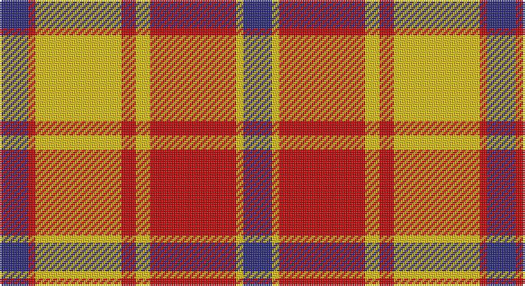

This page is one **sett** — a single exact thread-count. It belongs to the [tartan](/setts/db4r1ly12r2ly2r12ly1db4/)
(the same proportion at any scale), whose colour order is pattern [BRYRYRYB](/stripes/bryryryb/).

Part of the [Glassary](/tartans/glassary/) tartan — the named design grouping this sett with its other cloths.

Sourced from register-of-tartans.  It is a [8 stripe tartan](/stripes/stripes8/).

Original link https://www.tartanregister.gov.uk/tartanDetails.aspx?ref=1362

## Also known as

This cloth is also recorded under:

- Glassary #2
- Glassary #3

## Register references

External register numbers recorded for this tartan.

- Scottish Register of Tartans: [1362](https://www.tartanregister.gov.uk/tartanDetails.aspx?ref=1362)
- Scottish Tartans Authority (ITI): 5800

## Thread count
DB/16 R4 Y48 R8 Y8 R48 Y4 DB/16

One full sett is **272 threads**.

## Palette

Palette: <strong>Tartan Register</strong>
<table><thead><tr><th>Colour</th><th>Threads</th><th>Shade</th><th>Base</th><th>OKLCh</th></tr></thead><tbody><tr><td>DB/</td><td style="text-align:right;font-variant-numeric:tabular-nums">16</td><td><code style="background-color:#2C2C80;">#2C2C80</code> <small style="color:#888">#2C2C80</small></td><td>B <code style="background-color:#2A418A;">#2A418A</code></td><td><small style="color:#888">oklch(35.0% 0.138 276.6)</small></td></tr><tr><td>R</td><td style="text-align:right;font-variant-numeric:tabular-nums">4</td><td><code style="background-color:#C80000;">#C80000</code> <small style="color:#888">#C80000</small></td><td>R <code style="background-color:#CC0000;">#CC0000</code></td><td><small style="color:#888">oklch(52.3% 0.215 29.2)</small></td></tr><tr><td>Y</td><td style="text-align:right;font-variant-numeric:tabular-nums">48</td><td><code style="background-color:#E8C000;">#E8C000</code> <small style="color:#888">#E8C000</small></td><td>Y <code style="background-color:#F2BF00;">#F2BF00</code></td><td><small style="color:#888">oklch(81.9% 0.168 93.7)</small></td></tr><tr><td>R</td><td style="text-align:right;font-variant-numeric:tabular-nums">8</td><td><code style="background-color:#C80000;">#C80000</code> <small style="color:#888">#C80000</small></td><td>R <code style="background-color:#CC0000;">#CC0000</code></td><td><small style="color:#888">oklch(52.3% 0.215 29.2)</small></td></tr><tr><td>Y</td><td style="text-align:right;font-variant-numeric:tabular-nums">8</td><td><code style="background-color:#E8C000;">#E8C000</code> <small style="color:#888">#E8C000</small></td><td>Y <code style="background-color:#F2BF00;">#F2BF00</code></td><td><small style="color:#888">oklch(81.9% 0.168 93.7)</small></td></tr><tr><td>R</td><td style="text-align:right;font-variant-numeric:tabular-nums">48</td><td><code style="background-color:#C80000;">#C80000</code> <small style="color:#888">#C80000</small></td><td>R <code style="background-color:#CC0000;">#CC0000</code></td><td><small style="color:#888">oklch(52.3% 0.215 29.2)</small></td></tr><tr><td>Y</td><td style="text-align:right;font-variant-numeric:tabular-nums">4</td><td><code style="background-color:#E8C000;">#E8C000</code> <small style="color:#888">#E8C000</small></td><td>Y <code style="background-color:#F2BF00;">#F2BF00</code></td><td><small style="color:#888">oklch(81.9% 0.168 93.7)</small></td></tr><tr><td>DB/</td><td style="text-align:right;font-variant-numeric:tabular-nums">16</td><td><code style="background-color:#2C2C80;">#2C2C80</code> <small style="color:#888">#2C2C80</small></td><td>B <code style="background-color:#2A418A;">#2A418A</code></td><td><small style="color:#888">oklch(35.0% 0.138 276.6)</small></td></tr></tbody></table>

# Sample pattern

## Compared to the master

This cloth is one sett of its design; the master sett (the exemplar the design is anchored on) is below for comparison.

<figure style="margin:0"><figcaption style="color:#888;font-size:smaller">this sett</figcaption></figure>
<figure style="margin:0"><figcaption style="color:#888;font-size:smaller"><a href="/setts/db4ly1r12ly2r2ly12r1ly4/">master sett →</a></figcaption></figure>

## Nearest tartans

The nearest existing variants by ΔTartan distance, with this tartan at the top so the swatches line up against it.

ΔTartan

Tartan

Sett

—

<a href="/ttd/edit/#slug=db4r1ly12r2ly2r12ly1db4~x4">Glassary #2</a> <a class="nn-out" href="/variants/s8/db4r1ly12r2ly2r12ly1db4~x4/" title="open its dictionary page">↗</a>

1.19

<a href="/ttd/edit/#slug=o22dr2o2dr2o2dr15w17dr3~x2&amp;base=db4r1ly12r2ly2r12ly1db4~x4">Turnberry, Manx Snaefell</a> <a class="nn-out" href="/variants/s8/o22dr2o2dr2o2dr15w17dr3~x2/" title="open its dictionary page">↗</a>

1.29

<a href="/ttd/edit/#slug=r12w2lo3w2r3k5r2lo18w2~x2&amp;base=db4r1ly12r2ly2r12ly1db4~x4">Ballater Trade or 'Fancy' Tartan</a> <a class="nn-out" href="/variants/s9/r12w2lo3w2r3k5r2lo18w2~x2/" title="open its dictionary page">↗</a>

1.29

<a href="/ttd/edit/#slug=db4ly1r12ly2r2ly12r1ly4~x4&amp;base=db4r1ly12r2ly2r12ly1db4~x4">Glassary #3</a> <a class="nn-out" href="/variants/s8/db4ly1r12ly2r2ly12r1ly4~x4/" title="open its dictionary page">↗</a>

1.34

<a href="/ttd/edit/#slug=lo22do2lo2do2lo2do15w17do3~x2&amp;base=db4r1ly12r2ly2r12ly1db4~x4">Turnberry Manx Snaefell Family Tartan</a> <a class="nn-out" href="/variants/s8/lo22do2lo2do2lo2do15w17do3~x2/" title="open its dictionary page">↗</a>

1.37

<a href="/ttd/edit/#slug=r12w2o3w2r3k5r2o18w2~x2&amp;base=db4r1ly12r2ly2r12ly1db4~x4">Ballater</a> <a class="nn-out" href="/variants/s9/r12w2o3w2r3k5r2o18w2~x2/" title="open its dictionary page">↗</a>

1.39

<a href="/ttd/edit/#slug=r2ri1r10ri2w10db1w2~x4&amp;base=db4r1ly12r2ly2r12ly1db4~x4">Lennox Dress #2</a> <a class="nn-out" href="/variants/s7/r2ri1r10ri2w10db1w2~x4/" title="open its dictionary page">↗</a>

1.39

<a href="/ttd/edit/#slug=o15k1ly2db3o2k1ly15~x4&amp;base=db4r1ly12r2ly2r12ly1db4~x4">Scrymgeour Family Tartan</a> <a class="nn-out" href="/variants/s7/o15k1ly2db3o2k1ly15~x4/" title="open its dictionary page">↗</a>

1.41

<a href="/ttd/edit/#slug=ly20k2ly3k2ly4k9r18k2r5~x2&amp;base=db4r1ly12r2ly2r12ly1db4~x4">Aubigny</a> <a class="nn-out" href="/variants/s9/ly20k2ly3k2ly4k9r18k2r5~x2/" title="open its dictionary page">↗</a>

1.45

<a href="/ttd/edit/#slug=r15k1ly2db3r2k1ly15~x6&amp;base=db4r1ly12r2ly2r12ly1db4~x4">Scrymgeour</a> <a class="nn-out" href="/variants/s7/r15k1ly2db3r2k1ly15~x6/" title="open its dictionary page">↗</a>

1.45

<a href="/ttd/edit/#slug=r15k1ly2db3r2k1ly15~x3&amp;base=db4r1ly12r2ly2r12ly1db4~x4">Scrymgeour</a> <a class="nn-out" href="/variants/s7/r15k1ly2db3r2k1ly15~x3/" title="open its dictionary page">↗</a>

## Neighbour map

Every grey dot is one of 14360 variants placed by the first two principal components of the ΔTartan feature space (44% of its variance). Red is this tartan; blue dots are its nearest — click one to open its page.

<svg viewBox="0 0 640 380" role="img" style="max-width:100%;height:auto;border:1px solid #e0e0e0;border-radius:4px;display:block" xmlns="http://www.w3.org/2000/svg"><image href="/nn/cloud.v1.png" width="640" height="380"/><a href="/variants/s8/o22dr2o2dr2o2dr15w17dr3~x2/"><circle cx="224.7" cy="176.5" r="4" fill="#3465a4"><title>Turnberry, Manx Snaefell</title></circle></a><a href="/variants/s9/r12w2lo3w2r3k5r2lo18w2~x2/"><circle cx="229.0" cy="165.7" r="4" fill="#3465a4"><title>Ballater Trade or 'Fancy' Tartan</title></circle></a><a href="/variants/s8/db4ly1r12ly2r2ly12r1ly4~x4/"><circle cx="296.7" cy="172.1" r="4" fill="#3465a4"><title>Glassary #3</title></circle></a><a href="/variants/s8/lo22do2lo2do2lo2do15w17do3~x2/"><circle cx="221.8" cy="175.9" r="4" fill="#3465a4"><title>Turnberry Manx Snaefell Family Tartan</title></circle></a><a href="/variants/s9/r12w2o3w2r3k5r2o18w2~x2/"><circle cx="222.1" cy="163.2" r="4" fill="#3465a4"><title>Ballater</title></circle></a><a href="/variants/s7/r2ri1r10ri2w10db1w2~x4/"><circle cx="235.9" cy="158.9" r="4" fill="#3465a4"><title>Lennox Dress #2</title></circle></a><a href="/variants/s7/o15k1ly2db3o2k1ly15~x4/"><circle cx="266.4" cy="146.3" r="4" fill="#3465a4"><title>Scrymgeour Family Tartan</title></circle></a><a href="/variants/s9/ly20k2ly3k2ly4k9r18k2r5~x2/"><circle cx="222.1" cy="174.0" r="4" fill="#3465a4"><title>Aubigny</title></circle></a><a href="/variants/s7/r15k1ly2db3r2k1ly15~x6/"><circle cx="265.9" cy="149.7" r="4" fill="#3465a4"><title>Scrymgeour</title></circle></a><a href="/variants/s7/r15k1ly2db3r2k1ly15~x3/"><circle cx="265.9" cy="149.7" r="4" fill="#3465a4"><title>Scrymgeour</title></circle></a><circle cx="234.7" cy="170.6" r="5" fill="#c00000"/></svg>

ID: /variants/s8/db4r1ly12r2ly2r12ly1db4~x4/
