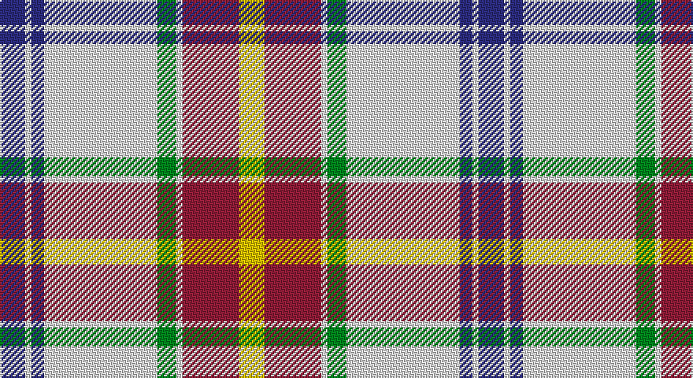

This page is one **sett** — a single exact thread-count. It belongs to the [tartan](/setts/db4w1db2w18g3w1r9ly4/)
(the same proportion at any scale), whose colour order is pattern [BWBWGWRY](/stripes/bwbwgwry/).

Part of the [Manitoba Dress](/tartans/manitoba-dress/) tartan — the named design grouping this sett with its other cloths.

Sourced from tartans-authority.  It is a [8 stripe tartan](/stripes/stripes8/).

Original link http://www.tartansauthority.com/tartan-ferret/display/7697/

2 attestations — the source records this cloth was collapsed from (oldest owns this page)

<ul>
<li>1958 — Manitoba Dress (1958) (District) (tartans-authority, <a href="http://www.tartansauthority.com/tartan-ferret/display/7697/">record</a>)</li>
<li>undated — Manitoba Dress (1958) (register-of-tartans, <a href="https://www.tartanregister.gov.uk/tartanDetails.aspx?ref=5694">record</a>)</li>
</ul>

## Register references

External register numbers recorded for this tartan.

- Scottish Register of Tartans: [5694](https://www.tartanregister.gov.uk/tartanDetails.aspx?ref=5694)
- Scottish Tartans Authority (ITI): 7697

## Thread count
DB/16 LN4 DB8 LN72 G12 LN4 DR36 Y/16

One full sett is **304 threads**.

## Palette

Palette: <strong>Tartan Register</strong> <small style="color:#888">(4 of 5 colours)</small>
<table><thead><tr><th>Colour</th><th>Threads</th><th>Shade</th><th>Base</th><th>OKLCh</th></tr></thead><tbody><tr><td>DB/</td><td style="text-align:right;font-variant-numeric:tabular-nums">16</td><td><code style="background-color:#2C2C80;">#2C2C80</code> <small style="color:#888">#2C2C80</small></td><td>B <code style="background-color:#2A418A;">#2A418A</code></td><td><small style="color:#888">oklch(35.0% 0.138 276.6)</small></td></tr><tr><td>LN</td><td style="text-align:right;font-variant-numeric:tabular-nums">4</td><td><code style="background-color:#E0E0E0;">#E0E0E0</code> <small style="color:#888">#E0E0E0</small></td><td>W <code style="background-color:#F7F7F7;">#F7F7F7</code></td><td><small style="color:#888">oklch(90.7% 0.000 89.9)</small></td></tr><tr><td>DB</td><td style="text-align:right;font-variant-numeric:tabular-nums">8</td><td><code style="background-color:#2C2C80;">#2C2C80</code> <small style="color:#888">#2C2C80</small></td><td>B <code style="background-color:#2A418A;">#2A418A</code></td><td><small style="color:#888">oklch(35.0% 0.138 276.6)</small></td></tr><tr><td>LN</td><td style="text-align:right;font-variant-numeric:tabular-nums">72</td><td><code style="background-color:#E0E0E0;">#E0E0E0</code> <small style="color:#888">#E0E0E0</small></td><td>W <code style="background-color:#F7F7F7;">#F7F7F7</code></td><td><small style="color:#888">oklch(90.7% 0.000 89.9)</small></td></tr><tr><td>G</td><td style="text-align:right;font-variant-numeric:tabular-nums">12</td><td><code style="background-color:#00881C;">#00881C</code> <small style="color:#888">#00881C</small></td><td>G <code style="background-color:#006100;">#006100</code></td><td><small style="color:#888">oklch(54.4% 0.175 144.2)</small></td></tr><tr><td>LN</td><td style="text-align:right;font-variant-numeric:tabular-nums">4</td><td><code style="background-color:#E0E0E0;">#E0E0E0</code> <small style="color:#888">#E0E0E0</small></td><td>W <code style="background-color:#F7F7F7;">#F7F7F7</code></td><td><small style="color:#888">oklch(90.7% 0.000 89.9)</small></td></tr><tr><td>DR</td><td style="text-align:right;font-variant-numeric:tabular-nums">36</td><td><code style="background-color:#901C38;">#901C38</code> <small style="color:#888">#901C38</small></td><td>R <code style="background-color:#CC0000;">#CC0000</code></td><td><small style="color:#888">oklch(43.2% 0.150 13.1)</small></td></tr><tr><td>Y/</td><td style="text-align:right;font-variant-numeric:tabular-nums">16</td><td><code style="background-color:#E8C000;">#E8C000</code> <small style="color:#888">#E8C000</small></td><td>Y <code style="background-color:#F2BF00;">#F2BF00</code></td><td><small style="color:#888">oklch(81.9% 0.168 93.7)</small></td></tr></tbody></table>

# Sample pattern

## Nearest tartans

The nearest existing variants by ΔTartan distance, with this tartan at the top so the swatches line up against it.

ΔTartan

Tartan

Sett

—

<a href="/ttd/edit/#slug=db4w1db2w18g3w1r9ly4~x4">Manitoba Dress (1958) (District)</a> <a class="nn-out" href="/variants/s8/db4w1db2w18g3w1r9ly4~x4/" title="open its dictionary page">↗</a>

0.73

<a href="/ttd/edit/#slug=w8b5t10dp24w30b2dg2~x2&amp;base=db4w1db2w18g3w1r9ly4~x4">Shiel, Magenta (Dance)</a> <a class="nn-out" href="/variants/s7/w8b5t10dp24w30b2dg2~x2/" title="open its dictionary page">↗</a>

0.85

<a href="/ttd/edit/#slug=w8g5t10dp24w30g2lp2~x2&amp;base=db4w1db2w18g3w1r9ly4~x4">Shiel, Purple (Dance)</a> <a class="nn-out" href="/variants/s7/w8g5t10dp24w30g2lp2~x2/" title="open its dictionary page">↗</a>

0.91

<a href="/ttd/edit/#slug=w8g5dp10t24w30g2lp2~x2&amp;base=db4w1db2w18g3w1r9ly4~x4">Shiel, Purple V2 (Dance)</a> <a class="nn-out" href="/variants/s7/w8g5dp10t24w30g2lp2~x2/" title="open its dictionary page">↗</a>

1.01

<a href="/ttd/edit/#slug=w39db9k10dg11r7k3r7~x2&amp;base=db4w1db2w18g3w1r9ly4~x4">MacDuff Dress #5</a> <a class="nn-out" href="/variants/s7/w39db9k10dg11r7k3r7~x2/" title="open its dictionary page">↗</a>

1.08

<a href="/variants/s8/wi4k13wi17lo2r2lo24wi2w2~x2/">Lalage (Personal)</a>

1.10

<a href="/ttd/edit/#slug=w60dt24oi3dt5w3dt5o16oi8k3oi6w4&amp;base=db4w1db2w18g3w1r9ly4~x4">Glenmore Pink</a> <a class="nn-out" href="/variants/s11/w60dt24oi3dt5w3dt5o16oi8k3oi6w4/" title="open its dictionary page">↗</a>

1.16

<a href="/ttd/edit/#slug=w1b6w4b1w16k1g4k6ly1~x2&amp;base=db4w1db2w18g3w1r9ly4~x4">Henderson Dress</a> <a class="nn-out" href="/variants/s9/w1b6w4b1w16k1g4k6ly1~x2/" title="open its dictionary page">↗</a>

1.17

<a href="/ttd/edit/#slug=w68lr3w3lr8w3lr3o24dt16oi3dt20lr3~x2&amp;base=db4w1db2w18g3w1r9ly4~x4">Ben Vorlich</a> <a class="nn-out" href="/variants/s11/w68lr3w3lr8w3lr3o24dt16oi3dt20lr3~x2/" title="open its dictionary page">↗</a>

1.18

<a href="/ttd/edit/#slug=db2w14p4ly1g8db2~x2&amp;base=db4w1db2w18g3w1r9ly4~x4">Manx Laxey, dress green</a> <a class="nn-out" href="/variants/s6/db2w14p4ly1g8db2~x2/" title="open its dictionary page">↗</a>

1.20

<a href="/ttd/edit/#slug=k4lb4k2lb4k2lb22o27ly2r3~x2&amp;base=db4w1db2w18g3w1r9ly4~x4">Falkirk (District)</a> <a class="nn-out" href="/variants/s9/k4lb4k2lb4k2lb22o27ly2r3~x2/" title="open its dictionary page">↗</a>

## Neighbour map

Every grey dot is one of 14360 variants placed by the first two principal components of the ΔTartan feature space (44% of its variance). Red is this tartan; blue dots are its nearest — click one to open its page.

<svg viewBox="0 0 640 380" role="img" style="max-width:100%;height:auto;border:1px solid #e0e0e0;border-radius:4px;display:block" xmlns="http://www.w3.org/2000/svg"><image href="/nn/cloud.v1.png" width="640" height="380"/><a href="/variants/s7/w8b5t10dp24w30b2dg2~x2/"><circle cx="207.5" cy="141.0" r="4" fill="#3465a4"><title>Shiel, Magenta (Dance)</title></circle></a><a href="/variants/s7/w8g5t10dp24w30g2lp2~x2/"><circle cx="197.8" cy="138.1" r="4" fill="#3465a4"><title>Shiel, Purple (Dance)</title></circle></a><a href="/variants/s7/w8g5dp10t24w30g2lp2~x2/"><circle cx="207.7" cy="145.1" r="4" fill="#3465a4"><title>Shiel, Purple V2 (Dance)</title></circle></a><a href="/variants/s7/w39db9k10dg11r7k3r7~x2/"><circle cx="170.4" cy="139.6" r="4" fill="#3465a4"><title>MacDuff Dress #5</title></circle></a><a href="/variants/s8/wi4k13wi17lo2r2lo24wi2w2~x2/"><circle cx="165.7" cy="134.6" r="4" fill="#3465a4"><title>Lalage (Personal)</title></circle></a><a href="/variants/s11/w60dt24oi3dt5w3dt5o16oi8k3oi6w4/"><circle cx="228.4" cy="80.0" r="4" fill="#3465a4"><title>Glenmore Pink</title></circle></a><a href="/variants/s9/w1b6w4b1w16k1g4k6ly1~x2/"><circle cx="216.2" cy="114.8" r="4" fill="#3465a4"><title>Henderson Dress</title></circle></a><a href="/variants/s11/w68lr3w3lr8w3lr3o24dt16oi3dt20lr3~x2/"><circle cx="232.5" cy="78.1" r="4" fill="#3465a4"><title>Ben Vorlich</title></circle></a><a href="/variants/s6/db2w14p4ly1g8db2~x2/"><circle cx="186.5" cy="153.0" r="4" fill="#3465a4"><title>Manx Laxey, dress green</title></circle></a><a href="/variants/s9/k4lb4k2lb4k2lb22o27ly2r3~x2/"><circle cx="225.4" cy="128.2" r="4" fill="#3465a4"><title>Falkirk (District)</title></circle></a><circle cx="211.6" cy="115.2" r="5" fill="#c00000"/></svg>

ID: /variants/s8/db4w1db2w18g3w1r9ly4~x4/
