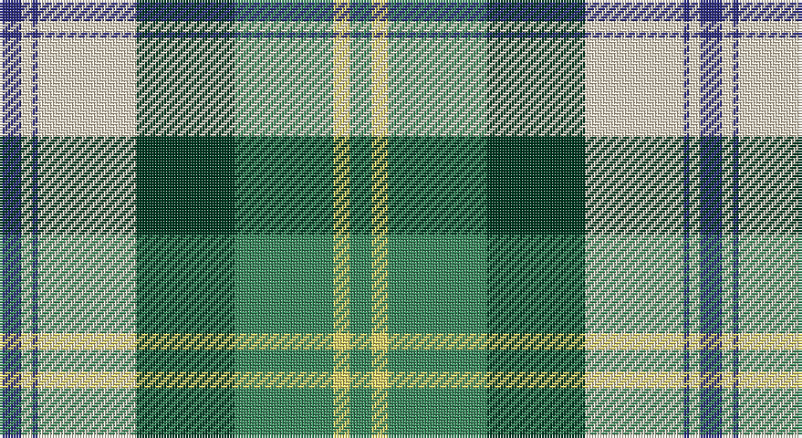

This page is one **sett** — a single exact thread-count. It belongs to the [tartan](/setts/db4w2db1w18dg18g18ly3g4/)
(the same proportion at any scale), whose colour order is pattern [BWBWGGYG](/stripes/bwbwggyg/).

Sourced from tartans-authority.  It is a [8 stripe tartan](/stripes/stripes8/).

Original link http://www.tartansauthority.com/tartan-ferret/display/7603/

## Provenance

Earliest known date: March 2008 One of a series of dancer's tartans for the House of Edgar's in-house collection designed by Kirsty Anderson.

## Also known as

This cloth is also recorded under:

- Gigha Green
- Gigha, Green

3 attestations — the source records this cloth was collapsed from (oldest owns this page)

<ul>
<li>March 2008 — Gigha, Green (Dance) (tartans-authority, <a href="http://www.tartansauthority.com/tartan-ferret/display/7603/">record</a>)</li>
<li>undated — Gigha Green (register-of-tartans, <a href="https://www.tartanregister.gov.uk/tartanDetails.aspx?ref=5627">record</a>)</li>
<li>undated — Gigha Green Fashion Tartan (house-of-tartan, <a href="http://www.house-of-tartan.scotland.net/house/TartanViewjs.asp?colr=Def&tnam=7603">record</a>)</li>
</ul>

## Register references

External register numbers recorded for this tartan.

- Scottish Register of Tartans: [5627](https://www.tartanregister.gov.uk/tartanDetails.aspx?ref=5627)
- Scottish Tartans Authority (ITI): 7603

## Thread count
DB/8 W4 DB2 W36 DG36 G36 LY6 G/8

One full sett is **256 threads**.

## Palette

Palette: <strong>Tartan Register</strong> <small style="color:#888">(3 of 5 colours)</small>
<table><thead><tr><th>Colour</th><th>Threads</th><th>Shade</th><th>Base</th><th>OKLCh</th></tr></thead><tbody><tr><td>DB/</td><td style="text-align:right;font-variant-numeric:tabular-nums">8</td><td><code style="background-color:#2C2C80;">#2C2C80</code> <small style="color:#888">#2C2C80</small></td><td>B <code style="background-color:#2A418A;">#2A418A</code></td><td><small style="color:#888">oklch(35.0% 0.138 276.6)</small></td></tr><tr><td>W</td><td style="text-align:right;font-variant-numeric:tabular-nums">4</td><td><code style="background-color:#F0E0C8;">#F0E0C8</code> <small style="color:#888">#F0E0C8</small></td><td>W <code style="background-color:#F7F7F7;">#F7F7F7</code></td><td><small style="color:#888">oklch(91.3% 0.036 78.1)</small></td></tr><tr><td>DB</td><td style="text-align:right;font-variant-numeric:tabular-nums">2</td><td><code style="background-color:#2C2C80;">#2C2C80</code> <small style="color:#888">#2C2C80</small></td><td>B <code style="background-color:#2A418A;">#2A418A</code></td><td><small style="color:#888">oklch(35.0% 0.138 276.6)</small></td></tr><tr><td>W</td><td style="text-align:right;font-variant-numeric:tabular-nums">36</td><td><code style="background-color:#F0E0C8;">#F0E0C8</code> <small style="color:#888">#F0E0C8</small></td><td>W <code style="background-color:#F7F7F7;">#F7F7F7</code></td><td><small style="color:#888">oklch(91.3% 0.036 78.1)</small></td></tr><tr><td>DG</td><td style="text-align:right;font-variant-numeric:tabular-nums">36</td><td><code style="background-color:#003820;">#003820</code> <small style="color:#888">#003820</small></td><td>G <code style="background-color:#006100;">#006100</code></td><td><small style="color:#888">oklch(30.0% 0.070 158.3)</small></td></tr><tr><td>G</td><td style="text-align:right;font-variant-numeric:tabular-nums">36</td><td><code style="background-color:#38885C;">#38885C</code> <small style="color:#888">#38885C</small></td><td>G <code style="background-color:#006100;">#006100</code></td><td><small style="color:#888">oklch(56.5% 0.105 156.5)</small></td></tr><tr><td>LY</td><td style="text-align:right;font-variant-numeric:tabular-nums">6</td><td><code style="background-color:#E8D468;">#E8D468</code> <small style="color:#888">#E8D468</small></td><td>Y <code style="background-color:#F2BF00;">#F2BF00</code></td><td><small style="color:#888">oklch(86.5% 0.130 99.0)</small></td></tr><tr><td>G/</td><td style="text-align:right;font-variant-numeric:tabular-nums">8</td><td><code style="background-color:#38885C;">#38885C</code> <small style="color:#888">#38885C</small></td><td>G <code style="background-color:#006100;">#006100</code></td><td><small style="color:#888">oklch(56.5% 0.105 156.5)</small></td></tr></tbody></table>

# Sample pattern

## Nearest tartans

The nearest existing variants by ΔTartan distance, with this tartan at the top so the swatches line up against it.

ΔTartan

Tartan

Sett

—

<a href="/ttd/edit/#slug=db4w2db1w18dg18g18ly3g4~x2">Gigha, Green (Dance)</a> <a class="nn-out" href="/variants/s8/db4w2db1w18dg18g18ly3g4~x2/" title="open its dictionary page">↗</a>

0.68

<a href="/ttd/edit/#slug=t13r1g13w1k1w7k3~x2&amp;base=db4w2db1w18dg18g18ly3g4~x2">Chambers, Christopher J (Personal)</a> <a class="nn-out" href="/variants/s7/t13r1g13w1k1w7k3~x2/" title="open its dictionary page">↗</a>

1.04

<a href="/ttd/edit/#slug=lo12k3g24r12g24k32w44g4w8g4&amp;base=db4w2db1w18dg18g18ly3g4~x2">Gillies Dress Green</a> <a class="nn-out" href="/variants/s10/lo12k3g24r12g24k32w44g4w8g4/" title="open its dictionary page">↗</a>

1.04

<a href="/ttd/edit/#slug=w3ly2g8ly2k3ly2n15k1ly2~x4&amp;base=db4w2db1w18dg18g18ly3g4~x2">MacManus</a> <a class="nn-out" href="/variants/s9/w3ly2g8ly2k3ly2n15k1ly2~x4/" title="open its dictionary page">↗</a>

1.19

<a href="/ttd/edit/#slug=db8w33k15g17t3g17t3~x2&amp;base=db4w2db1w18dg18g18ly3g4~x2">MacRobart, dress</a> <a class="nn-out" href="/variants/s7/db8w33k15g17t3g17t3~x2/" title="open its dictionary page">↗</a>

1.19

<a href="/ttd/edit/#slug=db8w33k15dg17t3dg17t3~x2&amp;base=db4w2db1w18dg18g18ly3g4~x2">MacRobart Dress (Personal)</a> <a class="nn-out" href="/variants/s7/db8w33k15dg17t3dg17t3~x2/" title="open its dictionary page">↗</a>

1.26

<a href="/ttd/edit/#slug=w7r1w14k6lo2k6g14r2g10lo1~x2&amp;base=db4w2db1w18dg18g18ly3g4~x2">Spanish shirt</a> <a class="nn-out" href="/variants/s10/w7r1w14k6lo2k6g14r2g10lo1~x2/" title="open its dictionary page">↗</a>

1.27

<a href="/ttd/edit/#slug=g2dy10g11ly4dy1w18g2dy1~x2&amp;base=db4w2db1w18dg18g18ly3g4~x2">Aviemore Check</a> <a class="nn-out" href="/variants/s8/g2dy10g11ly4dy1w18g2dy1~x2/" title="open its dictionary page">↗</a>

1.28

<a href="/ttd/edit/#slug=g2do8g8lo3do1w12g2do1~x2&amp;base=db4w2db1w18dg18g18ly3g4~x2">National Trust</a> <a class="nn-out" href="/variants/s8/g2do8g8lo3do1w12g2do1~x2/" title="open its dictionary page">↗</a>

1.29

<a href="/ttd/edit/#slug=dg3o2dg14o1w10y14o2y3~x2&amp;base=db4w2db1w18dg18g18ly3g4~x2">Bannockbane Hunting (MacBean and Bishop)</a> <a class="nn-out" href="/variants/s8/dg3o2dg14o1w10y14o2y3~x2/" title="open its dictionary page">↗</a>

1.30

<a href="/ttd/edit/#slug=w8g14r6g24db30ly10w40ly10db7ly4&amp;base=db4w2db1w18dg18g18ly3g4~x2">John, Hamilton Gray</a> <a class="nn-out" href="/variants/s10/w8g14r6g24db30ly10w40ly10db7ly4/" title="open its dictionary page">↗</a>

## Neighbour map

Every grey dot is one of 14360 variants placed by the first two principal components of the ΔTartan feature space (44% of its variance). Red is this tartan; blue dots are its nearest — click one to open its page.

<svg viewBox="0 0 640 380" role="img" style="max-width:100%;height:auto;border:1px solid #e0e0e0;border-radius:4px;display:block" xmlns="http://www.w3.org/2000/svg"><image href="/nn/cloud.v1.png" width="640" height="380"/><a href="/variants/s7/t13r1g13w1k1w7k3~x2/"><circle cx="138.5" cy="156.9" r="4" fill="#3465a4"><title>Chambers, Christopher J (Personal)</title></circle></a><a href="/variants/s10/lo12k3g24r12g24k32w44g4w8g4/"><circle cx="106.6" cy="135.5" r="4" fill="#3465a4"><title>Gillies Dress Green</title></circle></a><a href="/variants/s9/w3ly2g8ly2k3ly2n15k1ly2~x4/"><circle cx="172.5" cy="141.7" r="4" fill="#3465a4"><title>MacManus</title></circle></a><a href="/variants/s7/db8w33k15g17t3g17t3~x2/"><circle cx="104.9" cy="173.9" r="4" fill="#3465a4"><title>MacRobart, dress</title></circle></a><a href="/variants/s7/db8w33k15dg17t3dg17t3~x2/"><circle cx="114.3" cy="175.9" r="4" fill="#3465a4"><title>MacRobart Dress (Personal)</title></circle></a><a href="/variants/s10/w7r1w14k6lo2k6g14r2g10lo1~x2/"><circle cx="126.8" cy="144.1" r="4" fill="#3465a4"><title>Spanish shirt</title></circle></a><a href="/variants/s8/g2dy10g11ly4dy1w18g2dy1~x2/"><circle cx="187.2" cy="147.3" r="4" fill="#3465a4"><title>Aviemore Check</title></circle></a><a href="/variants/s8/g2do8g8lo3do1w12g2do1~x2/"><circle cx="144.5" cy="170.4" r="4" fill="#3465a4"><title>National Trust</title></circle></a><a href="/variants/s8/dg3o2dg14o1w10y14o2y3~x2/"><circle cx="167.2" cy="168.1" r="4" fill="#3465a4"><title>Bannockbane Hunting (MacBean and Bishop)</title></circle></a><a href="/variants/s10/w8g14r6g24db30ly10w40ly10db7ly4/"><circle cx="88.9" cy="157.1" r="4" fill="#3465a4"><title>John, Hamilton Gray</title></circle></a><circle cx="136.1" cy="141.1" r="5" fill="#c00000"/></svg>

ID: /variants/s8/db4w2db1w18dg18g18ly3g4~x2/
