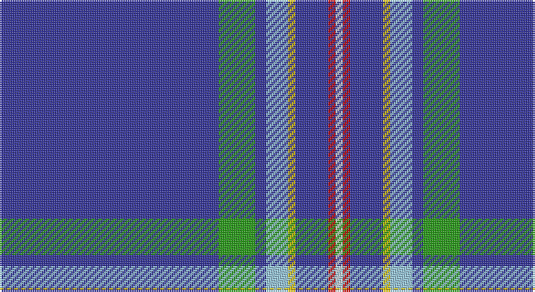

This page is one **sett** — a single exact thread-count. It belongs to the [tartan](/setts/db60g10db3lb6ly2db9r2w2/)
(the same proportion at any scale), whose colour order is pattern [BGBWYBRW](/stripes/bgbwybrw/).

Sourced from tartans-authority.  It is a [8 stripe tartan](/stripes/stripes8/).

Original link http://www.tartansauthority.com/tartan-ferret/display/8359/

## Register references

External register numbers recorded for this tartan.

- Scottish Register of Tartans: [8359](https://www.tartanregister.gov.uk/tartanDetails?ref=8359)
- Scottish Tartans Authority (ITI): 8359

## Thread count
B/120 G20 B6 LB12 Y4 B18 R4 LN/4

One full sett is **252 threads**.

## Palette

Palette: <strong>Tartan Register</strong> <small style="color:#888">(5 of 6 colours)</small>
<table><thead><tr><th>Colour</th><th>Threads</th><th>Shade</th><th>Base</th><th>OKLCh</th></tr></thead><tbody><tr><td>B/</td><td style="text-align:right;font-variant-numeric:tabular-nums">120</td><td><code style="background-color:#34349C;">#34349C</code> <small style="color:#888">#34349C</small></td><td>B <code style="background-color:#2A418A;">#2A418A</code></td><td><small style="color:#888">oklch(39.6% 0.164 275.9)</small></td></tr><tr><td>G</td><td style="text-align:right;font-variant-numeric:tabular-nums">20</td><td><code style="background-color:#289C18;">#289C18</code> <small style="color:#888">#289C18</small></td><td>G <code style="background-color:#006100;">#006100</code></td><td><small style="color:#888">oklch(60.6% 0.191 141.6)</small></td></tr><tr><td>B</td><td style="text-align:right;font-variant-numeric:tabular-nums">6</td><td><code style="background-color:#34349C;">#34349C</code> <small style="color:#888">#34349C</small></td><td>B <code style="background-color:#2A418A;">#2A418A</code></td><td><small style="color:#888">oklch(39.6% 0.164 275.9)</small></td></tr><tr><td>LB</td><td style="text-align:right;font-variant-numeric:tabular-nums">12</td><td><code style="background-color:#98C8E8;">#98C8E8</code> <small style="color:#888">#98C8E8</small></td><td>W <code style="background-color:#F7F7F7;">#F7F7F7</code></td><td><small style="color:#888">oklch(81.0% 0.068 237.9)</small></td></tr><tr><td>Y</td><td style="text-align:right;font-variant-numeric:tabular-nums">4</td><td><code style="background-color:#E8C000;">#E8C000</code> <small style="color:#888">#E8C000</small></td><td>Y <code style="background-color:#F2BF00;">#F2BF00</code></td><td><small style="color:#888">oklch(81.9% 0.168 93.7)</small></td></tr><tr><td>B</td><td style="text-align:right;font-variant-numeric:tabular-nums">18</td><td><code style="background-color:#34349C;">#34349C</code> <small style="color:#888">#34349C</small></td><td>B <code style="background-color:#2A418A;">#2A418A</code></td><td><small style="color:#888">oklch(39.6% 0.164 275.9)</small></td></tr><tr><td>R</td><td style="text-align:right;font-variant-numeric:tabular-nums">4</td><td><code style="background-color:#C80000;">#C80000</code> <small style="color:#888">#C80000</small></td><td>R <code style="background-color:#CC0000;">#CC0000</code></td><td><small style="color:#888">oklch(52.3% 0.215 29.2)</small></td></tr><tr><td>LN/</td><td style="text-align:right;font-variant-numeric:tabular-nums">4</td><td><code style="background-color:#E0E0E0;">#E0E0E0</code> <small style="color:#888">#E0E0E0</small></td><td>W <code style="background-color:#F7F7F7;">#F7F7F7</code></td><td><small style="color:#888">oklch(90.7% 0.000 89.9)</small></td></tr></tbody></table>

# Sample pattern

## Nearest tartans

The nearest existing variants by ΔTartan distance, with this tartan at the top so the swatches line up against it.

ΔTartan

Tartan

Sett

—

<a href="/ttd/edit/#slug=db60g10db3lb6ly2db9r2w2~x2">St. Petersburg City (District)</a> <a class="nn-out" href="/variants/s8/db60g10db3lb6ly2db9r2w2~x2/" title="open its dictionary page">↗</a>

1.23

<a href="/ttd/edit/#slug=db25lo1db6b1db6lb4t3w1~x4&amp;base=db60g10db3lb6ly2db9r2w2~x2">PSN Test</a> <a class="nn-out" href="/variants/s8/db25lo1db6b1db6lb4t3w1~x4/" title="open its dictionary page">↗</a>

1.27

<a href="/ttd/edit/#slug=db61w4db2w7p2g3ly2db16~x2&amp;base=db60g10db3lb6ly2db9r2w2~x2">Boat of Garten (District)</a> <a class="nn-out" href="/variants/s8/db61w4db2w7p2g3ly2db16~x2/" title="open its dictionary page">↗</a>

1.51

<a href="/variants/s8/b70db5b3wi5b3w5b3k5~x2/">Wyckoff, Ann Grainger Phillips Commemorative Tartan</a>

1.59

<a href="/ttd/edit/#slug=ly4db55o4k4db2ly2db2w5db3r2o2k2~x2&amp;base=db60g10db3lb6ly2db9r2w2~x2">London '88</a> <a class="nn-out" href="/variants/s12/ly4db55o4k4db2ly2db2w5db3r2o2k2~x2/" title="open its dictionary page">↗</a>

1.64

<a href="/ttd/edit/#slug=w3db3w1dt44o1dt2o1r4o1dt5lo2~x2&amp;base=db60g10db3lb6ly2db9r2w2~x2">Jewish (Kosher) (Corporate)</a> <a class="nn-out" href="/variants/s11/w3db3w1dt44o1dt2o1r4o1dt5lo2~x2/" title="open its dictionary page">↗</a>

1.67

<a href="/ttd/edit/#slug=n56db9w2db2r2n9lb4db2lb2ly3~x2&amp;base=db60g10db3lb6ly2db9r2w2~x2">Blue Toon</a> <a class="nn-out" href="/variants/s10/n56db9w2db2r2n9lb4db2lb2ly3~x2/" title="open its dictionary page">↗</a>

1.68

<a href="/ttd/edit/#slug=r5db58lb4t6ly4k4~x2&amp;base=db60g10db3lb6ly2db9r2w2~x2">Kendle (2013)</a> <a class="nn-out" href="/variants/s6/r5db58lb4t6ly4k4~x2/" title="open its dictionary page">↗</a>

1.69

<a href="/ttd/edit/#slug=r5db58lr4t6ly4k4~x2&amp;base=db60g10db3lb6ly2db9r2w2~x2">Kendle (2013)</a> <a class="nn-out" href="/variants/s6/r5db58lr4t6ly4k4~x2/" title="open its dictionary page">↗</a>

1.74

<a href="/ttd/edit/#slug=ly4db55y4k4db2ly2db2w5db3r2y2k2~x2&amp;base=db60g10db3lb6ly2db9r2w2~x2">London'88</a> <a class="nn-out" href="/variants/s12/ly4db55y4k4db2ly2db2w5db3r2y2k2~x2/" title="open its dictionary page">↗</a>

1.78

<a href="/ttd/edit/#slug=db35k10db4w2db3r2ly2~x2&amp;base=db60g10db3lb6ly2db9r2w2~x2">Laidlaw's Highland Drovers (Corp)</a> <a class="nn-out" href="/variants/s7/db35k10db4w2db3r2ly2~x2/" title="open its dictionary page">↗</a>

## Neighbour map

Every grey dot is one of 14360 variants placed by the first two principal components of the ΔTartan feature space (44% of its variance). Red is this tartan; blue dots are its nearest — click one to open its page.

<svg viewBox="0 0 640 380" role="img" style="max-width:100%;height:auto;border:1px solid #e0e0e0;border-radius:4px;display:block" xmlns="http://www.w3.org/2000/svg"><image href="/nn/cloud.v1.png" width="640" height="380"/><a href="/variants/s8/db25lo1db6b1db6lb4t3w1~x4/"><circle cx="498.7" cy="130.9" r="4" fill="#3465a4"><title>PSN Test</title></circle></a><a href="/variants/s8/db61w4db2w7p2g3ly2db16~x2/"><circle cx="533.5" cy="111.6" r="4" fill="#3465a4"><title>Boat of Garten (District)</title></circle></a><a href="/variants/s8/b70db5b3wi5b3w5b3k5~x2/"><circle cx="512.9" cy="109.3" r="4" fill="#3465a4"><title>Wyckoff, Ann Grainger Phillips Commemorative Tartan</title></circle></a><a href="/variants/s12/ly4db55o4k4db2ly2db2w5db3r2o2k2~x2/"><circle cx="428.7" cy="60.3" r="4" fill="#3465a4"><title>London '88</title></circle></a><a href="/variants/s11/w3db3w1dt44o1dt2o1r4o1dt5lo2~x2/"><circle cx="505.0" cy="64.6" r="4" fill="#3465a4"><title>Jewish (Kosher) (Corporate)</title></circle></a><a href="/variants/s10/n56db9w2db2r2n9lb4db2lb2ly3~x2/"><circle cx="454.3" cy="84.4" r="4" fill="#3465a4"><title>Blue Toon</title></circle></a><a href="/variants/s6/r5db58lb4t6ly4k4~x2/"><circle cx="419.4" cy="139.6" r="4" fill="#3465a4"><title>Kendle (2013)</title></circle></a><a href="/variants/s6/r5db58lr4t6ly4k4~x2/"><circle cx="419.8" cy="139.8" r="4" fill="#3465a4"><title>Kendle (2013)</title></circle></a><a href="/variants/s12/ly4db55y4k4db2ly2db2w5db3r2y2k2~x2/"><circle cx="424.4" cy="58.4" r="4" fill="#3465a4"><title>London'88</title></circle></a><a href="/variants/s7/db35k10db4w2db3r2ly2~x2/"><circle cx="452.2" cy="154.0" r="4" fill="#3465a4"><title>Laidlaw's Highland Drovers (Corp)</title></circle></a><circle cx="478.2" cy="97.5" r="5" fill="#c00000"/></svg>

ID: /variants/s8/db60g10db3lb6ly2db9r2w2~x2/
