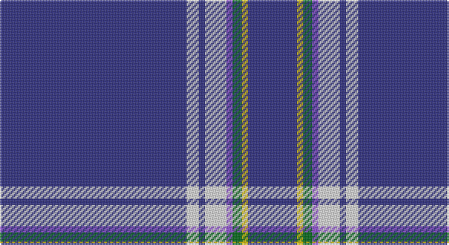

This page is one **sett** — a single exact thread-count. It belongs to the [tartan](/setts/db61w4db2w7p2g3ly2db16/)
(the same proportion at any scale), whose colour order is pattern [BWBWBGYB](/stripes/bwbwbgyb/).

Part of the [Boat of Garten](/tartans/boat-of-garten/) tartan — the named design grouping this sett with its other cloths.

Sourced from tartans-authority.  It is a [8 stripe tartan](/stripes/stripes8/).

Original link http://www.tartansauthority.com/tartan-ferret/display/7347/

## Register references

External register numbers recorded for this tartan.

- Scottish Tartans Authority (ITI): 7347

## Thread count
DB/122 LN8 DB4 LN14 P4 G6 Y4 DB/32

One full sett is **234 threads**.

## Palette

Palette: <strong>Tartan Register</strong> <small style="color:#888">(4 of 5 colours)</small>
<table><thead><tr><th>Colour</th><th>Threads</th><th>Shade</th><th>Base</th><th>OKLCh</th></tr></thead><tbody><tr><td>DB/</td><td style="text-align:right;font-variant-numeric:tabular-nums">122</td><td><code style="background-color:#2C2C80;">#2C2C80</code> <small style="color:#888">#2C2C80</small></td><td>B <code style="background-color:#2A418A;">#2A418A</code></td><td><small style="color:#888">oklch(35.0% 0.138 276.6)</small></td></tr><tr><td>LN</td><td style="text-align:right;font-variant-numeric:tabular-nums">8</td><td><code style="background-color:#E0E0E0;">#E0E0E0</code> <small style="color:#888">#E0E0E0</small></td><td>W <code style="background-color:#F7F7F7;">#F7F7F7</code></td><td><small style="color:#888">oklch(90.7% 0.000 89.9)</small></td></tr><tr><td>DB</td><td style="text-align:right;font-variant-numeric:tabular-nums">4</td><td><code style="background-color:#2C2C80;">#2C2C80</code> <small style="color:#888">#2C2C80</small></td><td>B <code style="background-color:#2A418A;">#2A418A</code></td><td><small style="color:#888">oklch(35.0% 0.138 276.6)</small></td></tr><tr><td>LN</td><td style="text-align:right;font-variant-numeric:tabular-nums">14</td><td><code style="background-color:#E0E0E0;">#E0E0E0</code> <small style="color:#888">#E0E0E0</small></td><td>W <code style="background-color:#F7F7F7;">#F7F7F7</code></td><td><small style="color:#888">oklch(90.7% 0.000 89.9)</small></td></tr><tr><td>P</td><td style="text-align:right;font-variant-numeric:tabular-nums">4</td><td><code style="background-color:#9050D8;">#9050D8</code> <small style="color:#888">#9050D8</small></td><td>B <code style="background-color:#2A418A;">#2A418A</code></td><td><small style="color:#888">oklch(57.3% 0.201 302.1)</small></td></tr><tr><td>G</td><td style="text-align:right;font-variant-numeric:tabular-nums">6</td><td><code style="background-color:#006818;">#006818</code> <small style="color:#888">#006818</small></td><td>G <code style="background-color:#006100;">#006100</code></td><td><small style="color:#888">oklch(45.0% 0.142 145.0)</small></td></tr><tr><td>Y</td><td style="text-align:right;font-variant-numeric:tabular-nums">4</td><td><code style="background-color:#E8C000;">#E8C000</code> <small style="color:#888">#E8C000</small></td><td>Y <code style="background-color:#F2BF00;">#F2BF00</code></td><td><small style="color:#888">oklch(81.9% 0.168 93.7)</small></td></tr><tr><td>DB/</td><td style="text-align:right;font-variant-numeric:tabular-nums">32</td><td><code style="background-color:#2C2C80;">#2C2C80</code> <small style="color:#888">#2C2C80</small></td><td>B <code style="background-color:#2A418A;">#2A418A</code></td><td><small style="color:#888">oklch(35.0% 0.138 276.6)</small></td></tr></tbody></table>

# Sample pattern

## Compared to the master

This cloth is one sett of its design; the master sett (the exemplar the design is anchored on) is below for comparison.

<figure style="margin:0"><figcaption style="color:#888;font-size:smaller">this sett</figcaption></figure>
<figure style="margin:0"><figcaption style="color:#888;font-size:smaller"><a href="/setts/db62w4k2w7dp2dg3ly2db16/">master sett →</a></figcaption></figure>

## Nearest tartans

The nearest existing variants by ΔTartan distance, with this tartan at the top so the swatches line up against it.

ΔTartan

Tartan

Sett

—

<a href="/ttd/edit/#slug=db61w4db2w7p2g3ly2db16~x2">Boat of Garten (District)</a> <a class="nn-out" href="/variants/s8/db61w4db2w7p2g3ly2db16~x2/" title="open its dictionary page">↗</a>

1.27

<a href="/ttd/edit/#slug=db60g10db3lb6ly2db9r2w2~x2&amp;base=db61w4db2w7p2g3ly2db16~x2">St. Petersburg City (District)</a> <a class="nn-out" href="/variants/s8/db60g10db3lb6ly2db9r2w2~x2/" title="open its dictionary page">↗</a>

1.33

<a href="/ttd/edit/#slug=b7db5w6db5r7db2b2db70w2&amp;base=db61w4db2w7p2g3ly2db16~x2">United States (Corporate)</a> <a class="nn-out" href="/variants/s9/b7db5w6db5r7db2b2db70w2/" title="open its dictionary page">↗</a>

1.35

<a href="/ttd/edit/#slug=db45ly3db10o4k1w2~x2&amp;base=db61w4db2w7p2g3ly2db16~x2">Wylie</a> <a class="nn-out" href="/variants/s6/db45ly3db10o4k1w2~x2/" title="open its dictionary page">↗</a>

1.43

<a href="/ttd/edit/#slug=db48w2db7w2db7w2db20t11r2~x2&amp;base=db61w4db2w7p2g3ly2db16~x2">RAAF #4</a> <a class="nn-out" href="/variants/s9/db48w2db7w2db7w2db20t11r2~x2/" title="open its dictionary page">↗</a>

1.43

<a href="/ttd/edit/#slug=db61r6w2r8lo2db3lo2db15~x2&amp;base=db61w4db2w7p2g3ly2db16~x2">Duke of York (Royal)</a> <a class="nn-out" href="/variants/s8/db61r6w2r8lo2db3lo2db15~x2/" title="open its dictionary page">↗</a>

1.49

<a href="/variants/s8/b70db5b3wi5b3w5b3k5~x2/">Wyckoff, Ann Grainger Phillips Commemorative Tartan</a>

1.50

<a href="/ttd/edit/#slug=r5w4k4db80w4~x2&amp;base=db61w4db2w7p2g3ly2db16~x2">Volunteer Lifesaving Corps (Corp.)</a> <a class="nn-out" href="/variants/s5/r5w4k4db80w4~x2/" title="open its dictionary page">↗</a>

1.53

<a href="/ttd/edit/#slug=db66w2db10w2db10w2db12r3t24~x2&amp;base=db61w4db2w7p2g3ly2db16~x2">RAAF</a> <a class="nn-out" href="/variants/s9/db66w2db10w2db10w2db12r3t24~x2/" title="open its dictionary page">↗</a>

1.59

<a href="/ttd/edit/#slug=db122r11w4r15ly4db6ly4db30&amp;base=db61w4db2w7p2g3ly2db16~x2">Inverness, Duke of York</a> <a class="nn-out" href="/variants/s8/db122r11w4r15ly4db6ly4db30/" title="open its dictionary page">↗</a>

1.60

<a href="/ttd/edit/#slug=db6w4db3w6db8lo3db52lo3db8r4&amp;base=db61w4db2w7p2g3ly2db16~x2">Dundee F.C. Corporate Tartan</a> <a class="nn-out" href="/variants/s10/db6w4db3w6db8lo3db52lo3db8r4/" title="open its dictionary page">↗</a>

## Neighbour map

Every grey dot is one of 14360 variants placed by the first two principal components of the ΔTartan feature space (44% of its variance). Red is this tartan; blue dots are its nearest — click one to open its page.

<svg viewBox="0 0 640 380" role="img" style="max-width:100%;height:auto;border:1px solid #e0e0e0;border-radius:4px;display:block" xmlns="http://www.w3.org/2000/svg"><image href="/nn/cloud.v1.png" width="640" height="380"/><a href="/variants/s8/db60g10db3lb6ly2db9r2w2~x2/"><circle cx="478.2" cy="97.5" r="4" fill="#3465a4"><title>St. Petersburg City (District)</title></circle></a><a href="/variants/s9/b7db5w6db5r7db2b2db70w2/"><circle cx="524.5" cy="107.9" r="4" fill="#3465a4"><title>United States (Corporate)</title></circle></a><a href="/variants/s6/db45ly3db10o4k1w2~x2/"><circle cx="592.3" cy="123.9" r="4" fill="#3465a4"><title>Wylie</title></circle></a><a href="/variants/s9/db48w2db7w2db7w2db20t11r2~x2/"><circle cx="548.7" cy="158.2" r="4" fill="#3465a4"><title>RAAF #4</title></circle></a><a href="/variants/s8/db61r6w2r8lo2db3lo2db15~x2/"><circle cx="550.3" cy="141.9" r="4" fill="#3465a4"><title>Duke of York (Royal)</title></circle></a><a href="/variants/s8/b70db5b3wi5b3w5b3k5~x2/"><circle cx="512.9" cy="109.3" r="4" fill="#3465a4"><title>Wyckoff, Ann Grainger Phillips Commemorative Tartan</title></circle></a><a href="/variants/s5/r5w4k4db80w4~x2/"><circle cx="560.8" cy="163.3" r="4" fill="#3465a4"><title>Volunteer Lifesaving Corps (Corp.)</title></circle></a><a href="/variants/s9/db66w2db10w2db10w2db12r3t24~x2/"><circle cx="494.1" cy="134.1" r="4" fill="#3465a4"><title>RAAF</title></circle></a><a href="/variants/s8/db122r11w4r15ly4db6ly4db30/"><circle cx="575.0" cy="137.8" r="4" fill="#3465a4"><title>Inverness, Duke of York</title></circle></a><a href="/variants/s10/db6w4db3w6db8lo3db52lo3db8r4/"><circle cx="496.3" cy="136.4" r="4" fill="#3465a4"><title>Dundee F.C. Corporate Tartan</title></circle></a><circle cx="533.5" cy="111.6" r="5" fill="#c00000"/></svg>

ID: /variants/s8/db61w4db2w7p2g3ly2db16~x2/
