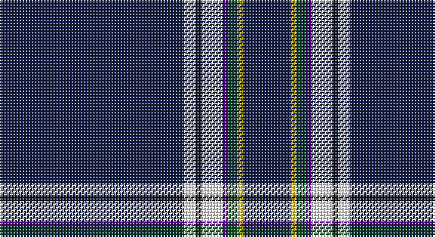

This page is one **sett** — a single exact thread-count. It belongs to the [tartan](/setts/db62w4k2w7dp2dg3ly2db16/)
(the same proportion at any scale), whose colour order is pattern [BWKWBGYB](/stripes/bwkwbgyb/).

Part of the [Boat of Garten](/tartans/boat-of-garten/) tartan — the named design grouping this sett with its other cloths.

Sourced from register-of-tartans.  It is a [8 stripe tartan](/stripes/stripes8/).

Original link https://www.tartanregister.gov.uk/tartanDetails.aspx?ref=5843

## Register references

External register numbers recorded for this tartan.

- Scottish Register of Tartans: [5843](https://www.tartanregister.gov.uk/tartanDetails.aspx?ref=5843)
- Scottish Tartans Authority (ITI): 7347
- Scottish Tartans World Register: 3186

## Thread count
DB/124 W8 K4 W14 P4 G6 Y4 DB/32

One full sett is **236 threads**.

## Palette

Palette: <strong>Tartan Register</strong>
<table><thead><tr><th>Colour</th><th>Threads</th><th>Shade</th><th>Base</th><th>OKLCh</th></tr></thead><tbody><tr><td>DB/</td><td style="text-align:right;font-variant-numeric:tabular-nums">124</td><td><code style="background-color:#141E46;">#141E46</code> <small style="color:#888">#141E46</small></td><td>B <code style="background-color:#2A418A;">#2A418A</code></td><td><small style="color:#888">oklch(25.2% 0.076 269.7)</small></td></tr><tr><td>W</td><td style="text-align:right;font-variant-numeric:tabular-nums">8</td><td><code style="background-color:#FFFFFF;">#FFFFFF</code> <small style="color:#888">#FFFFFF</small></td><td>W <code style="background-color:#F7F7F7;">#F7F7F7</code></td><td><small style="color:#888">oklch(100.0% 0.000 89.9)</small></td></tr><tr><td>K</td><td style="text-align:right;font-variant-numeric:tabular-nums">4</td><td><code style="background-color:#101010;">#101010</code> <small style="color:#888">#101010</small></td><td>K <code style="background-color:#000000;">#000000</code></td><td><small style="color:#888">oklch(17.3% 0.000 89.9)</small></td></tr><tr><td>W</td><td style="text-align:right;font-variant-numeric:tabular-nums">14</td><td><code style="background-color:#FFFFFF;">#FFFFFF</code> <small style="color:#888">#FFFFFF</small></td><td>W <code style="background-color:#F7F7F7;">#F7F7F7</code></td><td><small style="color:#888">oklch(100.0% 0.000 89.9)</small></td></tr><tr><td>P</td><td style="text-align:right;font-variant-numeric:tabular-nums">4</td><td><code style="background-color:#5A008C;">#5A008C</code> <small style="color:#888">#5A008C</small></td><td>B <code style="background-color:#2A418A;">#2A418A</code></td><td><small style="color:#888">oklch(37.0% 0.191 306.3)</small></td></tr><tr><td>G</td><td style="text-align:right;font-variant-numeric:tabular-nums">6</td><td><code style="background-color:#005020;">#005020</code> <small style="color:#888">#005020</small></td><td>G <code style="background-color:#006100;">#006100</code></td><td><small style="color:#888">oklch(37.7% 0.105 149.6)</small></td></tr><tr><td>Y</td><td style="text-align:right;font-variant-numeric:tabular-nums">4</td><td><code style="background-color:#E8C000;">#E8C000</code> <small style="color:#888">#E8C000</small></td><td>Y <code style="background-color:#F2BF00;">#F2BF00</code></td><td><small style="color:#888">oklch(81.9% 0.168 93.7)</small></td></tr><tr><td>DB/</td><td style="text-align:right;font-variant-numeric:tabular-nums">32</td><td><code style="background-color:#141E46;">#141E46</code> <small style="color:#888">#141E46</small></td><td>B <code style="background-color:#2A418A;">#2A418A</code></td><td><small style="color:#888">oklch(25.2% 0.076 269.7)</small></td></tr></tbody></table>

# Sample pattern

## Nearest tartans

The nearest existing variants by ΔTartan distance, with this tartan at the top so the swatches line up against it.

ΔTartan

Tartan

Sett

—

<a href="/ttd/edit/#slug=db62w4k2w7dp2dg3ly2db16~x2">Boat of Garten</a> <a class="nn-out" href="/variants/s8/db62w4k2w7dp2dg3ly2db16~x2/" title="open its dictionary page">↗</a>

1.46

<a href="/ttd/edit/#slug=db60w1ly4k4w1lp8w2~x2&amp;base=db62w4k2w7dp2dg3ly2db16~x2">Nunavut Territory (District)</a> <a class="nn-out" href="/variants/s7/db60w1ly4k4w1lp8w2~x2/" title="open its dictionary page">↗</a>

1.64

<a href="/ttd/edit/#slug=w12db79lo6db53lb4db22lp10db24g8&amp;base=db62w4k2w7dp2dg3ly2db16~x2">Centrica Energy (Corporate)</a> <a class="nn-out" href="/variants/s9/w12db79lo6db53lb4db22lp10db24g8/" title="open its dictionary page">↗</a>

1.69

<a href="/ttd/edit/#slug=db61w4db2w7p2g3ly2db16~x2&amp;base=db62w4k2w7dp2dg3ly2db16~x2">Boat of Garten (District)</a> <a class="nn-out" href="/variants/s8/db61w4db2w7p2g3ly2db16~x2/" title="open its dictionary page">↗</a>

1.71

<a href="/ttd/edit/#slug=db73g16db10r8db10k4db10w2&amp;base=db62w4k2w7dp2dg3ly2db16~x2">Scotch Whisky, Heritage</a> <a class="nn-out" href="/variants/s8/db73g16db10r8db10k4db10w2/" title="open its dictionary page">↗</a>

1.75

<a href="/ttd/edit/#slug=w3dt9ly1lb3dp9lb1dt40dp2~x2&amp;base=db62w4k2w7dp2dg3ly2db16~x2">Parkin</a> <a class="nn-out" href="/variants/s8/w3dt9ly1lb3dp9lb1dt40dp2~x2/" title="open its dictionary page">↗</a>

1.77

<a href="/ttd/edit/#slug=db60w1db6g10r1g7k2lo2w2~x2&amp;base=db62w4k2w7dp2dg3ly2db16~x2">Mohammed, Abu Hassan (Personal)</a> <a class="nn-out" href="/variants/s9/db60w1db6g10r1g7k2lo2w2~x2/" title="open its dictionary page">↗</a>

1.80

<a href="/ttd/edit/#slug=db60g10db3lb6ly2db9r2w2~x2&amp;base=db62w4k2w7dp2dg3ly2db16~x2">St. Petersburg City (District)</a> <a class="nn-out" href="/variants/s8/db60g10db3lb6ly2db9r2w2~x2/" title="open its dictionary page">↗</a>

1.81

<a href="/ttd/edit/#slug=k20db2k2db4dg4ly2k40r2w3~x2&amp;base=db62w4k2w7dp2dg3ly2db16~x2">McCuaig (Glenelg and the Western Isles) Hunting</a> <a class="nn-out" href="/variants/s9/k20db2k2db4dg4ly2k40r2w3~x2/" title="open its dictionary page">↗</a>

1.82

<a href="/ttd/edit/#slug=w3db3w1dt44o1dt2o1r4o1dt5lo2~x2&amp;base=db62w4k2w7dp2dg3ly2db16~x2">Jewish (Kosher) (Corporate)</a> <a class="nn-out" href="/variants/s11/w3db3w1dt44o1dt2o1r4o1dt5lo2~x2/" title="open its dictionary page">↗</a>

1.84

<a href="/ttd/edit/#slug=r2db8ly1db16w1g12db27w1db1w1~x2&amp;base=db62w4k2w7dp2dg3ly2db16~x2">World Youth Congress (Corporate)</a> <a class="nn-out" href="/variants/s10/r2db8ly1db16w1g12db27w1db1w1~x2/" title="open its dictionary page">↗</a>

## Neighbour map

Every grey dot is one of 14360 variants placed by the first two principal components of the ΔTartan feature space (44% of its variance). Red is this tartan; blue dots are its nearest — click one to open its page.

<svg viewBox="0 0 640 380" role="img" style="max-width:100%;height:auto;border:1px solid #e0e0e0;border-radius:4px;display:block" xmlns="http://www.w3.org/2000/svg"><image href="/nn/cloud.v1.png" width="640" height="380"/><a href="/variants/s7/db60w1ly4k4w1lp8w2~x2/"><circle cx="496.5" cy="86.1" r="4" fill="#3465a4"><title>Nunavut Territory (District)</title></circle></a><a href="/variants/s9/w12db79lo6db53lb4db22lp10db24g8/"><circle cx="465.7" cy="140.0" r="4" fill="#3465a4"><title>Centrica Energy (Corporate)</title></circle></a><a href="/variants/s8/db61w4db2w7p2g3ly2db16~x2/"><circle cx="533.5" cy="111.6" r="4" fill="#3465a4"><title>Boat of Garten (District)</title></circle></a><a href="/variants/s8/db73g16db10r8db10k4db10w2/"><circle cx="503.2" cy="132.5" r="4" fill="#3465a4"><title>Scotch Whisky, Heritage</title></circle></a><a href="/variants/s8/w3dt9ly1lb3dp9lb1dt40dp2~x2/"><circle cx="473.4" cy="109.7" r="4" fill="#3465a4"><title>Parkin</title></circle></a><a href="/variants/s9/db60w1db6g10r1g7k2lo2w2~x2/"><circle cx="487.5" cy="77.3" r="4" fill="#3465a4"><title>Mohammed, Abu Hassan (Personal)</title></circle></a><a href="/variants/s8/db60g10db3lb6ly2db9r2w2~x2/"><circle cx="478.2" cy="97.5" r="4" fill="#3465a4"><title>St. Petersburg City (District)</title></circle></a><a href="/variants/s9/k20db2k2db4dg4ly2k40r2w3~x2/"><circle cx="474.3" cy="122.7" r="4" fill="#3465a4"><title>McCuaig (Glenelg and the Western Isles) Hunting</title></circle></a><a href="/variants/s11/w3db3w1dt44o1dt2o1r4o1dt5lo2~x2/"><circle cx="505.0" cy="64.6" r="4" fill="#3465a4"><title>Jewish (Kosher) (Corporate)</title></circle></a><a href="/variants/s10/r2db8ly1db16w1g12db27w1db1w1~x2/"><circle cx="465.8" cy="133.9" r="4" fill="#3465a4"><title>World Youth Congress (Corporate)</title></circle></a><circle cx="485.1" cy="90.8" r="5" fill="#c00000"/></svg>

ID: /variants/s8/db62w4k2w7dp2dg3ly2db16~x2/
