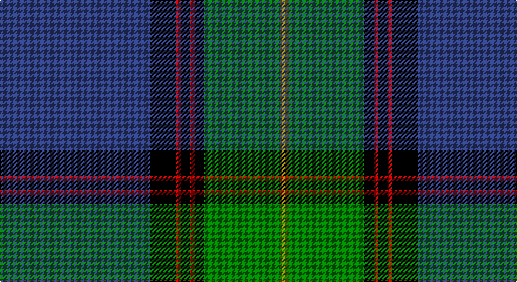

This page is one **sett** — a single exact thread-count. It belongs to the [tartan](/setts/db64k11r2k4r2k4g32y4/)
(the same proportion at any scale), whose colour order is pattern [BKRKRKGG](/stripes/bkrkrkgg/).

Part of the [Sinclair-Brown](/tartans/sinclair-brown/) tartan — the named design grouping this sett with its other cloths.

Sourced from weddslist.  It is a [8 stripe tartan](/stripes/stripes8/).

Original link http://www.weddslist.com/cgi-bin/tartans/pg.pl?source=sts

## Thread count
B/128 K22 R4 K8 R4 K8 G64 LG/8

One full sett is **356 threads**.

## Palette

Palette: <strong>Ingles Buchan</strong> <small style="color:#888">(1 of 5 colours)</small>
<table><thead><tr><th>Colour</th><th>Threads</th><th>Shade</th><th>Base</th><th>OKLCh</th></tr></thead><tbody><tr><td>B/</td><td style="text-align:right;font-variant-numeric:tabular-nums">128</td><td><code style="background-color:#304080;">#304080</code> <small style="color:#888">#304080</small></td><td>B <code style="background-color:#2A418A;">#2A418A</code></td><td><small style="color:#888">oklch(39.4% 0.109 270.2)</small></td></tr><tr><td>K</td><td style="text-align:right;font-variant-numeric:tabular-nums">22</td><td><code style="background-color:#000000;">#000000</code> <small style="color:#888">#000000</small></td><td>K <code style="background-color:#000000;">#000000</code></td><td><small style="color:#888">oklch(0.0% 0.000 0.0)</small></td></tr><tr><td>R</td><td style="text-align:right;font-variant-numeric:tabular-nums">4</td><td><code style="background-color:#C00000;">#C00000</code> <small style="color:#888">#C00000</small></td><td>R <code style="background-color:#CC0000;">#CC0000</code></td><td><small style="color:#888">oklch(50.7% 0.208 29.2)</small></td></tr><tr><td>K</td><td style="text-align:right;font-variant-numeric:tabular-nums">8</td><td><code style="background-color:#000000;">#000000</code> <small style="color:#888">#000000</small></td><td>K <code style="background-color:#000000;">#000000</code></td><td><small style="color:#888">oklch(0.0% 0.000 0.0)</small></td></tr><tr><td>R</td><td style="text-align:right;font-variant-numeric:tabular-nums">4</td><td><code style="background-color:#C00000;">#C00000</code> <small style="color:#888">#C00000</small></td><td>R <code style="background-color:#CC0000;">#CC0000</code></td><td><small style="color:#888">oklch(50.7% 0.208 29.2)</small></td></tr><tr><td>K</td><td style="text-align:right;font-variant-numeric:tabular-nums">8</td><td><code style="background-color:#000000;">#000000</code> <small style="color:#888">#000000</small></td><td>K <code style="background-color:#000000;">#000000</code></td><td><small style="color:#888">oklch(0.0% 0.000 0.0)</small></td></tr><tr><td>G</td><td style="text-align:right;font-variant-numeric:tabular-nums">64</td><td><code style="background-color:#008000;">#008000</code> <small style="color:#888">#008000</small></td><td>G <code style="background-color:#006100;">#006100</code></td><td><small style="color:#888">oklch(52.0% 0.177 142.5)</small></td></tr><tr><td>LG/</td><td style="text-align:right;font-variant-numeric:tabular-nums">8</td><td><code style="background-color:#908000;">#908000</code> <small style="color:#888">#908000</small></td><td>G <code style="background-color:#006100;">#006100</code></td><td><small style="color:#888">oklch(59.6% 0.124 100.6)</small></td></tr></tbody></table>

# Sample pattern

## Compared to the master

This cloth is one sett of its design; the master sett (the exemplar the design is anchored on) is below for comparison.

<figure style="margin:0"><figcaption style="color:#888;font-size:smaller">this sett</figcaption></figure>
<figure style="margin:0"><figcaption style="color:#888;font-size:smaller"><a href="/setts/db64k11r2k4r2k4g32lo4/">master sett →</a></figcaption></figure>

## Nearest tartans

The nearest existing variants by ΔTartan distance, with this tartan at the top so the swatches line up against it.

ΔTartan

Tartan

Sett

—

<a href="/ttd/edit/#slug=db64k11r2k4r2k4g32y4~x2">Sinclair-Brown</a> <a class="nn-out" href="/variants/s8/db64k11r2k4r2k4g32y4~x2/" title="open its dictionary page">↗</a>

0.75

<a href="/ttd/edit/#slug=w3dt1k14dt2k1g6k1dt30lo3~x2&amp;base=db64k11r2k4r2k4g32y4~x2">Bro-Kerne</a> <a class="nn-out" href="/variants/s9/w3dt1k14dt2k1g6k1dt30lo3~x2/" title="open its dictionary page">↗</a>

0.86

<a href="/ttd/edit/#slug=r4k2w6k2b40k80g10w6r3&amp;base=db64k11r2k4r2k4g32y4~x2">Italian American (Corporate)</a> <a class="nn-out" href="/variants/s9/r4k2w6k2b40k80g10w6r3/" title="open its dictionary page">↗</a>

0.96

<a href="/ttd/edit/#slug=db36k10g3r3g6k1ly2~x2&amp;base=db64k11r2k4r2k4g32y4~x2">MacLaurin, of Brioch</a> <a class="nn-out" href="/variants/s7/db36k10g3r3g6k1ly2~x2/" title="open its dictionary page">↗</a>

1.00

<a href="/ttd/edit/#slug=w10db2w1db35dg10lo3dg10r4~x2&amp;base=db64k11r2k4r2k4g32y4~x2">Sandelin #2 (Personal)</a> <a class="nn-out" href="/variants/s8/w10db2w1db35dg10lo3dg10r4~x2/" title="open its dictionary page">↗</a>

1.01

<a href="/ttd/edit/#slug=r4k2w6k2db40k80dg10w6r3&amp;base=db64k11r2k4r2k4g32y4~x2">Italian American</a> <a class="nn-out" href="/variants/s9/r4k2w6k2db40k80dg10w6r3/" title="open its dictionary page">↗</a>

1.03

<a href="/ttd/edit/#slug=w2db40g22ly3g2r3g2w2~x2&amp;base=db64k11r2k4r2k4g32y4~x2">Tartan Day SA (Corporate)</a> <a class="nn-out" href="/variants/s8/w2db40g22ly3g2r3g2w2~x2/" title="open its dictionary page">↗</a>

1.12

<a href="/ttd/edit/#slug=ly3db1k2g26db28w1db1r2~x2&amp;base=db64k11r2k4r2k4g32y4~x2">Johnston, Diana Hunting (Personal)</a> <a class="nn-out" href="/variants/s8/ly3db1k2g26db28w1db1r2~x2/" title="open its dictionary page">↗</a>

1.14

<a href="/ttd/edit/#slug=w2k40dg22lo3dg2r3dg2w2~x2&amp;base=db64k11r2k4r2k4g32y4~x2">Tartan Day SA</a> <a class="nn-out" href="/variants/s8/w2k40dg22lo3dg2r3dg2w2~x2/" title="open its dictionary page">↗</a>

1.14

<a href="/ttd/edit/#slug=b10k6g42k2g1k2r1k24r2~x2&amp;base=db64k11r2k4r2k4g32y4~x2">Black Thistle</a> <a class="nn-out" href="/variants/s9/b10k6g42k2g1k2r1k24r2~x2/" title="open its dictionary page">↗</a>

1.15

<a href="/ttd/edit/#slug=lo8k50o15dg6o6db3o6lo2~x2&amp;base=db64k11r2k4r2k4g32y4~x2">Royal College of G.P.s (Corporate)</a> <a class="nn-out" href="/variants/s8/lo8k50o15dg6o6db3o6lo2~x2/" title="open its dictionary page">↗</a>

## Neighbour map

Every grey dot is one of 14360 variants placed by the first two principal components of the ΔTartan feature space (44% of its variance). Red is this tartan; blue dots are its nearest — click one to open its page.

<svg viewBox="0 0 640 380" role="img" style="max-width:100%;height:auto;border:1px solid #e0e0e0;border-radius:4px;display:block" xmlns="http://www.w3.org/2000/svg"><image href="/nn/cloud.v1.png" width="640" height="380"/><a href="/variants/s9/w3dt1k14dt2k1g6k1dt30lo3~x2/"><circle cx="332.4" cy="116.8" r="4" fill="#3465a4"><title>Bro-Kerne</title></circle></a><a href="/variants/s9/r4k2w6k2b40k80g10w6r3/"><circle cx="328.1" cy="89.0" r="4" fill="#3465a4"><title>Italian American (Corporate)</title></circle></a><a href="/variants/s7/db36k10g3r3g6k1ly2~x2/"><circle cx="352.6" cy="116.1" r="4" fill="#3465a4"><title>MacLaurin, of Brioch</title></circle></a><a href="/variants/s8/w10db2w1db35dg10lo3dg10r4~x2/"><circle cx="271.2" cy="114.3" r="4" fill="#3465a4"><title>Sandelin #2 (Personal)</title></circle></a><a href="/variants/s9/r4k2w6k2db40k80dg10w6r3/"><circle cx="341.0" cy="97.3" r="4" fill="#3465a4"><title>Italian American</title></circle></a><a href="/variants/s8/w2db40g22ly3g2r3g2w2~x2/"><circle cx="303.2" cy="125.3" r="4" fill="#3465a4"><title>Tartan Day SA (Corporate)</title></circle></a><a href="/variants/s8/ly3db1k2g26db28w1db1r2~x2/"><circle cx="293.0" cy="107.2" r="4" fill="#3465a4"><title>Johnston, Diana Hunting (Personal)</title></circle></a><a href="/variants/s8/w2k40dg22lo3dg2r3dg2w2~x2/"><circle cx="302.2" cy="128.9" r="4" fill="#3465a4"><title>Tartan Day SA</title></circle></a><a href="/variants/s9/b10k6g42k2g1k2r1k24r2~x2/"><circle cx="336.0" cy="119.1" r="4" fill="#3465a4"><title>Black Thistle</title></circle></a><a href="/variants/s8/lo8k50o15dg6o6db3o6lo2~x2/"><circle cx="296.7" cy="121.8" r="4" fill="#3465a4"><title>Royal College of G.P.s (Corporate)</title></circle></a><circle cx="312.4" cy="116.1" r="5" fill="#c00000"/></svg>

ID: /variants/s8/db64k11r2k4r2k4g32y4~x2/
