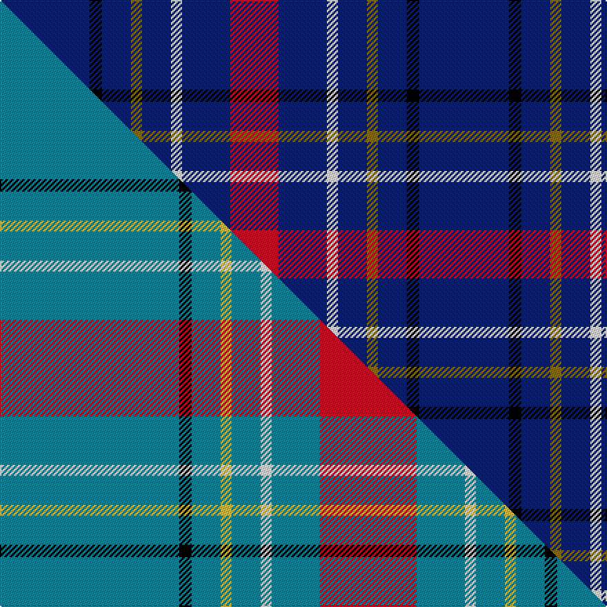

This is one **variant** — a specific cloth: this exact thread count and colourway, with its own
provenance below. It is one weaving of the [sett](/tartans/m/ma/maud-mary/) (the scale-free proportion — the
same cloth at any scale or shade), whose colour order is pattern [BKBGBWBR](/stripes/bkbgbwbr/).

Part of the [Maud, Mary](/tartans/m/ma/maud-mary/) tartan — the named design grouping this sett with its other cloths.

Sourced from house-of-tartan.  It is a [8 stripe tartan](/stripes/stripes8/).

Original link [http://www.house-of-tartan.scotland.net/house/TartanViewjs.asp?colr=Def&tnam=268](http://www.house-of-tartan.scotland.net/house/TartanViewjs.asp?colr=Def&tnam=268)

## Provenance

Earliest known date: pre 1892 Dublin

2 attestations — the source records this cloth was collapsed from (oldest owns this page)

<ul>
<li>pre 1892 — Maud Mary Irish Family Tartan (house-of-tartan, <a href="http://www.house-of-tartan.scotland.net/house/TartanViewjs.asp?colr=Def&tnam=268">record</a>) </li>
<li>undated — Maud, Mary (weddslist, <a href="http://www.weddslist.com/cgi-bin/tartans/pg.pl?source=sts">record</a>) </li>
</ul>

Dataset <small>— provenance for this record, inherited from the source manifest</small>

<dl class="dataset-prov">
<dt>source</dt><dd><a href="/sources/house-of-tartan/">House of Tartan</a></dd>
<dt>data captured from</dt><dd><a href="https://github.com/thetartan/tartan-database/blob/master/data/house-of-tartan/data.csv">https://github.com/thetartan/tartan-database/blob/master/data/house-of-tartan/data.csv</a></dd>
<dt>data date</dt><dd>pre 1892 <small>(this record)</small></dd>
<dt>licence</dt><dd><a href="https://creativecommons.org/licenses/by-nc-nd/4.0/">CC BY-NC-ND 4.0</a></dd>
</dl>

Capture chain <small>— the hands this data passed through, oldest first; each capture carries its own licence</small>

<ol class="capture-chain">
<li><a href="http://www.house-of-tartan.scotland.net/">House of Tartan</a> <small>the weaver/retailer's database — the site is now offline; the URL is kept as the ultimate source's identity</small></li>
<li><a href="https://github.com/thetartan/tartan-database">thetartan/tartan-database</a> <small>2016-2017</small> · <a href="https://creativecommons.org/licenses/by-nc-nd/4.0/">CC BY-NC-ND 4.0</a> <small>Levko Kravets's frozen compilation — the capture we vendored, and where its CC licence text came from</small></li>
<li>this dictionary <small>captured 2026-06-10 · commit 5bf86c7566</small> <small>each re-capture is a git commit to data/sources</small></li>
</ol>

## Thread count
DB/65 K9 DB21 Y8 DB21 W8 DB35 R/35

One full sett is **304 threads**.

## Palette
<table><thead><tr><th>Colour</th><th>Shade</th><th>OKLCh</th></tr></thead><tbody><tr><td>DB</td><td><code style="background-color:#082077;">#082077</code> <small style="color:#888">#082077</small></td><td><small style="color:#888">oklch(30.0% 0.149 265.1)</small></td></tr><tr><td>K</td><td><code style="background-color:#000000;">#000000</code> <small style="color:#888">#000000</small></td><td><small style="color:#888">oklch(0.0% 0.000 0.0)</small></td></tr><tr><td>W</td><td><code style="background-color:#F7F7F7;">#F7F7F7</code> <small style="color:#888">#F7F7F7</small></td><td><small style="color:#888">oklch(97.6% 0.000 89.9)</small></td></tr><tr><td>R</td><td><code style="background-color:#D60020;">#D60020</code> <small style="color:#888">#D60020</small></td><td><small style="color:#888">oklch(55.2% 0.224 25.5)</small></td></tr><tr><td>Y</td><td><code style="background-color:#8B6E00;">#8B6E00</code> <small style="color:#888">#8B6E00</small></td><td><small style="color:#888">oklch(55.1% 0.113 90.4)</small></td></tr></tbody></table>

# Sample pattern

## Compared to the master

This cloth is one sett of its design; the master sett (the exemplar the design is anchored on) is below for comparison.

Its **ΔTartan distance** from the master is **0.64** — the same measure the nearest-tartans table ranks by (0 is identical; a re-scale of the same cloth is near 0, a recolour or a different proportion further).

<figure class="master-compare" style="margin:0">

this sett
master sett ★

<figcaption style="color:#888;font-size:smaller">One weave of this sett against the <a href="/setts/t130k9t21ly8t21w8t35r70/">master sett ★</a>, split on the diagonal: a shared proportion runs seamlessly across it with only the shades shifting; a different proportion breaks on it.</figcaption>
</figure>

## Nearest tartan variants

The nearest existing variants by ΔTartan distance, with this cloth at the top so the swatches line up against it.

ΔTartan

Threads

Variant

Sett

—

304

<a href="/variants/s8/db65k9db21y8db21w8db35r35/">Maud Mary Irish Family Tartan</a>

<a href="/ttd/edit/#slug=r5db20r3db20w6db3lb2db1~x2&amp;base=db65k9db21y8db21w8db35r35" title="compare in the TTD">1.23</a>

228

<a href="/variants/s8/r5db20r3db20w6db3lb2db1~x2/">Masai Shuka 29 (Artefact)</a>

<a href="/ttd/edit/#slug=r3db21r3db3k13db13lb3db3w2~x2&amp;base=db65k9db21y8db21w8db35r35" title="compare in the TTD">1.49</a>

246

<a href="/variants/s9/r3db21r3db3k13db13lb3db3w2~x2/">Fitzgerald Blue Irish Family Tartan</a>

<a href="/ttd/edit/#slug=r3t22r3t3k14t14lb3t3w2~x2&amp;base=db65k9db21y8db21w8db35r35" title="compare in the TTD">1.50</a>

258

<a href="/variants/s9/r3t22r3t3k14t14lb3t3w2~x2/">Fitzgerald (Family)</a>

<a href="/ttd/edit/#slug=db18r1db1r1db1k7db13w2~x4&amp;base=db65k9db21y8db21w8db35r35" title="compare in the TTD">1.59</a>

272

<a href="/variants/s8/db18r1db1r1db1k7db13w2~x4/">Tokyo Bluebells</a>

<a href="/ttd/edit/#slug=db14o3db14dy6db14w4db14y3~x2&amp;base=db65k9db21y8db21w8db35r35" title="compare in the TTD">1.90</a>

254

<a href="/variants/s8/db14o3db14dy6db14w4db14y3~x2/">Columba of Iona (School)</a>

<a href="/ttd/edit/#slug=r5db15g3db15y3db3~x2&amp;base=db65k9db21y8db21w8db35r35" title="compare in the TTD">2.29</a>

160

<a href="/variants/s6/r5db15g3db15y3db3~x2/">Abertay University (Estimated threadcount)</a>

<a href="/ttd/edit/#slug=db30r3db3y3db3g30db36w5~x2&amp;base=db65k9db21y8db21w8db35r35" title="compare in the TTD">2.35</a>

382

<a href="/variants/s8/db30r3db3y3db3g30db36w5~x2/">De Nardi Hunting (Personal)</a>

<a href="/ttd/edit/#slug=db7w2db28k7db3ly2db2g2db13r2~x2&amp;base=db65k9db21y8db21w8db35r35" title="compare in the TTD">2.43</a>

254

<a href="/variants/s10/db7w2db28k7db3ly2db2g2db13r2~x2/">Pride of the Highlands (Fashion)</a>

<a href="/ttd/edit/#slug=y1db2w1db15k4y1db1y1db5w1~x4&amp;base=db65k9db21y8db21w8db35r35" title="compare in the TTD">2.44</a>

248

<a href="/variants/s10/y1db2w1db15k4y1db1y1db5w1~x4/">SPA Association (Corporate)</a>

<a href="/ttd/edit/#slug=r10db4r6db30k10db5w2~x2&amp;base=db65k9db21y8db21w8db35r35" title="compare in the TTD">2.49</a>

244

<a href="/variants/s7/r10db4r6db30k10db5w2~x2/">Heritage of Wales (Fashion)</a>

## Neighbour map

Every grey dot is one of 13656 variants placed by the first two principal components of the ΔTartan feature space (42% of its variance). Red is this tartan; blue dots are its nearest — click one to open its page. The map is a flat projection of a many-dimensional space — [how to read it](/posts/neighbourhood-maps/).

<svg viewBox="0 0 640 380" role="img" style="max-width:100%;height:auto;border:1px solid #e0e0e0;border-radius:4px;display:block" xmlns="http://www.w3.org/2000/svg"><image href="/nn/cloud.v1.png" width="640" height="380"/><a href="/variants/s8/r5db20r3db20w6db3lb2db1~x2/"><circle cx="416.9" cy="153.0" r="4" fill="#3465a4"><title>Masai Shuka 29 (Artefact)</title></circle></a><a href="/variants/s9/r3db21r3db3k13db13lb3db3w2~x2/"><circle cx="280.2" cy="153.9" r="4" fill="#3465a4"><title>Fitzgerald Blue Irish Family Tartan</title></circle></a><a href="/variants/s9/r3t22r3t3k14t14lb3t3w2~x2/"><circle cx="269.6" cy="152.6" r="4" fill="#3465a4"><title>Fitzgerald (Family)</title></circle></a><a href="/variants/s8/db18r1db1r1db1k7db13w2~x4/"><circle cx="431.3" cy="139.1" r="4" fill="#3465a4"><title>Tokyo Bluebells</title></circle></a><a href="/variants/s8/db14o3db14dy6db14w4db14y3~x2/"><circle cx="390.8" cy="244.7" r="4" fill="#3465a4"><title>Columba of Iona (School)</title></circle></a><a href="/variants/s6/r5db15g3db15y3db3~x2/"><circle cx="424.0" cy="250.3" r="4" fill="#3465a4"><title>Abertay University (Estimated threadcount)</title></circle></a><a href="/variants/s8/db30r3db3y3db3g30db36w5~x2/"><circle cx="340.3" cy="171.5" r="4" fill="#3465a4"><title>De Nardi Hunting (Personal)</title></circle></a><a href="/variants/s10/db7w2db28k7db3ly2db2g2db13r2~x2/"><circle cx="410.0" cy="113.5" r="4" fill="#3465a4"><title>Pride of the Highlands (Fashion)</title></circle></a><a href="/variants/s10/y1db2w1db15k4y1db1y1db5w1~x4/"><circle cx="391.5" cy="124.6" r="4" fill="#3465a4"><title>SPA Association (Corporate)</title></circle></a><a href="/variants/s7/r10db4r6db30k10db5w2~x2/"><circle cx="296.6" cy="161.6" r="4" fill="#3465a4"><title>Heritage of Wales (Fashion)</title></circle></a><circle cx="328.5" cy="185.0" r="5" fill="#c00000"/><text x="320" y="376" text-anchor="middle" font-size="11" fill="#999">ground</text><text x="11" y="190" text-anchor="middle" font-size="11" fill="#999" transform="rotate(-90 11 190)">complexity</text></svg>

ID: /variants/s8/db65k9db21y8db21w8db35r35/
