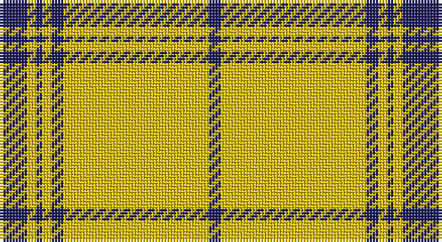

This page is one **sett** — a single exact thread-count. It belongs to the [tartan](/setts/db6db3ly3db2ly3db4ly48db4/)
(the same proportion at any scale), whose colour order is pattern [BBYBYBYB](/stripes/bbybybyb/).

Part of the [Morris](/tartans/morris/) tartan — the named design grouping this sett with its other cloths.

Sourced from tartans-authority.  It is a [8 stripe tartan](/stripes/stripes8/).

Original link http://www.tartansauthority.com/tartan-ferret/display/5749/

## Register references

External register numbers recorded for this tartan.

- Scottish Tartans Authority (ITI): 5749

## Thread count
DBa/6 DB3 Y3 DB2 Y3 DB4 Y48 DB/4

One full sett is **136 threads**.

## Palette

Palette: <strong>Tartan Register</strong>
<table><thead><tr><th>Colour</th><th>Threads</th><th>Shade</th><th>Base</th><th>OKLCh</th></tr></thead><tbody><tr><td>DBa/</td><td style="text-align:right;font-variant-numeric:tabular-nums">6</td><td><code style="background-color:#202060;">#202060</code> <small style="color:#888">#202060</small></td><td>B <code style="background-color:#2A418A;">#2A418A</code></td><td><small style="color:#888">oklch(28.9% 0.111 276.9)</small></td></tr><tr><td>DB</td><td style="text-align:right;font-variant-numeric:tabular-nums">3</td><td><code style="background-color:#202060;">#202060</code> <small style="color:#888">#202060</small></td><td>B <code style="background-color:#2A418A;">#2A418A</code></td><td><small style="color:#888">oklch(28.9% 0.111 276.9)</small></td></tr><tr><td>Y</td><td style="text-align:right;font-variant-numeric:tabular-nums">3</td><td><code style="background-color:#E8C000;">#E8C000</code> <small style="color:#888">#E8C000</small></td><td>Y <code style="background-color:#F2BF00;">#F2BF00</code></td><td><small style="color:#888">oklch(81.9% 0.168 93.7)</small></td></tr><tr><td>DB</td><td style="text-align:right;font-variant-numeric:tabular-nums">2</td><td><code style="background-color:#202060;">#202060</code> <small style="color:#888">#202060</small></td><td>B <code style="background-color:#2A418A;">#2A418A</code></td><td><small style="color:#888">oklch(28.9% 0.111 276.9)</small></td></tr><tr><td>Y</td><td style="text-align:right;font-variant-numeric:tabular-nums">3</td><td><code style="background-color:#E8C000;">#E8C000</code> <small style="color:#888">#E8C000</small></td><td>Y <code style="background-color:#F2BF00;">#F2BF00</code></td><td><small style="color:#888">oklch(81.9% 0.168 93.7)</small></td></tr><tr><td>DB</td><td style="text-align:right;font-variant-numeric:tabular-nums">4</td><td><code style="background-color:#202060;">#202060</code> <small style="color:#888">#202060</small></td><td>B <code style="background-color:#2A418A;">#2A418A</code></td><td><small style="color:#888">oklch(28.9% 0.111 276.9)</small></td></tr><tr><td>Y</td><td style="text-align:right;font-variant-numeric:tabular-nums">48</td><td><code style="background-color:#E8C000;">#E8C000</code> <small style="color:#888">#E8C000</small></td><td>Y <code style="background-color:#F2BF00;">#F2BF00</code></td><td><small style="color:#888">oklch(81.9% 0.168 93.7)</small></td></tr><tr><td>DB/</td><td style="text-align:right;font-variant-numeric:tabular-nums">4</td><td><code style="background-color:#202060;">#202060</code> <small style="color:#888">#202060</small></td><td>B <code style="background-color:#2A418A;">#2A418A</code></td><td><small style="color:#888">oklch(28.9% 0.111 276.9)</small></td></tr></tbody></table>

# Sample pattern

## Nearest tartans

The nearest existing variants by ΔTartan distance, with this tartan at the top so the swatches line up against it.

ΔTartan

Tartan

Sett

—

<a href="/ttd/edit/#slug=db6db3ly3db2ly3db4ly48db4">Morris (Welsh Name)</a> <a class="nn-out" href="/variants/s8/db6db3ly3db2ly3db4ly48db4/" title="open its dictionary page">↗</a>

1.38

<a href="/ttd/edit/#slug=ly75k6w3o2k6o2k6w3o2&amp;base=db6db3ly3db2ly3db4ly48db4">Norton (Corporate)</a> <a class="nn-out" href="/variants/s9/ly75k6w3o2k6o2k6w3o2/" title="open its dictionary page">↗</a>

1.55

<a href="/ttd/edit/#slug=ly75k26k3ly4k6~x2&amp;base=db6db3ly3db2ly3db4ly48db4">Perry Ancient (Personal)</a> <a class="nn-out" href="/variants/s5/ly75k26k3ly4k6~x2/" title="open its dictionary page">↗</a>

1.80

<a href="/ttd/edit/#slug=k7w3k7w45r3w3r3~x2&amp;base=db6db3ly3db2ly3db4ly48db4">White Stripes (Corporate)</a> <a class="nn-out" href="/variants/s7/k7w3k7w45r3w3r3~x2/" title="open its dictionary page">↗</a>

1.80

<a href="/ttd/edit/#slug=w3k5lo3r3lo32k2lo3~x2&amp;base=db6db3ly3db2ly3db4ly48db4">Bro-Dreger</a> <a class="nn-out" href="/variants/s7/w3k5lo3r3lo32k2lo3~x2/" title="open its dictionary page">↗</a>

1.86

<a href="/ttd/edit/#slug=dg4w13dg3w4dg3w3dg40w3dg2ly4~x2&amp;base=db6db3ly3db2ly3db4ly48db4">St. Patrick (Fashion)</a> <a class="nn-out" href="/variants/s10/dg4w13dg3w4dg3w3dg40w3dg2ly4~x2/" title="open its dictionary page">↗</a>

1.94

<a href="/ttd/edit/#slug=k14w4k8ly45w3k1ly2~x2&amp;base=db6db3ly3db2ly3db4ly48db4">Kernow Spirit (Corporate)</a> <a class="nn-out" href="/variants/s7/k14w4k8ly45w3k1ly2~x2/" title="open its dictionary page">↗</a>

2.01

<a href="/ttd/edit/#slug=ly5k9ly2k7lo35r4lo35k4~x2&amp;base=db6db3ly3db2ly3db4ly48db4">Wilbers</a> <a class="nn-out" href="/variants/s8/ly5k9ly2k7lo35r4lo35k4~x2/" title="open its dictionary page">↗</a>

2.07

<a href="/ttd/edit/#slug=ly40lo3ly10lo6ly20k3ly2k3ly10r4ly2r8ly2~x2&amp;base=db6db3ly3db2ly3db4ly48db4">Virginia Quadricentennial (District)</a> <a class="nn-out" href="/variants/s13/ly40lo3ly10lo6ly20k3ly2k3ly10r4ly2r8ly2~x2/" title="open its dictionary page">↗</a>

2.09

<a href="/ttd/edit/#slug=w40o3w10o6w20k3w2k3w10r4w2r8w2&amp;base=db6db3ly3db2ly3db4ly48db4">Virginia Quadricentennial</a> <a class="nn-out" href="/variants/s13/w40o3w10o6w20k3w2k3w10r4w2r8w2/" title="open its dictionary page">↗</a>

2.09

<a href="/ttd/edit/#slug=lo4k6lo1k1lo16k2~x2&amp;base=db6db3ly3db2ly3db4ly48db4">Monoch Airline</a> <a class="nn-out" href="/variants/s6/lo4k6lo1k1lo16k2~x2/" title="open its dictionary page">↗</a>

## Neighbour map

Every grey dot is one of 14360 variants placed by the first two principal components of the ΔTartan feature space (44% of its variance). Red is this tartan; blue dots are its nearest — click one to open its page.

<svg viewBox="0 0 640 380" role="img" style="max-width:100%;height:auto;border:1px solid #e0e0e0;border-radius:4px;display:block" xmlns="http://www.w3.org/2000/svg"><image href="/nn/cloud.v1.png" width="640" height="380"/><a href="/variants/s9/ly75k6w3o2k6o2k6w3o2/"><circle cx="458.3" cy="63.5" r="4" fill="#3465a4"><title>Norton (Corporate)</title></circle></a><a href="/variants/s5/ly75k26k3ly4k6~x2/"><circle cx="427.6" cy="149.5" r="4" fill="#3465a4"><title>Perry Ancient (Personal)</title></circle></a><a href="/variants/s7/k7w3k7w45r3w3r3~x2/"><circle cx="418.5" cy="134.0" r="4" fill="#3465a4"><title>White Stripes (Corporate)</title></circle></a><a href="/variants/s7/w3k5lo3r3lo32k2lo3~x2/"><circle cx="467.8" cy="144.4" r="4" fill="#3465a4"><title>Bro-Dreger</title></circle></a><a href="/variants/s10/dg4w13dg3w4dg3w3dg40w3dg2ly4~x2/"><circle cx="395.8" cy="129.9" r="4" fill="#3465a4"><title>St. Patrick (Fashion)</title></circle></a><a href="/variants/s7/k14w4k8ly45w3k1ly2~x2/"><circle cx="391.6" cy="105.1" r="4" fill="#3465a4"><title>Kernow Spirit (Corporate)</title></circle></a><a href="/variants/s8/ly5k9ly2k7lo35r4lo35k4~x2/"><circle cx="398.5" cy="150.5" r="4" fill="#3465a4"><title>Wilbers</title></circle></a><a href="/variants/s13/ly40lo3ly10lo6ly20k3ly2k3ly10r4ly2r8ly2~x2/"><circle cx="466.4" cy="122.9" r="4" fill="#3465a4"><title>Virginia Quadricentennial (District)</title></circle></a><a href="/variants/s13/w40o3w10o6w20k3w2k3w10r4w2r8w2/"><circle cx="426.0" cy="97.5" r="4" fill="#3465a4"><title>Virginia Quadricentennial</title></circle></a><a href="/variants/s6/lo4k6lo1k1lo16k2~x2/"><circle cx="445.2" cy="190.9" r="4" fill="#3465a4"><title>Monoch Airline</title></circle></a><circle cx="471.7" cy="113.0" r="5" fill="#c00000"/></svg>

ID: /variants/s8/db6db3ly3db2ly3db4ly48db4/
