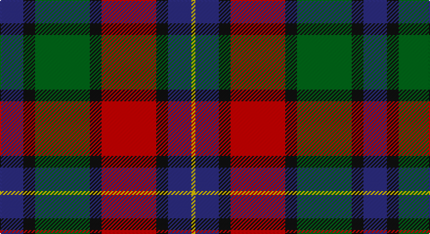

This page is one **sett** — a single exact thread-count. It belongs to the [tartan](/setts/db6k3g14k3r14k3db6ly1/)
(the same proportion at any scale), whose colour order is pattern [BKGKRKBY](/stripes/bkgkrkby/).

Part of the [Kilgour](/tartans/kilgour/) tartan — the named design grouping this sett with its other cloths.

Sourced from tartans-authority.  It is a [8 stripe tartan](/stripes/stripes8/).

Original link http://www.tartansauthority.com/tartan-ferret/display/5348/

## Provenance

Earliest known date: pre 2003 This sett was recorded by Peter MacDonald on the 17th of January, 1983. MacDonald was engaged in research work for the Scottish Tartans Society at the time but the correspondence up until 1985 does not indicate whether the design was ever finalised or even woven. There is a similarity in structure with the Kyle tartan recorded in 1984. Interest in the Kile tartan was revived in 1995. (Scottish Tartans Society correspondence) The name, Kyle or Kile, is associated with the Carrick District.

3 attestations — the source records this cloth was collapsed from (oldest owns this page)

<ul>
<li>1880 — Kilgour (Symmetrical) (tartans-authority, <a href="http://www.tartansauthority.com/tartan-ferret/display/5348/">record</a>)</li>
<li>undated — Kilgour (weddslist, <a href="http://www.weddslist.com/cgi-bin/tartans/pg.pl?source=sts">record</a>)</li>
<li>undated — Kilgour Family Tartan (house-of-tartan, <a href="http://www.house-of-tartan.scotland.net/house/TartanViewjs.asp?colr=Def&tnam=1979">record</a>)</li>
</ul>

## Register references

External register numbers recorded for this tartan.

- Scottish Tartans Authority (ITI): 5348

## Thread count
DB/24 K12 G56 K12 R56 K12 DB24 Y/4

One full sett is **372 threads**.

## Palette

Palette: <strong>Tartan Register</strong>
<table><thead><tr><th>Colour</th><th>Threads</th><th>Shade</th><th>Base</th><th>OKLCh</th></tr></thead><tbody><tr><td>DB/</td><td style="text-align:right;font-variant-numeric:tabular-nums">24</td><td><code style="background-color:#2C2C80;">#2C2C80</code> <small style="color:#888">#2C2C80</small></td><td>B <code style="background-color:#2A418A;">#2A418A</code></td><td><small style="color:#888">oklch(35.0% 0.138 276.6)</small></td></tr><tr><td>K</td><td style="text-align:right;font-variant-numeric:tabular-nums">12</td><td><code style="background-color:#101010;">#101010</code> <small style="color:#888">#101010</small></td><td>K <code style="background-color:#000000;">#000000</code></td><td><small style="color:#888">oklch(17.3% 0.000 89.9)</small></td></tr><tr><td>G</td><td style="text-align:right;font-variant-numeric:tabular-nums">56</td><td><code style="background-color:#006818;">#006818</code> <small style="color:#888">#006818</small></td><td>G <code style="background-color:#006100;">#006100</code></td><td><small style="color:#888">oklch(45.0% 0.142 145.0)</small></td></tr><tr><td>K</td><td style="text-align:right;font-variant-numeric:tabular-nums">12</td><td><code style="background-color:#101010;">#101010</code> <small style="color:#888">#101010</small></td><td>K <code style="background-color:#000000;">#000000</code></td><td><small style="color:#888">oklch(17.3% 0.000 89.9)</small></td></tr><tr><td>R</td><td style="text-align:right;font-variant-numeric:tabular-nums">56</td><td><code style="background-color:#C80000;">#C80000</code> <small style="color:#888">#C80000</small></td><td>R <code style="background-color:#CC0000;">#CC0000</code></td><td><small style="color:#888">oklch(52.3% 0.215 29.2)</small></td></tr><tr><td>K</td><td style="text-align:right;font-variant-numeric:tabular-nums">12</td><td><code style="background-color:#101010;">#101010</code> <small style="color:#888">#101010</small></td><td>K <code style="background-color:#000000;">#000000</code></td><td><small style="color:#888">oklch(17.3% 0.000 89.9)</small></td></tr><tr><td>DB</td><td style="text-align:right;font-variant-numeric:tabular-nums">24</td><td><code style="background-color:#2C2C80;">#2C2C80</code> <small style="color:#888">#2C2C80</small></td><td>B <code style="background-color:#2A418A;">#2A418A</code></td><td><small style="color:#888">oklch(35.0% 0.138 276.6)</small></td></tr><tr><td>Y/</td><td style="text-align:right;font-variant-numeric:tabular-nums">4</td><td><code style="background-color:#E8C000;">#E8C000</code> <small style="color:#888">#E8C000</small></td><td>Y <code style="background-color:#F2BF00;">#F2BF00</code></td><td><small style="color:#888">oklch(81.9% 0.168 93.7)</small></td></tr></tbody></table>

# Sample pattern

## Compared to the master

This cloth is one sett of its design; the master sett (the exemplar the design is anchored on) is below for comparison.

<figure style="margin:0"><figcaption style="color:#888;font-size:smaller">this sett</figcaption></figure>
<figure style="margin:0"><figcaption style="color:#888;font-size:smaller"><a href="/setts/db14dg21db4r21db14ly2/">master sett →</a></figcaption></figure>

## Nearest tartans

The nearest existing variants by ΔTartan distance, with this tartan at the top so the swatches line up against it.

ΔTartan

Tartan

Sett

—

<a href="/ttd/edit/#slug=db6k3g14k3r14k3db6ly1~x4">Kilgour (Symmetrical)</a> <a class="nn-out" href="/variants/s8/db6k3g14k3r14k3db6ly1~x4/" title="open its dictionary page">↗</a>

0.00

<a href="/ttd/edit/#slug=db6k3r14k3g14k3db6ly1~x4&amp;base=db6k3g14k3r14k3db6ly1~x4">Kilgour (Asymmetrical)</a> <a class="nn-out" href="/variants/s8/db6k3r14k3g14k3db6ly1~x4/" title="open its dictionary page">↗</a>

0.00

<a href="/ttd/edit/#slug=db6ly1db6k3r14k3g14k3~x4&amp;base=db6k3g14k3r14k3db6ly1~x4">Kilgour (Cant)</a> <a class="nn-out" href="/variants/s8/db6ly1db6k3r14k3g14k3~x4/" title="open its dictionary page">↗</a>

0.66

<a href="/ttd/edit/#slug=db18k5r26k5g25k5db18ly2~x2&amp;base=db6k3g14k3r14k3db6ly1~x4">St. Clement of Rome (Corporate)</a> <a class="nn-out" href="/variants/s8/db18k5r26k5g25k5db18ly2~x2/" title="open its dictionary page">↗</a>

0.86

<a href="/ttd/edit/#slug=r6db6r3db3r3db28k21g28r21k2ly4&amp;base=db6k3g14k3r14k3db6ly1~x4">MacLagan of Glenquiech</a> <a class="nn-out" href="/variants/s11/r6db6r3db3r3db28k21g28r21k2ly4/" title="open its dictionary page">↗</a>

0.87

<a href="/ttd/edit/#slug=dg1r11dg3k4dg4r1k2db11w1~x2&amp;base=db6k3g14k3r14k3db6ly1~x4">Manson (Name)</a> <a class="nn-out" href="/variants/s9/dg1r11dg3k4dg4r1k2db11w1~x2/" title="open its dictionary page">↗</a>

0.88

<a href="/ttd/edit/#slug=r4g6ly3g12k14db5r20db5k4db2~x2&amp;base=db6k3g14k3r14k3db6ly1~x4">Etienne-Carter, Sir George</a> <a class="nn-out" href="/variants/s10/r4g6ly3g12k14db5r20db5k4db2~x2/" title="open its dictionary page">↗</a>

0.88

<a href="/ttd/edit/#slug=dgi3db12w1dg12r12dg2~x2&amp;base=db6k3g14k3r14k3db6ly1~x4">Patterson, John (Personal)</a> <a class="nn-out" href="/variants/s6/dgi3db12w1dg12r12dg2~x2/" title="open its dictionary page">↗</a>

0.92

<a href="/ttd/edit/#slug=k4r6g8r16k6db10k2db10k2g8ly1~x2&amp;base=db6k3g14k3r14k3db6ly1~x4">MacBrine (Name)</a> <a class="nn-out" href="/variants/s11/k4r6g8r16k6db10k2db10k2g8ly1~x2/" title="open its dictionary page">↗</a>

0.93

<a href="/ttd/edit/#slug=g3db12w1dg12r12dg2~x2&amp;base=db6k3g14k3r14k3db6ly1~x4">Patterson, John (Personal)</a> <a class="nn-out" href="/variants/s6/g3db12w1dg12r12dg2~x2/" title="open its dictionary page">↗</a>

0.96

<a href="/ttd/edit/#slug=r4dg7ly3dg12k16t5r20t5k4t2~x2&amp;base=db6k3g14k3r14k3db6ly1~x4">Unidentified #9</a> <a class="nn-out" href="/variants/s10/r4dg7ly3dg12k16t5r20t5k4t2~x2/" title="open its dictionary page">↗</a>

## Neighbour map

Every grey dot is one of 14360 variants placed by the first two principal components of the ΔTartan feature space (44% of its variance). Red is this tartan; blue dots are its nearest — click one to open its page.

<svg viewBox="0 0 640 380" role="img" style="max-width:100%;height:auto;border:1px solid #e0e0e0;border-radius:4px;display:block" xmlns="http://www.w3.org/2000/svg"><image href="/nn/cloud.v1.png" width="640" height="380"/><a href="/variants/s8/db6k3r14k3g14k3db6ly1~x4/"><circle cx="136.7" cy="175.1" r="4" fill="#3465a4"><title>Kilgour (Asymmetrical)</title></circle></a><a href="/variants/s8/db6ly1db6k3r14k3g14k3~x4/"><circle cx="136.7" cy="175.1" r="4" fill="#3465a4"><title>Kilgour (Cant)</title></circle></a><a href="/variants/s8/db18k5r26k5g25k5db18ly2~x2/"><circle cx="158.6" cy="186.2" r="4" fill="#3465a4"><title>St. Clement of Rome (Corporate)</title></circle></a><a href="/variants/s11/r6db6r3db3r3db28k21g28r21k2ly4/"><circle cx="143.2" cy="148.6" r="4" fill="#3465a4"><title>MacLagan of Glenquiech</title></circle></a><a href="/variants/s9/dg1r11dg3k4dg4r1k2db11w1~x2/"><circle cx="153.7" cy="165.7" r="4" fill="#3465a4"><title>Manson (Name)</title></circle></a><a href="/variants/s10/r4g6ly3g12k14db5r20db5k4db2~x2/"><circle cx="124.4" cy="173.3" r="4" fill="#3465a4"><title>Etienne-Carter, Sir George</title></circle></a><a href="/variants/s6/dgi3db12w1dg12r12dg2~x2/"><circle cx="162.9" cy="196.7" r="4" fill="#3465a4"><title>Patterson, John (Personal)</title></circle></a><a href="/variants/s11/k4r6g8r16k6db10k2db10k2g8ly1~x2/"><circle cx="123.6" cy="163.4" r="4" fill="#3465a4"><title>MacBrine (Name)</title></circle></a><a href="/variants/s6/g3db12w1dg12r12dg2~x2/"><circle cx="168.9" cy="200.8" r="4" fill="#3465a4"><title>Patterson, John (Personal)</title></circle></a><a href="/variants/s10/r4dg7ly3dg12k16t5r20t5k4t2~x2/"><circle cx="114.1" cy="169.0" r="4" fill="#3465a4"><title>Unidentified #9</title></circle></a><circle cx="136.7" cy="175.1" r="5" fill="#c00000"/></svg>

ID: /variants/s8/db6k3g14k3r14k3db6ly1~x4/
