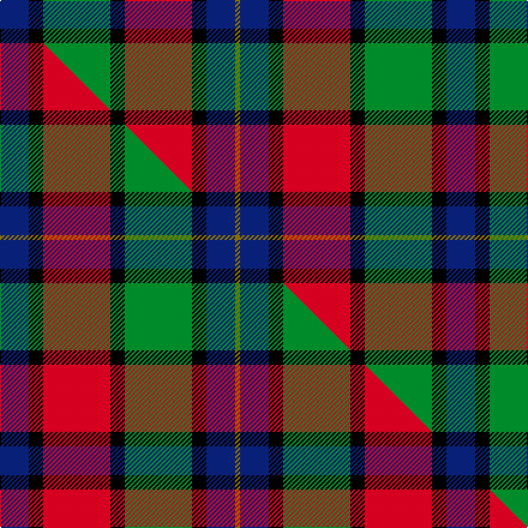

This page is one **sett** — a single exact thread-count. It belongs to the [tartan](/setts/db6k3g14k3r14k3db6y1/)
(the same proportion at any scale), whose colour order is pattern [BKGKRKBG](/stripes/bkgkrkbg/).

Part of the [Kilgour](/tartans/kilgour/) tartan — the named design grouping this sett with its other cloths.

Sourced from tartans-authority.  It is a [8 stripe tartan](/stripes/stripes8/).

Original link https://www.tartanregister.gov.uk/tartanDetails.aspx?ref=5348

## Provenance

Earliest known date: pre 2003 This sett was recorded by Peter MacDonald on the 17th of January, 1983. MacDonald was engaged in research work for the Scottish Tartans Society at the time but the correspondence up until 1985 does not indicate whether the design was ever finalised or even woven. There is a similarity in structure with the Kyle tartan recorded in 1984. Interest in the Kile tartan was revived in 1995. (Scottish Tartans Society correspondence) The name, Kyle or Kile, is associated with the Carrick District.

3 attestations — the source records this cloth was collapsed from (oldest owns this page)

<ul>
<li>1880 — Kilgour (Symmetrical) (tartans-authority, <a href="https://www.tartanregister.gov.uk/tartanDetails.aspx?ref=5348">record</a>)  <em>A symmetrical version of 1979 has been seen at various times but the original asymmetric version seems to be the most popular.</em></li>
<li>undated — Kilgour (weddslist, <a href="http://www.weddslist.com/cgi-bin/tartans/pg.pl?source=sts">record</a>) </li>
<li>undated — Kilgour Family Tartan (house-of-tartan, <a href="http://www.house-of-tartan.scotland.net/house/TartanViewjs.asp?colr=Def&tnam=1979">record</a>) </li>
</ul>

Dataset <small>— provenance for this record, inherited from the source manifest</small>

<dl class="dataset-prov">
<dt>source</dt><dd><a href="/sources/tartans-authority/">Scottish Tartans Authority</a></dd>
<dt>data captured from</dt><dd><a href="https://github.com/thetartan/tartan-database/blob/master/data/tartans-authority/data.csv">https://github.com/thetartan/tartan-database/blob/master/data/tartans-authority/data.csv</a></dd>
<dt>data date</dt><dd>1880 <small>(this record)</small></dd>
<dt>licence</dt><dd><a href="https://creativecommons.org/licenses/by-nc-nd/4.0/">CC BY-NC-ND 4.0</a></dd>
</dl>

Capture chain <small>— the hands this data passed through, oldest first; each capture carries its own licence</small>

<ol class="capture-chain">
<li><a href="https://www.tartansauthority.com/">Scottish Tartans Authority</a> <small>the heritage body's archive — its tartan-ferret record browser is retired (links repaired to the SRT, above)</small></li>
<li><a href="https://github.com/thetartan/tartan-database">thetartan/tartan-database</a> <small>2016-2017</small> · <a href="https://creativecommons.org/licenses/by-nc-nd/4.0/">CC BY-NC-ND 4.0</a> <small>Levko Kravets's frozen compilation — the capture we vendored, and where its CC licence text came from</small></li>
<li>this dictionary <small>captured 2026-06-10 · commit 5bf86c7566</small> <small>each re-capture is a git commit to data/sources</small></li>
</ol>

## Register references

External register numbers recorded for this tartan.

- Scottish Tartans Authority (ITI): 5348

## Thread count
DB/24 K12 G56 K12 R56 K12 DB24 Y/4

One full sett is **372 threads**.

## Palette
<table><thead><tr><th>Colour</th><th>Shade</th><th>OKLCh</th></tr></thead><tbody><tr><td>DB</td><td><code style="background-color:#082077;">#082077</code> <small style="color:#888">#082077</small></td><td><small style="color:#888">oklch(30.0% 0.149 265.1)</small></td></tr><tr><td>G</td><td><code style="background-color:#008B2A;">#008B2A</code> <small style="color:#888">#008B2A</small></td><td><small style="color:#888">oklch(55.4% 0.170 145.9)</small></td></tr><tr><td>K</td><td><code style="background-color:#000000;">#000000</code> <small style="color:#888">#000000</small></td><td><small style="color:#888">oklch(0.0% 0.000 0.0)</small></td></tr><tr><td>R</td><td><code style="background-color:#D60020;">#D60020</code> <small style="color:#888">#D60020</small></td><td><small style="color:#888">oklch(55.2% 0.224 25.5)</small></td></tr><tr><td>Y</td><td><code style="background-color:#8B6E00;">#8B6E00</code> <small style="color:#888">#8B6E00</small></td><td><small style="color:#888">oklch(55.1% 0.113 90.4)</small></td></tr></tbody></table>

# Sample pattern

## Compared to the master

This cloth is one sett of its design; the master sett (the exemplar the design is anchored on) is below for comparison.

Its **ΔTartan distance** from the master is **0.03** — the same measure the nearest-tartans table ranks by (0 is identical; a re-scale of the same cloth is near 0, a recolour or a different proportion further).

<figure class="master-compare" style="margin:0">

this sett
master sett ★

<figcaption style="color:#888;font-size:smaller">One weave of this sett against the <a href="/setts/db6k3r14k3g14k3db6y1/">master sett ★</a>, split on the diagonal: a shared proportion runs seamlessly across it with only the shades shifting; a different proportion breaks on it.</figcaption>
</figure>

## Nearest tartan variants

The nearest existing variants by ΔTartan distance, with this cloth at the top so the swatches line up against it.

ΔTartan

Threads

Variant

Sett

—

372

<a href="/variants/s8/db6k3g14k3r14k3db6y1~x4/">Kilgour (Symmetrical)</a>

<a href="/ttd/edit/#slug=db6y1db6k3r14k3g14k3~x4&amp;base=db6k3g14k3r14k3db6y1~x4" title="compare in the TTD">0.00</a>

364

<a href="/variants/s8/db6y1db6k3r14k3g14k3~x4/">Kilgour (Cant)</a>

<a href="/ttd/edit/#slug=db6k3r14k3g14k3db6y1~x4&amp;base=db6k3g14k3r14k3db6y1~x4" title="compare in the TTD">0.00</a>

372

<a href="/variants/s8/db6k3r14k3g14k3db6y1~x4/">Kilgour (Clan)</a>

<a href="/ttd/edit/#slug=db6k3r14k3g14k3db6y1~x4~db1406275&amp;base=db6k3g14k3r14k3db6y1~x4" title="compare in the TTD">0.03</a>

372

<a href="/variants/s8/db6k3r14k3g14k3db6y1~x4~db1406275/">Kilgour (Asymmetrical)</a>

<a href="/ttd/edit/#slug=db18k5r26k5g25k5db18y2~x2&amp;base=db6k3g14k3r14k3db6y1~x4" title="compare in the TTD">0.36</a>

376

<a href="/variants/s8/db18k5r26k5g25k5db18y2~x2/">St. Clement of Rome (Corporate)</a>

<a href="/ttd/edit/#slug=dt18k5r26k5g25k5dt18y2~x2~dt1204274&amp;base=db6k3g14k3r14k3db6y1~x4" title="compare in the TTD">0.38</a>

376

<a href="/variants/s8/db18k5r26k5g25k5db18y2~x2~db1204274/">St. Clement of Rome School</a>

<a href="/ttd/edit/#slug=r6db6r3db3r3db28k21g28r21k2y4&amp;base=db6k3g14k3r14k3db6y1~x4" title="compare in the TTD">1.88</a>

240

<a href="/variants/s11/r6db6r3db3r3db28k21g28r21k2y4/">MacLagan of Glenquiech</a>

<a href="/ttd/edit/#slug=r4g6y3g12k14db5r20db5k4db2~x2&amp;base=db6k3g14k3r14k3db6y1~x4" title="compare in the TTD">1.94</a>

288

<a href="/variants/s10/r4g6y3g12k14db5r20db5k4db2~x2/">Etienne-Carter, Sir George</a>

<a href="/ttd/edit/#slug=k4r6g8r16k6db10k2db10k2g8y1~x2&amp;base=db6k3g14k3r14k3db6y1~x4" title="compare in the TTD">2.01</a>

282

<a href="/variants/s11/k4r6g8r16k6db10k2db10k2g8y1~x2/">MacBrine (Name)</a>

<a href="/ttd/edit/#slug=o18k3o4lb3o4k18n20k2r4~x2~o2500000-n1900000&amp;base=db6k3g14k3r14k3db6y1~x4" title="compare in the TTD">2.04</a>

260

<a href="/variants/s9/o18k3o4lb3o4k18n20k2r4~x2~o2500000-n1900000/">Heart of the Highlands</a>

<a href="/ttd/edit/#slug=lr18k3lr4lb3lr4k19dt20k2r4~x2~lr2800000-dt1700000&amp;base=db6k3g14k3r14k3db6y1~x4" title="compare in the TTD">2.15</a>

264

<a href="/variants/s9/lr18k3lr4lb3lr4k19n20k2r4~x2~lr2800000-n1700000/">Heart of the Highlands</a>

## Neighbour map

Every grey dot is one of 13620 variants placed by the first two principal components of the ΔTartan feature space (42% of its variance). Red is this tartan; blue dots are its nearest — click one to open its page.

<svg viewBox="0 0 640 380" role="img" style="max-width:100%;height:auto;border:1px solid #e0e0e0;border-radius:4px;display:block" xmlns="http://www.w3.org/2000/svg"><image href="/nn/cloud.v1.png" width="640" height="380"/><a href="/variants/s8/db6y1db6k3r14k3g14k3~x4/"><circle cx="98.0" cy="162.4" r="4" fill="#3465a4"><title>Kilgour (Cant)</title></circle></a><a href="/variants/s8/db6k3r14k3g14k3db6y1~x4/"><circle cx="98.0" cy="162.4" r="4" fill="#3465a4"><title>Kilgour (Clan)</title></circle></a><a href="/variants/s8/db6k3r14k3g14k3db6y1~x4~db1406275/"><circle cx="101.0" cy="162.7" r="4" fill="#3465a4"><title>Kilgour (Asymmetrical)</title></circle></a><a href="/variants/s8/db18k5r26k5g25k5db18y2~x2/"><circle cx="120.8" cy="170.2" r="4" fill="#3465a4"><title>St. Clement of Rome (Corporate)</title></circle></a><a href="/variants/s8/db18k5r26k5g25k5db18y2~x2~db1204274/"><circle cx="124.7" cy="170.2" r="4" fill="#3465a4"><title>St. Clement of Rome School</title></circle></a><a href="/variants/s11/r6db6r3db3r3db28k21g28r21k2y4/"><circle cx="105.9" cy="138.1" r="4" fill="#3465a4"><title>MacLagan of Glenquiech</title></circle></a><a href="/variants/s10/r4g6y3g12k14db5r20db5k4db2~x2/"><circle cx="93.4" cy="166.7" r="4" fill="#3465a4"><title>Etienne-Carter, Sir George</title></circle></a><a href="/variants/s11/k4r6g8r16k6db10k2db10k2g8y1~x2/"><circle cx="94.3" cy="156.2" r="4" fill="#3465a4"><title>MacBrine (Name)</title></circle></a><a href="/variants/s9/o18k3o4lb3o4k18n20k2r4~x2~o2500000-n1900000/"><circle cx="120.7" cy="159.8" r="4" fill="#3465a4"><title>Heart of the Highlands</title></circle></a><a href="/variants/s9/lr18k3lr4lb3lr4k19n20k2r4~x2~lr2800000-n1700000/"><circle cx="113.3" cy="157.8" r="4" fill="#3465a4"><title>Heart of the Highlands</title></circle></a><circle cx="98.0" cy="162.4" r="5" fill="#c00000"/><text x="320" y="376" text-anchor="middle" font-size="11" fill="#999">ground</text><text x="11" y="190" text-anchor="middle" font-size="11" fill="#999" transform="rotate(-90 11 190)">complexity</text></svg>

ID: /variants/s8/db6k3g14k3r14k3db6y1~x4/
