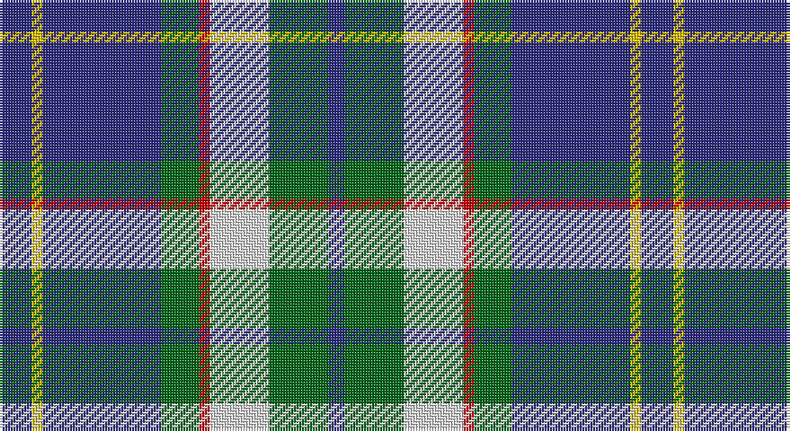

This page is one **sett** — a single exact thread-count. It belongs to the [tartan](/setts/db6ly2db22g7r2w11g11db3/)
(the same proportion at any scale), whose colour order is pattern [BGWRGBYB](/stripes/bgwrgbyb/).

Part of the [Bahamas](/tartans/bahamas/) tartan — the named design grouping this sett with its other cloths.

Sourced from house-of-tartan.  It is a [8 stripe tartan](/stripes/stripes8/).

Original link http://www.house-of-tartan.scotland.net/house/TartanViewjs.asp?colr=Def&tnam=2089

## Provenance

Earliest known date: 1966 Designed by Gordon Rees of the Scottish Shop in Nassau, now owned by Colin and Beverley Honnes. It was intended to perpetuate the memory of early Scottish settlers in the Bahamas including Thompson, Sands, Forsythe, Munroe, Johnston, Russell, Christie, Roberts, Kelly, MacKinney, Saunders, Malcolm, Crawford, MacPherson, Clark and Rae. The tartan was formally approved by the Bahamas Government in 1966.

## Thread count
DB/12 Y4 DB44 G14 R4 LN22 G22 DB/6

One full sett is **238 threads**.

## Palette

Palette: <strong>Tartan Register</strong>
<table><thead><tr><th>Colour</th><th>Threads</th><th>Shade</th><th>Base</th><th>OKLCh</th></tr></thead><tbody><tr><td>DB/</td><td style="text-align:right;font-variant-numeric:tabular-nums">12</td><td><code style="background-color:#2C2C80;">#2C2C80</code> <small style="color:#888">#2C2C80</small></td><td>B <code style="background-color:#2A418A;">#2A418A</code></td><td><small style="color:#888">oklch(35.0% 0.138 276.6)</small></td></tr><tr><td>Y</td><td style="text-align:right;font-variant-numeric:tabular-nums">4</td><td><code style="background-color:#E8C000;">#E8C000</code> <small style="color:#888">#E8C000</small></td><td>Y <code style="background-color:#F2BF00;">#F2BF00</code></td><td><small style="color:#888">oklch(81.9% 0.168 93.7)</small></td></tr><tr><td>DB</td><td style="text-align:right;font-variant-numeric:tabular-nums">44</td><td><code style="background-color:#2C2C80;">#2C2C80</code> <small style="color:#888">#2C2C80</small></td><td>B <code style="background-color:#2A418A;">#2A418A</code></td><td><small style="color:#888">oklch(35.0% 0.138 276.6)</small></td></tr><tr><td>G</td><td style="text-align:right;font-variant-numeric:tabular-nums">14</td><td><code style="background-color:#006818;">#006818</code> <small style="color:#888">#006818</small></td><td>G <code style="background-color:#006100;">#006100</code></td><td><small style="color:#888">oklch(45.0% 0.142 145.0)</small></td></tr><tr><td>R</td><td style="text-align:right;font-variant-numeric:tabular-nums">4</td><td><code style="background-color:#C80000;">#C80000</code> <small style="color:#888">#C80000</small></td><td>R <code style="background-color:#CC0000;">#CC0000</code></td><td><small style="color:#888">oklch(52.3% 0.215 29.2)</small></td></tr><tr><td>LN</td><td style="text-align:right;font-variant-numeric:tabular-nums">22</td><td><code style="background-color:#E0E0E0;">#E0E0E0</code> <small style="color:#888">#E0E0E0</small></td><td>W <code style="background-color:#F7F7F7;">#F7F7F7</code></td><td><small style="color:#888">oklch(90.7% 0.000 89.9)</small></td></tr><tr><td>G</td><td style="text-align:right;font-variant-numeric:tabular-nums">22</td><td><code style="background-color:#006818;">#006818</code> <small style="color:#888">#006818</small></td><td>G <code style="background-color:#006100;">#006100</code></td><td><small style="color:#888">oklch(45.0% 0.142 145.0)</small></td></tr><tr><td>DB/</td><td style="text-align:right;font-variant-numeric:tabular-nums">6</td><td><code style="background-color:#2C2C80;">#2C2C80</code> <small style="color:#888">#2C2C80</small></td><td>B <code style="background-color:#2A418A;">#2A418A</code></td><td><small style="color:#888">oklch(35.0% 0.138 276.6)</small></td></tr></tbody></table>

# Sample pattern

## Compared to the master

This cloth is one sett of its design; the master sett (the exemplar the design is anchored on) is below for comparison.

<figure style="margin:0"><figcaption style="color:#888;font-size:smaller">this sett</figcaption></figure>
<figure style="margin:0"><figcaption style="color:#888;font-size:smaller"><a href="/setts/n8ly2n22dg6r2lb10dg12n3/">master sett →</a></figcaption></figure>

## Nearest tartans

The nearest existing variants by ΔTartan distance, with this tartan at the top so the swatches line up against it.

ΔTartan

Tartan

Sett

—

<a href="/ttd/edit/#slug=db6ly2db22g7r2w11g11db3~x2">Bahamas District Tartan</a> <a class="nn-out" href="/variants/s8/db6ly2db22g7r2w11g11db3~x2/" title="open its dictionary page">↗</a>

0.56

<a href="/ttd/edit/#slug=db15lb2g2ly15r3db21r3g15~x2&amp;base=db6ly2db22g7r2w11g11db3~x2">Loyalhanna</a> <a class="nn-out" href="/variants/s8/db15lb2g2ly15r3db21r3g15~x2/" title="open its dictionary page">↗</a>

0.79

<a href="/ttd/edit/#slug=r1b10k2w4k4ly1~x6&amp;base=db6ly2db22g7r2w11g11db3~x2">Thomson Dress (Blue)</a> <a class="nn-out" href="/variants/s6/r1b10k2w4k4ly1~x6/" title="open its dictionary page">↗</a>

0.91

<a href="/ttd/edit/#slug=db3g11w11r2g7db22ly2db2~x2&amp;base=db6ly2db22g7r2w11g11db3~x2">Bahamas</a> <a class="nn-out" href="/variants/s8/db3g11w11r2g7db22ly2db2~x2/" title="open its dictionary page">↗</a>

0.97

<a href="/ttd/edit/#slug=w4g28db18r4db18ly3~x2&amp;base=db6ly2db22g7r2w11g11db3~x2">MacIntyre, Inglis</a> <a class="nn-out" href="/variants/s6/w4g28db18r4db18ly3~x2/" title="open its dictionary page">↗</a>

0.99

<a href="/ttd/edit/#slug=lt16k3lt16k26dp4k26n20w3n8&amp;base=db6ly2db22g7r2w11g11db3~x2">Scotsburn Croft</a> <a class="nn-out" href="/variants/s9/lt16k3lt16k26dp4k26n20w3n8/" title="open its dictionary page">↗</a>

1.00

<a href="/ttd/edit/#slug=w3db28g26r3g26db26lb12db3lb3&amp;base=db6ly2db22g7r2w11g11db3~x2">Seaford House</a> <a class="nn-out" href="/variants/s9/w3db28g26r3g26db26lb12db3lb3/" title="open its dictionary page">↗</a>

1.03

<a href="/ttd/edit/#slug=db2r1db10w1y4g8g1g2~x4&amp;base=db6ly2db22g7r2w11g11db3~x2">Ayrshire</a> <a class="nn-out" href="/variants/s8/db2r1db10w1y4g8g1g2~x4/" title="open its dictionary page">↗</a>

1.04

<a href="/ttd/edit/#slug=r4t28k6lb12k12lo3~x2&amp;base=db6ly2db22g7r2w11g11db3~x2">MacTavish Dress</a> <a class="nn-out" href="/variants/s6/r4t28k6lb12k12lo3~x2/" title="open its dictionary page">↗</a>

1.07

<a href="/ttd/edit/#slug=r2t2r2t21lg11k17lb2~x2&amp;base=db6ly2db22g7r2w11g11db3~x2">Loch Ness (Fashion)</a> <a class="nn-out" href="/variants/s7/r2t2r2t21lg11k17lb2~x2/" title="open its dictionary page">↗</a>

1.08

<a href="/ttd/edit/#slug=r15t98db72ly25db8w15&amp;base=db6ly2db22g7r2w11g11db3~x2">Afternoon Tea / Earl Grey</a> <a class="nn-out" href="/variants/s6/r15t98db72ly25db8w15/" title="open its dictionary page">↗</a>

## Neighbour map

Every grey dot is one of 14360 variants placed by the first two principal components of the ΔTartan feature space (44% of its variance). Red is this tartan; blue dots are its nearest — click one to open its page.

<svg viewBox="0 0 640 380" role="img" style="max-width:100%;height:auto;border:1px solid #e0e0e0;border-radius:4px;display:block" xmlns="http://www.w3.org/2000/svg"><image href="/nn/cloud.v1.png" width="640" height="380"/><a href="/variants/s8/db15lb2g2ly15r3db21r3g15~x2/"><circle cx="175.6" cy="177.8" r="4" fill="#3465a4"><title>Loyalhanna</title></circle></a><a href="/variants/s6/r1b10k2w4k4ly1~x6/"><circle cx="179.4" cy="179.2" r="4" fill="#3465a4"><title>Thomson Dress (Blue)</title></circle></a><a href="/variants/s8/db3g11w11r2g7db22ly2db2~x2/"><circle cx="191.6" cy="167.1" r="4" fill="#3465a4"><title>Bahamas</title></circle></a><a href="/variants/s6/w4g28db18r4db18ly3~x2/"><circle cx="223.6" cy="207.3" r="4" fill="#3465a4"><title>MacIntyre, Inglis</title></circle></a><a href="/variants/s9/lt16k3lt16k26dp4k26n20w3n8/"><circle cx="150.3" cy="186.1" r="4" fill="#3465a4"><title>Scotsburn Croft</title></circle></a><a href="/variants/s9/w3db28g26r3g26db26lb12db3lb3/"><circle cx="196.4" cy="190.2" r="4" fill="#3465a4"><title>Seaford House</title></circle></a><a href="/variants/s8/db2r1db10w1y4g8g1g2~x4/"><circle cx="177.2" cy="170.8" r="4" fill="#3465a4"><title>Ayrshire</title></circle></a><a href="/variants/s6/r4t28k6lb12k12lo3~x2/"><circle cx="167.8" cy="188.3" r="4" fill="#3465a4"><title>MacTavish Dress</title></circle></a><a href="/variants/s7/r2t2r2t21lg11k17lb2~x2/"><circle cx="169.2" cy="171.4" r="4" fill="#3465a4"><title>Loch Ness (Fashion)</title></circle></a><a href="/variants/s6/r15t98db72ly25db8w15/"><circle cx="185.4" cy="169.2" r="4" fill="#3465a4"><title>Afternoon Tea / Earl Grey</title></circle></a><circle cx="200.4" cy="175.3" r="5" fill="#c00000"/></svg>

ID: /variants/s8/db6ly2db22g7r2w11g11db3~x2/
