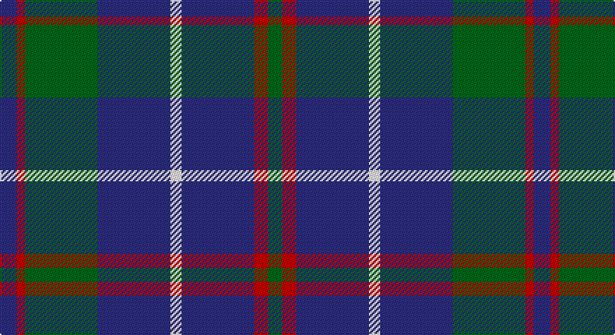

This page is one **sett** — a single exact thread-count. It belongs to the [tartan](/setts/db6r3g26db26w4db26r5g5/)
(the same proportion at any scale), whose colour order is pattern [BRGBWBRG](/stripes/brgbwbrg/).

Part of the [MacHardy](/tartans/machardy/) tartan — the named design grouping this sett with its other cloths.

Sourced from register-of-tartans.  It is a [8 stripe tartan](/stripes/stripes8/).

Original link https://www.tartanregister.gov.uk/tartanDetails.aspx?ref=4953

## Also known as

This cloth is also recorded under:

- MacHardy Black
- MacHardy, Blue

## Register references

External register numbers recorded for this tartan.

- Scottish Register of Tartans: [4953](https://www.tartanregister.gov.uk/tartanDetails.aspx?ref=4953)
- Scottish Tartans Authority (ITI): 3380

## Thread count
DB/12 R6 G52 DB52 W8 DB52 R10 G/10

One full sett is **382 threads**.

## Palette

Palette: <strong>Tartan Register</strong>
<table><thead><tr><th>Colour</th><th>Threads</th><th>Shade</th><th>Base</th><th>OKLCh</th></tr></thead><tbody><tr><td>DB/</td><td style="text-align:right;font-variant-numeric:tabular-nums">12</td><td><code style="background-color:#2C2C80;">#2C2C80</code> <small style="color:#888">#2C2C80</small></td><td>B <code style="background-color:#2A418A;">#2A418A</code></td><td><small style="color:#888">oklch(35.0% 0.138 276.6)</small></td></tr><tr><td>R</td><td style="text-align:right;font-variant-numeric:tabular-nums">6</td><td><code style="background-color:#C80000;">#C80000</code> <small style="color:#888">#C80000</small></td><td>R <code style="background-color:#CC0000;">#CC0000</code></td><td><small style="color:#888">oklch(52.3% 0.215 29.2)</small></td></tr><tr><td>G</td><td style="text-align:right;font-variant-numeric:tabular-nums">52</td><td><code style="background-color:#006818;">#006818</code> <small style="color:#888">#006818</small></td><td>G <code style="background-color:#006100;">#006100</code></td><td><small style="color:#888">oklch(45.0% 0.142 145.0)</small></td></tr><tr><td>DB</td><td style="text-align:right;font-variant-numeric:tabular-nums">52</td><td><code style="background-color:#2C2C80;">#2C2C80</code> <small style="color:#888">#2C2C80</small></td><td>B <code style="background-color:#2A418A;">#2A418A</code></td><td><small style="color:#888">oklch(35.0% 0.138 276.6)</small></td></tr><tr><td>W</td><td style="text-align:right;font-variant-numeric:tabular-nums">8</td><td><code style="background-color:#FCFCFC;">#FCFCFC</code> <small style="color:#888">#FCFCFC</small></td><td>W <code style="background-color:#F7F7F7;">#F7F7F7</code></td><td><small style="color:#888">oklch(99.1% 0.000 89.9)</small></td></tr><tr><td>DB</td><td style="text-align:right;font-variant-numeric:tabular-nums">52</td><td><code style="background-color:#2C2C80;">#2C2C80</code> <small style="color:#888">#2C2C80</small></td><td>B <code style="background-color:#2A418A;">#2A418A</code></td><td><small style="color:#888">oklch(35.0% 0.138 276.6)</small></td></tr><tr><td>R</td><td style="text-align:right;font-variant-numeric:tabular-nums">10</td><td><code style="background-color:#C80000;">#C80000</code> <small style="color:#888">#C80000</small></td><td>R <code style="background-color:#CC0000;">#CC0000</code></td><td><small style="color:#888">oklch(52.3% 0.215 29.2)</small></td></tr><tr><td>G/</td><td style="text-align:right;font-variant-numeric:tabular-nums">10</td><td><code style="background-color:#006818;">#006818</code> <small style="color:#888">#006818</small></td><td>G <code style="background-color:#006100;">#006100</code></td><td><small style="color:#888">oklch(45.0% 0.142 145.0)</small></td></tr></tbody></table>

# Sample pattern

## Compared to the master

This cloth is one sett of its design; the master sett (the exemplar the design is anchored on) is below for comparison.

<figure style="margin:0"><figcaption style="color:#888;font-size:smaller">this sett</figcaption></figure>
<figure style="margin:0"><figcaption style="color:#888;font-size:smaller"><a href="/setts/db1r1g6db6ly1db6r1g1/">master sett →</a></figcaption></figure>

## Nearest tartans

The nearest existing variants by ΔTartan distance, with this tartan at the top so the swatches line up against it.

ΔTartan

Tartan

Sett

—

<a href="/ttd/edit/#slug=db6r3g26db26w4db26r5g5~x2">MacHardy, Blue</a> <a class="nn-out" href="/variants/s8/db6r3g26db26w4db26r5g5~x2/" title="open its dictionary page">↗</a>

1.02

<a href="/ttd/edit/#slug=w1db8g2db2g6db1g6db2g2db8ly1~x4&amp;base=db6r3g26db26w4db26r5g5~x2">Bruce (Personal)</a> <a class="nn-out" href="/variants/s11/w1db8g2db2g6db1g6db2g2db8ly1~x4/" title="open its dictionary page">↗</a>

1.05

<a href="/ttd/edit/#slug=db1r1g6db6ly1db6r1g1~x2&amp;base=db6r3g26db26w4db26r5g5~x2">MacHardy</a> <a class="nn-out" href="/variants/s8/db1r1g6db6ly1db6r1g1~x2/" title="open its dictionary page">↗</a>

1.09

<a href="/ttd/edit/#slug=db3r3g18db16w2db26r3g3~x2&amp;base=db6r3g26db26w4db26r5g5~x2">MacHardy</a> <a class="nn-out" href="/variants/s8/db3r3g18db16w2db26r3g3~x2/" title="open its dictionary page">↗</a>

1.10

<a href="/ttd/edit/#slug=dg1r1db6ly1db6dg6r1db1~x2&amp;base=db6r3g26db26w4db26r5g5~x2">MacHardy</a> <a class="nn-out" href="/variants/s8/dg1r1db6ly1db6dg6r1db1~x2/" title="open its dictionary page">↗</a>

1.12

<a href="/ttd/edit/#slug=g9b9k24b35dr5b35k24b9g9dr5~x2&amp;base=db6r3g26db26w4db26r5g5~x2">Notre Dame Marching Guard</a> <a class="nn-out" href="/variants/s10/g9b9k24b35dr5b35k24b9g9dr5~x2/" title="open its dictionary page">↗</a>

1.13

<a href="/ttd/edit/#slug=db4ly2db17k2r4k2db3k11db3~x2&amp;base=db6r3g26db26w4db26r5g5~x2">Stone of Destiny</a> <a class="nn-out" href="/variants/s9/db4ly2db17k2r4k2db3k11db3~x2/" title="open its dictionary page">↗</a>

1.14

<a href="/ttd/edit/#slug=dg10r1dg1r2dg8db10dg1ly1~x4&amp;base=db6r3g26db26w4db26r5g5~x2">Glen Esk</a> <a class="nn-out" href="/variants/s8/dg10r1dg1r2dg8db10dg1ly1~x4/" title="open its dictionary page">↗</a>

1.15

<a href="/ttd/edit/#slug=o11dbi1o3db1dbi9r1~x4&amp;base=db6r3g26db26w4db26r5g5~x2">Dege, of Saville Row</a> <a class="nn-out" href="/variants/s6/o11dbi1o3db1dbi9r1~x4/" title="open its dictionary page">↗</a>

1.17

<a href="/ttd/edit/#slug=w4y15db8k4db28k2db4w2&amp;base=db6r3g26db26w4db26r5g5~x2">Kelvinside Academy (School)</a> <a class="nn-out" href="/variants/s8/w4y15db8k4db28k2db4w2/" title="open its dictionary page">↗</a>

1.18

<a href="/ttd/edit/#slug=dg20db2g6db2dg4db27lo2db8~x2&amp;base=db6r3g26db26w4db26r5g5~x2">Kinross (Fashion)</a> <a class="nn-out" href="/variants/s8/dg20db2g6db2dg4db27lo2db8~x2/" title="open its dictionary page">↗</a>

## Neighbour map

Every grey dot is one of 14360 variants placed by the first two principal components of the ΔTartan feature space (44% of its variance). Red is this tartan; blue dots are its nearest — click one to open its page.

<svg viewBox="0 0 640 380" role="img" style="max-width:100%;height:auto;border:1px solid #e0e0e0;border-radius:4px;display:block" xmlns="http://www.w3.org/2000/svg"><image href="/nn/cloud.v1.png" width="640" height="380"/><a href="/variants/s11/w1db8g2db2g6db1g6db2g2db8ly1~x4/"><circle cx="285.8" cy="215.4" r="4" fill="#3465a4"><title>Bruce (Personal)</title></circle></a><a href="/variants/s8/db1r1g6db6ly1db6r1g1~x2/"><circle cx="291.2" cy="229.6" r="4" fill="#3465a4"><title>MacHardy</title></circle></a><a href="/variants/s8/db3r3g18db16w2db26r3g3~x2/"><circle cx="360.0" cy="198.7" r="4" fill="#3465a4"><title>MacHardy</title></circle></a><a href="/variants/s8/dg1r1db6ly1db6dg6r1db1~x2/"><circle cx="309.7" cy="239.8" r="4" fill="#3465a4"><title>MacHardy</title></circle></a><a href="/variants/s10/g9b9k24b35dr5b35k24b9g9dr5~x2/"><circle cx="238.4" cy="223.5" r="4" fill="#3465a4"><title>Notre Dame Marching Guard</title></circle></a><a href="/variants/s9/db4ly2db17k2r4k2db3k11db3~x2/"><circle cx="307.8" cy="208.0" r="4" fill="#3465a4"><title>Stone of Destiny</title></circle></a><a href="/variants/s8/dg10r1dg1r2dg8db10dg1ly1~x4/"><circle cx="324.4" cy="208.7" r="4" fill="#3465a4"><title>Glen Esk</title></circle></a><a href="/variants/s6/o11dbi1o3db1dbi9r1~x4/"><circle cx="328.7" cy="209.2" r="4" fill="#3465a4"><title>Dege, of Saville Row</title></circle></a><a href="/variants/s8/w4y15db8k4db28k2db4w2/"><circle cx="351.5" cy="187.3" r="4" fill="#3465a4"><title>Kelvinside Academy (School)</title></circle></a><a href="/variants/s8/dg20db2g6db2dg4db27lo2db8~x2/"><circle cx="333.8" cy="198.5" r="4" fill="#3465a4"><title>Kinross (Fashion)</title></circle></a><circle cx="303.1" cy="215.9" r="5" fill="#c00000"/></svg>

ID: /variants/s8/db6r3g26db26w4db26r5g5~x2/
