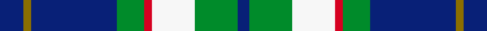
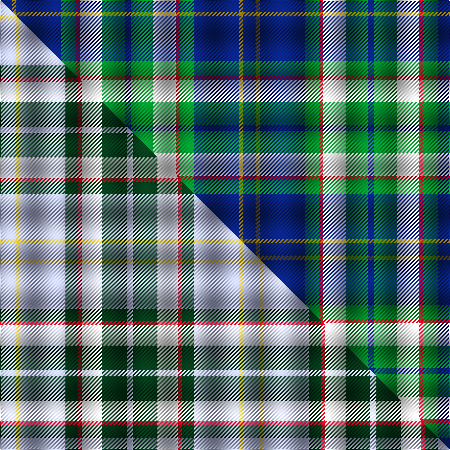

This page is one **sett** — a single exact thread-count. It belongs to the [tartan](/setts/db6y2db22g7r2w11g11db3/)
(the same proportion at any scale), whose colour order is pattern [BGBGRWGB](/stripes/bgbgrwgb/).

Part of the [Bahamas](/tartans/bahamas/) tartan — the named design grouping this sett with its other cloths.

Sourced from house-of-tartan.  It is a [8 stripe tartan](/stripes/stripes8/).

Original link http://www.house-of-tartan.scotland.net/house/TartanViewjs.asp?colr=Def&tnam=2089

## Provenance

Earliest known date: 1966 Designed by Gordon Rees of the Scottish Shop in Nassau, now owned by Colin and Beverley Honnes. It was intended to perpetuate the memory of early Scottish settlers in the Bahamas including Thompson, Sands, Forsythe, Munroe, Johnston, Russell, Christie, Roberts, Kelly, MacKinney, Saunders, Malcolm, Crawford, MacPherson, Clark and Rae. The tartan was formally approved by the Bahamas Government in 1966.

## Thread count
DB/12 Y4 DB44 G14 R4 W22 G22 DB/6

One full sett is **238 threads**.

## Palette
<table><thead><tr><th>Colour</th><th>Shade</th><th>OKLCh</th></tr></thead><tbody><tr><td>DB</td><td><code style="background-color:#082077;">#082077</code> <small style="color:#888">#082077</small></td><td><small style="color:#888">oklch(30.0% 0.149 265.1)</small></td></tr><tr><td>G</td><td><code style="background-color:#008B2A;">#008B2A</code> <small style="color:#888">#008B2A</small></td><td><small style="color:#888">oklch(55.4% 0.170 145.9)</small></td></tr><tr><td>W</td><td><code style="background-color:#F7F7F7;">#F7F7F7</code> <small style="color:#888">#F7F7F7</small></td><td><small style="color:#888">oklch(97.6% 0.000 89.9)</small></td></tr><tr><td>R</td><td><code style="background-color:#D60020;">#D60020</code> <small style="color:#888">#D60020</small></td><td><small style="color:#888">oklch(55.2% 0.224 25.5)</small></td></tr><tr><td>Y</td><td><code style="background-color:#8B6E00;">#8B6E00</code> <small style="color:#888">#8B6E00</small></td><td><small style="color:#888">oklch(55.1% 0.113 90.4)</small></td></tr></tbody></table>

# Sample pattern

## Compared to the master

This cloth is one sett of its design; the master sett (the exemplar the design is anchored on) is below for comparison.

Its **ΔTartan distance** from the master is **1.60** — the same measure the nearest-tartans table ranks by (0 is identical; a re-scale of the same cloth is near 0, a recolour or a different proportion further).

<figure class="master-compare" style="margin:0">

this sett
master sett ★

<figcaption style="color:#888;font-size:smaller">One weave of this sett against the <a href="/setts/lb8ly2lb22dg6r2w10dg12lb3/">master sett ★</a>, split on the diagonal: a shared proportion runs seamlessly across it with only the shades shifting; a different proportion breaks on it.</figcaption>
</figure>

## Nearest variants

The nearest existing variants by ΔTartan distance, with this cloth at the top so the swatches line up against it.

ΔTartan

Threads

Variant

Sett

—

238

<a href="/variants/s8/db6y2db22g7r2w11g11db3~x2/">Bahamas District Tartan</a>

<a href="/ttd/edit/#slug=lb8ly2lb22dg6r2w10dg12lb3~x2&amp;base=db6y2db22g7r2w11g11db3~x2" title="compare in the TTD">0.13</a>

238

<a href="/variants/s8/lb8ly2lb22dg6r2w10dg12lb3~x2/">Bahamas</a>

<a href="/ttd/edit/#slug=db3g11w11r2g7db22y2db2~x2&amp;base=db6y2db22g7r2w11g11db3~x2" title="compare in the TTD">0.21</a>

230

<a href="/variants/s8/db3g11w11r2g7db22y2db2~x2/">Bahamas</a>

<a href="/ttd/edit/#slug=w3db28g26r3g26db26lb12db3lb3&amp;base=db6y2db22g7r2w11g11db3~x2" title="compare in the TTD">2.56</a>

254

<a href="/variants/s9/w3db28g26r3g26db26lb12db3lb3/">Seaford House</a>

<a href="/ttd/edit/#slug=g3w3g18db14r5db14r5db14g21w3~x2&amp;base=db6y2db22g7r2w11g11db3~x2" title="compare in the TTD">2.70</a>

388

<a href="/variants/s10/g3w3g18db14r5db14r5db14g21w3~x2/">Hamilton of Clayton (Personal)</a>

## Neighbour map

Every grey dot is one of 13620 variants placed by the first two principal components of the ΔTartan feature space (42% of its variance). Red is this tartan; blue dots are its nearest — click one to open its page.

<svg viewBox="0 0 640 380" role="img" style="max-width:100%;height:auto;border:1px solid #e0e0e0;border-radius:4px;display:block" xmlns="http://www.w3.org/2000/svg"><image href="/nn/cloud.v1.png" width="640" height="380"/><a href="/variants/s8/lb8ly2lb22dg6r2w10dg12lb3~x2/"><circle cx="225.6" cy="188.2" r="4" fill="#3465a4"><title>Bahamas</title></circle></a><a href="/variants/s8/db3g11w11r2g7db22y2db2~x2/"><circle cx="192.3" cy="178.3" r="4" fill="#3465a4"><title>Bahamas</title></circle></a><a href="/variants/s9/w3db28g26r3g26db26lb12db3lb3/"><circle cx="207.2" cy="197.5" r="4" fill="#3465a4"><title>Seaford House</title></circle></a><a href="/variants/s10/g3w3g18db14r5db14r5db14g21w3~x2/"><circle cx="197.5" cy="228.1" r="4" fill="#3465a4"><title>Hamilton of Clayton (Personal)</title></circle></a><circle cx="202.9" cy="185.3" r="5" fill="#c00000"/><text x="320" y="376" text-anchor="middle" font-size="11" fill="#999">ground</text><text x="11" y="190" text-anchor="middle" font-size="11" fill="#999" transform="rotate(-90 11 190)">complexity</text></svg>

ID: /variants/s8/db6y2db22g7r2w11g11db3~x2/
