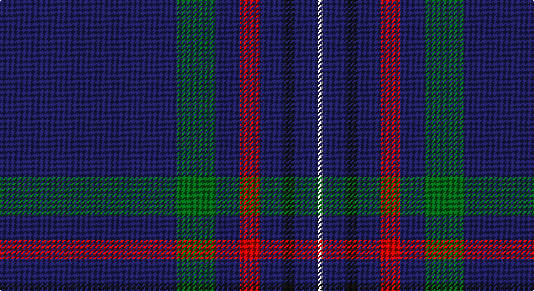

This page is one **sett** — a single exact thread-count. It belongs to the [tartan](/setts/db73g16db10r8db10k4db10w2/)
(the same proportion at any scale), whose colour order is pattern [BGBRBKBW](/stripes/bgbrbkbw/).

Sourced from register-of-tartans.  It is a [8 stripe tartan](/stripes/stripes8/).

Original link https://www.tartanregister.gov.uk/tartanDetails.aspx?ref=3672

## Also known as

This cloth is also recorded under:

- Scotch Whisky Heritage Centre
- Scotch Whisky, Heritage

2 attestations — the source records this cloth was collapsed from (oldest owns this page)

<ul>
<li>01/01/1988 — Scotch Whisky Heritage Centre (register-of-tartans, <a href="https://www.tartanregister.gov.uk/tartanDetails.aspx?ref=3672">record</a>)</li>
<li>January 1988 — Scotch Whisky Heritage Centre (Corp) (tartans-authority, <a href="http://www.tartansauthority.com/tartan-ferret/display/1920/">record</a>)</li>
</ul>

## Register references

External register numbers recorded for this tartan.

- Scottish Register of Tartans: [3672](https://www.tartanregister.gov.uk/tartanDetails.aspx?ref=3672)
- Scottish Tartans Authority (ITI): 1920
- Scottish Tartans World Register: 1920

## Thread count
DB/146 Ga32 DB20 R16 DB20 K8 DB20 LN/4

One full sett is **382 threads**.

## Palette

Palette: <strong>Tartan Register</strong>
<table><thead><tr><th>Colour</th><th>Threads</th><th>Shade</th><th>Base</th><th>OKLCh</th></tr></thead><tbody><tr><td>DB/</td><td style="text-align:right;font-variant-numeric:tabular-nums">146</td><td><code style="background-color:#202060;">#202060</code> <small style="color:#888">#202060</small></td><td>B <code style="background-color:#2A418A;">#2A418A</code></td><td><small style="color:#888">oklch(28.9% 0.111 276.9)</small></td></tr><tr><td>Ga</td><td style="text-align:right;font-variant-numeric:tabular-nums">32</td><td><code style="background-color:#006818;">#006818</code> <small style="color:#888">#006818</small></td><td>G <code style="background-color:#006100;">#006100</code></td><td><small style="color:#888">oklch(45.0% 0.142 145.0)</small></td></tr><tr><td>DB</td><td style="text-align:right;font-variant-numeric:tabular-nums">20</td><td><code style="background-color:#202060;">#202060</code> <small style="color:#888">#202060</small></td><td>B <code style="background-color:#2A418A;">#2A418A</code></td><td><small style="color:#888">oklch(28.9% 0.111 276.9)</small></td></tr><tr><td>R</td><td style="text-align:right;font-variant-numeric:tabular-nums">16</td><td><code style="background-color:#C80000;">#C80000</code> <small style="color:#888">#C80000</small></td><td>R <code style="background-color:#CC0000;">#CC0000</code></td><td><small style="color:#888">oklch(52.3% 0.215 29.2)</small></td></tr><tr><td>DB</td><td style="text-align:right;font-variant-numeric:tabular-nums">20</td><td><code style="background-color:#202060;">#202060</code> <small style="color:#888">#202060</small></td><td>B <code style="background-color:#2A418A;">#2A418A</code></td><td><small style="color:#888">oklch(28.9% 0.111 276.9)</small></td></tr><tr><td>K</td><td style="text-align:right;font-variant-numeric:tabular-nums">8</td><td><code style="background-color:#101010;">#101010</code> <small style="color:#888">#101010</small></td><td>K <code style="background-color:#000000;">#000000</code></td><td><small style="color:#888">oklch(17.3% 0.000 89.9)</small></td></tr><tr><td>DB</td><td style="text-align:right;font-variant-numeric:tabular-nums">20</td><td><code style="background-color:#202060;">#202060</code> <small style="color:#888">#202060</small></td><td>B <code style="background-color:#2A418A;">#2A418A</code></td><td><small style="color:#888">oklch(28.9% 0.111 276.9)</small></td></tr><tr><td>LN/</td><td style="text-align:right;font-variant-numeric:tabular-nums">4</td><td><code style="background-color:#E0E0E0;">#E0E0E0</code> <small style="color:#888">#E0E0E0</small></td><td>W <code style="background-color:#F7F7F7;">#F7F7F7</code></td><td><small style="color:#888">oklch(90.7% 0.000 89.9)</small></td></tr></tbody></table>

# Sample pattern

## Nearest tartans

The nearest existing variants by ΔTartan distance, with this tartan at the top so the swatches line up against it.

ΔTartan

Tartan

Sett

—

<a href="/ttd/edit/#slug=db73g16db10r8db10k4db10w2~x2">Scotch Whisky Heritage Centre</a> <a class="nn-out" href="/variants/s8/db73g16db10r8db10k4db10w2~x2/" title="open its dictionary page">↗</a>

1.29

<a href="/ttd/edit/#slug=r2db8ly1db16w1g12db27w1db1w1~x2&amp;base=db73g16db10r8db10k4db10w2~x2">World Youth Congress (Corporate)</a> <a class="nn-out" href="/variants/s10/r2db8ly1db16w1g12db27w1db1w1~x2/" title="open its dictionary page">↗</a>

1.29

<a href="/ttd/edit/#slug=g5w1r5k5db43r1~x2&amp;base=db73g16db10r8db10k4db10w2~x2">Michael (John) (Personal)</a> <a class="nn-out" href="/variants/s6/g5w1r5k5db43r1~x2/" title="open its dictionary page">↗</a>

1.35

<a href="/ttd/edit/#slug=k5db15k5b1k35m1k2~x4&amp;base=db73g16db10r8db10k4db10w2~x2">Gibson, Robert (Personal)</a> <a class="nn-out" href="/variants/s7/k5db15k5b1k35m1k2~x4/" title="open its dictionary page">↗</a>

1.37

<a href="/ttd/edit/#slug=k64y12n6k15o1y5lr1~x2&amp;base=db73g16db10r8db10k4db10w2~x2">McCann of Castlecraig (Personal)</a> <a class="nn-out" href="/variants/s7/k64y12n6k15o1y5lr1~x2/" title="open its dictionary page">↗</a>

1.43

<a href="/ttd/edit/#slug=db7dt5lr6dt5r7dt2db2dt70lr2&amp;base=db73g16db10r8db10k4db10w2~x2">United States Trade sett Tartan</a> <a class="nn-out" href="/variants/s9/db7dt5lr6dt5r7dt2db2dt70lr2/" title="open its dictionary page">↗</a>

1.44

<a href="/ttd/edit/#slug=r5dt40w1dt13g8k4~x2&amp;base=db73g16db10r8db10k4db10w2~x2">London Scottish Rugby Club</a> <a class="nn-out" href="/variants/s6/r5dt40w1dt13g8k4~x2/" title="open its dictionary page">↗</a>

1.52

<a href="/ttd/edit/#slug=db73g16db10r8db10k4db10w2&amp;base=db73g16db10r8db10k4db10w2~x2">Scotch Whisky, Heritage</a> <a class="nn-out" href="/variants/s8/db73g16db10r8db10k4db10w2/" title="open its dictionary page">↗</a>

1.53

<a href="/ttd/edit/#slug=w3dt9ly1lb3dp9lb1dt40dp2~x2&amp;base=db73g16db10r8db10k4db10w2~x2">Parkin</a> <a class="nn-out" href="/variants/s8/w3dt9ly1lb3dp9lb1dt40dp2~x2/" title="open its dictionary page">↗</a>

1.54

<a href="/ttd/edit/#slug=db6lo2db7g4db3g6db2g4db39ly2~x2&amp;base=db73g16db10r8db10k4db10w2~x2">Seletar Shipping (Corporate)</a> <a class="nn-out" href="/variants/s10/db6lo2db7g4db3g6db2g4db39ly2~x2/" title="open its dictionary page">↗</a>

1.56

<a href="/ttd/edit/#slug=db80k5g12k2ly2g2k10~x2&amp;base=db73g16db10r8db10k4db10w2~x2">Affara (Personal)</a> <a class="nn-out" href="/variants/s7/db80k5g12k2ly2g2k10~x2/" title="open its dictionary page">↗</a>

## Neighbour map

Every grey dot is one of 14360 variants placed by the first two principal components of the ΔTartan feature space (44% of its variance). Red is this tartan; blue dots are its nearest — click one to open its page.

<svg viewBox="0 0 640 380" role="img" style="max-width:100%;height:auto;border:1px solid #e0e0e0;border-radius:4px;display:block" xmlns="http://www.w3.org/2000/svg"><image href="/nn/cloud.v1.png" width="640" height="380"/><a href="/variants/s10/r2db8ly1db16w1g12db27w1db1w1~x2/"><circle cx="465.8" cy="133.9" r="4" fill="#3465a4"><title>World Youth Congress (Corporate)</title></circle></a><a href="/variants/s6/g5w1r5k5db43r1~x2/"><circle cx="503.9" cy="129.8" r="4" fill="#3465a4"><title>Michael (John) (Personal)</title></circle></a><a href="/variants/s7/k5db15k5b1k35m1k2~x4/"><circle cx="524.4" cy="167.8" r="4" fill="#3465a4"><title>Gibson, Robert (Personal)</title></circle></a><a href="/variants/s7/k64y12n6k15o1y5lr1~x2/"><circle cx="535.0" cy="132.8" r="4" fill="#3465a4"><title>McCann of Castlecraig (Personal)</title></circle></a><a href="/variants/s9/db7dt5lr6dt5r7dt2db2dt70lr2/"><circle cx="571.0" cy="136.2" r="4" fill="#3465a4"><title>United States Trade sett Tartan</title></circle></a><a href="/variants/s6/r5dt40w1dt13g8k4~x2/"><circle cx="524.1" cy="170.6" r="4" fill="#3465a4"><title>London Scottish Rugby Club</title></circle></a><a href="/variants/s8/db73g16db10r8db10k4db10w2/"><circle cx="503.2" cy="132.5" r="4" fill="#3465a4"><title>Scotch Whisky, Heritage</title></circle></a><a href="/variants/s8/w3dt9ly1lb3dp9lb1dt40dp2~x2/"><circle cx="473.4" cy="109.7" r="4" fill="#3465a4"><title>Parkin</title></circle></a><a href="/variants/s10/db6lo2db7g4db3g6db2g4db39ly2~x2/"><circle cx="524.5" cy="163.5" r="4" fill="#3465a4"><title>Seletar Shipping (Corporate)</title></circle></a><a href="/variants/s7/db80k5g12k2ly2g2k10~x2/"><circle cx="535.2" cy="149.2" r="4" fill="#3465a4"><title>Affara (Personal)</title></circle></a><circle cx="540.4" cy="142.6" r="5" fill="#c00000"/></svg>

ID: /variants/s8/db73g16db10r8db10k4db10w2~x2/
