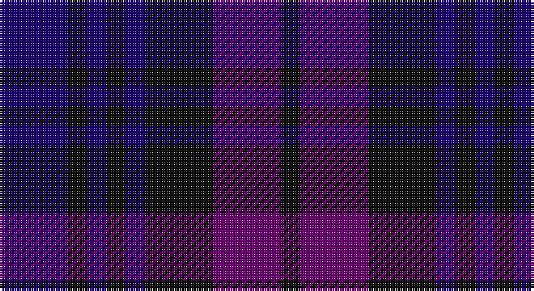

This page is one **sett** — a single exact thread-count. It belongs to the [tartan](/setts/db7k2db2k2db2k7dp7k2/)
(the same proportion at any scale), whose colour order is pattern [BKBKBKBK](/stripes/bkbkbkbk/).

Part of the [Glasgow Academy](/tartans/glasgow-academy/) tartan — the named design grouping this sett with its other cloths.

Sourced from register-of-tartans.  It is a [8 stripe tartan](/stripes/stripes8/).

Original link https://www.tartanregister.gov.uk/tartanDetails.aspx?ref=1351

## Also known as

This cloth is also recorded under:

- Glasgow, Academy

2 attestations — the source records this cloth was collapsed from (oldest owns this page)

<ul>
<li>01/01/1992 — Glasgow Academy (register-of-tartans, <a href="https://www.tartanregister.gov.uk/tartanDetails.aspx?ref=1351">record</a>)</li>
<li>1996 — Glasgow Academy (Corporate) (tartans-authority, <a href="http://www.tartansauthority.com/tartan-ferret/display/2052/">record</a>)</li>
</ul>

## Register references

External register numbers recorded for this tartan.

- Scottish Register of Tartans: [1351](https://www.tartanregister.gov.uk/tartanDetails.aspx?ref=1351)
- Scottish Tartans Authority (ITI): 2052
- Scottish Tartans World Register: 2052

## Thread count
DB/28 K8 DB8 K8 DB8 K28 P28 K/8

One full sett is **212 threads**.

## Palette

Palette: <strong>Tartan Register</strong>
<table><thead><tr><th>Colour</th><th>Threads</th><th>Shade</th><th>Base</th><th>OKLCh</th></tr></thead><tbody><tr><td>DB/</td><td style="text-align:right;font-variant-numeric:tabular-nums">28</td><td><code style="background-color:#1C0070;">#1C0070</code> <small style="color:#888">#1C0070</small></td><td>B <code style="background-color:#2A418A;">#2A418A</code></td><td><small style="color:#888">oklch(26.3% 0.162 277.1)</small></td></tr><tr><td>K</td><td style="text-align:right;font-variant-numeric:tabular-nums">8</td><td><code style="background-color:#101010;">#101010</code> <small style="color:#888">#101010</small></td><td>K <code style="background-color:#000000;">#000000</code></td><td><small style="color:#888">oklch(17.3% 0.000 89.9)</small></td></tr><tr><td>DB</td><td style="text-align:right;font-variant-numeric:tabular-nums">8</td><td><code style="background-color:#1C0070;">#1C0070</code> <small style="color:#888">#1C0070</small></td><td>B <code style="background-color:#2A418A;">#2A418A</code></td><td><small style="color:#888">oklch(26.3% 0.162 277.1)</small></td></tr><tr><td>K</td><td style="text-align:right;font-variant-numeric:tabular-nums">8</td><td><code style="background-color:#101010;">#101010</code> <small style="color:#888">#101010</small></td><td>K <code style="background-color:#000000;">#000000</code></td><td><small style="color:#888">oklch(17.3% 0.000 89.9)</small></td></tr><tr><td>DB</td><td style="text-align:right;font-variant-numeric:tabular-nums">8</td><td><code style="background-color:#1C0070;">#1C0070</code> <small style="color:#888">#1C0070</small></td><td>B <code style="background-color:#2A418A;">#2A418A</code></td><td><small style="color:#888">oklch(26.3% 0.162 277.1)</small></td></tr><tr><td>K</td><td style="text-align:right;font-variant-numeric:tabular-nums">28</td><td><code style="background-color:#101010;">#101010</code> <small style="color:#888">#101010</small></td><td>K <code style="background-color:#000000;">#000000</code></td><td><small style="color:#888">oklch(17.3% 0.000 89.9)</small></td></tr><tr><td>P</td><td style="text-align:right;font-variant-numeric:tabular-nums">28</td><td><code style="background-color:#6C0070;">#6C0070</code> <small style="color:#888">#6C0070</small></td><td>B <code style="background-color:#2A418A;">#2A418A</code></td><td><small style="color:#888">oklch(37.6% 0.174 326.5)</small></td></tr><tr><td>K/</td><td style="text-align:right;font-variant-numeric:tabular-nums">8</td><td><code style="background-color:#101010;">#101010</code> <small style="color:#888">#101010</small></td><td>K <code style="background-color:#000000;">#000000</code></td><td><small style="color:#888">oklch(17.3% 0.000 89.9)</small></td></tr></tbody></table>

# Sample pattern

## Nearest tartans

The nearest existing variants by ΔTartan distance, with this tartan at the top so the swatches line up against it.

ΔTartan

Tartan

Sett

—

<a href="/ttd/edit/#slug=db7k2db2k2db2k7dp7k2~x4">Glasgow Academy</a> <a class="nn-out" href="/variants/s8/db7k2db2k2db2k7dp7k2~x4/" title="open its dictionary page">↗</a>

1.56

<a href="/ttd/edit/#slug=db2dg6db6dp5db1dp2~x2&amp;base=db7k2db2k2db2k7dp7k2~x4">Unidentified no. 54</a> <a class="nn-out" href="/variants/s6/db2dg6db6dp5db1dp2~x2/" title="open its dictionary page">↗</a>

1.70

<a href="/ttd/edit/#slug=db22k3db3k3db3k22dp22k4dp22k22db22k4db4&amp;base=db7k2db2k2db2k7dp7k2~x4">Glasgow Academy Corporate Tartan</a> <a class="nn-out" href="/variants/s13/db22k3db3k3db3k22dp22k4dp22k22db22k4db4/" title="open its dictionary page">↗</a>

1.81

<a href="/ttd/edit/#slug=dy3dbi6db2lo2db11dbi2db2dy3~x2&amp;base=db7k2db2k2db2k7dp7k2~x4">Daks (Blue)</a> <a class="nn-out" href="/variants/s8/dy3dbi6db2lo2db11dbi2db2dy3~x2/" title="open its dictionary page">↗</a>

1.96

<a href="/ttd/edit/#slug=db12k2db2k2db2k10r2k10dbi12k3dbi12k10db11k2db2~x2&amp;base=db7k2db2k2db2k7dp7k2~x4">Mundigl Family Tartan</a> <a class="nn-out" href="/variants/s15/db12k2db2k2db2k10r2k10dbi12k3dbi12k10db11k2db2~x2/" title="open its dictionary page">↗</a>

2.03

<a href="/ttd/edit/#slug=db11k2db2k2db2k8dp8lo2dp8k8db8k2db2~x4&amp;base=db7k2db2k2db2k7dp7k2~x4">Clemson University</a> <a class="nn-out" href="/variants/s13/db11k2db2k2db2k8dp8lo2dp8k8db8k2db2~x4/" title="open its dictionary page">↗</a>

2.05

<a href="/ttd/edit/#slug=k3db15k9dy3k2dy14k2dy3k9db13k2db3~x2&amp;base=db7k2db2k2db2k7dp7k2~x4">McWilliams (2014)</a> <a class="nn-out" href="/variants/s12/k3db15k9dy3k2dy14k2dy3k9db13k2db3~x2/" title="open its dictionary page">↗</a>

2.06

<a href="/ttd/edit/#slug=k2dg2db10k10dg2k10dg2db3dg2db5dg2~x2&amp;base=db7k2db2k2db2k7dp7k2~x4">Clergy (Clark)</a> <a class="nn-out" href="/variants/s11/k2dg2db10k10dg2k10dg2db3dg2db5dg2~x2/" title="open its dictionary page">↗</a>

2.07

<a href="/ttd/edit/#slug=b5k22db4k4db26k4~x2&amp;base=db7k2db2k2db2k7dp7k2~x4">Slanj, The</a> <a class="nn-out" href="/variants/s6/b5k22db4k4db26k4~x2/" title="open its dictionary page">↗</a>

2.10

<a href="/ttd/edit/#slug=db12k2db2k2db2k10r12k3r12k10db12k2db2~x2&amp;base=db7k2db2k2db2k7dp7k2~x4">MacDevitt (Name)</a> <a class="nn-out" href="/variants/s13/db12k2db2k2db2k10r12k3r12k10db12k2db2~x2/" title="open its dictionary page">↗</a>

2.10

<a href="/ttd/edit/#slug=k1dg3k3db3k1db1~x4&amp;base=db7k2db2k2db2k7dp7k2~x4">Sutherland 42nd</a> <a class="nn-out" href="/variants/s6/k1dg3k3db3k1db1~x4/" title="open its dictionary page">↗</a>

## Neighbour map

Every grey dot is one of 14360 variants placed by the first two principal components of the ΔTartan feature space (44% of its variance). Red is this tartan; blue dots are its nearest — click one to open its page.

<svg viewBox="0 0 640 380" role="img" style="max-width:100%;height:auto;border:1px solid #e0e0e0;border-radius:4px;display:block" xmlns="http://www.w3.org/2000/svg"><image href="/nn/cloud.v1.png" width="640" height="380"/><a href="/variants/s6/db2dg6db6dp5db1dp2~x2/"><circle cx="290.3" cy="334.0" r="4" fill="#3465a4"><title>Unidentified no. 54</title></circle></a><a href="/variants/s13/db22k3db3k3db3k22dp22k4dp22k22db22k4db4/"><circle cx="283.0" cy="258.4" r="4" fill="#3465a4"><title>Glasgow Academy Corporate Tartan</title></circle></a><a href="/variants/s8/dy3dbi6db2lo2db11dbi2db2dy3~x2/"><circle cx="305.5" cy="281.4" r="4" fill="#3465a4"><title>Daks (Blue)</title></circle></a><a href="/variants/s15/db12k2db2k2db2k10r2k10dbi12k3dbi12k10db11k2db2~x2/"><circle cx="256.5" cy="255.4" r="4" fill="#3465a4"><title>Mundigl Family Tartan</title></circle></a><a href="/variants/s13/db11k2db2k2db2k8dp8lo2dp8k8db8k2db2~x4/"><circle cx="212.9" cy="245.2" r="4" fill="#3465a4"><title>Clemson University</title></circle></a><a href="/variants/s12/k3db15k9dy3k2dy14k2dy3k9db13k2db3~x2/"><circle cx="302.6" cy="271.6" r="4" fill="#3465a4"><title>McWilliams (2014)</title></circle></a><a href="/variants/s11/k2dg2db10k10dg2k10dg2db3dg2db5dg2~x2/"><circle cx="281.0" cy="279.3" r="4" fill="#3465a4"><title>Clergy (Clark)</title></circle></a><a href="/variants/s6/b5k22db4k4db26k4~x2/"><circle cx="347.6" cy="294.5" r="4" fill="#3465a4"><title>Slanj, The</title></circle></a><a href="/variants/s13/db12k2db2k2db2k10r12k3r12k10db12k2db2~x2/"><circle cx="239.7" cy="253.1" r="4" fill="#3465a4"><title>MacDevitt (Name)</title></circle></a><a href="/variants/s6/k1dg3k3db3k1db1~x4/"><circle cx="234.1" cy="350.3" r="4" fill="#3465a4"><title>Sutherland 42nd</title></circle></a><circle cx="276.9" cy="325.2" r="5" fill="#c00000"/></svg>

ID: /variants/s8/db7k2db2k2db2k7dp7k2~x4/
