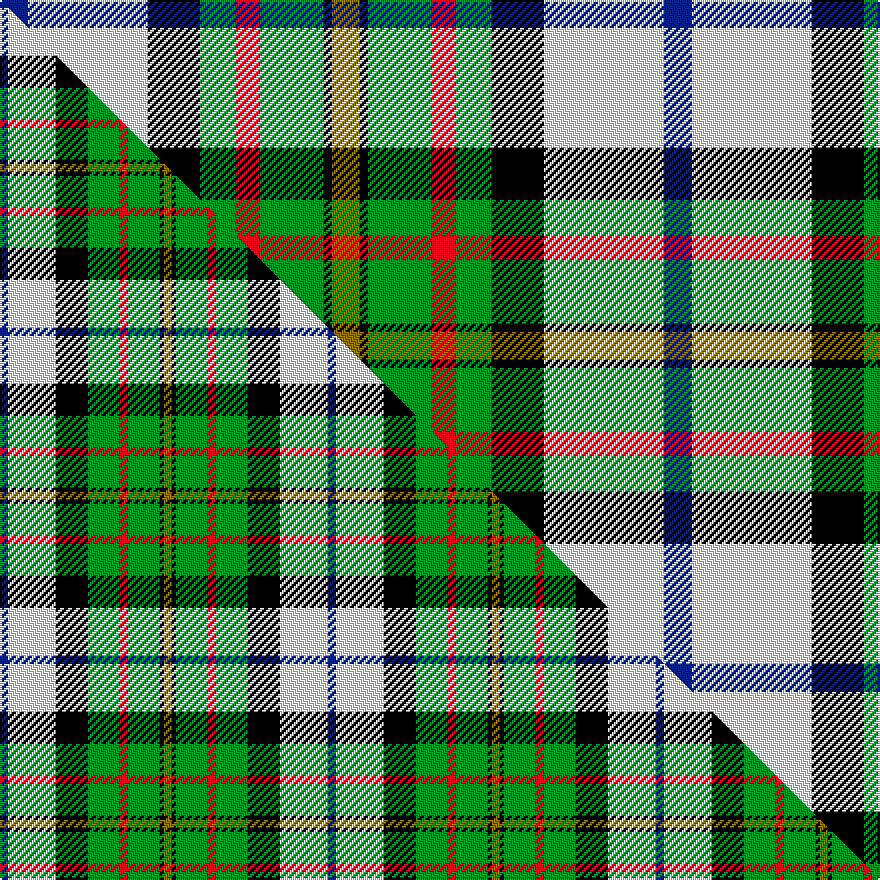

This is one **variant** — a specific cloth: this exact thread count and colourway, with its own
provenance below. It is one weaving of the [sett](/tartans/m/ma/maclaren-dress-2/) (the scale-free proportion — the
same cloth at any scale or shade), whose colour order is pattern [BWKGRGKG](/stripes/bwkgrgkg/).

Part of the [MacLaren Dress](/tartans/m/ma/maclaren-dress-2/) tartan — the named design grouping this sett with its other cloths.

Sourced from house-of-tartan.  It is a [8 stripe tartan](/stripes/stripes8/).

Original link [http://www.house-of-tartan.scotland.net/house/TartanViewjs.asp?colr=Def&tnam=649](http://www.house-of-tartan.scotland.net/house/TartanViewjs.asp?colr=Def&tnam=649)

## Provenance

Earliest known date: 1981 This sett was approved by the Chief and accepted by the A.G.M. of the Clan MacLaren Society as Dress MacLaren in 1981. The sett has been designed by changing the blue ground of the usual MacLaren sett to white and then centering a blue stripe on the white ground. This illustration is based on a kilt belonging to the designer, Mr I.G.Campbell MacLaren.

2 attestations — the source records this cloth was collapsed from (oldest owns this page)

<ul>
<li>1981 — MacLaren Dress Clan Tartan (house-of-tartan, <a href="http://www.house-of-tartan.scotland.net/house/TartanViewjs.asp?colr=Def&tnam=649">record</a>) </li>
<li>undated — MacLaren dress (weddslist, <a href="http://www.weddslist.com/cgi-bin/tartans/pg.pl?source=sts">record</a>) </li>
</ul>

Dataset <small>— provenance for this record, inherited from the source manifest</small>

<dl class="dataset-prov">
<dt>source</dt><dd><a href="/sources/house-of-tartan/">House of Tartan</a></dd>
<dt>data captured from</dt><dd><a href="https://github.com/thetartan/tartan-database/blob/master/data/house-of-tartan/data.csv">https://github.com/thetartan/tartan-database/blob/master/data/house-of-tartan/data.csv</a></dd>
<dt>data date</dt><dd>1981 <small>(this record)</small></dd>
<dt>licence</dt><dd><a href="https://creativecommons.org/licenses/by-nc-nd/4.0/">CC BY-NC-ND 4.0</a></dd>
</dl>

Capture chain <small>— the hands this data passed through, oldest first; each capture carries its own licence</small>

<ol class="capture-chain">
<li><a href="http://www.house-of-tartan.scotland.net/">House of Tartan</a> <small>the weaver/retailer's database — the site is now offline; the URL is kept as the ultimate source's identity</small></li>
<li><a href="https://github.com/thetartan/tartan-database">thetartan/tartan-database</a> <small>2016-2017</small> · <a href="https://creativecommons.org/licenses/by-nc-nd/4.0/">CC BY-NC-ND 4.0</a> <small>Levko Kravets's frozen compilation — the capture we vendored, and where its CC licence text came from</small></li>
<li>this dictionary <small>captured 2026-06-10 · commit 5bf86c7566</small> <small>each re-capture is a git commit to data/sources</small></li>
</ol>

## Thread count
DB/14 W60 K26 G18 R12 G32 K4 Y/14

One full sett is **332 threads**.

## Palette
<table><thead><tr><th>Colour</th><th>Shade</th><th>OKLCh</th></tr></thead><tbody><tr><td>DB</td><td><code style="background-color:#082077;">#082077</code> <small style="color:#888">#082077</small></td><td><small style="color:#888">oklch(30.0% 0.149 265.1)</small></td></tr><tr><td>G</td><td><code style="background-color:#008B2A;">#008B2A</code> <small style="color:#888">#008B2A</small></td><td><small style="color:#888">oklch(55.4% 0.170 145.9)</small></td></tr><tr><td>K</td><td><code style="background-color:#000000;">#000000</code> <small style="color:#888">#000000</small></td><td><small style="color:#888">oklch(0.0% 0.000 0.0)</small></td></tr><tr><td>W</td><td><code style="background-color:#F7F7F7;">#F7F7F7</code> <small style="color:#888">#F7F7F7</small></td><td><small style="color:#888">oklch(97.6% 0.000 89.9)</small></td></tr><tr><td>R</td><td><code style="background-color:#D60020;">#D60020</code> <small style="color:#888">#D60020</small></td><td><small style="color:#888">oklch(55.2% 0.224 25.5)</small></td></tr><tr><td>Y</td><td><code style="background-color:#8B6E00;">#8B6E00</code> <small style="color:#888">#8B6E00</small></td><td><small style="color:#888">oklch(55.1% 0.113 90.4)</small></td></tr></tbody></table>

# Sample pattern

## Compared to the master

This cloth is one sett of its design; the master sett (the exemplar the design is anchored on) is below for comparison.

Its **ΔTartan distance** from the master is **0.54** — the same measure the nearest-tartans table ranks by (0 is identical; a re-scale of the same cloth is near 0, a recolour or a different proportion further).

<figure class="master-compare" style="margin:0">

this sett
master sett ★

<figcaption style="color:#888;font-size:smaller">One weave of this sett against the <a href="/setts/db2w12k8g8r2g8k1y2/">master sett ★</a>, split on the diagonal: a shared proportion runs seamlessly across it with only the shades shifting; a different proportion breaks on it.</figcaption>
</figure>

## Nearest tartan variants

The nearest existing variants by ΔTartan distance, with this cloth at the top so the swatches line up against it.

ΔTartan

Threads

Variant

Sett

—

332

<a href="/variants/s8/db7w30k13g9r6g16k2y7~x2/">MacLaren Dress Clan Tartan</a>

<a href="/ttd/edit/#slug=db2w12k8g8r2g8k1y2~x2&amp;base=db7w30k13g9r6g16k2y7~x2" title="compare in the TTD">0.54</a>

164

<a href="/variants/s8/db2w12k8g8r2g8k1y2~x2/">MacLaren Dress</a>

<a href="/ttd/edit/#slug=db2w12k8g8r2g8k1lo2~x2&amp;base=db7w30k13g9r6g16k2y7~x2" title="compare in the TTD">0.82</a>

164

<a href="/variants/s8/db2w12k8g8r2g8k1lo2~x2/">MacLaren Dress (Clan)</a>

<a href="/ttd/edit/#slug=y6k2g15r6g8k12w25lb2w3lb2~x2&amp;base=db7w30k13g9r6g16k2y7~x2" title="compare in the TTD">1.56</a>

308

<a href="/variants/s10/y6k2g15r6g8k12w25lb2w3lb2~x2/">Gillies, dress Green</a>

<a href="/ttd/edit/#slug=y6k2g12r4g8k10w24t2w3t2~x2&amp;base=db7w30k13g9r6g16k2y7~x2" title="compare in the TTD">1.71</a>

276

<a href="/variants/s10/y6k2g12r4g8k10w24t2w3t2~x2/">Gillies Dress, Green (Dance)</a>

<a href="/ttd/edit/#slug=b2w2b1w9k5dg3dr2dg5k1ly2~x4&amp;base=db7w30k13g9r6g16k2y7~x2" title="compare in the TTD">1.79</a>

240

<a href="/variants/s10/b2w2b1w9k5dg3dr2dg5k1ly2~x4/">Firth of Tay</a>

<a href="/ttd/edit/#slug=db8w33k15g17lb3g17lb3~x2&amp;base=db7w30k13g9r6g16k2y7~x2" title="compare in the TTD">2.02</a>

362

<a href="/variants/s7/db8w33k15g17lb3g17lb3~x2/">MacRobart, dress</a>

<a href="/ttd/edit/#slug=db8w33k15dg17lb3dg17lb3~x2&amp;base=db7w30k13g9r6g16k2y7~x2" title="compare in the TTD">2.02</a>

362

<a href="/variants/s7/db8w33k15dg17lb3dg17lb3~x2/">MacRobart Dress (Personal)</a>

<a href="/ttd/edit/#slug=y8k3b2db1w6g12db2~x2&amp;base=db7w30k13g9r6g16k2y7~x2" title="compare in the TTD">2.25</a>

116

<a href="/variants/s7/y8k3b2db1w6g12db2~x2/">Carmen Lau (Hong Kong) (Personal)</a>

<a href="/ttd/edit/#slug=lo12k3g24r12g24k32w44g4w8g4&amp;base=db7w30k13g9r6g16k2y7~x2" title="compare in the TTD">2.34</a>

318

<a href="/variants/s10/lo12k3g24r12g24k32w44g4w8g4/">Gillies Dress Green</a>

<a href="/ttd/edit/#slug=g16db4g8k2y1k6w8r10~x2&amp;base=db7w30k13g9r6g16k2y7~x2" title="compare in the TTD">2.44</a>

168

<a href="/variants/s8/g16db4g8k2y1k6w8r10~x2/">Red Deer, City of</a>

## Neighbour map

Every grey dot is one of 13656 variants placed by the first two principal components of the ΔTartan feature space (42% of its variance). Red is this tartan; blue dots are its nearest — click one to open its page. The map is a flat projection of a many-dimensional space — [how to read it](/posts/neighbourhood-maps/).

<svg viewBox="0 0 640 380" role="img" style="max-width:100%;height:auto;border:1px solid #e0e0e0;border-radius:4px;display:block" xmlns="http://www.w3.org/2000/svg"><image href="/nn/cloud.v1.png" width="640" height="380"/><a href="/variants/s8/db2w12k8g8r2g8k1y2~x2/"><circle cx="83.5" cy="158.4" r="4" fill="#3465a4"><title>MacLaren Dress</title></circle></a><a href="/variants/s8/db2w12k8g8r2g8k1lo2~x2/"><circle cx="83.1" cy="157.9" r="4" fill="#3465a4"><title>MacLaren Dress (Clan)</title></circle></a><a href="/variants/s10/y6k2g15r6g8k12w25lb2w3lb2~x2/"><circle cx="77.3" cy="134.3" r="4" fill="#3465a4"><title>Gillies, dress Green</title></circle></a><a href="/variants/s10/y6k2g12r4g8k10w24t2w3t2~x2/"><circle cx="87.5" cy="134.2" r="4" fill="#3465a4"><title>Gillies Dress, Green (Dance)</title></circle></a><a href="/variants/s10/b2w2b1w9k5dg3dr2dg5k1ly2~x4/"><circle cx="51.8" cy="155.8" r="4" fill="#3465a4"><title>Firth of Tay</title></circle></a><a href="/variants/s7/db8w33k15g17lb3g17lb3~x2/"><circle cx="101.2" cy="184.6" r="4" fill="#3465a4"><title>MacRobart, dress</title></circle></a><a href="/variants/s7/db8w33k15dg17lb3dg17lb3~x2/"><circle cx="100.8" cy="180.4" r="4" fill="#3465a4"><title>MacRobart Dress (Personal)</title></circle></a><a href="/variants/s7/y8k3b2db1w6g12db2~x2/"><circle cx="93.8" cy="167.9" r="4" fill="#3465a4"><title>Carmen Lau (Hong Kong) (Personal)</title></circle></a><a href="/variants/s10/lo12k3g24r12g24k32w44g4w8g4/"><circle cx="94.5" cy="148.6" r="4" fill="#3465a4"><title>Gillies Dress Green</title></circle></a><a href="/variants/s8/g16db4g8k2y1k6w8r10~x2/"><circle cx="118.9" cy="152.8" r="4" fill="#3465a4"><title>Red Deer, City of</title></circle></a><circle cx="69.7" cy="149.2" r="5" fill="#c00000"/><text x="320" y="376" text-anchor="middle" font-size="11" fill="#999">ground</text><text x="11" y="190" text-anchor="middle" font-size="11" fill="#999" transform="rotate(-90 11 190)">complexity</text></svg>

ID: /variants/s8/db7w30k13g9r6g16k2y7~x2/
