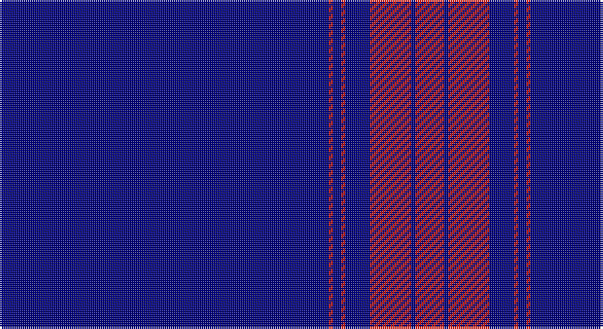

This page is one **sett** — a single exact thread-count. It belongs to the [tartan](/setts/db80r1db2r1db6r10db1r7/)
(the same proportion at any scale), whose colour order is pattern [BRBRBRBR](/stripes/brbrbrbr/).

Sourced from register-of-tartans.  It is a [8 stripe tartan](/stripes/stripes8/).

Original link https://www.tartanregister.gov.uk/tartanDetails.aspx?ref=10795

2 attestations — the source records this cloth was collapsed from (oldest owns this page)

<ul>
<li>24/01/2008 — Mack of Stoneywood Dress (Personal) (register-of-tartans, <a href="https://www.tartanregister.gov.uk/tartanDetails.aspx?ref=10795">record</a>)</li>
<li>Feb 2008 — Mack of Stoneywood Dress (Personal) (tartans-authority, <a href="http://www.tartansauthority.com/tartan-ferret/display/10795/">record</a>)</li>
</ul>

## Register references

External register numbers recorded for this tartan.

- Scottish Register of Tartans: [10795](https://www.tartanregister.gov.uk/tartanDetails.aspx?ref=10795)
- Scottish Tartans Authority (ITI): 10795

## Thread count
DB/160 R2 DB4 R2 DB12 R20 DB2 R/14

One full sett is **258 threads**.

## Palette

Palette: <strong>custom</strong>
<table><thead><tr><th>Colour</th><th>Threads</th><th>Shade</th><th>Base</th><th>OKLCh</th></tr></thead><tbody><tr><td>DB/</td><td style="text-align:right;font-variant-numeric:tabular-nums">160</td><td><code style="background-color:#000080;">#000080</code> <small style="color:#888">#000080</small></td><td>B <code style="background-color:#2A418A;">#2A418A</code></td><td><small style="color:#888">oklch(27.1% 0.188 264.1)</small></td></tr><tr><td>R</td><td style="text-align:right;font-variant-numeric:tabular-nums">2</td><td><code style="background-color:#E3170D;">#E3170D</code> <small style="color:#888">#E3170D</small></td><td>R <code style="background-color:#CC0000;">#CC0000</code></td><td><small style="color:#888">oklch(58.1% 0.230 29.4)</small></td></tr><tr><td>DB</td><td style="text-align:right;font-variant-numeric:tabular-nums">4</td><td><code style="background-color:#000080;">#000080</code> <small style="color:#888">#000080</small></td><td>B <code style="background-color:#2A418A;">#2A418A</code></td><td><small style="color:#888">oklch(27.1% 0.188 264.1)</small></td></tr><tr><td>R</td><td style="text-align:right;font-variant-numeric:tabular-nums">2</td><td><code style="background-color:#E3170D;">#E3170D</code> <small style="color:#888">#E3170D</small></td><td>R <code style="background-color:#CC0000;">#CC0000</code></td><td><small style="color:#888">oklch(58.1% 0.230 29.4)</small></td></tr><tr><td>DB</td><td style="text-align:right;font-variant-numeric:tabular-nums">12</td><td><code style="background-color:#000080;">#000080</code> <small style="color:#888">#000080</small></td><td>B <code style="background-color:#2A418A;">#2A418A</code></td><td><small style="color:#888">oklch(27.1% 0.188 264.1)</small></td></tr><tr><td>R</td><td style="text-align:right;font-variant-numeric:tabular-nums">20</td><td><code style="background-color:#E3170D;">#E3170D</code> <small style="color:#888">#E3170D</small></td><td>R <code style="background-color:#CC0000;">#CC0000</code></td><td><small style="color:#888">oklch(58.1% 0.230 29.4)</small></td></tr><tr><td>DB</td><td style="text-align:right;font-variant-numeric:tabular-nums">2</td><td><code style="background-color:#000080;">#000080</code> <small style="color:#888">#000080</small></td><td>B <code style="background-color:#2A418A;">#2A418A</code></td><td><small style="color:#888">oklch(27.1% 0.188 264.1)</small></td></tr><tr><td>R/</td><td style="text-align:right;font-variant-numeric:tabular-nums">14</td><td><code style="background-color:#E3170D;">#E3170D</code> <small style="color:#888">#E3170D</small></td><td>R <code style="background-color:#CC0000;">#CC0000</code></td><td><small style="color:#888">oklch(58.1% 0.230 29.4)</small></td></tr></tbody></table>

# Sample pattern

## Nearest tartans

The nearest existing variants by ΔTartan distance, with this tartan at the top so the swatches line up against it.

ΔTartan

Tartan

Sett

—

<a href="/ttd/edit/#slug=db80r1db2r1db6r10db1r7~x2">Mack of Stoneywood Dress (Personal)</a> <a class="nn-out" href="/variants/s8/db80r1db2r1db6r10db1r7~x2/" title="open its dictionary page">↗</a>

1.89

<a href="/ttd/edit/#slug=db43ly5db1ly4db1ly2db7w1db2~x2&amp;base=db80r1db2r1db6r10db1r7~x2">University of Delaware (Corporate)</a> <a class="nn-out" href="/variants/s9/db43ly5db1ly4db1ly2db7w1db2~x2/" title="open its dictionary page">↗</a>

1.91

<a href="/ttd/edit/#slug=db80w1lo8w3~x2&amp;base=db80r1db2r1db6r10db1r7~x2">Weir Minerals (Corporate)</a> <a class="nn-out" href="/variants/s4/db80w1lo8w3~x2/" title="open its dictionary page">↗</a>

2.02

<a href="/ttd/edit/#slug=b10db6b3db62w4db5~x2&amp;base=db80r1db2r1db6r10db1r7~x2">Auchairne</a> <a class="nn-out" href="/variants/s6/b10db6b3db62w4db5~x2/" title="open its dictionary page">↗</a>

2.03

<a href="/ttd/edit/#slug=db61r6w2r8lo2db3lo2db15~x2&amp;base=db80r1db2r1db6r10db1r7~x2">Duke of York (Royal)</a> <a class="nn-out" href="/variants/s8/db61r6w2r8lo2db3lo2db15~x2/" title="open its dictionary page">↗</a>

2.15

<a href="/ttd/edit/#slug=lo6db1lo1db1lo1db5lo2db5lo4db2r1db40r1~x2&amp;base=db80r1db2r1db6r10db1r7~x2">Angotta (Name)</a> <a class="nn-out" href="/variants/s13/lo6db1lo1db1lo1db5lo2db5lo4db2r1db40r1~x2/" title="open its dictionary page">↗</a>

2.25

<a href="/ttd/edit/#slug=w2db4r2db90w2db4r1~x2&amp;base=db80r1db2r1db6r10db1r7~x2">Spirit of Ulster</a> <a class="nn-out" href="/variants/s7/w2db4r2db90w2db4r1~x2/" title="open its dictionary page">↗</a>

2.27

<a href="/ttd/edit/#slug=ly6db1ly1db1ly1db5ly2db5ly4db2r1db40r1~x2&amp;base=db80r1db2r1db6r10db1r7~x2">Angotta</a> <a class="nn-out" href="/variants/s13/ly6db1ly1db1ly1db5ly2db5ly4db2r1db40r1~x2/" title="open its dictionary page">↗</a>

2.28

<a href="/ttd/edit/#slug=db66r16w2r1w1r1w2r16db66ly2~x2&amp;base=db80r1db2r1db6r10db1r7~x2">Cougan Irish Personal Tartan</a> <a class="nn-out" href="/variants/s10/db66r16w2r1w1r1w2r16db66ly2~x2/" title="open its dictionary page">↗</a>

2.29

<a href="/ttd/edit/#slug=b11db7b3db70lb4db6~x2&amp;base=db80r1db2r1db6r10db1r7~x2">Auchairne (Corporate)</a> <a class="nn-out" href="/variants/s6/b11db7b3db70lb4db6~x2/" title="open its dictionary page">↗</a>

2.33

<a href="/ttd/edit/#slug=b7db5w6db5r7db2b2db70w2&amp;base=db80r1db2r1db6r10db1r7~x2">United States (Corporate)</a> <a class="nn-out" href="/variants/s9/b7db5w6db5r7db2b2db70w2/" title="open its dictionary page">↗</a>

## Neighbour map

Every grey dot is one of 14360 variants placed by the first two principal components of the ΔTartan feature space (44% of its variance). Red is this tartan; blue dots are its nearest — click one to open its page.

<svg viewBox="0 0 640 380" role="img" style="max-width:100%;height:auto;border:1px solid #e0e0e0;border-radius:4px;display:block" xmlns="http://www.w3.org/2000/svg"><image href="/nn/cloud.v1.png" width="640" height="380"/><a href="/variants/s9/db43ly5db1ly4db1ly2db7w1db2~x2/"><circle cx="579.9" cy="110.7" r="4" fill="#3465a4"><title>University of Delaware (Corporate)</title></circle></a><a href="/variants/s4/db80w1lo8w3~x2/"><circle cx="626.0" cy="169.7" r="4" fill="#3465a4"><title>Weir Minerals (Corporate)</title></circle></a><a href="/variants/s6/b10db6b3db62w4db5~x2/"><circle cx="552.3" cy="185.8" r="4" fill="#3465a4"><title>Auchairne</title></circle></a><a href="/variants/s8/db61r6w2r8lo2db3lo2db15~x2/"><circle cx="550.3" cy="141.9" r="4" fill="#3465a4"><title>Duke of York (Royal)</title></circle></a><a href="/variants/s13/lo6db1lo1db1lo1db5lo2db5lo4db2r1db40r1~x2/"><circle cx="568.2" cy="104.4" r="4" fill="#3465a4"><title>Angotta (Name)</title></circle></a><a href="/variants/s7/w2db4r2db90w2db4r1~x2/"><circle cx="626.0" cy="142.7" r="4" fill="#3465a4"><title>Spirit of Ulster</title></circle></a><a href="/variants/s13/ly6db1ly1db1ly1db5ly2db5ly4db2r1db40r1~x2/"><circle cx="546.6" cy="89.1" r="4" fill="#3465a4"><title>Angotta</title></circle></a><a href="/variants/s10/db66r16w2r1w1r1w2r16db66ly2~x2/"><circle cx="545.6" cy="114.9" r="4" fill="#3465a4"><title>Cougan Irish Personal Tartan</title></circle></a><a href="/variants/s6/b11db7b3db70lb4db6~x2/"><circle cx="612.6" cy="198.8" r="4" fill="#3465a4"><title>Auchairne (Corporate)</title></circle></a><a href="/variants/s9/b7db5w6db5r7db2b2db70w2/"><circle cx="524.5" cy="107.9" r="4" fill="#3465a4"><title>United States (Corporate)</title></circle></a><circle cx="626.0" cy="139.1" r="5" fill="#c00000"/></svg>

ID: /variants/s8/db80r1db2r1db6r10db1r7~x2/
