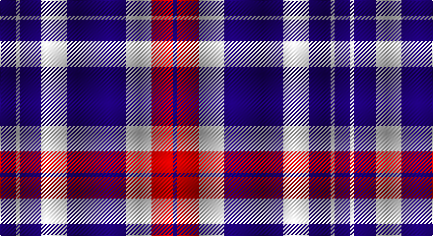

This page is one **sett** — a single exact thread-count. It belongs to the [tartan](/setts/db8w2db11w13db30w13r11db2/)
(the same proportion at any scale), whose colour order is pattern [BRWBWBWB](/stripes/brwbwbwb/).

Part of the [Jubilation](/tartans/jubilation/) tartan — the named design grouping this sett with its other cloths.

Sourced from tartans-authority.  It is a [8 stripe tartan](/stripes/stripes8/).

Original link http://www.tartansauthority.com/tartan-ferret/display/2566/

## Register references

External register numbers recorded for this tartan.

- Scottish Tartans Authority (ITI): 2566

## Thread count
DB/16 LN4 DB22 LN26 DB60 LN26 R22 DB/4

One full sett is **340 threads**.

## Palette

Palette: <strong>Tartan Register</strong>
<table><thead><tr><th>Colour</th><th>Threads</th><th>Shade</th><th>Base</th><th>OKLCh</th></tr></thead><tbody><tr><td>DB/</td><td style="text-align:right;font-variant-numeric:tabular-nums">16</td><td><code style="background-color:#1C0070;">#1C0070</code> <small style="color:#888">#1C0070</small></td><td>B <code style="background-color:#2A418A;">#2A418A</code></td><td><small style="color:#888">oklch(26.3% 0.162 277.1)</small></td></tr><tr><td>LN</td><td style="text-align:right;font-variant-numeric:tabular-nums">4</td><td><code style="background-color:#E0E0E0;">#E0E0E0</code> <small style="color:#888">#E0E0E0</small></td><td>W <code style="background-color:#F7F7F7;">#F7F7F7</code></td><td><small style="color:#888">oklch(90.7% 0.000 89.9)</small></td></tr><tr><td>DB</td><td style="text-align:right;font-variant-numeric:tabular-nums">22</td><td><code style="background-color:#1C0070;">#1C0070</code> <small style="color:#888">#1C0070</small></td><td>B <code style="background-color:#2A418A;">#2A418A</code></td><td><small style="color:#888">oklch(26.3% 0.162 277.1)</small></td></tr><tr><td>LN</td><td style="text-align:right;font-variant-numeric:tabular-nums">26</td><td><code style="background-color:#E0E0E0;">#E0E0E0</code> <small style="color:#888">#E0E0E0</small></td><td>W <code style="background-color:#F7F7F7;">#F7F7F7</code></td><td><small style="color:#888">oklch(90.7% 0.000 89.9)</small></td></tr><tr><td>DB</td><td style="text-align:right;font-variant-numeric:tabular-nums">60</td><td><code style="background-color:#1C0070;">#1C0070</code> <small style="color:#888">#1C0070</small></td><td>B <code style="background-color:#2A418A;">#2A418A</code></td><td><small style="color:#888">oklch(26.3% 0.162 277.1)</small></td></tr><tr><td>LN</td><td style="text-align:right;font-variant-numeric:tabular-nums">26</td><td><code style="background-color:#E0E0E0;">#E0E0E0</code> <small style="color:#888">#E0E0E0</small></td><td>W <code style="background-color:#F7F7F7;">#F7F7F7</code></td><td><small style="color:#888">oklch(90.7% 0.000 89.9)</small></td></tr><tr><td>R</td><td style="text-align:right;font-variant-numeric:tabular-nums">22</td><td><code style="background-color:#C80000;">#C80000</code> <small style="color:#888">#C80000</small></td><td>R <code style="background-color:#CC0000;">#CC0000</code></td><td><small style="color:#888">oklch(52.3% 0.215 29.2)</small></td></tr><tr><td>DB/</td><td style="text-align:right;font-variant-numeric:tabular-nums">4</td><td><code style="background-color:#1C0070;">#1C0070</code> <small style="color:#888">#1C0070</small></td><td>B <code style="background-color:#2A418A;">#2A418A</code></td><td><small style="color:#888">oklch(26.3% 0.162 277.1)</small></td></tr></tbody></table>

# Sample pattern

## Compared to the master

This cloth is one sett of its design; the master sett (the exemplar the design is anchored on) is below for comparison.

<figure style="margin:0"><figcaption style="color:#888;font-size:smaller">this sett</figcaption></figure>
<figure style="margin:0"><figcaption style="color:#888;font-size:smaller"><a href="/setts/r11w13db30w13db11w2db8w2db11w13db30w13r11db2/">master sett →</a></figcaption></figure>

## Nearest tartans

The nearest existing variants by ΔTartan distance, with this tartan at the top so the swatches line up against it.

ΔTartan

Tartan

Sett

—

<a href="/ttd/edit/#slug=db8w2db11w13db30w13r11db2~x2">Jubilation (Commemorative)</a> <a class="nn-out" href="/variants/s8/db8w2db11w13db30w13r11db2~x2/" title="open its dictionary page">↗</a>

1.18

<a href="/ttd/edit/#slug=r11w13db30w13db11w2db8w2db11w13db30w13r11db2~x2&amp;base=db8w2db11w13db30w13r11db2~x2">Jubilation</a> <a class="nn-out" href="/variants/s14/r11w13db30w13db11w2db8w2db11w13db30w13r11db2~x2/" title="open its dictionary page">↗</a>

1.36

<a href="/ttd/edit/#slug=k1w3db2w4db8w1db1~x6&amp;base=db8w2db11w13db30w13r11db2~x2">Queen Margaret University (Corporate</a> <a class="nn-out" href="/variants/s7/k1w3db2w4db8w1db1~x6/" title="open its dictionary page">↗</a>

1.57

<a href="/ttd/edit/#slug=db8w3db28w32k3w4~x2&amp;base=db8w2db11w13db30w13r11db2~x2">Ailsa, Navy (Dance)</a> <a class="nn-out" href="/variants/s6/db8w3db28w32k3w4~x2/" title="open its dictionary page">↗</a>

1.62

<a href="/ttd/edit/#slug=db2w2r2w2r2db2r2db12ly1db2w2~x4&amp;base=db8w2db11w13db30w13r11db2~x2">Good Morning America (Corporate)</a> <a class="nn-out" href="/variants/s11/db2w2r2w2r2db2r2db12ly1db2w2~x4/" title="open its dictionary page">↗</a>

1.68

<a href="/ttd/edit/#slug=db5r2db5w7db32w7r13db3r13w2~x2&amp;base=db8w2db11w13db30w13r11db2~x2">America (Eagle version)</a> <a class="nn-out" href="/variants/s10/db5r2db5w7db32w7r13db3r13w2~x2/" title="open its dictionary page">↗</a>

1.68

<a href="/ttd/edit/#slug=k15n3w10n7dp40w3dp6~x2&amp;base=db8w2db11w13db30w13r11db2~x2">Loughborough Sport</a> <a class="nn-out" href="/variants/s7/k15n3w10n7dp40w3dp6~x2/" title="open its dictionary page">↗</a>

1.69

<a href="/ttd/edit/#slug=db11k4w5k1r3k1w5k4db11r1~x4&amp;base=db8w2db11w13db30w13r11db2~x2">Hydro-Electric</a> <a class="nn-out" href="/variants/s10/db11k4w5k1r3k1w5k4db11r1~x4/" title="open its dictionary page">↗</a>

1.70

<a href="/ttd/edit/#slug=w8k16w2db2w1k1~x4&amp;base=db8w2db11w13db30w13r11db2~x2">Ikelman No 1</a> <a class="nn-out" href="/variants/s6/w8k16w2db2w1k1~x4/" title="open its dictionary page">↗</a>

1.72

<a href="/ttd/edit/#slug=db10g4w27db40r4~x2&amp;base=db8w2db11w13db30w13r11db2~x2">Turnbull Dress, Bruce (Personal)</a> <a class="nn-out" href="/variants/s5/db10g4w27db40r4~x2/" title="open its dictionary page">↗</a>

1.73

<a href="/ttd/edit/#slug=w24db12w1db2w2db2w1db12dt3db4dt3db20~x2&amp;base=db8w2db11w13db30w13r11db2~x2">Costa, David (Personal)</a> <a class="nn-out" href="/variants/s12/w24db12w1db2w2db2w1db12dt3db4dt3db20~x2/" title="open its dictionary page">↗</a>

## Neighbour map

Every grey dot is one of 14360 variants placed by the first two principal components of the ΔTartan feature space (44% of its variance). Red is this tartan; blue dots are its nearest — click one to open its page.

<svg viewBox="0 0 640 380" role="img" style="max-width:100%;height:auto;border:1px solid #e0e0e0;border-radius:4px;display:block" xmlns="http://www.w3.org/2000/svg"><image href="/nn/cloud.v1.png" width="640" height="380"/><a href="/variants/s14/r11w13db30w13db11w2db8w2db11w13db30w13r11db2~x2/"><circle cx="257.7" cy="168.3" r="4" fill="#3465a4"><title>Jubilation</title></circle></a><a href="/variants/s7/k1w3db2w4db8w1db1~x6/"><circle cx="279.6" cy="209.8" r="4" fill="#3465a4"><title>Queen Margaret University (Corporate</title></circle></a><a href="/variants/s6/db8w3db28w32k3w4~x2/"><circle cx="278.4" cy="190.9" r="4" fill="#3465a4"><title>Ailsa, Navy (Dance)</title></circle></a><a href="/variants/s11/db2w2r2w2r2db2r2db12ly1db2w2~x4/"><circle cx="285.3" cy="142.7" r="4" fill="#3465a4"><title>Good Morning America (Corporate)</title></circle></a><a href="/variants/s10/db5r2db5w7db32w7r13db3r13w2~x2/"><circle cx="289.2" cy="158.2" r="4" fill="#3465a4"><title>America (Eagle version)</title></circle></a><a href="/variants/s7/k15n3w10n7dp40w3dp6~x2/"><circle cx="269.7" cy="161.7" r="4" fill="#3465a4"><title>Loughborough Sport</title></circle></a><a href="/variants/s10/db11k4w5k1r3k1w5k4db11r1~x4/"><circle cx="193.4" cy="171.7" r="4" fill="#3465a4"><title>Hydro-Electric</title></circle></a><a href="/variants/s6/w8k16w2db2w1k1~x4/"><circle cx="325.0" cy="176.5" r="4" fill="#3465a4"><title>Ikelman No 1</title></circle></a><a href="/variants/s5/db10g4w27db40r4~x2/"><circle cx="287.5" cy="201.3" r="4" fill="#3465a4"><title>Turnbull Dress, Bruce (Personal)</title></circle></a><a href="/variants/s12/w24db12w1db2w2db2w1db12dt3db4dt3db20~x2/"><circle cx="342.7" cy="130.6" r="4" fill="#3465a4"><title>Costa, David (Personal)</title></circle></a><circle cx="287.6" cy="189.2" r="5" fill="#c00000"/></svg>

ID: /variants/s8/db8w2db11w13db30w13r11db2~x2/
