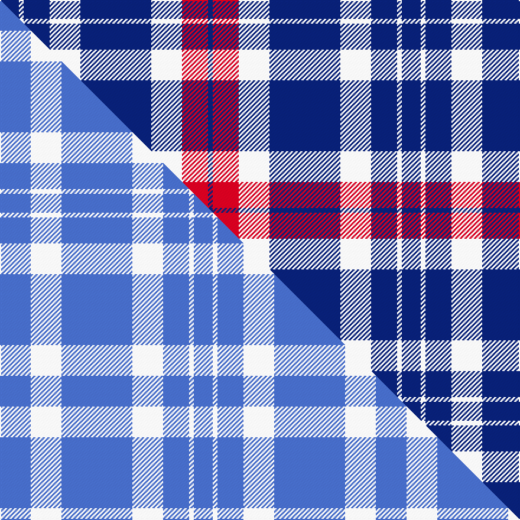

This page is one **sett** — a single exact thread-count. It belongs to the [tartan](/setts/db8w2db11w13db30w13r11db2/)
(the same proportion at any scale), whose colour order is pattern [BRWBWBWB](/stripes/brwbwbwb/).

Part of the [Jubilation](/tartans/jubilation/) tartan — the named design grouping this sett with its other cloths.

Sourced from tartans-authority.  It is a [8 stripe tartan](/stripes/stripes8/).

Original link http://www.tartansauthority.com/tartan-ferret/display/2566/

## Register references

External register numbers recorded for this tartan.

- Scottish Tartans Authority (ITI): 2566

## Thread count
DB/16 W4 DB22 W26 DB60 W26 R22 DB/4

One full sett is **340 threads**.

## Palette
<table><thead><tr><th>Colour</th><th>Shade</th><th>OKLCh</th></tr></thead><tbody><tr><td>DB</td><td><code style="background-color:#082077;">#082077</code> <small style="color:#888">#082077</small></td><td><small style="color:#888">oklch(30.0% 0.149 265.1)</small></td></tr><tr><td>W</td><td><code style="background-color:#F7F7F7;">#F7F7F7</code> <small style="color:#888">#F7F7F7</small></td><td><small style="color:#888">oklch(97.6% 0.000 89.9)</small></td></tr><tr><td>R</td><td><code style="background-color:#D60020;">#D60020</code> <small style="color:#888">#D60020</small></td><td><small style="color:#888">oklch(55.2% 0.224 25.5)</small></td></tr></tbody></table>

# Sample pattern

## Compared to the master

This cloth is one sett of its design; the master sett (the exemplar the design is anchored on) is below for comparison.

Its **ΔTartan distance** from the master is **3.53** — the same measure the nearest-tartans table ranks by (0 is identical; a re-scale of the same cloth is near 0, a recolour or a different proportion further).

<figure class="master-compare" style="margin:0">

this sett
master sett ★

<figcaption style="color:#888;font-size:smaller">One weave of this sett against the <a href="/setts/b13w13b30w13b11w2b8/">master sett ★</a>, split on the diagonal: a shared proportion runs seamlessly across it with only the shades shifting; a different proportion breaks on it.</figcaption>
</figure>

## Nearest tartan variants

The nearest existing variants by ΔTartan distance, with this cloth at the top so the swatches line up against it.

ΔTartan

Threads

Variant

Sett

—

340

<a href="/variants/s8/db8w2db11w13db30w13r11db2~x2/">Jubilation (Commemorative)</a>

<a href="/ttd/edit/#slug=dy7db7dy4db26w12db3w14dr2db6&amp;base=db8w2db11w13db30w13r11db2~x2" title="compare in the TTD">1.93</a>

149

<a href="/variants/s9/dy7db7dy4db26w12db3w14dr2db6/">Aquascutum (Kinloch Anderson)</a>

<a href="/ttd/edit/#slug=db33w7db5r2db5w2r13db3~x2&amp;base=db8w2db11w13db30w13r11db2~x2" title="compare in the TTD">1.98</a>

208

<a href="/variants/s8/db33w7db5r2db5w2r13db3~x2/">Americana - 1978 (Fashion)</a>

<a href="/ttd/edit/#slug=lb3k24lb6k8w4k8lb35k2~x2&amp;base=db8w2db11w13db30w13r11db2~x2" title="compare in the TTD">2.14</a>

350

<a href="/variants/s8/lb3k24lb6k8w4k8lb35k2~x2/">Nowell/Noel 1951 (Name)</a>

<a href="/ttd/edit/#slug=w16db3w2db3w2db3r5db6w2~x4&amp;base=db8w2db11w13db30w13r11db2~x2" title="compare in the TTD">2.29</a>

264

<a href="/variants/s9/w16db3w2db3w2db3r5db6w2~x4/">Jeux Canada Games '87 (Corporate)</a>

<a href="/ttd/edit/#slug=db8r2db18r1db2w10db4~x2&amp;base=db8w2db11w13db30w13r11db2~x2" title="compare in the TTD">2.74</a>

156

<a href="/variants/s7/db8r2db18r1db2w10db4~x2/">Nike ACG Lunarstorm (Fashion)</a>

<a href="/ttd/edit/#slug=db12w4db1w4r8w2r1~x4&amp;base=db8w2db11w13db30w13r11db2~x2" title="compare in the TTD">2.74</a>

204

<a href="/variants/s7/db12w4db1w4r8w2r1~x4/">Sunderland</a>

<a href="/ttd/edit/#slug=y2w21db16lb8db30w8db1~x2&amp;base=db8w2db11w13db30w13r11db2~x2" title="compare in the TTD">2.86</a>

338

<a href="/variants/s7/y2w21db16lb8db30w8db1~x2/">Muir, John</a>

<a href="/ttd/edit/#slug=db7w1r7db4r2db4w2~x2&amp;base=db8w2db11w13db30w13r11db2~x2" title="compare in the TTD">2.92</a>

90

<a href="/variants/s7/db7w1r7db4r2db4w2~x2/">Coronation</a>

<a href="/ttd/edit/#slug=db11w1r12db6r1db6w1~x2&amp;base=db8w2db11w13db30w13r11db2~x2" title="compare in the TTD">2.92</a>

128

<a href="/variants/s7/db11w1r12db6r1db6w1~x2/">Coronation</a>

<a href="/ttd/edit/#slug=db11w1r12db6r1db6w1~x4&amp;base=db8w2db11w13db30w13r11db2~x2" title="compare in the TTD">2.92</a>

256

<a href="/variants/s7/db11w1r12db6r1db6w1~x4/">Coronation (1936) #2</a>

## Neighbour map

Every grey dot is one of 13620 variants placed by the first two principal components of the ΔTartan feature space (42% of its variance). Red is this tartan; blue dots are its nearest — click one to open its page.

<svg viewBox="0 0 640 380" role="img" style="max-width:100%;height:auto;border:1px solid #e0e0e0;border-radius:4px;display:block" xmlns="http://www.w3.org/2000/svg"><image href="/nn/cloud.v1.png" width="640" height="380"/><a href="/variants/s9/dy7db7dy4db26w12db3w14dr2db6/"><circle cx="261.9" cy="195.9" r="4" fill="#3465a4"><title>Aquascutum (Kinloch Anderson)</title></circle></a><a href="/variants/s8/db33w7db5r2db5w2r13db3~x2/"><circle cx="384.0" cy="163.8" r="4" fill="#3465a4"><title>Americana - 1978 (Fashion)</title></circle></a><a href="/variants/s8/lb3k24lb6k8w4k8lb35k2~x2/"><circle cx="274.0" cy="160.0" r="4" fill="#3465a4"><title>Nowell/Noel 1951 (Name)</title></circle></a><a href="/variants/s9/w16db3w2db3w2db3r5db6w2~x4/"><circle cx="262.8" cy="203.4" r="4" fill="#3465a4"><title>Jeux Canada Games '87 (Corporate)</title></circle></a><a href="/variants/s7/db8r2db18r1db2w10db4~x2/"><circle cx="402.1" cy="181.5" r="4" fill="#3465a4"><title>Nike ACG Lunarstorm (Fashion)</title></circle></a><a href="/variants/s7/db12w4db1w4r8w2r1~x4/"><circle cx="222.1" cy="204.6" r="4" fill="#3465a4"><title>Sunderland</title></circle></a><a href="/variants/s7/y2w21db16lb8db30w8db1~x2/"><circle cx="314.6" cy="175.3" r="4" fill="#3465a4"><title>Muir, John</title></circle></a><a href="/variants/s7/db7w1r7db4r2db4w2~x2/"><circle cx="274.6" cy="246.8" r="4" fill="#3465a4"><title>Coronation</title></circle></a><a href="/variants/s7/db11w1r12db6r1db6w1~x2/"><circle cx="355.2" cy="206.2" r="4" fill="#3465a4"><title>Coronation</title></circle></a><a href="/variants/s7/db11w1r12db6r1db6w1~x4/"><circle cx="355.2" cy="206.2" r="4" fill="#3465a4"><title>Coronation (1936) #2</title></circle></a><circle cx="292.4" cy="198.1" r="5" fill="#c00000"/><text x="320" y="376" text-anchor="middle" font-size="11" fill="#999">ground</text><text x="11" y="190" text-anchor="middle" font-size="11" fill="#999" transform="rotate(-90 11 190)">complexity</text></svg>

ID: /variants/s8/db8w2db11w13db30w13r11db2~x2/
