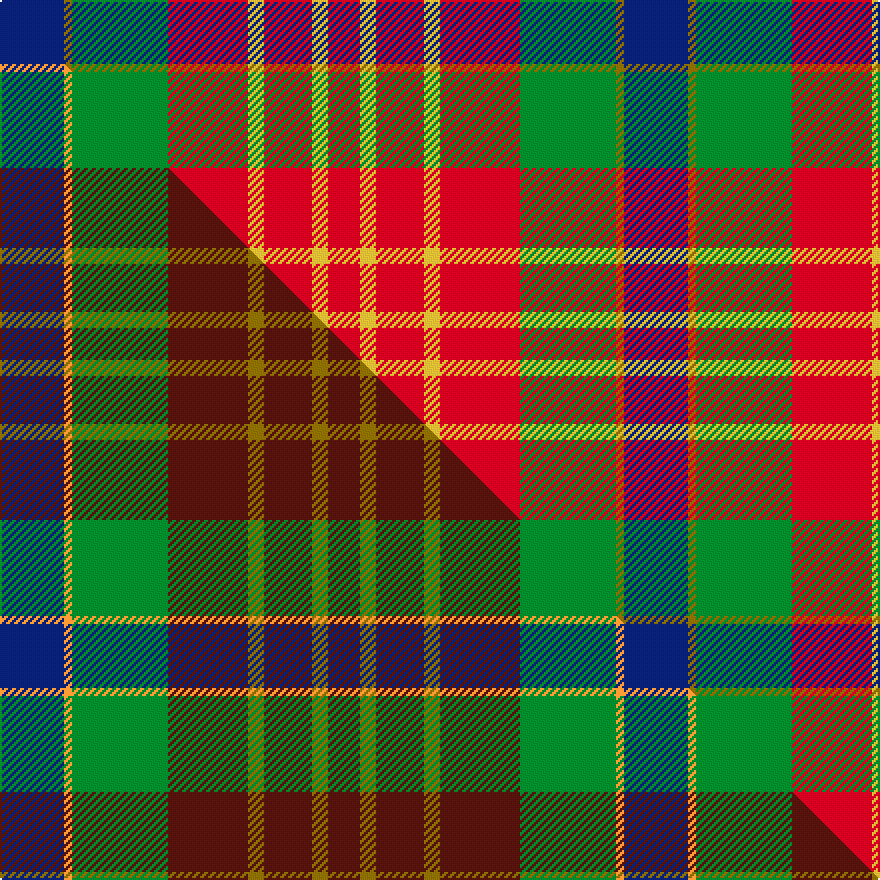

This is one **variant** — a specific cloth: this exact thread count and colourway, with its own
provenance below. It is one weaving of the [sett](/setts/db8y1g12r10ly2r6ly2r4/) (the scale-free proportion — the
same cloth at any scale or shade), whose colour order is pattern [BGGRYRYR](/stripes/bggryryr/).

Part of the [Indiana "Cardinal"](/tartans/i/in/indiana-cardinal/) tartan — the named design grouping this sett with its other cloths.

Sourced from register-of-tartans.  It is a [8 stripe tartan](/stripes/stripes8/).

Original link [https://www.tartanregister.gov.uk/tartanDetails.aspx?ref=5874](https://www.tartanregister.gov.uk/tartanDetails.aspx?ref=5874)

Dataset <small>— provenance for this record, inherited from the source manifest</small>

<dl class="dataset-prov">
<dt>source</dt><dd><a href="/sources/register-of-tartans/">Scottish Register of Tartans</a></dd>
<dt>data captured from</dt><dd><a href="https://github.com/thetartan/tartan-database/blob/master/data/register-of-tartans/data.csv">https://github.com/thetartan/tartan-database/blob/master/data/register-of-tartans/data.csv</a></dd>
<dt>data date</dt><dd>1992 <small>(this record)</small></dd>
<dt>licence</dt><dd><a href="https://www.tartanregister.gov.uk/copyright">Crown copyright</a></dd>
</dl>

Capture chain <small>— the hands this data passed through, oldest first; each capture carries its own licence</small>

<ol class="capture-chain">
<li><a href="https://www.tartanregister.gov.uk/">Scottish Register of Tartans</a> · <a href="https://www.tartanregister.gov.uk/copyright">Crown copyright</a> <small>the living register — still published by National Records of Scotland</small></li>
<li><a href="https://github.com/thetartan/tartan-database">thetartan/tartan-database</a> <small>2016-2017</small> · <a href="https://creativecommons.org/licenses/by-nc-nd/4.0/">CC BY-NC-ND 4.0</a> <small>Levko Kravets's frozen compilation — the capture we vendored, and where its CC licence text came from</small></li>
<li>this dictionary <small>captured 2026-06-10 · commit 5bf86c7566</small> <small>each re-capture is a git commit to data/sources</small></li>
</ol>

## Register references

External register numbers recorded for this tartan.

- Scottish Register of Tartans: [5874](https://www.tartanregister.gov.uk/tartanDetails.aspx?ref=5874)
- Scottish Tartans World Register: 3131

## Thread count
DB/32 Y4 G48 R40 LY8 R24 LY8 R/16

One full sett is **312 threads**.

## Palette
<table><thead><tr><th>Colour</th><th>Shade</th><th>OKLCh</th></tr></thead><tbody><tr><td>DB</td><td><code style="background-color:#082077;">#082077</code> <small style="color:#888">#082077</small></td><td><small style="color:#888">oklch(30.0% 0.149 265.1)</small></td></tr><tr><td>LY</td><td><code style="background-color:#DCBC32;">#DCBC32</code> <small style="color:#888">#DCBC32</small></td><td><small style="color:#888">oklch(80.0% 0.150 95.2)</small></td></tr><tr><td>G</td><td><code style="background-color:#008B2A;">#008B2A</code> <small style="color:#888">#008B2A</small></td><td><small style="color:#888">oklch(55.4% 0.170 145.9)</small></td></tr><tr><td>R</td><td><code style="background-color:#D60020;">#D60020</code> <small style="color:#888">#D60020</small></td><td><small style="color:#888">oklch(55.2% 0.224 25.5)</small></td></tr><tr><td>Y</td><td><code style="background-color:#8B6E00;">#8B6E00</code> <small style="color:#888">#8B6E00</small></td><td><small style="color:#888">oklch(55.1% 0.113 90.4)</small></td></tr></tbody></table>

# Sample pattern

## Compared to the master

This cloth is one sett of its design; the master sett (the exemplar the design is anchored on) is below for comparison.

Its **ΔTartan distance** from the master is **0.92** — the same measure the nearest-tartans table ranks by (0 is identical; a re-scale of the same cloth is near 0, a recolour or a different proportion further).

<figure class="master-compare" style="margin:0">

this sett
master sett ★

<figcaption style="color:#888;font-size:smaller">One weave of this sett against the <a href="/setts/db8lo1g12dr10y2dr6y2dr4/">master sett ★</a>, split on the diagonal: a shared proportion runs seamlessly across it with only the shades shifting; a different proportion breaks on it.</figcaption>
</figure>

## Nearest tartan variants

The nearest existing variants by ΔTartan distance, with this cloth at the top so the swatches line up against it.

ΔTartan

Threads

Variant

Sett

—

312

<a href="/variants/s8/db8y1g12r10ly2r6ly2r4~x4/">Indiana &quot;Cardinal&quot;</a>

<a href="/ttd/edit/#slug=r1dy1r9g6lg2gi3r2y1~x4~lg2803208-gi2203208&amp;base=db8y1g12r10ly2r6ly2r4~x4" title="compare in the TTD">1.17</a>

192

<a href="/variants/s8/r1dy1r9g6lg2t3r2y1~x4~lg2803208-t2203208/">Battle of Bannockburn, The</a>

<a href="/ttd/edit/#slug=r1do1r9g6lb2t3r2ly1~x4&amp;base=db8y1g12r10ly2r6ly2r4~x4" title="compare in the TTD">1.47</a>

192

<a href="/variants/s8/r1do1r9g6lb2t3r2ly1~x4/">Battle of Bannockburn, The</a>

<a href="/ttd/edit/#slug=r52t16k16g22r16lo3r16~x2&amp;base=db8y1g12r10ly2r6ly2r4~x4" title="compare in the TTD">1.79</a>

428

<a href="/variants/s7/r52t16k16g22r16lo3r16~x2/">Sturrock (Blue/Black)</a>

<a href="/ttd/edit/#slug=r6g16r4db12r16w1r2~x2&amp;base=db8y1g12r10ly2r6ly2r4~x4" title="compare in the TTD">2.11</a>

212

<a href="/variants/s7/r6g16r4db12r16w1r2~x2/">MacQuarrie LO</a>

<a href="/ttd/edit/#slug=r6g16r4db12r16lb1r2~x2&amp;base=db8y1g12r10ly2r6ly2r4~x4" title="compare in the TTD">2.11</a>

212

<a href="/variants/s7/r6g16r4db12r16lb1r2~x2/">MacQuarrie #6</a>

<a href="/ttd/edit/#slug=r13lb3r13g12y2dp9lb9r13dp2~x2&amp;base=db8y1g12r10ly2r6ly2r4~x4" title="compare in the TTD">2.29</a>

274

<a href="/variants/s9/r13lb3r13g12y2dp9lb9r13dp2~x2/">Caledonia No 3</a>

<a href="/ttd/edit/#slug=b2r11lb9b11y2g13r21w2~x2&amp;base=db8y1g12r10ly2r6ly2r4~x4" title="compare in the TTD">2.36</a>

276

<a href="/variants/s8/b2r11lb9b11y2g13r21w2~x2/">Wilson's, No 2</a>

<a href="/ttd/edit/#slug=dp1r5g15r3dp9r10w1~x4&amp;base=db8y1g12r10ly2r6ly2r4~x4" title="compare in the TTD">2.39</a>

344

<a href="/variants/s7/dp1r5g15r3dp9r10w1~x4/">Geddes</a>

<a href="/ttd/edit/#slug=dr24n5o9n2o9w9~x4&amp;base=db8y1g12r10ly2r6ly2r4~x4" title="compare in the TTD">2.42</a>

332

<a href="/variants/s6/dr24n5o9n2o9w9~x4/">Plaid Wine</a>

<a href="/ttd/edit/#slug=w4dg20g10r25b2r2g2~x2&amp;base=db8y1g12r10ly2r6ly2r4~x4" title="compare in the TTD">2.55</a>

248

<a href="/variants/s7/w4dg20g10r25b2r2g2~x2/">Caledonian Brewery</a>

## Neighbour map

Every grey dot is one of 13656 variants placed by the first two principal components of the ΔTartan feature space (42% of its variance). Red is this tartan; blue dots are its nearest — click one to open its page. The map is a flat projection of a many-dimensional space — [how to read it](/posts/neighbourhood-maps/).

<svg viewBox="0 0 640 380" role="img" style="max-width:100%;height:auto;border:1px solid #e0e0e0;border-radius:4px;display:block" xmlns="http://www.w3.org/2000/svg"><image href="/nn/cloud.v1.png" width="640" height="380"/><a href="/variants/s8/r1dy1r9g6lg2t3r2y1~x4~lg2803208-t2203208/"><circle cx="247.3" cy="185.8" r="4" fill="#3465a4"><title>Battle of Bannockburn, The</title></circle></a><a href="/variants/s8/r1do1r9g6lb2t3r2ly1~x4/"><circle cx="234.8" cy="181.5" r="4" fill="#3465a4"><title>Battle of Bannockburn, The</title></circle></a><a href="/variants/s7/r52t16k16g22r16lo3r16~x2/"><circle cx="174.1" cy="144.3" r="4" fill="#3465a4"><title>Sturrock (Blue/Black)</title></circle></a><a href="/variants/s7/r6g16r4db12r16w1r2~x2/"><circle cx="271.1" cy="191.5" r="4" fill="#3465a4"><title>MacQuarrie LO</title></circle></a><a href="/variants/s7/r6g16r4db12r16lb1r2~x2/"><circle cx="274.6" cy="192.6" r="4" fill="#3465a4"><title>MacQuarrie #6</title></circle></a><a href="/variants/s9/r13lb3r13g12y2dp9lb9r13dp2~x2/"><circle cx="221.1" cy="225.1" r="4" fill="#3465a4"><title>Caledonia No 3</title></circle></a><a href="/variants/s8/b2r11lb9b11y2g13r21w2~x2/"><circle cx="204.0" cy="187.8" r="4" fill="#3465a4"><title>Wilson's, No 2</title></circle></a><a href="/variants/s7/dp1r5g15r3dp9r10w1~x4/"><circle cx="247.3" cy="196.1" r="4" fill="#3465a4"><title>Geddes</title></circle></a><a href="/variants/s6/dr24n5o9n2o9w9~x4/"><circle cx="222.4" cy="214.6" r="4" fill="#3465a4"><title>Plaid Wine</title></circle></a><a href="/variants/s7/w4dg20g10r25b2r2g2~x2/"><circle cx="217.5" cy="173.1" r="4" fill="#3465a4"><title>Caledonian Brewery</title></circle></a><circle cx="209.7" cy="194.3" r="5" fill="#c00000"/><text x="320" y="376" text-anchor="middle" font-size="11" fill="#999">ground</text><text x="11" y="190" text-anchor="middle" font-size="11" fill="#999" transform="rotate(-90 11 190)">complexity</text></svg>

ID: /variants/s8/db8y1g12r10ly2r6ly2r4~x4/
