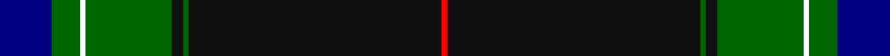
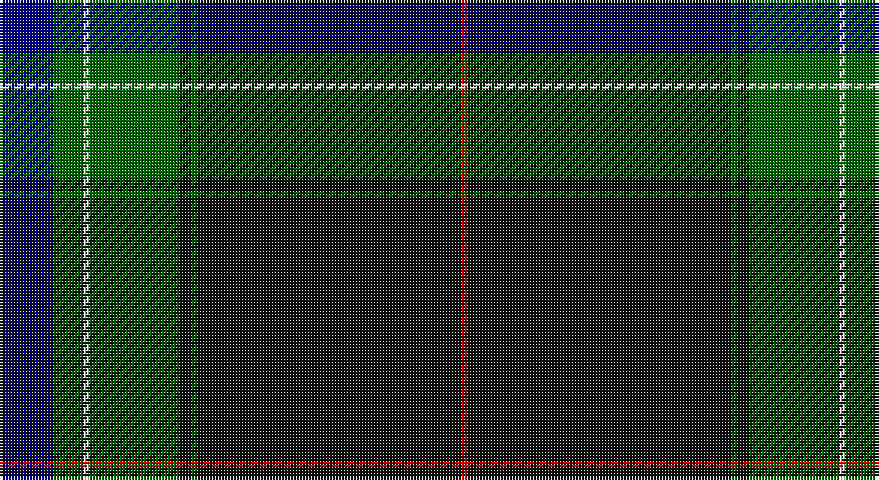

This page is one **sett** — a single exact thread-count. It belongs to the [tartan](/setts/db9g5w1g15k2g1k44r1/)
(the same proportion at any scale), whose colour order is pattern [BGWGKGKR](/stripes/bgwgkgkr/).

Sourced from register-of-tartans.  It is a [8 stripe tartan](/stripes/stripes8/).

Original link https://www.tartanregister.gov.uk/tartanDetails.aspx?ref=10737

## Provenance

Earliest known date: 14 November 2012 In this design, numerical significance predominates with the marriage date of Mr & Mrs Ataç and the birthday of Mrs Ataç. The blue band between the narrow whites has 18 threads, the dark green next to it has 10 and the broad black has 88 giving the date of 18th October 1988.The broader dark grren has 30 threads and, teamed with the narrower dark green of 10, produces Mrs Ataç's birthday of the 30th of October. The colours of green and red also represent the corporate colours of Mr Ataç's company.

## Also known as

This cloth is also recorded under:

- Ata?, H.M. & I.C.

2 attestations — the source records this cloth was collapsed from (oldest owns this page)

<ul>
<li>16/10/2012 — Ataç, H.M. & I.C. (Personal) (register-of-tartans, <a href="https://www.tartanregister.gov.uk/tartanDetails.aspx?ref=10737">record</a>)</li>
<li>undated — Ataç, H.M. & I.C. (Personal) Name Tartan (house-of-tartan, <a href="http://www.house-of-tartan.scotland.net/house/TartanViewjs.asp?colr=Def&tnam=10737">record</a>)</li>
</ul>

## Register references

External register numbers recorded for this tartan.

- Scottish Register of Tartans: [10737](https://www.tartanregister.gov.uk/tartanDetails.aspx?ref=10737)

## Thread count
DB/18 G10 W2 G30 K4 G2 K88 R/2

One full sett is **292 threads**.

## Palette

Palette: <strong>Tartan Register</strong> <small style="color:#888">(4 of 5 colours)</small>
<table><thead><tr><th>Colour</th><th>Threads</th><th>Shade</th><th>Base</th><th>OKLCh</th></tr></thead><tbody><tr><td>DB/</td><td style="text-align:right;font-variant-numeric:tabular-nums">18</td><td><code style="background-color:#000080;">#000080</code> <small style="color:#888">#000080</small></td><td>B <code style="background-color:#2A418A;">#2A418A</code></td><td><small style="color:#888">oklch(27.1% 0.188 264.1)</small></td></tr><tr><td>G</td><td style="text-align:right;font-variant-numeric:tabular-nums">10</td><td><code style="background-color:#006400;">#006400</code> <small style="color:#888">#006400</small></td><td>G <code style="background-color:#006100;">#006100</code></td><td><small style="color:#888">oklch(43.6% 0.148 142.5)</small></td></tr><tr><td>W</td><td style="text-align:right;font-variant-numeric:tabular-nums">2</td><td><code style="background-color:#FFFFFF;">#FFFFFF</code> <small style="color:#888">#FFFFFF</small></td><td>W <code style="background-color:#F7F7F7;">#F7F7F7</code></td><td><small style="color:#888">oklch(100.0% 0.000 89.9)</small></td></tr><tr><td>G</td><td style="text-align:right;font-variant-numeric:tabular-nums">30</td><td><code style="background-color:#006400;">#006400</code> <small style="color:#888">#006400</small></td><td>G <code style="background-color:#006100;">#006100</code></td><td><small style="color:#888">oklch(43.6% 0.148 142.5)</small></td></tr><tr><td>K</td><td style="text-align:right;font-variant-numeric:tabular-nums">4</td><td><code style="background-color:#101010;">#101010</code> <small style="color:#888">#101010</small></td><td>K <code style="background-color:#000000;">#000000</code></td><td><small style="color:#888">oklch(17.3% 0.000 89.9)</small></td></tr><tr><td>G</td><td style="text-align:right;font-variant-numeric:tabular-nums">2</td><td><code style="background-color:#006400;">#006400</code> <small style="color:#888">#006400</small></td><td>G <code style="background-color:#006100;">#006100</code></td><td><small style="color:#888">oklch(43.6% 0.148 142.5)</small></td></tr><tr><td>K</td><td style="text-align:right;font-variant-numeric:tabular-nums">88</td><td><code style="background-color:#101010;">#101010</code> <small style="color:#888">#101010</small></td><td>K <code style="background-color:#000000;">#000000</code></td><td><small style="color:#888">oklch(17.3% 0.000 89.9)</small></td></tr><tr><td>R/</td><td style="text-align:right;font-variant-numeric:tabular-nums">2</td><td><code style="background-color:#FF0000;">#FF0000</code> <small style="color:#888">#FF0000</small></td><td>R <code style="background-color:#CC0000;">#CC0000</code></td><td><small style="color:#888">oklch(62.8% 0.258 29.2)</small></td></tr></tbody></table>

# Sample pattern

## Nearest tartans

The nearest existing variants by ΔTartan distance, with this tartan at the top so the swatches line up against it.

ΔTartan

Tartan

Sett

—

<a href="/ttd/edit/#slug=db9g5w1g15k2g1k44r1~x2">Ataç, H.M. &amp; I.C. (Personal)</a> <a class="nn-out" href="/variants/s8/db9g5w1g15k2g1k44r1~x2/" title="open its dictionary page">↗</a>

1.17

<a href="/ttd/edit/#slug=r4k1k1db8r2k44g8k1ly2k1g4~x2&amp;base=db9g5w1g15k2g1k44r1~x2">Marsa Scout Group</a> <a class="nn-out" href="/variants/s11/r4k1k1db8r2k44g8k1ly2k1g4~x2/" title="open its dictionary page">↗</a>

1.19

<a href="/ttd/edit/#slug=r4k32dg18k1w2k1dg4m4~x2&amp;base=db9g5w1g15k2g1k44r1~x2">Hot Boontjie</a> <a class="nn-out" href="/variants/s8/r4k32dg18k1w2k1dg4m4~x2/" title="open its dictionary page">↗</a>

1.23

<a href="/ttd/edit/#slug=dg68k2dg2k2dg2lo8r8k8lo2db7~x2&amp;base=db9g5w1g15k2g1k44r1~x2">Moran Family Ubique</a> <a class="nn-out" href="/variants/s10/dg68k2dg2k2dg2lo8r8k8lo2db7~x2/" title="open its dictionary page">↗</a>

1.30

<a href="/ttd/edit/#slug=db50dg25lo3o8r1w1r1~x2&amp;base=db9g5w1g15k2g1k44r1~x2">Wells (2014)</a> <a class="nn-out" href="/variants/s7/db50dg25lo3o8r1w1r1~x2/" title="open its dictionary page">↗</a>

1.34

<a href="/ttd/edit/#slug=dt46w1lo3dg13w1r7g3w1~x2&amp;base=db9g5w1g15k2g1k44r1~x2">Victorian Highland Pipe Band Association (Australia)</a> <a class="nn-out" href="/variants/s8/dt46w1lo3dg13w1r7g3w1~x2/" title="open its dictionary page">↗</a>

1.34

<a href="/ttd/edit/#slug=lr3k6w2k6dt2k2dt32k2n1~x2&amp;base=db9g5w1g15k2g1k44r1~x2">Nocken Blue Modern Tartan (Personal)</a> <a class="nn-out" href="/variants/s9/lr3k6w2k6dt2k2dt32k2n1~x2/" title="open its dictionary page">↗</a>

1.35

<a href="/ttd/edit/#slug=r4k2w6k2db40k80dg10w6r3&amp;base=db9g5w1g15k2g1k44r1~x2">Italian American</a> <a class="nn-out" href="/variants/s9/r4k2w6k2db40k80dg10w6r3/" title="open its dictionary page">↗</a>

1.35

<a href="/ttd/edit/#slug=dg6k6r1w1k6dg32k6r1w1k6dg6ly2~x4&amp;base=db9g5w1g15k2g1k44r1~x2">Schwarzen Keiler, Die</a> <a class="nn-out" href="/variants/s12/dg6k6r1w1k6dg32k6r1w1k6dg6ly2~x4/" title="open its dictionary page">↗</a>

1.36

<a href="/ttd/edit/#slug=k53b3k2w1k2b3k5b32ly1r3~x2&amp;base=db9g5w1g15k2g1k44r1~x2">Estonian National Tartan (District)</a> <a class="nn-out" href="/variants/s10/k53b3k2w1k2b3k5b32ly1r3~x2/" title="open its dictionary page">↗</a>

1.37

<a href="/ttd/edit/#slug=lr4dg30k1dg1k1dg3k12db10r3~x2&amp;base=db9g5w1g15k2g1k44r1~x2">MacDonnald of ye Ylis</a> <a class="nn-out" href="/variants/s9/lr4dg30k1dg1k1dg3k12db10r3~x2/" title="open its dictionary page">↗</a>

## Neighbour map

Every grey dot is one of 14360 variants placed by the first two principal components of the ΔTartan feature space (44% of its variance). Red is this tartan; blue dots are its nearest — click one to open its page.

<svg viewBox="0 0 640 380" role="img" style="max-width:100%;height:auto;border:1px solid #e0e0e0;border-radius:4px;display:block" xmlns="http://www.w3.org/2000/svg"><image href="/nn/cloud.v1.png" width="640" height="380"/><a href="/variants/s11/r4k1k1db8r2k44g8k1ly2k1g4~x2/"><circle cx="420.3" cy="84.3" r="4" fill="#3465a4"><title>Marsa Scout Group</title></circle></a><a href="/variants/s8/r4k32dg18k1w2k1dg4m4~x2/"><circle cx="339.7" cy="130.8" r="4" fill="#3465a4"><title>Hot Boontjie</title></circle></a><a href="/variants/s10/dg68k2dg2k2dg2lo8r8k8lo2db7~x2/"><circle cx="441.7" cy="104.0" r="4" fill="#3465a4"><title>Moran Family Ubique</title></circle></a><a href="/variants/s7/db50dg25lo3o8r1w1r1~x2/"><circle cx="371.3" cy="104.0" r="4" fill="#3465a4"><title>Wells (2014)</title></circle></a><a href="/variants/s8/dt46w1lo3dg13w1r7g3w1~x2/"><circle cx="402.1" cy="95.7" r="4" fill="#3465a4"><title>Victorian Highland Pipe Band Association (Australia)</title></circle></a><a href="/variants/s9/lr3k6w2k6dt2k2dt32k2n1~x2/"><circle cx="408.1" cy="125.5" r="4" fill="#3465a4"><title>Nocken Blue Modern Tartan (Personal)</title></circle></a><a href="/variants/s9/r4k2w6k2db40k80dg10w6r3/"><circle cx="341.0" cy="97.3" r="4" fill="#3465a4"><title>Italian American</title></circle></a><a href="/variants/s12/dg6k6r1w1k6dg32k6r1w1k6dg6ly2~x4/"><circle cx="395.4" cy="123.9" r="4" fill="#3465a4"><title>Schwarzen Keiler, Die</title></circle></a><a href="/variants/s10/k53b3k2w1k2b3k5b32ly1r3~x2/"><circle cx="408.9" cy="86.2" r="4" fill="#3465a4"><title>Estonian National Tartan (District)</title></circle></a><a href="/variants/s9/lr4dg30k1dg1k1dg3k12db10r3~x2/"><circle cx="304.4" cy="126.0" r="4" fill="#3465a4"><title>MacDonnald of ye Ylis</title></circle></a><circle cx="401.9" cy="120.3" r="5" fill="#c00000"/></svg>

ID: /variants/s8/db9g5w1g15k2g1k44r1~x2/
